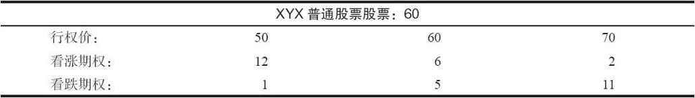
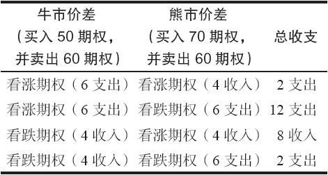

# 23.1　蝶式价差

虽然在第10章中蝶式价差是用看涨期权来构造的，但在前面我们已介绍过这个策略。读者应当记得，蝶式价差是一个中性的头寸，它风险有限，盈利也有限。这个策略涉及三个行权价，在较低的两个行权价之间是一个牛市价差，在较高的两个行权价之间是一个熊市价差。如果股票价格在到期日等于中间的行权价，这个价差就能实现其最大盈利，如果股票价格在到期日高于较高的行权价或低于较低的行权价，它就承受其最大亏损。

因为无论是牛市价差还是熊市价差都可以用看跌期权或者看涨期权来构造，那么，（由一手牛市价差和一手熊市价差组成的）蝶式价差显然也可以用其他不同的方法来构造。事实上，这个价差有4种构造方法。如果期权的价格相当平稳，也就是说，套利交易者将价格保持在接近合理的水平，那么，所有这4种方法在期权到期时的潜在盈亏都是相同的。不过，由于看跌期权和看涨期权在到期之前行为方式各有不同，因而构造蝶式价差的方法也各有自己的优缺点。

【示例23-1】有以下的价格存在

只使用看涨期权的方法意味着投资者应当买入1手50看涨期权，卖出2手60看涨期权和买入1手70看涨期权。因此，这时就有1手行权价在50~60之间的牛市价差，和1手行权价在60~70之间的熊市价差。同样，投资者可以将行权价在50~60之间的任何类型的牛市价差和行权价在60~70之间的任何类型的熊市价差组合起来，构造一个相似的蝶式价差。这些价差有的是收入价差，有的是支出价差。事实上，投资者在两个相等的蝶式价差之间做出选择的依据，很可能是看它们是用收入还是支出来建立的。

表23-1总结了构造蝶式价差的四种方法。为了核实这里所显示的支出和收入，读者应当记得，无论是使用看跌期权还是看涨期权，一手牛市价差都是由买入一手较低行权价的期权和卖出一手较高行权价的期权所组成的。与此相似，用看跌期权或看涨期权构造的熊市价差，都是由买入一手较高行权价的期权和卖出一手较低行权价的期权所组成的。请注意，第3种选择（用看跌期权构造的牛市价差和用看涨期权构造的牛市价差）是一个被虚值看跌期权多头和虚值看涨期权多头所保护的跨式价差空头。

表23-1　蝶式价差

如果标的股票在到期日刚好在60，这4种价差中任何一种在到期日的最大潜在盈利都是8点。如果股票价格在到期日是在70之上或者50之下，每种价差的最大可能亏损都是2点。例如，在这张表格的最上面一行只用看涨期权来构造的价差中，或者是最下面一行只用看跌期权来构造的价差中，风险都等于涉及的支出，也就是2点。无论股票的价位在哪里，大支出的价差（表中的第2行）可以在到期日平仓，至少收入10点，因此风险也就是2点（它一开始的成本是12点）。最后，用收入构造的组合（第3行）的最大买回成本是10点，因此它的风险也是2点。此外，因为行权价之间的差价是10点，所以，在所有情况中的最大潜在盈利都是8点（最大盈利=行权价的差价-最大风险）。

使得所有这些组合在风险和收益方面都保持相同的因素是套利交易者。如果看跌期权和看涨期权的价格偏离太远，套利交易者就会采取无风险行动迫使它们回归正常。这种特殊形式的套利叫作盒式价差，我们将在第27章中介绍它。

尽管所有这四种构造蝶式价差的方法在到期时都是相等的，但在到期之前的某些价格运动中，有的价差比其他的更优越。我们在前面说过，最好用看涨期权来构造牛市价差，最好用看跌期权来构造熊市价差。由于蝶式价差是由一手牛市价差和一手熊市价差组合起来的，蝶式价差的最好构造方法就是用看涨期权来构造牛市价差，用看跌期权来构造熊市价差。这个组合就是表23-1中第二行中的那个头寸。这个策略涉及四个价差中最大的支出，因此许多投资者都回避这个策略。不过，所有其他的价差都涉及一开始就卖出一手实值的看跌期权或看涨期权，这是一个会导致提前行权的情况。读者也许还记得，表23-1中第三行的收入组合就是我们在前面所说的保护性跨式价差头寸。也就是说，投资者卖出一个跨式价差，同时分别买入一手到期日相同的虚值看跌期权和虚值看涨期权来对跨式价差作保护。因此，一手蝶式价差实际上和卖出一手完全受到保护的跨式价差是相等的。

虽然蝶式价差有的时候也有一些作用，但它不是一个非常有吸引力的策略。构造这个头寸的手续费非常高，它也没有大笔盈利的机会。头寸中的风险有限是个有益的特征，但是，仅这个特征还不足以弥补这个策略的其他不那么吸引人的特性。从根本上说，策略家在这里寻找的是在期权到期之前会保持中性的股票。如果潜在盈利至少是最大风险的3倍（最好是4倍），而且标的股票看上去是在交易范围之内，那这个策略就是可行的；否则就是不可行的。
