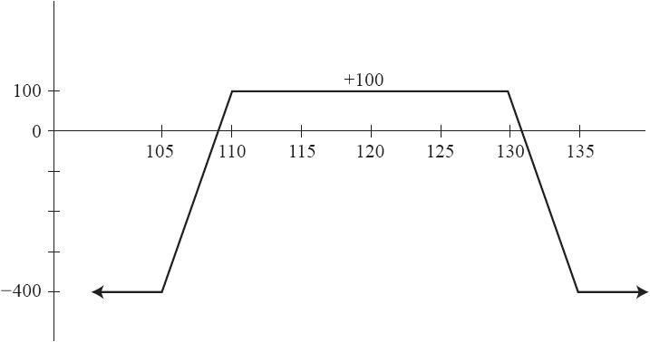

# 23.2　鹰式和铁鹰式价差

鹰式价差与蝶式价差非常相似，只是该价差中间是两个不同的行权价。鹰式价差可以全部用看涨期权来构造，也可以全部用看跌期权来构造。而铁鹰式价差则是用看涨期权和看跌期权的组合来构造。这些价差的盈利图形都相同，因此它们是相等的。在实践中，大多数交易者在构造这类价差时，都使用铁鹰式价差策略。此时，所有期权最初都是虚值的，在建立该头寸时就能获得收入。

【示例23-2】假设XYZ价格为120，某个铁鹰式价差可能可以用下面的方式来构造：

买入1手XYZ 12月135看涨期权：0.50

卖出1手XYZ 12月130看涨期权：1.00

卖出1手XYZ 12月110看跌期权：1.00

买入1手XYZ 12月105看跌期权：0.50

净收入：1.00

在这个基本的构成中，看涨期权行权价之间的差和看跌期权行权价之间的差应该相等（在本例中是5点）。所有期权在开始时都是虚值的。在这些标准下，建立该头寸时常能获得一笔收入，因为卖出的期权的行权价与标的物当前价格的距离，比买入的期权更近。如果标的股票在到期时位于两个中间的行权价之间，那所有期权都会无价值到期，该交易者能获得等于初始收入的盈利（减去手续费）。这是该交易能提供的最大潜在盈利：本例中是100美元。

相反的，如果标的物在到期时位于任何一个期权多头的行权价之外，那就会实现最大损失，在本例中是400美元。图23-1显示了该价差的潜在盈亏：

最大损失=较高行权价之差–最初的收入

=135–130–1.00=4.00

当看跌期权价差和看涨期权价差具有相同的行权价之差时，最大损失同时也等于较低行权价之差减去最初的收入。如果较低的行权价之差比较高的行权价之差更大，那最大损失就会是较低行权价之差减去最初的收入。一般而言，最大损失为两个行权价之差中的较大值，再减去最初的收入。

图23-1　鹰式价差（美元）

该价差所需要的保证金就是其最大风险。因此，如果标的物在到期时高于较高的行权价，或低于较低的行权价，投资者可能会损失其100%投资于该头寸的资金。这样看的话，该策略有很大的风险。

理想情况下，投资者可以把这些行权价设置得离当前股票价格足够远，以让出现最大损失的概率足够小。例如，期权空头行权价的通常设置标准是离股票当前价格有1个或更多的标准差的距离。标准差计算的实际方法可以在第28章“数学应用”中找到。然而，头寸损失的概率不会是零，总是有可能会出现最大风险。

需要指出的是，波动率的上升从两方面给该策略带来了负面影响：（1）股票有更大的概率移出最初估计的期权空头行权价；（2）所有期权都会变得更贵，这会导致价差出现盯市亏损，不过许多投资者并不太在乎盯市亏损，毕竟这些亏损仍是有限的。

交易者们不会就什么是最好的后续行动达成一致。一种理论认为，当股票上涨到看涨期权空头行权价（上例中是130）之上时，看涨期权价差就应该被立刻或短期内平仓；而当股票下跌至看跌期权空头行权价（上例中是110）之下时，看跌期权价差就应该被平仓。然而，这种方式虽然会限制亏损，但可能会导致比什么都不做更大的损失。这是因为股价有可能先快速上穿130，然后又在到期日跌回到120，执行了止损的投资者会有一笔“小额”亏损。而如果他什么都不做，却能实现最大盈利。

因此另一种后续行动的理论就是什么都不做，任由价差到期。当然，如果某个投资者把他的资金都投资在一个价差里，这种理论就会是有害的。因此，需要某种资金管理的方法，例如，分配全部资金的特定比例给这个策略。此外，只分配1/3~1/2的资金给这个策略，即使发生最大损失，投资者仍有剩余资金来继续交易，并继续用相同的比例来分配剩余资金。

总而言之，鹰式价差有很大的吸引力。它有很大的机会获得小额盈利（假设期权空头行权价离初始股票价格足够远）。但它也有较小的可能会亏损，因此交易者不能用很高比例的资金来交易这个策略。总之，市场中有很多有吸引力的策略，特别当股票市场剧烈波动时。
