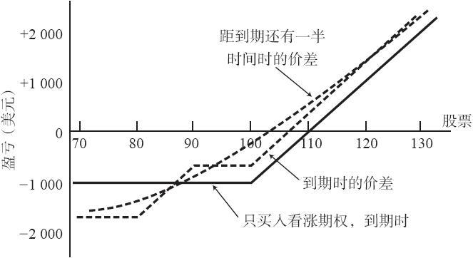
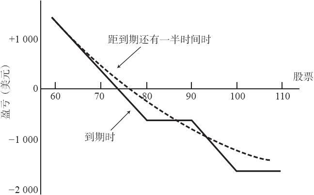

# 23.3　期权多头和价差的组合

投资者也有可能将一手看涨期权多头和一个收入看跌期权价差组合起来，构造一个表现同买入看涨期权非常相似，但风险在大部分价格范围内都比较小的头寸。在使用该策略时，投资者常常对标的股票相当看多，而他想要买入的看涨期权又“定价过高”。与此相似，如果投资者对标的物是看空的，他有时可以将买入一手看跌期权同卖出一个看涨期权收入价差组合起来。在这一节里我们将介绍这两种做法。

### 23.3.1　在看多的情况里

有的时候会发生这样的事：投资者对某只股票看多，可是发现它的期权非常昂贵。事实上，它们可以贵到使人对直接买入看涨期权望而却步的地步。例如，这可能发生在股票价格突然暴跌的时候（也许是因为整个股市中的一个突如其来的看空运动）。在这样的时候，直接买入看涨期权会冒很大的风险。如果标的股票开始反弹，看涨期权的隐含波动率常常会下降，从而对投资者的看涨期权多头头寸造成损害。

在这种情况下，买入看涨期权是对的，但不妨在买入期权的同时，卖出一个看跌期权收入价差。读者应当记得，看跌期权收入价差是一个看多的策略。此外，由于我们假定这个特定股票的期权价格昂贵，那价差中的看跌期权也会相当昂贵。因此，从这个价差中得到的收入会稍许大于“正常的”收入，因为期权价格很贵。

【示例23-3】XYZ的售价是100。投资者希望买入12月看涨期权作直接的看多投机。这个看涨期权的售价是10。不过，投资者认为12月看涨期权定价过高（投资者可以使用一个期权定价模型来判断该期权是否定价过高，在第28章中将讨论这样的模型）。因此，他决定除买入12月100看涨期权之外，还使用下面的看跌期权价差：

卖出12月90看跌期权：6

买入12月80看跌期权：3

卖出这个看跌期权价差可以带来3点收入。因此他整个头寸的总支出就是7点（在12月100看涨期权上支出了10点，再减去卖出看跌期权价差所得到的3点收入）。如果投资者对该股票看多的判断是正确的（也就是说，这个股票上涨了），从某种意义上说，他可以认为他为这个看涨期权付出的价格是7点。看这个问题的另一种方法是：由于卖出了看跌期权价差，这个看涨期权的价格就被降低到一个可以接受的水平，一个同它的“理论价值”相当的水平。换句话说，如果它的价格是7而不是10，这个看涨期权就不会被认为昂贵。卖出看跌期权价差可以被视为降低这个看涨期权总成本的一种手段。

当然，由于卖出的看跌期权价差，这个头寸有了某些额外的风险。如果股票急剧下跌，这个看跌期权价差就有可能亏损7点（这个价差10点的跨度，减去最初收到的3点收入）。加上在看涨期权上所支出的10点，这就意味着整个头寸的风险是17点。事实上，这就是对这个价差的保证金要求。因此，整个价差仍然风险有限，因为买入看涨期权和看跌期权收入价差都是风险有限的策略。不过，将两者组合在一起的风险比任一单独头寸的风险都要大。

读者应当记得，投资者使用这个策略的前提是对标的股票看多。因此，如果他的分析是正确的，他想要的是上行运动带来的最大结果。如果他对股票的看法错了，那么，在这个头寸的最大潜在风险成为现实之前，他需要使用某种止损的办法。

图23-2　买入看涨期权与看跌期权收入（牛市）价差对比

图23-2显示了这个头寸的结果，以及其他两种可能。标注着“到期时的价差”的那条直线，显示的是在12月到期日时这个看涨期权和牛市价差的组合的盈利能力。此外，另外有一条直线是如果用10点买入12月100看涨期权的可能结果。这种做法可以用来与那手三重价差进行比较，看一看额外的风险和收益出现在哪里。请注意，只要股票价格在到期日高过87，这个三重价差的表现就会比只买入12月100看涨期权的表现要好。由于股票开始的时候是在100，而且投资者在开始的时候对这个股票是看多的，那可以认为股票跌到87之下的机会相当小。所以，在一个较大的价格范围内，三重价差的表现都比只买入看涨期权要好。

在图23-2中的最后一种可能性，是在离到期日还有一半时间的时候这个三重价差的盈亏。你可以看出，它看上去很像持有一手看涨期权：它的曲线同第1章显示的看涨期权价格曲线的形状相同。

因此，相对于只持有一手看涨期权，这个三重的策略常常更有吸引力和更具盈利能力。不过，要记住，它确实会增加风险，同时也需要比只买入平值看涨期权更多的质押。在这个策略里，投资者也可以尝试在使用买入虚值看涨期权的同时卖出一手看跌期权价差，以得到足够的收入来完全支付看涨期权的费用。这样的话，只要股票价格保持在看跌期权收入价差中较高的行权价之上，他就没有风险。

### 23.3.2　在看空的情况里

用同样的方式，投资者可以利用对股票看空的看法来构造一个头寸。同样，它也是在期权定价过高，投资者感到只买入平值看跌期权价格太贵的情况下最有用。

【示例23-4】XYZ的交易价是80，投资者对这只股票明确地看空。不过，12月80看跌期权的售价为8，根据期权模型的分析，它贵了一些。因此，投资者可以考虑卖出一手看涨期权收入价差（虚值期权）来帮助减少买入看跌期权的成本。整个头寸因此可以是：

买入1手12月80看跌期权：8支出

卖出1手12月90看涨期权：4收入

买入1手12月100看涨期权：2支出

总成本：6支出（600美元）

整个头寸的盈利能力显示在图23-3里。图形中的直线显示了这个头寸在到期日的表现。引进看涨期权收入价差将股票在到期时反弹到100之上的风险增加到1600美元。请注意，这个风险是有限的，因为买入看跌期权和看涨期权收入价差都是风险有限的策略。所需要的保证金是它的最大风险，也就是1600美元。

图23-3　买入看跌期权与看涨期权收入（熊市）价差对比

图23-3中的曲线显示了在离到期日还有一半时间的时候整个三重价差的表现。在这个情况里，它的曲线看上去与只买入看跌期权的曲线非常相似。

因此，这个策略对看空的交易者具有吸引力，特别是当期权价格很高的时候。在这种情况里，它比只买入一手看跌期权有一定的优点，但是，它确实需要更大的保证金投资，而且在理论上有更大的风险。
