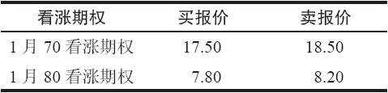
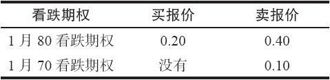

# 23.4　牛市或熊市价差的一个简单后续行动

有时，当投资者已经有一手牛市或熊市价差在手里的时候，他可以使用另一种看跌期权和看涨期权组合的方法。假定投资者持有一手看涨期权牛市价差，而且标的股票向上运动得很好。事实上，它比价差所使用的两个行权价都高。不过，正如常常出现的那样，牛市价差的跨度有可能还没有伸展到它的最大潜在盈利。这个时候，投资者可以为了两个目的使用看跌期权：（1）决定这个看涨期权价差是否在“合理”的价值上交易，（2）锁住某些盈利。首先让我们来看一看核实“合理价值”的一个示例。

【示例23-5】交易者用5点买入了一手XYZ看涨期权牛市价差。这个价差使用的是1月70看涨期权和1月80看涨期权。后来，XYZ价格上涨到88，但是在这些期权中还保留有许多时间价值。在这个时候，价差的跨度可能只有7点。交易者对此有些失望，因为它还没有伸展到10点的最大潜在盈利。不过，在牛市价差和熊市价差中经常出现这种情况，这也是这些价差没有直接买入看涨期权或看跌期权那么具有吸引力的原因之一。

不管怎么说，假定有下面的价格存在：

1月80看跌期权：5

1月70看跌期权：2

我们可以使用这些看跌期权的价格来核实这个牛市价差的价格是否“合理”。请注意这个看跌期权的跨度是3点，而看涨期权的是7点（两者都是由1月70和1月80的期权组成的）。因此，把它们加在一起就是10点，也就是行权价之间的跨度。在出现这种情况的时候，我们可以得出结论说这些价差是“合理”的，它们是按理论上正确的价格在交易。

知道这样的信息并不能帮助投资者获得更多的盈利，但它提供了某种价格验证。许多时候，在看到一手看涨期权牛市价差的跨度没有伸展到他所期望的那么宽的时候，投资者会感到烦恼。用看跌期权来核实，可以帮助策略家冷静下来，从而做出理性的而不是感性的决定。

【示例23-6】使用前面的示例里使用过的牛市价差，假定投资者持有一手XYZ看涨期权牛市价差，买入1月70看涨期权，卖出1月80看涨期权，支出为5点。现在，假设时间快到到期日了，股票价格再一次到达88。在这个时候，整个价差在理论上接近它的最高价格10点。不过，由于两手期权都深度实值，做市商（market-maker）给这些看涨期权报出的买价同卖价之间相差相当大。在离到期只有一或两个星期，股票价格为88的时候，市场上或许有下列的价格：

如果投资者要按市场价格将他的头寸平仓，他就会按17.50卖掉他买入的1月70看涨期权，花8.20买回他卖出的1月80看涨期权，从而得到9.30的收入。因为这个价差的最大价值是10点，投资者就放弃了0.70点，对一个很快就会到期的头寸来说，这个数目相当大。

不过，如果我们看一下看跌期权，并且发现了下列的价格：

投资者可以花40美分买入1月80看跌期权来“锁定”他的看涨期权价差的盈利。让我们暂时不考虑手续费，如果他买入了这手看跌期权，并且同这个看涨期权价差一起一直持有至到期日，在到期日时他将看涨期权价差平仓，可以得到10点的收入。他为这手看跌期权支付了40美分，因此，他在将价差出手的时候的净收入就是9.60，这比他只持有看涨期权价差而只能得到的9.30要好多了。

这个看跌期权策略有一个很大的好处：如果标的股票突然暴跌到70之下（应当承认，这不是经常发生的），那就会产生大量的盈利。买入1月80看跌期权在所有的价格上都保护了这手牛市价差的盈利。但是，在70之下，这手看跌期权就可以有额外的盈利，而价差可以有很好的盈利。只有在出现了对XYZ公司带来显著损害的新闻时价格才会这样暴跌，不过，这种情况有的时候确实会发生。

如果投资者使用这样的策略，那么他需要仔细考虑手续费成本和提前行权的可能性。对专业交易商来说，这些是不相关的问题，因此专业商可以在任何他觉得有道理的时候随时将牛市价差按这种方式出手。不过，如果公众客户的股票在80的价格上被指派，在70的价格行权买入股票，那么他就要付两笔手续费，再加上看跌期权的手续费。应当将这样的支出同直接将这手看涨期权价差平仓时两手实值看涨期权的手续费成本相比较。此外，如果公众客户就卖出的1月80看涨期权收到提前指派通知，第二天在他将1月70看涨期权行权时，他有可能需要提供日间交易（day-trade）保证金。

对熊市价差我们就不做详细讨论了，可以说，它的盈利也可以通过相似的策略来锁定。假定投资者持有一手1月60看跌期权，并且卖出了一手1月50看跌期权来构造一个熊市价差。后来，当股票价格为45的时候，他想要将这个价差平仓，但是发现市场中实值看跌期权的买报价和卖报价之间相差太大，他无法兑现接近10点的理论价值。这时，他应当看一看1月50看涨期权的售价是多少。如果它的价格不到1点，就像在临近到期日时经常发生的那样，那么，就应当买入这样的看涨期权来锁住熊市价差中的盈利。同样，公众客户在决定采用这个策略之前应当考虑手续费成本。
