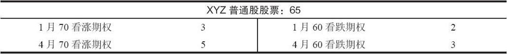
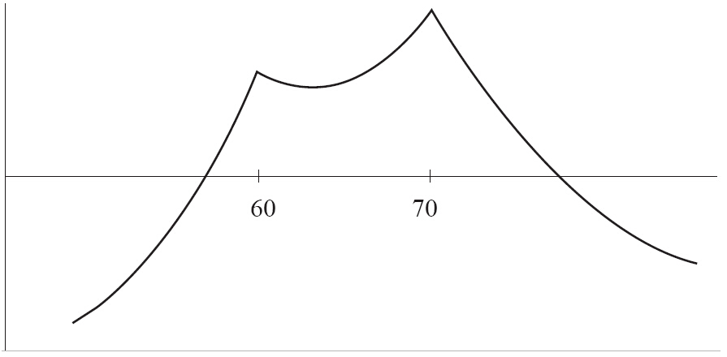
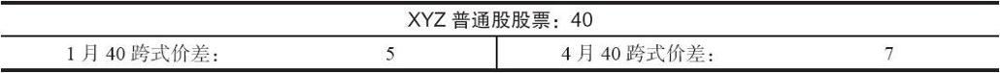
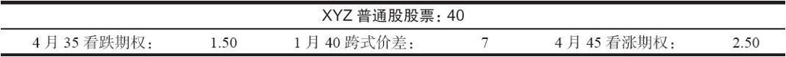

# 23.5　3种有用但复杂的策略

这一节将讨论三种策略。它们的设计，都是为了允许在市场出现正确条件的情况下获得大量盈利的同时，也对风险进行限制。三种策略都是组合策略，也就是说，它们都同时涉及看跌期权和看涨期权。它们也都是跨期策略，也就是说，它们卖出短期期权，同时买入较长期的期权。（在第24章里我们将讨论性质同这些策略相似的第四种策略。）虽然这些策略都比较复杂，适合于最成熟的策略家，它们确实提供了具有吸引力的风险/收益机会。此外，这些策略也可以为公众客户所使用，它们并不只是为专业人员设计的。在这一节里，我们对这三种策略都只做概念性的介绍，具体的选择标准将在下一节里讨论。

### 23.5.1　双刃攻击（双重跨期价差）

我们在前面说过，看多的跨期价差是一个相当具有吸引力的策略。一手看多的看涨期权跨期价差是用虚值看涨期权以较小的支出构造起来的。如果短期看涨期权无价值到期，股票在较长期的看涨期权到期之前大幅上涨，盈利有可能会很大。无论在哪种情况里，风险都是有限的，它等于构造这个价差时所需要的那一小笔支出。与此相似，使用看跌期权的看空跨期价差也是具有吸引力的策略。在这个策略里，投资者使用虚值的看跌期权来设立这个价差。然后，他会希望短期看跌期权无价值到期，接着股票价格出现大幅下跌，从而在较长期的看跌期权上产生盈利。

因为这两种策略都具有吸引力，将它们组合在一起应当也具有吸引力。这就是说，当股票价格在两个行权价之间的中点时，投资者可以同时设立一手看多的虚值看涨期权跨期价差和一手看空的虚值看跌期权跨期价差。如果股票保持相对稳定，两手短期期权都会无价值到期。然后，无论是在哪个方向上，只要股票有大幅运动，都可以产生大量的盈利。使用这种策略，在短期期权无价值到期之后，价差交易者不关心股票是朝哪个方向运动；他只希望股票变成高波动的，在某个方向上有大幅的运动。

【示例23-7】假定在离1月期权到期之前还有3个月的时候，有下列的价格存在：

这个跨期价差的看多部分可以通过按3点卖出较短期的1月70看涨期权同时用5点买入较长期的4月70看涨期权来构成。价差的这个部分需要2点的支出。这个价差的看空部分是用看跌期权来构造的。短期1月60看跌期权可以卖到2点，较长期4月60看跌期权可以用3点买入。因此，这个价差的看跌期权部分是1点的支出。于是，这个跨期价差构造起来需要3点的支出，再加上手续费。这个支出就是所需要的投资，没有质押的要求。由于这里涉及4手期权，手续费成本会很高。同样，构造大量的价差可以减小按百分比计算的手续费成本。

请注意，这个头寸的期权在刚构造头寸时都是虚值的。股票价格在看涨期权的行权价之下，在看跌期权的行权价之上。投资者卖出了一个短期的看跌期权和看涨期权的组合，买入了一个较长期的组合。为了称呼方便，我们把它叫做“双重跨期价差”。

这个头寸可以有各种不同的结果。首先，应当知道，风险是限制在初始支出之内的，在这个示例里，也就是3点。如果标的股票在短期期权到期之前急剧上涨或者急剧下跌，那么，看涨期权之间的跨度和看跌期权之间的跨度都会缩小到几乎不存在。这是投资者最不想看到的局面。在实践中，即使标的股票很早就出现大幅运动，这个价差也还有可能剩下小量的正值差价。因此，亏掉全部投资的可能性并不大。

在图23-4中，图形中有两个盈利尖峰，每个行权价均有一个。根据权益类期权的定价方式，看涨期权跨期价差的尖峰（本例中在70的行权价上）会比看跌期权跨期价差的尖峰更高。如果最初建立头寸时持有额外的看跌期权跨期价差，那这些尖峰就可能是等高的。例如，买入3手看涨期权跨期价差，并买入4手看跌期权跨期价差，则可能产生等高的尖峰。

图23-4　双重跨期价差

如果投资者认为标的股票会在价差建立之后且在短期期权到期之前出现跳空，那这种类型的策略就会非常有用。这种跳空有可能是因为盈余公告，或者某个生物技术公司召开美国食品及药物管理局（FDA）听证会，或者是一宗有潜在不确定性的诉讼。在所有这些情况下，用隐含波动率来表示的短期期权价格都会比长期期权变得更贵，这在理论上会让双重跨期价差成为一个有吸引力的策略。投资者一般会试图估计未来的跳空幅度，并把跨期价差设置在这些点上。短期跨式价差的价格有时是一个有用的参考。

【示例23-8】XYZ市场价为80，并且即将发布盈余公告。假设XYZ在发布盈余公告时常会跳空。此外，假设最短期的7月80跨式价差的价格为10点。这或多或少代表了期权市场对XYZ价格在盈余公告发布之后的移动距离。投资者并不知道XYZ在发布盈余公告之后会上涨还是下跌，但基于现在可获得的信息，期权交易者可以预期该股票在盈余公告发布之后会移动大约10点。因此某个投资者可以同时买入行权价为90的看涨期权跨期价差和行权价为70的看跌期权跨期价差——它们都与当前股票价格有10点的距离（事实上，他可以买入3手看涨期权价差和4手看跌期权价差，以便让他在任意行权价上的潜在盈利保持相等）。他可以卖出7月期权（预期会发生的跳空之后的首个到期日）和买入8月、9月或10月期权（这取决于有什么月份可以交易）。

如果短期期权都无价值到期，那么，当时就会有盈利出现。

【示例23-9】在前面的示例里，如果XYZ价格在1月到期时仍然是65，这个头寸当时就会有盈利。XYZ为65，1月看涨期权和看跌期权就都无价值到期，4月期权的总价值有可能为5点。如果XYZ价格在1月时为65，这个头寸就可以平仓，投资者就可以提走盈利，因为4月期权可以卖到5点，而最初的价差“成本”只有3点。虽然手续费会显著地降低这2点的毛盈利，但总头寸仍会有不错的百分比盈利。如果策略家决定在这时提取盈利，那么，他就是用保守的方法在运作。

不过，策略家也许想更激进一些，那可以继续持有4月的组合，期望股票在这些期权到期之前会有大幅的运动。如果这种情况真的发生，那潜在盈利就会很大。

【示例23-10】如果在4月到期之前股票有非常大的牛市运动，上涨到100，那么，4月70看涨期权就可以卖到30点。（4月60看跌期权这时就会无价值到期。）相反，如果股票在4月到期日暴跌到30，那么，60的看跌期权就会价值30点，看涨期权则会无价值到期。无论是哪种情况，策略家都可以在最初的3点的投资上得到大量的收益。

在短期期权过期之后，应当采取什么样的行动，对策略家来说不是一件容易的事。他可能在是提取有限的盈利还是继续持有这个组合以博取更大的盈利之间左右徘徊。对策略家来说，一种合理的方法也许是在短期期权刚刚无价值到期之后什么都不做。在长期期权由于因时减值而产生亏损之前，他可以继续持有这些期权一段时间。回到前面的示例，当1月期权无价值到期之后，策略家继续持有4月的组合，这个组合当时值5点。即使股票价格保持在65，他也可以继续持有这个组合6或8个星期，直到它们的价值销蚀到3点。到这个时候，这个头寸就可以平仓，净亏损等于在各个交易中所花的手续费成本。

作为一般的规则，投资者应当愿意继续持有这个组合，即使这意味着他让小笔的盈利消蚀为亏损。这样做的原因是投资者应当给自己最大的机会去实现更大的盈利。这样做他有可能会遭受若干小亏损，但是，如果有机会得到大盈利，他的盈利就有相当的可能超过所有亏损的总和。

在这个策略，在短期期权到期时，如果看跌期权或是看涨期权稍稍实值的话，那么，在这个时候投资者就应当提走小笔的盈利。

【示例23-11】如果XYZ在1月期权快要到期的时候运动到了71，价差的看涨期权部分就应当平仓。1月70看涨期权可以用1点买回，4月70看涨期权或许会价值5点。因此，这个价差的看涨期权部分可以“卖”到4点，足以弥补整个头寸的全部成本。当股票价格为71时，4月60看跌期权就不会有什么价值，不过应当将它留在手里，以防股票出现大幅下跌。如果标的股票在1月到期时稍稍实值，例如，价格在58或59，类似的情况也会出现在价差的看跌期权一侧。策略家在任何时候都不应当去冒让卖出的期权被指派的风险。因此，只要头寸中的某一部分在短期到期日出现实值，他就必须将它平仓。当然，只有在股票上涨到看涨期权的行权价之上或者是下跌到看跌期权的行权价之下时才有必要这样做。

总的来说，如果投资者在足以包括若干市场周期的长时段内运作这个策略，那么这就是个合理的策略。不过，策略家必须小心，不要将他的大部分交易资本都放进这个策略。因为即使亏损是有限的，它们仍然代表了他的全部净投资。我们在下一章将讨论这个策略的一种变形，其中投资者卖出的期权数量会比他买入的更多。

### 23.5.2　跨期跨式价差

另一个把看跌期权跨期价差和看涨期权跨期价差合起来的策略是通过卖出一手短期的跨式价差，并同时买入一手较长期的跨式价差所构成的。因为短期跨式价差的时间价值消失得比长期跨式价差要快，投资者可以就有限的投资获取盈利。这个策略在某种程度上不如前面一节所介绍的那个策略，不过，它相当有趣，值得我们在这里考察一下。

【示例23-12】假定离1月到期日还有3个月，有下面的价格存在：

在卖出1月40跨式价差的同时买入4月40跨式价差，就可以构造跨式价差的跨期价差。它有2点的成本，或者说交易的支出，再加上手续费。

在短期跨式价差到期之前，风险限制在这个支出的数量之内。也就是说，即使XYZ价格大幅上涨或者大幅下跌，可能出现的最糟的情况就是两个跨式价差之间的差价缩减到零。这就使得投资者的亏损数量等于他最初的支出，再加上手续费。对风险的限制只适用于短期跨式价差到期之前。如果策略家决定买回短期跨式价差，然后继续持有较长期的那一手，那么，他的风险就增加了买回短期跨式价差的成本。

【示例23-13】当1月期权到期时，XYZ的价格是43。1月40看涨期权现在用3点买回。看跌期权无价值到期，因此，整个跨式价差可以用3点平仓。在这个时候，4月40跨式价差也许可以卖到6点。如果策略家想继续持有4月跨式价差，希望股票也许会有大幅的价格波动，那么，他在买回了1月40跨式价差之后完全可以这样做。不过，他现在在这个头寸里的总投资是5点：最初的2点支出加上买回1月40跨式价差的3点。因此，他的风险就增加到了5点。如果XYZ的价格在4月到期时刚好在40，那么，他就会把整个5点都亏损掉。亏损掉整个5点的可能性虽然很小，但是，他还是有很大的可能会亏损比最初的2点支出更多的数量。因此，由于买回了短期跨式价差并且继续持有较长期的跨式价差，他的风险增加了。

这实际上是一个中性的策略。读者应当记得，在前面讨论跨期价差的时候，我们指出过，投资者用价格靠近行权价的股票来构造一手中性跨期价差。这对看涨期权跨期价差和看跌期权跨期价差都是如此。这个用跨式价差来构造跨期价差的策略只是一手中性看涨期权跨期价差和一手中性看跌期权跨期价差的组合。此外，回忆一下，我们曾经说过，中性跨期价差交易者构造这个头寸的动机，是要在短期期权到期之后就将这个头寸平仓。他主要感兴趣的是卖出时间，想要在短期期权失去时间价值的速度比长期期权快这个事实中获取盈利。跨式价差的跨期价差也应当如此对待。一般最好是在短期期权到期日将它平仓。如果股票价格在这个时候接近行权价，一般来说就会出现盈利。要证实这一点，回过头去看一下前面提到的价格。在1月到期日时XYZ的价格是43。1月40跨式价差可以用3点买回，4月40跨式价差可以卖到6点。因此，这两个跨式价差之间的差距就扩大到了3点。因为最初的差距是2点，这就代表了这个策略家有1点的盈利。

如果股票在短期到期日时刚好等于行权价，最大盈利就得以实现。在这种情况里，1月40跨式价差可以用不足1点的价格买回，4月40跨式价差可能会价值5点。在这个示例里，两个价差之间的差距从最初的2点扩大到现在的将近5点。

这个策略不如前面一节里所介绍的那个策略（“跨期组合”）。为了有可能得到无限的盈利，投资者必须增加他的净支出，加进买回短期跨式价差的成本。因此，策略家只有在短期跨式价差看起来定价非常高的情况里才使用这个策略。此外，除非股票价格在短期到期日与行权价接近程度使得短期跨式价差可以用不到1点的价格买回，否则的话，这个头寸就应当在这个时候平仓。因为买回的成本不到1点，这个策略家就有可能以增加小量风险为代价来换取得到大量盈利的机会。有可能以不到1点的成本买回短期跨式价差的机会很小，远不如前面策略中虚值看跌期权和看涨期权都无价值到期的机会大。因此，“跨期组合”为价差交易者提供了更多的得到大量盈利的机会，同时也绝不会迫使他增加他的风险。

### 23.5.3　持有一手“免费的”组合（“对角蝶式价差”）

前面几节里介绍的策略都是用支出来建立的。这就意味着即使短期期权无价值到期，策略家还是有风险。他这时持有的期权多头也会紧接着无价值到期，从而使得他的总亏损等于他的最初支出。还有另一个使用看涨期权和看跌期权的策略，它可以给这个策略家持有一手“免费”组合的机会。这就是说，从卖出短期期权所得到的收入会等于或者超过他买入长期期权的全部成本。

这个策略包括卖出一手短期跨式价差并且买入一手长期虚值看涨期权和一手长期虚值看跌期权。这个策略同前面介绍的卖出受保护的跨式价差有所不同，区别在于买入的期权的存续期要比卖出的期权的存续期更长。

【示例23-14】有下面的价格：

如果投资者想要按7点卖出短期的1月40跨式价差，同时买入虚值看跌期权和看涨期权组合（4月35看跌期权和4月45看涨期权），那么，他就构造了一手收入价差。这个头寸的收入是3点减去手续费，因为从卖出跨式价差中收入了7点，买入虚值组合支出了4点。要注意，从技术上说，这个头寸包括了一个看涨期权的熊市价差（买入较高的行权价，卖出较低的行权价）和一个看跌期权的牛市价差（买入较低的行权价，卖出较高的行权价）。所需要的投资以质押的形式出现，因为两个价差都是收入价差，它等于行权价之间的差价减去所收到的收入。在这个示例里，投资就会是行权价差价的10点（看涨期权5点，看跌期权5点）减去3点收入，总的质押要求是700美元，再加上手续费。

这个头寸可能出现的结果之间会有很大的不同。不过，在短期期权到期前，风险是有限的。如果标的股票在1月到期之前大幅上涨，看跌期权就会接近无价值，两手看涨期权都会按接近持平价交易。当看涨期权处于持平关系时，策略家最多只需要付5点就可以将这个看涨期权价差平仓，因为两手看涨期权的行权价之间的差价是5点。同样，如果标的股票在1月期权到期之前大幅下跌，看涨期权就会接近无价值，而看跌期权则会成为持平。同样，把这个看跌期权价差平仓，最多也只需要5点，因为两手看跌期权的行权价之间的差价也是5点。这个示例中最差的结果是2点的亏损（最初有3点收入，而策略家要平仓也最多只需付5点）。这是理论风险。在实践中，即使标的股票大幅上涨，也不大可能出现两手看涨期权交易价格之间的差距为5点。因为较长期的看涨期权会保存少量的时间价值，即使它深度虚值。同样的分析也适用于看跌期权。因为风险等于两个相邻行权价（两个互相挨着的行权价）之间的差价减去初始净收入，因此，我们总是可以迅速地计算出所面临的风险。

策略家在这个头寸中的目标是要能够用比最初的收入更低的价格把短期跨式价差平仓。如果他能做到这一点，他就可以免费持有那手长期的组合。

【示例23-15】在临近1月到期日的时候，策略家能够用2点买回1月40跨式价差。因为他最初收入了3点，现在又用2点买回卖出的跨式价差，他在这个头寸中就有1点的总盈利，再减去手续费。一旦他这样做了，策略家就保留了买入的头寸，4月35看跌期权和4月45看涨期权。如果标的股票接着大幅上涨或者大幅下跌，他就可以得到非常大的盈利。不过，即使买入的组合无价值到期，策略家还是有盈利，因为他买回跨式价差的钱少于最初的收入。

在这个示例里，策略家的目标是要用低于3点的价格买回1月40跨式价差，因为3点是初始收入的数量。在到期的时候，这就意味着如果想用3点或者更少的成本买回，股票价格就必须在37~43之间。虽然股票价格确实有可能在短期期权到期日时停留在这个相当窄的范围之内，但是，这并不是很现实。不过，愿意稍微多承担一点风险的策略家常常可以通过将1月40跨式价差“分腿”而达到同样的结果。我们反复说过，投资者不应当将一个价差分腿，这里是这条规则的一个例外，因为投资者持有一手买入的组合，因而是受到保护的，他并没有因为将他卖出的跨式价差“分腿”而面临大量的风险。

【示例23-16】XYZ在1月到期之前价格上涨，1月40看跌期权的价格跌到0.50点。即使离到期日还有一些时间，策略家也许决定要用0.50点的价格买回这个看跌期权。如果股票继续上涨，他的总风险就有可能会增加0.50点。不过，如果股票接着掉转方向，开始下跌，他就可以用2.50点或者更低的价格将看涨期权买回来。这样的话，他仍然可以达到用3点或更低的价格买回短期跨式价差的目的。事实上，如果股票先是在一个方向上迅速运动，然后掉转方向，在另一方向上出现大幅运动，那么，他就有可能在离短期到期日相当远的地方就将这个跨式价差的两条腿都平仓。

我们介绍了这个策略的最大风险和可能的优化目标，不过，在这个策略里，也应当考虑期间的结果。

【示例23-17】XYZ在1月期权到期时是44。1月40跨式价差必须用4点买回。这就意味着无法免费得到组合价差多头，需要1点的成本再加手续费。策略家在这个时候必须决定他是否想要继续持有4月的期权，或者他是否想把它们卖掉。如果卖掉的话，也许整个头寸能产生一小笔盈利。在这类情况里，没有什么铁定的规则。如果他决定继续持有较长期的期权，策略家就应当意识到他这样做承担了额外的风险。不过，他也许认为以低成本持有这个组合价差多头是值得的。在这个示例里，成本是1点加上手续费，因为他最初只得到3点的收入，却付出4点买回那个跨式价差。买回短期跨式价差的成本越高，策略家就越倾向于在同一时候卖掉他买入的期权。例如，如果XYZ在1月到期时是48，1月40跨式价差需要8点才能买回，这样的话，他毫无疑问应当同时把他的4月期权也卖掉。最难做出决定的时候是当股票刚好在短期到期日的最优买回区域之外的时候。在这个示例里，如果XYZ价格在1月到期日时在44~45或35~36的区域，策略家就会很难做出决定。

读者也许还记得，在第14章讨论将价差对角化的时候，我们提到过，投资者有时可以通过建立一手对角收入价差而免费持有一手看涨期权。我们举了一个对角熊市价差的例子。对一手对角看跌期权牛市价差也是如此，因为它也是一手收入价差。这一节所讨论的策略是一手对角看涨期权熊市价差和一手对角看跌期权牛市价差的组合，它通常被称为“对角蝶式价差”。在第14章中所讨论的概念，也就是能够从短期看涨期权中得到比最初为长期看涨期权所付的更多的钱这个想法，在这里也同样适用。投资者构造一个收入头寸，希望有可能在买回卖出的短期看涨期权时得到的盈利大于买入期权的成本。如果他能够做到这一点，他就可以免费持有期权，标的股票无论朝哪个方向大幅运动，他都可以得到大量的盈利。即使股票在短期期权买回之后没有什么运动，他仍然没有什么风险。风险出现在短期期权到期之前，而且这个风险是有限的。因此，这是一个有吸引力的头寸，这个头寸如果持续运作几个市场周期，应当可以产生相当大的盈利。理想情况下，这些盈利能够足以抵消所有不得不承担的小额亏损。因为在这个策略里有大量的手续费成本，策略家应当记住，批量构造这些价差可以起到减少手续费百分比的效果。
