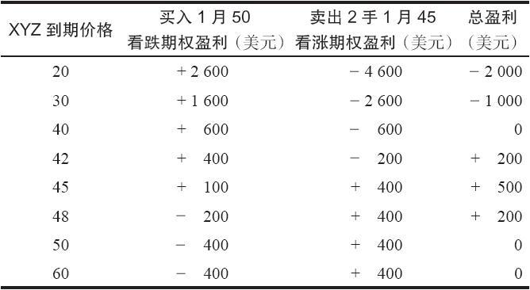
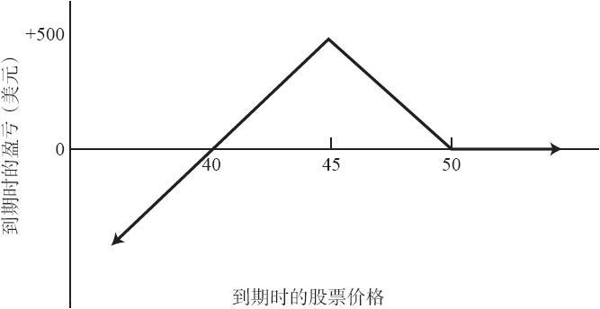
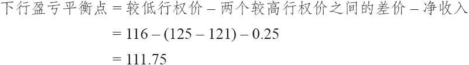
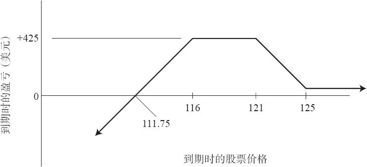

# 24.1　看跌期权比率价差

这个策略是为对标的股票持中性或略为看空的人所设计的。在一手看跌期权比率价差里，投资者买入一定数量的行权价较高的看跌期权，卖出更多数量的行权价较低的看跌期权。这个头寸涉及裸看跌期权，因为投资者卖出的看跌期权比他买入的要多。这个头寸在上行方向的风险有限，但在下行方向有可能风险巨大。如果在到期时股票价格刚好等于卖出的期权的行权价，那么，这个头寸就可以实现它的最大盈利。

【示例24-1】如果有下面的价格存在：

XYZ普通股股票：50

XYZ 1月45看跌期权：2

XYZ 1月50看跌期权：4

那么，可以通过在买入1手1月50看跌期权的同时卖出2手1月45看跌期权来建立一个看跌期权比率价差。因为投资者为买入的看跌期权要支付400美元，从卖出的2手虚值看跌期权中可以收回400美元，所以，整个价差可以用零的成本建立起来。这个头寸没有上行方向的风险。如果XYZ在1月到期时上涨到50之上，那么，所有的看跌期权都无价值到期，结果就只亏损手续费。不过，在下行方向有风险。如果XYZ大幅下跌，投资者就必须付出比他卖出1手看跌期权多头所收到的钱更多的钱来买回2手看跌期权空头。如果XYZ价格在到期日时是45，整个头寸就实现它的最大盈利，因为卖出的看跌期权无价值到期，而买入的1月50看跌期权则价值5点，投资者可以按这个价格将它卖掉。表24-1和图24-1总结了这个头寸。请注意，这个头寸有一个盈利范围，在这个示例里是40~50。如果XYZ在1月到期时在40~50之间，那么，在除去手续费之前，这个价差就有一定的盈利。如果股票价格在到期时低于40，那么就会出现亏损。虽然因为股票的价格不可能跌到零之下，所以亏损是有限的，但是，这些亏损有可能数额巨大。不过，正如前面指出的，在上行方向没有风险。下面的公式总结了所有看跌期权比率价差的情况：

最大上行风险=价差的净支出（如果建立时有收入就没有上行风险）

最大潜在盈利=行权价差价×买入看跌期权数量-净支出（或加上净收入）

下行盈亏平衡价格=较低行权价-最大潜在盈利÷裸看跌期权数量

表24-1　看跌期权比率价差

图24-1　看跌期权比率价差

看跌期权比率价差所需要的投资包括，裸期权所必需的质押要求加上（减去）整个头寸的支出（收入）。因为对裸期权的质押要求是股票价格的20%，加上权利金，减去期权的虚值额，整个示例里的实际金额就是700美元（5000美元的20%，加上200美元的权利金，减去1月45看跌期权虚值的500美元）。同所有的卖出裸期权头寸一样，策略家必须留有足够的质押，以防股票价格出现反向运动。这样，他就给股票的运动留下足够的余地，而不至于因为追加保证金而不得不将头寸提前平仓。在这个示例里，如果策略家感到在股票跌到39之前他都想持有这个头寸，那么，他就应当将质押价值增加到1380美元（3900美元的20%，加上600美元的实值额）。

一般而言，如果在建立头寸时，股票价格在两个行权价之间，那看跌期权比率价差就最有吸引力。也就是说，如果XYZ在45~50之间的某个价位上，投资者会发现使用上面那个示例中的看跌期权比率价差具有吸引力。如果股票在建立头寸时低于较低的行权价，这个看跌期权比率价差就不具有吸引力，因为股票价格已经过于接近下行方向的风险点。换一种情况，如果股票价格高于买入的看跌期权的行权价，投资者一般就必须为建立这个头寸付出大量的支出。虽然投资者可以通过为每一手买入的看跌期权卖出4手或5手期权来抵消支出，但大比率会导致下行方向极度的风险，因此是非常激进的。

看跌期权比率价差的后续行动比较简单。除了在股票突破下行方向的盈亏平衡点时将头寸平仓之外，投资者没有什么可以做的。因为看跌期权在变成实值之后，时间价值失去得相当迅速，一般而言不存在向下挪仓的机会。如果股票向下突破盈亏平衡点，投资者应当能够按持平价将看跌期权平仓。价差交易者也许会想要买入额外的看跌期权，就像在第11章里就看涨期权所说的那样。不过，在看跌期权里这样做没有多大的好处，原因是时间价值的缩减。

对经验不够丰富的投资者来说，整个策略可以提供心理上的满足，因为在标的股票的上行运动中他不会输钱。许多涉及看涨期权的比率策略都有上行方向的风险，大部分投资者不喜欢在股票上涨时亏钱。因此，虽然投资者会由于卖出多手虚值期权来盈利，因而被比率策略所吸引。但是，他们常常更喜欢看跌期权比率而不是看涨期权比率，因为看跌期权的策略在上行方向风险很小。

有一种看跌期权比率价差的变形，有时更具有吸引力。因为它降低了下行盈亏平衡点，从而降低了股票跌到该点之下的可能性。

【示例24-2】在看跌期权比率价差中使用三个行权价。假设有下列的价格存在：

XYZ：127

XYZ 12月125看跌期权：3.00

XYZ 12月121看跌期权：2.00

XYZ 12月116看跌期权：1.25

宽基（broad-based）指数或者交易所交易基金（ETF），例如SPY[1]，一般都有1月期的期权存在。较低行权价期权的隐含波动率一般比较高行权价期权更大。可以用下面的方式建立一个看跌期权比率价差：

买入1手12月125看跌期权，卖出1手12月121看跌期权，卖出1手12月116看跌期权净收入为0.25。

这个头寸与前面介绍的看跌期权比率价差相似。如果XYZ在到期时高于125，该头寸的盈利为最初的收入——0.25点。然而，这个价差的盈利区域更宽，而该区域的很大一部分都可以获得最大盈利。

除非XYZ在到期时低于111.75，否则这个价差就不会亏钱。由于建立该价差时股票价格为127，因此还有很大的下行保护。

图24-2显示了这个价差的盈利图形。

图24-2　使用三个行权价的看跌期权比率价差

此外，在两个较低行权价之间的任何位置——本例中是116~121的区域，该价差都可以获得最大潜在盈利。

最大潜在盈利=两个较高行权价的差价+净收入

=（125-121）+0.25=4.25

由于116看跌期权是一个裸看跌期权，因此投资者必须为它提供保证金。另外两个看跌期权组成了一个熊市价差，因此不需要任何质押。假设股票位于较低行权价以计算保证金是较为明智的，这需要一些额外的质押。这样就不会在标的物价格一开始下跌就收到保证金追加通知。

建立好头寸之后，投资者必须对其进行监控，看标的物是否开始下跌。如果这真的发生了，标的物下跌至最大潜在盈利区域（本例中是介于116~121之间），那就有可能在到期前就获得盈利。在这种情况下，该价差交易者可以平掉部分或全部头寸以提取盈利，特别是在他担心股价会继续下跌的情况下。

相反地，如果标的物略微超过较高的行权价（本例中是130），就能获得比最初的收入更大的盈利。这与时间价值的销蚀有关。另外，如果一周之后标的物价格接近128，那投资者可以平掉头寸以获得收入。

因此，有可能在建立这类头寸时就获得一笔收入，然后在稍后平仓时获得另一笔收入。这是这个策略的目标，并经常能够实现。该担忧的当然是下行风险。但如果该价差交易者一直在监控，并能及时在触及下侧盈亏平衡点时平仓（即使此时会有一些亏损），那这个策略在长期中的净效果就会是非常令人满意的。

[1] SPY为标普500指数ETF的交易代码。——译者注
