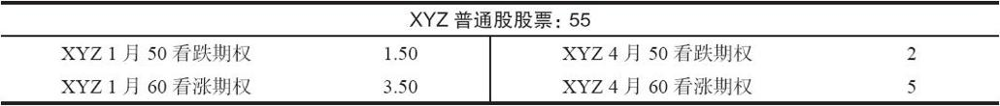

# 24.4　一个合乎逻辑的延伸（比率跨期组合）

前面一节展示了看跌期权比率跨期价差的吸引力。对于看多的投资者来说，前面介绍的看涨期权比率跨期价差也是相当有吸引力的策略。这两类比率跨期价差（看跌期权和看涨期权）的合乎逻辑的组合就是比率组合（ratio combination），它是买入1手较长期的虚值组合，同时卖出若干手短期的虚值组合。

【示例24-6】有下列价格存在：

投资者可以卖出近期的1月组合（1月50看跌期权和1月60看涨期权）而得到5点。买入较长期的4月组合（4月50看跌期权和4月60看涨期权）需要7点的成本。如果卖出的1月组合的数量比买入的4月组合更多，那么就建立了一个比率跨期组合。例如，假设策略家卖出2手近期1月组合，得到10点，与此同时，买入1手4月组合支出7点。这就是一个收入头寸，在这个示例里是3点的收入。如果近期的虚值组合无价值到期，那就会保证有3点的盈利存在，即使长期期权接下去也无价值到期。如果近期的组合无价值到期，长期的组合就是免费得到的，不管股票朝哪个方向有大幅的运动，都会产生大量的盈利。

如果近期期权无价值到期，那这确实是一个非常诱人的策略。但投资者必须紧密监控这个头寸，避免出现大笔亏损。如果股票在近期到期日之前朝某个方向突破得过于迅速，就可能出现大量的亏损。在缺乏对标的股票的技术分析信息的情况下，投资者可以大致计算出一个如果达到就应该采取后续行动的价格。这同我们在第12章就看涨期权比率跨期价差所介绍的分析是相似的。假定在这个示例里股票开始上涨。这里应当有一个价格，在这个价格上策略家应当支付3点的支出，将这个组合的看涨期权腿平仓。这应当是他的盈亏平衡价格。

【示例24-7】XYZ价格在1月到期日时是65（比最初组合的行权价高出5点），近期的1月60看涨期权价值5点，远期的4月60看涨期权有可能价值7点。如果投资者将这个组合的看涨期权腿平仓，他就不得不花10点买回那两手1月60看涨期权，与此同时，从卖出4月60看涨期权中可以得到7点。这个平仓的交易会是3点的支出。不计手续费，这代表目前为止盈亏平衡的情况，因为一开始有3点的收入。策略家将继续持有4月50看跌期权（1月50看跌期权已经无价值到期），同时期望发生不太可能发生的事情，也就是股票价格在4月到期之前会暴跌到50之下。如果标的股票很快出现向下的突破，同样的分析也可以用在这个价差的看跌期权腿上。例如，可以决定在1月的合约到期时向下的盈亏平衡点是46。因此，如果股票在近期到期日之前出现大幅运动，策略家有两个参数可以用来控制亏损：上行方向的65和下行方向的46。在实践中，如果股票在到期日之前而不是刚好是到期日时达到这些价位的话，策略家将组合的实值腿平仓，会有一小笔亏损。不过，他仍然应当采取这样的行动，因为这个策略的风险管理的目标是，如果有必要就承受少量的亏损。最终产生的大量的盈利除了弥补在此出现的所有少量亏损之外，还会有很多的剩余盈利。

前面的后续行动是用来处理在近期到期日之前的标的股票的高波动运动。另一个也许更常见的需要采取后续行动的情况是，当标的股票在近期到期时相对无变化的时候。在这个示例里，如果XYZ在1月到期时的价格接近55，这时候就会出现一笔比较大的盈利：近期组合会无价值到期，投资者从而得到卖出这个组合时收入的10点，远期的组合也许仍然价值5点，因此在4月组合中未兑现的亏损就只有2点。这代表了一笔总量（实现的和未实现的）为8点的盈利。事实上，只要可以用比这个头寸的最初的3点的收入少的费用买回近期组合，这个头寸在近期到期日就会有总的未兑现收益。是提取这个收益，还是持有长期的组合，并希望标的股票会有大幅的运动？虽然策略家通常会具体情况具体分析，但一般的哲学是保留4月的组合。在这个时候投资者的盈利已经有了担保，最糟的情况也有3点的盈利（最初的收入）。因此，策略家应当给他自己一个获得大量盈利的机会。策略家也许应当试图将他的买入的组合交易出手，因为这样做他就没有使得这个头寸亏损的风险。技术分析也许能够为他提供这个股票的买入或卖出的区域，这样，他就可以根据这些价位来考虑卖掉他买入的头寸。

总的来说，这是一个极有吸引力的策略，有交易裸期权经验的策略家应当使用这个策略。只要坚持只承受少量亏损的风险管理原则，这个策略就有相当大的概率可以在总体上获得盈利。
