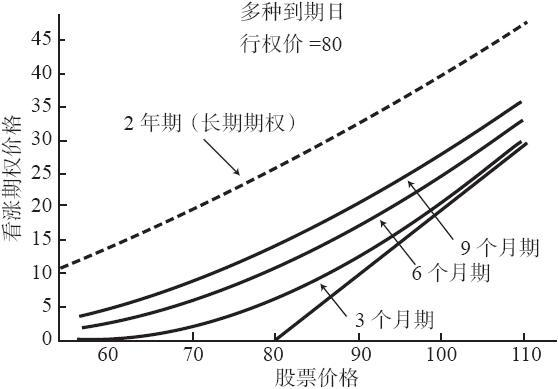
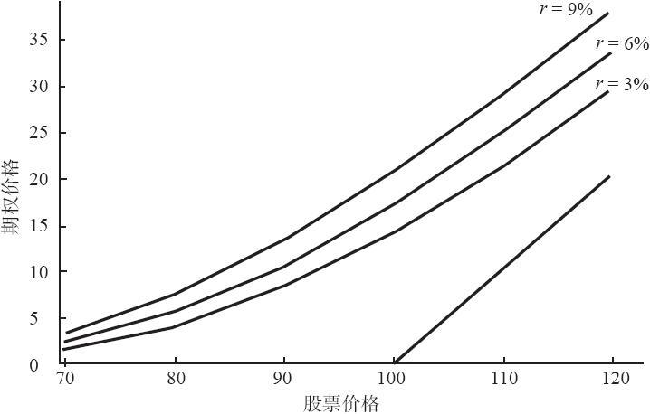
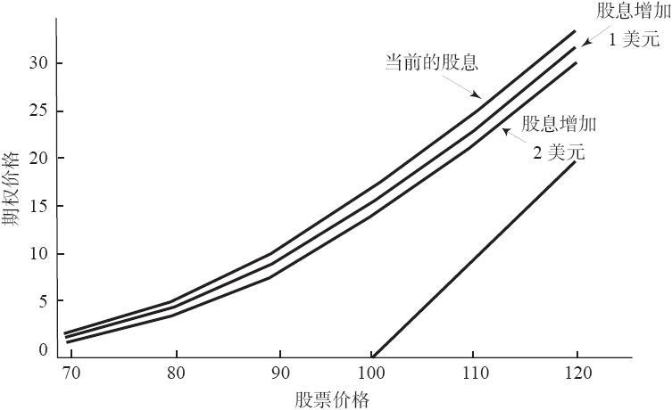

# 25.1　长期期权的定价

影响长期期权价格的因素与影响其他任何期权价格的因素完全相同：

（1）标的股票价格；

（2）行权价；

（3）离到期的时间；

（4）波动率；

（5）无风险利率；

（6）股息率。

相对于短期股票期权，这些因素对长期期权的影响也许会更显著。因此，交易者在考察长期期权时也许会认为它过度昂贵或便宜，但事实上并非如此。投资者需要对长期期权与他所熟悉的短期股票期权之间的价格关系进行观察，在这方面积累经验。如果不具备这样的经验，那么，在对长期期权进行评价时，他就必须加倍小心。

重新考察一下包括某些长期期权在内的期权定价曲线也许是有用的。请看一下图25-1中若干期权的定价曲线。同以前一样，内在价值的实线是底部的线条；它对所有的看涨期权都相同。这些曲线是根据相关变量的相同价值而绘制的，这些变量是股票价格、行权价、波动率、短期利率和股息。这样，我们就可以直接对它们进行比较。

图25-1　长期看涨期权定价曲线

图25-1的曲线中最引人注目的是2年长期期权的曲线相当平坦。它整体的形状同短期曲线相似，但即使股票价格只是25%实值或者虚值，还是有很多的时间价值，因此，2年的曲线要比其他曲线都平坦得多。

我们还可以得出其他的结论。注意一下平值期权：2年长期期权的卖价比3个月期权的卖价高出4倍多一点。正如我们所看到的，由于利率和股息的影响，这有可能发生变化，但是，它证实了在前面提到过的事情：因时减值不是线性的。因此，即使2年长期期权的剩余存续期是3个月期权的8倍，它的售价也仅是后者的4倍。在一个没有经验的观察者看来，这个长期期权看上去似乎很便宜。但是要记住，这些图形描绘的是一组输入参数的合理价值。不要只是因为把长期期权的价格同短期期权的价格相比，就得出长期期权看上去便宜的结论，要使用模型来对它进行评价，或者，至少使用别人的模型的结论。

图25-1的曲线描绘了股票价格、行权价和所剩时间之间的关系。决定期权价格的其他因素中最重要的是标的股票的波动率。所有期权的价格都在很大程度上受到波动率变化的影响，对长期期权来说更是如此。只要波动率有一点变化，长期期权的价格就会大幅波动。我们在后面还将考察波动率变化对短期和长期期权的不同影响。

在进行这样的讨论之前，考察一下利率和股息对长期期权的影响是有好处的。相对于传统的股票期权，它们对长期期权的影响要大得多。之前我们曾经说过，除非股息数量很大，否则，利率和股息对期权价格的影响很小。对短期期权来说这种说法是正确的。对长期期权来说，利率或股息在这么长一段时间内积累起来的效果，对期权的绝对价值会有放大的影响。

图25-2描绘的也是期权定价曲线，不过这是一个2年长期期权的曲线。行权价是100，右面的直线描绘的是这个长期期权的内在价值。3条曲线分别代表无风险利率为3%、6%和9%时的期权价格。所有其他因素（离到期的时间、波动率和股息）都是固定的。仅仅是利率中3%的变化就会导致期权价格的巨大变化。

图25-2　2年长期看涨期权定价曲线，利率的比较

随着长期期权变为实值，长期期权之间的价格区别也逐步增大。注意一下在这幅图形里，如果从左往右看，曲线之间的距离在扩大。虚值长期期权的价格区别已经够大了，即使虚值相当深的期权也有将近1个点（见图形左边的那些点位）。对平值的2年长期期权，3%的利率变化导致了超过2点的更大的价格变化。最大的期权价格变化出现在实值期权中！这似乎有些不合逻辑，不过，在后面考察长期期权策略时就可以看出其中的原因。现在，可以认为：利率变化3%，实值长期期权的价格变化4点之上。这是个巨大的变化，有这样的变化，任何考虑要交易实值长期期权的交易者，都应当考虑一下他自己对短期利率变化趋势的看法。

利率在2年之内发生3%的变化，可能性是相当大的。因此，要想有把握地预测2年的长期期权定价时应当采用什么样的利率，不是一件容易的事。此外，投资者在决定长期期权是“便宜”还是“昂贵”的时候应当非常小心。因为在传统情况下，短期利率在这种分析中并不是一个重要的因素。但是，对长期期权来说，图25-2就是一个明显的证据，它说明对长期期权的交易者来说，利率是一个重要的考虑因素。

现在来考虑一下股息。图25-3描绘了2年看涨期权的价格。图形中不同的曲线针对的是不同的股息率：顶部的线条代表目前的股息率，中间的代表如果股息每年增加1美元会出现的价格，底部的显示如果股息每年增加2美元会有什么样的价格。所有其他的因素（波动率、离到期的时间和无风险利率）在这个图形中的每一条曲线上都是相同的。通过LEAPS看涨期权价格的下降，证实了股息的增加的影响。原因是显而易见的，在股票由于增加的股息而有较大数量的除息时，它的价格会降低更多。

在看涨期权实值程度变得更深的时候，长期看涨期权价格降低的实际数量会略有增加。也就是说，这些曲线之间的距离在左边（虚值）比在右边（实值）要小。对实值的看涨期权，在2年内的每1美元的股息增长会导致长期期权的价值减少点。

图25-3的刻度同图25-2是相同的，因此它们可以直接在规模上进行比较。请注意，股息增加1美元对长期看涨期权的影响要比利率增加3%的影响要小得多。就图形而言，读者只要注意到前面图形中3条曲线之间的距离比这幅图形中3条曲线之间的空间要宽得多，就可以意识到这一点。

图25-3　当股息增加时2年长期看涨期权定价曲线

最后请注意，股息的增加对看跌期权的效果是相反的。也就是说，标的普通股股票中股息支付的增加会导致看跌期权价格增加。如果这个看跌期权是一个长期期权，那么这种增加的效果会更大。

如果有人认为很难给长期期权做出客观的定价，那么，注意一下下面的情况。由于两个原因，前面的利率图形和股息效果图形往往会放大它们对长期期权价格的影响。第一，它们描绘的是对一个2年长期期权的效果。这是一个时间很长的长期期权。许多长期期权的到期日没有这么远，因此，对于还有10~23个月到期的长期期权来说，它们的效果没有那么大。第二，这些图形所显示的利率和股息的变化是一下子发生的。这并不完全符合现实。在现实中，如果利率发生变化，它们会每次变化一点，通常是每次0.25%或0.5%，或许多到1%。如果股息增加，这样的增加可能是一次性的，但是它们不太会在长期期权买入或卖出后立刻就发生。不过，这些图形想要说明的是，利率和股息对长期期权的影响要远远大于它们对普通短期股票期权的影响，这一点是确定无疑的。
