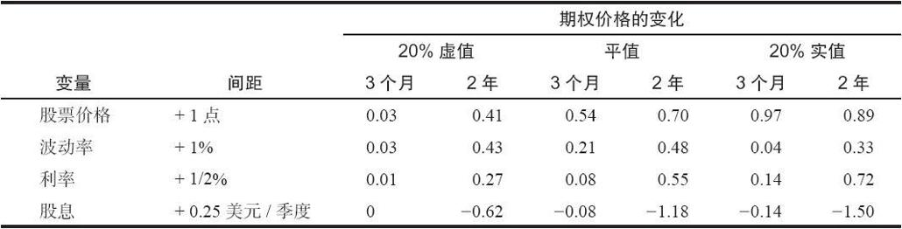

# 25.2　长期期权同短期期权的比较

表25-1可以帮助说明投资者在评价长期期权时会面临到的问题，不管是借助脑力还是模型。所有这些变量（股票价格、波动率、利率和股息）都是按间距提供的，它还显示了3个月的短期期权同2年的长期期权的比较。这里有3组比较：20%虚值期权、平值期权和20%实值期权。

这里需要简单解释一下为什么在这张表格里列出了波动率。波动率通常是以百分率表示的。股票市场的波动率大约是15%。这个表格显示了如果波动率变化1个百分点，例如，达到16%的话，会发生什么事。当然，这个表格也显示了如果其他因素有少量变化的话会发生什么情况。

表25-1　长期看涨期权同短期看涨期权的比较

3个月和2年的期权之间的大部分区别都很大。例如，如果波动率增加了1个百分点，3个月的虚值看涨期权的价格只会增长3美分（左面一栏里的0.03），而2年的长期看涨期权的价格则会增加43美分。作为另一个示例，看一看底部右面的那对数字，它们显示了股息的增长对实值20%期权的影响。这里的假设是，股息在这个季度会增加25美分（而且以后每个季度都会增加25美分）。对3个月的看涨期权，这就意味着14美分的损失，因为影响到这个期权的只有一个股息季度；但对这个2年的长期期权来说，这就是一笔1的损失，因为在这个看涨期权的存续期中这个股票将经历额外的2美元的除息。

这张表格同时也显示出只有3点区别不怎么大。其中的2个同股票的价格有关。如果股票价格变化1点，无论是平值的还是实值的期权都没有非常不同的表现，虽然长期期权确实上跳了70美分。仔细观察的读者会注意到，这个表格的顶部一栏描写的是这些期权的delta，它显示的是期权价格对应股票价格中每一点的变化而会出现的变化。另一个差别不是非常大的是波动率的变化对平值期权的影响。3个月的看涨期权的变化是21美分，而长期期权的变化也只有0.5点。这仍然是2比1的比例，但是比起表格中的其他比较来，就小得多了。

研究一下表格中的其他比较。习惯于交易短期期权的交易者也许一般会忽略利率1.5%的上升、季度股息25美分的增长、波动率只有1%的增加，或者股票价格1点的运动的影响（除非当他的头寸是虚值的时候）。但如果发生其中任意一种情况，长期期权的交易者就会立刻要么有丰厚的收益，要么有严重的亏损。在几乎每一种情况里，他的长期看涨期权都会获益或者亏损0.5的价值，这是一个有显著的数量。
