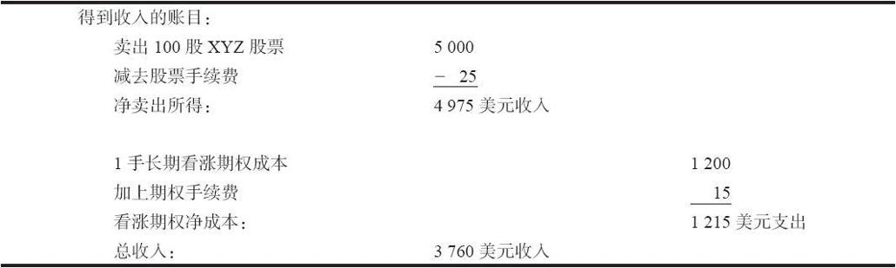
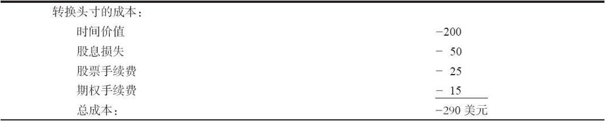
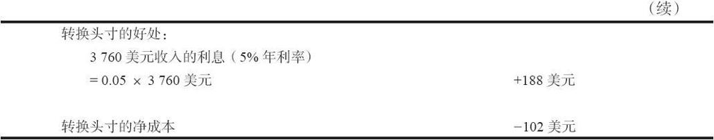
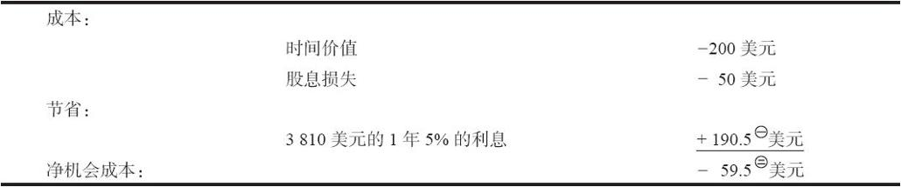
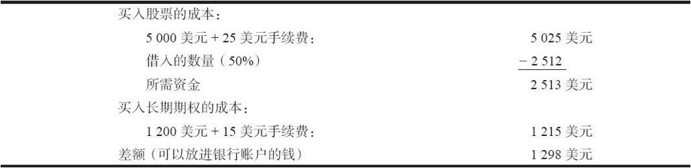
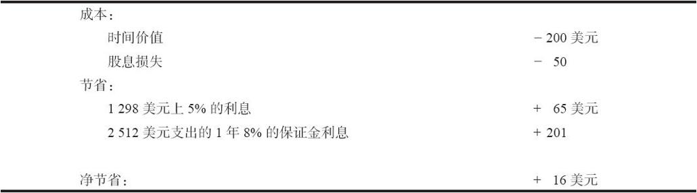

# 25.3　长期期权策略

许多使用长期期权的策略同相应的使用短期期权的策略没有多大区别。不过，正如前面显示的，长期期权的长期性有的时候会使策略家经历同他习惯的结果不同的结果。

作为一般的规则，投资者应当在利率低的时候和市场隐含波动率低的时候买入长期期权。如果出现相反的情况（高利率和高波动率），他就应当倾向于使用卖出长期期权的策略。当然，在运作一个策略的时候，还有许多其他的具体的考虑。但是，由于长期期权的长期性将投资者在如此长一段时间内暴露于利率和波动率的运动，投资者在建立一个头寸时，应当把自己放在一个就这两方面而言是有利的位置上。

### 25.3.1　使用长期期权来代替股票

任何实值的期权都可以用来代替标的股票。股票持有者可以使用一手实值看涨期权多头来代替股票多头。股票的卖空者也可以使用看跌期权空头来代替股票空头。这并不是什么新观念，我们在第3章讨论买入看涨期权的理由时简单地提到过。在短期期权中这已经在相当长的时间内被用作一种策略。不过，随着长期期权的引进，它的吸引力似乎在某种程度上增加了。越来越多的人在考虑是否能够卖出他们持有的股票，买入LEAPS作为替代，或者干脆一开始就买入长期期权而不是具体的普通股股票。

替代目前持有的股票。简单地说，这个策略使用的是这样的思考方式：如果投资者持有股票并且卖了它，他就可以从这笔收入中拿出一小部分来投资在一手看涨期权里。如果股票价格上涨，他仍然可以得到上行方向的潜在盈利，与此同时，将剩下的钱投资在银行里以得到利息。所收到的利息可以作为股息（如果有的话）的替代品，毕竟现在他就不能收到股息了。此外，他在下行方向的风险更小了：如果股票急剧下跌，他的亏损限制在这个看涨期权最初的成本里。

在实践中，投资者应当仔细计算他能够得到的和他将要放弃的。例如，失去的股息收入是否太大，将多余的收入进行投资是不是足以弥补这个亏损？在为这个看涨期权所支付的时间价值中，有多少潜在的收益会浪费掉？决定使用看涨期权来代替股票的股票持有者所面临的成本是手续费、看涨期权的时间价值和失去的股息。好处是从释放出的大笔资金中得到利息，再加上持有看涨期权比持有股票在下行方向的较小风险。

【示例25-1】XYZ的售价是50。行权价为40的1年的长期期权的售价是12美元。XYZ的年度股息是50美分，短期利率是5%。一个100股XYZ普通股股票的持有者如果想要卖掉他的股票，买入1年长期期权作为替代，那么，他必须计算的经济事实有哪些呢？

这个看涨期权的时间价值是2点（40+12-50）。此外，如果卖掉股票，买入长期期权，他可以得到3800美元减去手续费。首先，计算一下由此产生的净收入：

现在可以计算出做这样转换头寸的成本和好处：

股票的持有者现在必须决定是否值得为了将他的下行风险限制在39的价格之上而在每股股票上支出略微高于1美元的成本。39的价格作为下行方向的风险限制，只是用每股的形式表达出的他从该头寸中收入的净收入（3760美元）加上利息收入（188美元）的总量。也就是说，如果XYZ在今后一年急剧下跌，这手长期期权无价值到期，投资者在他银行账户里仍然有3948美元。这就等于将他最初的100股股票的价格风险限制在39之上。

如果投资者决定要用长期期权替代股票，他就应当将卖股票的收入存在1年的定期存款或政府债券里。这样做有两个原因。首先，他在1年内锁住了目前的利率，也就是他在计算中所使用的利率。其次，他不会再受诱惑，把这笔钱用在其他地方，如果这样做，就有可能抹去了这个替代策略的潜在好处。

上面的计算都是假定这个长期看涨期权或股票都会被持有整整一年。如果投资者知道情况不是如此，那么就必须重新计算，得出正确的成本和好处。

警告。看上去这笔钱（102美元）对将股票头寸转换成看涨期权持有权来说是一个合理的不高的价格。不过，如果投资者计划要在股票跌到39之前就将股票出手，那么，他也许会感到他不需要花这个钱来买保护。（不过，应当意识到，他基本上可以实现同样的目的，因为他在任何时候都可以将他的长期期权卖掉。）另外，在1年结束的时候，如果他仍然想持有这个股票的话，他必须支付另一笔股票手续费，将XYZ普通股股票买回来（或者他必须付两笔期权手续费将他的看涨期权多头挪仓到后面的到期日）。另一个可能存在但不太可能出现的缺点是，标的普通股股票有可能宣布增加股息，或者更糟一些，会有特殊的现金股息。无论什么形式的股息，长期期权持有者都没有权利得到，而股票持有者则显然有这样的权利。如果这个公司宣布有配股，它对这个策略没有影响，因为看涨期权持有者有权利得到配股（以股票形式发放股息）。利率的变化也不成为影响因素，因为长期看涨期权的持有者是投资在1年的债券或者1年的定期存款中，因此不受期间短期利率变化的影响。

还有其他会对这个策略发生影响的情况。它们大部分都与税收考虑有关。如果这个股票目前是一笔有盈利的投资，把它卖掉就会产生资本收益，因此就必须纳税。如果股票目前有浮亏，买入看涨期权就会是一笔洗售交易（wash sale），投资者在这个时候并没有承接亏损。（参见第41章，其中对洗售交易规则和期权交易有更广泛的讨论。）

从理论上说，上面的计算可以产生一笔总收入。在这种情况下，投资者一般会想要用看涨期权来替代股票，除非他的税务考虑占了上风，或者他怀疑会有新的现金股息。如果出现这种情况，在转换头寸上一定要非常小心。正常情况下，套利者——为交易所会员交易并且无须付手续费的人，在一般公众有机会发现这样的情况之前就已经利用了这样的情况。如果他们不利用这样的机会，那就一定有什么理由（也许是现金股息）。因此，如果出现这种情况，在大胆走进去之前，你必须极度小心进行经济分析和研究。

总的来说，如果一只普通股股票有实值长期期权存在，股票的持有者就应当对使用长期看涨期权来替代普通股股票的经济理由作一个评价。即使数学的计算肯定了这种替代策略，股票持有者还是必须考虑他的税务情况以及股票的现金股息前景，然后才能决定是否应当转换头寸。

### 25.3.2　一开始就买入长期期权而不是买入普通股股票

这种股票持有者决定是否应当用长期看涨期权来代替股票的逻辑，同样也适用于准备买股票的人。换句话说，这个投资者不是已经持有这只股票，他是想要买这只股票。这个潜在的买家也许应当买入一手长期看涨期权，然后将剩下来准备买股票的钱存进银行，而不是实际买入股票。

他的成本（实际成本和机会成本）可以用同前面相似的方法计算出来。唯一真正的不同是，在这个情况里，他必须支付股票手续费，而在前面的示例里他则不用（因为他已经持有股票）。

【示例25-2】同前面一样，XYZ的售价是50，1年的行权价为40的长期期权的售价是12，XYZ的年度股息是50美分，短期利率是5%。

普通股股票的原始买家，如果他决定买入长期看涨期权而不是股票本身的话，他就有一定的“机会”成本和节省。首先，计算一下买入股票同买入长期期权之间所需投资的不同：

现在，计算一下成本和节省：

注1：疑原文有误，原文为190。——译者注

注2：疑原文有误，原文为60。——译者注

在这个情况里，看起来似乎潜在的股票买家更应当买入长期看涨期权。如果他将初始投资中的差额放入1年的定期存款或者政府债券的话，他的净“成本”就只有59.5[1]美元。用这样一小笔钱，他就可以得到全部的上行方向的潜在盈利（扣掉59.5[2]美元），而下行的风险则限制在40之上（到1年结束的时候，即使长期期权无价值到期，他也会有4000美元在银行账户里）。

买入实值长期期权，同时将长期期权的成本同股票的成本之间的差额放进有利息的投资里，这是一个有吸引力的策略。如果这个差额投资的利息很高的话，就更是如此。不幸的是，这样的高利息带来一种两难的困境。因为，正如前面指出的，较高的利息会使得长期期权变得更为昂贵。

在这个替代的策略里，投资者得不到增发现金股息或特别股息的好处，而他所替代的股票持有者则能够得到。但是，股票持有者有其他的担心，像税收之类的，这些就与他无关。同样，这些具体的计算只有在打算将股票持有整整一年的情况下才有效。如果预期持有期短于1年，那么就应当作相应的调整。

使用保证金。一个普通股股票的潜在原始购买者也可能在考虑用保证金来买入股票。如果他用长期期权代替，他就可以省下保证金利息。当然，他不会有那么多的钱放在银行里。不过，他同时也应当将成本同买入长期看涨期权所需要的成本进行比较。

【示例25-3】同前面一样，XYZ的售价是50，1年的行权价为40的长期期权的售价是12；XYZ的年度股息是50美分，短期利率是5%。另外，假定保证金的利率是就借入的支出的8%。

首先，计算一下不同投资前景的差别：

假定他是要买入长期期权的话，现在可以将成本和机会进行比较了。

对于潜在的使用保证金的股票买家来说，在这个示例里有真正的节省。事实上，他不必就他的支出支付保证金利息，使得买入长期看涨期权成为一种节约成本的替代方法。最后，应当注意到，现有的保证金规则允许投资者使用保证金来购买长期期权。这也可以放到上面的计算里，只要减去所需投资，在支出上增加保证金费用就可以了。

总的来说，普通股股票的潜在买家常常会发现，如果有实值的期权可以使用，买入这个期权比买入股票自身更具吸引力。如果他计划要使用保证金来买股票，那么，买入长期期权就可能更具有吸引力。买入长期期权的主要缺陷是如果现金股息增加或者有特别股息，他是得不到的。不过，读者请耐心地读下去，因为下面的策略也许比上面这个策略还要好。

### 25.3.3　使用长期看跌期权来保护已经持有的股票

上面所介绍的替代策略要达到什么目的呢？股票持有者付出一定的成本（在实际示例里是102美元），从而将他持有股票的风险限制在39上。如果他买入一手长期看跌期权作为代替呢？让我们暂时不考虑这个看跌期权的价格，把注意力集中在这个策略能够实现什么样的目的上。投资者在下行方向会得到保护，不会有大量的亏损，因为他持有一手看跌期权，而且他可以享受上行方向的增值，因为他仍然持有股票。这难道不是替代策略想要达到的目的吗？是的，确实是。在这个策略里只需要付一笔手续费（付在相当便宜的虚值长期看跌期权上），而且也没有失去增加的股息或特别股息的风险。

在使用一手看涨期权作为替代与买入一手看跌期权之间进行比较是相当容易的。首先，像在上面的示例里那样对它们的表现进行计算。这个示例显示出股票持有者要用长期看涨期权来替代股票的成本是102美元，这样的替代可以把他的头寸保护在39的价格上。事实上，他为一手行权价为40的长期看跌期权所付的是[3]美元（102美元的成本加上40的行权价同保护价之间的差额）。现在，如果XYZ的1年的行权价为40的长期看跌期权可以用买到，他只买入这手看跌期权，就可以完成最初想要完成的所有的事情。

此外，他还可以在手续费上省钱，并且仍然可以享受增加的现金股息。这些额外的好处应当使得看跌期权对股票持有者具有更大的价值，因此，他也许愿意为这个看跌期权付比略高一些的价格。如果长期看跌期权可以以这个价格买到，它显然就是个更好的选择，投资者应当买入长期看跌期权而不是使用长期看涨期权来代替普通股股票。

因此，任何想要对他的头寸进行保护的股票持有者都可以用以下方法中的一种：他可以卖掉股票，用一手看涨期权来代替它；或者继续持有股票，同时买入一手看跌期权来保护它。对这个策略来说，长期看涨期权和看跌期权是经得起检验的。因为LEAPS的长期性，投资者不必反复建立他的头寸，付多重的手续费，就像他在短期期权中不得不做的那样。要决定这样的运作是否可行，或者，如果可行的话，是应当使用看涨期权的替代策略还是看跌期权的保护策略，股票持有者应当进行上面所显示的那些简单的计算。

### 25.3.4　使用长期期权而不是卖空股票

正如买入实值的长期看涨期权有的时候比买入股票本身更明智一样，买入实值的看跌期权有的时候是比卖空普通股股票更好的选择。读者应当还记得，无论是买入看跌期权还是卖空股票都是一种看空的策略，实施的人通常预期股票价格会下跌。不过，策略家知道，卖空股票是许多策略的一个组成部分，它也许反映了其他的看法，而不只是对股票的纯粹看空。无论是哪种情况，一手实值的看跌期权都可以有效地替代对股票自身的卖空。看跌期权持有者有两个主要优势：他限制了风险（而股票卖空者在理论上有无限的风险）；同时，他不必像卖空者那样必须为标的股票支付任何股息。此外，买入看跌期权的手续费通常比卖空股票所需要的手续费要低。

要在买入实值看跌期权同卖空股票之间进行比较，没有太多可以计算的。如果花在时间价值上的费用同省下来的股息支付小的话，那么，看跌期权或许是更好的选择。

专业套利者和其他交易所会员，以及某些大客户，他们在卖空股票时能有利息收入。对这些交易者来说，要交易看跌期权，就必须是几乎完全没有时间价值。这样比较下来，他们才会选择买入看跌期权而不是卖空股票。不过，想要卖空的公众客户应当意识到存在买入一手实值看跌期权来代替这样的可能。

[1] 疑原文有误，原文为60。——译者注

[2] 疑原文有误，原文为60。——译者注

[3] 疑原文有误，原文为152。——译者注
