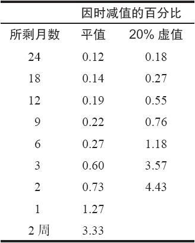
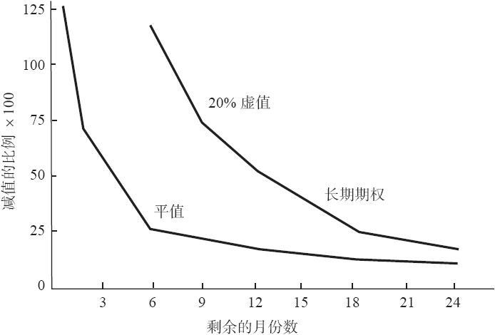
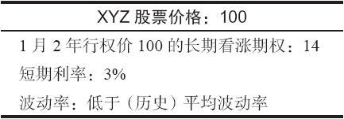
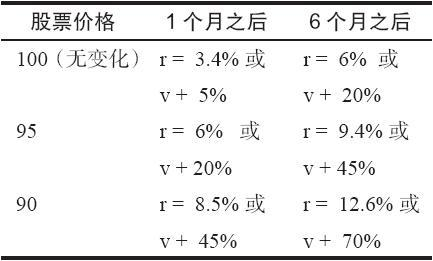
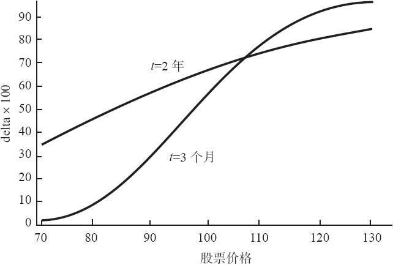
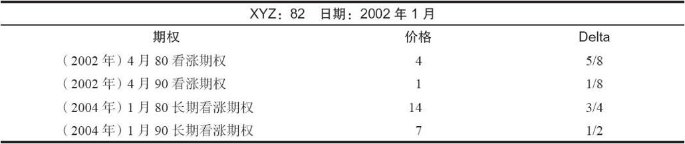
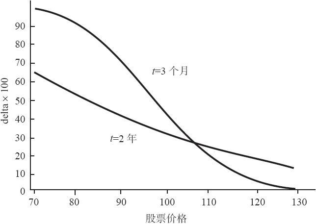

# 25.4　为投机买入长期期权

只要看一下上面的股票替代策略，策略家就可以知道买入看涨期权和看跌期权有各种不同的用法。不过，买入期权的最流行的原因是为了投机获利。持有期权所带来的杠杆和有限风险的特征使得它们在这个目的上也具有吸引力。当然，风险是亏损100%的投资，而且因时减值也是同期权持有者作对的。在这些方面，长期期权与短期期权没有什么不同，有区别的只是期权的存续期更长。

因时减值是投机性期权持有者的最大敌人。如果买入的是长期期权而不是短期期权，那么买家以天计算的因时减值暴露通常就会减小。因为随着期权接近它的到期日，因时减值的极度负面的影响才会日益放大。我们在第3章说明过因时减值不是线性的：期权价值在快到期时销蚀得比刚开始时要快得多。一手长期看跌期权或看涨期权最终会变成一手正常的短期股票期权，时间价值此时才会开始以更快的速度销蚀。但是，在长期期权存续期开始的时候，由于还有很多的剩余时间，短期的因时减值相对价格而言是不大的。

表25-2　因时减值的日百分比

表25-2和图25-4显示了两个期权的减值率：一个是平值的（上端的曲线），另一个是20%虚值的（下端的曲线）。横轴是离到期的月份数。纵轴是期权价格按日计算的因为因时减值而失去的百分比。可以称作长期期权的是离到期至少有9个月的期权，因此，它们是在图形右端底部的那些期权。

图25-4　因时减值的日百分比

两条曲线随着时间接近到期日而向上倾斜的性质表明了随着到期日的接近因时减值的加快。注意一下虚值期权的价值按百分比而言比平值期权销蚀得要快多少。不过，同正常的股票期权相比，长期期权几乎没有什么销蚀。大部分长期期权，甚至虚值的长期期权，每天失去的不到它们的价值1%的。同一手6个月的20%虚值的股票期权相比，这个数量很小。6个月的期权每天要失去1%以上的价值，而且它离到期仍然还有6个月。

从表25-2中可以看到，2个月的虚值期权每天失去价值要大于4%！

因此，长期期权价值的因时减值速度是不快的。这就使得长期期权的持有者有机会利用他对股票价格的看法为他服务，而不必像普通股票期权持有者那样，过多地担心时间的消逝。因此，持有长期期权的一个好处就是，投资者对买入期权的时机的把握不必像买入较短期期权那样把握得那么精确。这不但是一个策略上的优势，而且是一个巨大的心理优势。一个对股票的走向感到有把握的长期期权的买家，可以冷静地等到预期的运动出现。如果它不出现，即使在或许是6个月这样长的时间内，他仍然可以收回他最初买价的相当大的一部分，因为因时减值的速度缓慢。

不要以为长期期权的价值根本不会销蚀。虽然（像前面所显示的）销蚀的速度缓慢，一个每天失去0.15%价值的期权在6个月里仍然会失去它价值的25%。

【示例25-4】XYZ的价格是60，18个月的行权价为60的长期看涨期权的售价是8美元，这个期权同时间相关的价值每天的销蚀是微小的；因为时间而销蚀1/8点大约需要1个星期。不过，如果将这个期权持有6个月而没有发生其他事情的话，这个长期看涨期权的售价就会是6。因此，如果股票在6个月结束时保持在60，它就会失去25%的价值。

那些熟悉持有股票看涨期权和看跌期权的人，可能已经习惯看到一手期权在4或5个星期这样短的时间内失去它25%的价值。因此，从较为缓慢的因时减值的角度来看，持有长期期权显然是有优势的。

这种结论导致一个显而易见的问题：“什么时候是卖出看涨期权再买入较远期的看涨期权的最好时机呢？”再看一看表25-4中的数字可能对回答这个问题有帮助。可以注意到，对平值期权来说，曲线是在过了6个月之后开始急剧向上弯曲。因此，要减少因时减值的效果，在其他条件都相同的情况下，投资者在他买入的平值看涨期权离到期还有大约6个月的时间卖掉它，同时买入一手2年的长期看涨期权，这样做应当是符合逻辑的。这就可以将他的因时减值暴露减小到最低限度。

虚值期权的情况就更突出。图25-4显示了虚值20%的看涨期权在离到期还有1年左右的时候，价值就开始以快得多的速度（按百分比计）销蚀。同样的逻辑在这里也适用：如果投资者交易的是虚值期权，那么他就可以在离到期还有将近1年的时间时卖掉他持有的期权多头，同时买入一手2年的长期期权来重新建立他的头寸。

### 25.4.1　“廉价”买入的好处

我们在上面说明了一手长期看涨期权的价格会因为利率的上涨和波动率的增加而上涨。因此，如果投资者想要参与到投机买入长期看涨期权的策略里，那么他就应当在利率和波动率低的时候更激进一些。

使用几个价格作为例证，也许可以帮助说明利率和波动率的影响有多大，以及它们如何能够成为长期看涨期权买家的朋友。假定投资者买入一手2年的平值长期看涨期权，当时的情况是：

为了说明的目的，假定目前的波动率低于XYZ的历史波动率，3%的利率也是低水平的。如果股票价格上涨，那就没有问题，因为长期看涨期权的价格也会上涨。但是，如果股票价格下跌或者停留在原来的价位没有变化呢？是不是就没有盈利的希望啦？实际上，不是。如果利率增加或者看涨期权交易的波动率增加，我们知道长期看涨期权价值也会增加。因此，即使股票也许是朝不利的方向运动，仍然有可能拯救交易者的投资。表25-3显示了即使在所说的时间过去之后，要将长期看涨期权的价值保持在14时，波动率应当是多少以及短期利率应当在哪里。

表25-3　1月2年长期期权=14时所必需的因素（r：利率；v：波动率）

为了说明怎样使用这张表格，假定股票价格在1个月之后是100（无变化），如果利率在这段时间从原来的3%上涨到了3.4%，即使已经过了1个月，这个看涨期权仍然价值14。换一种情况，如果利率没有变化，波动率从它原来的水平上升了5%，那么，这个看涨期权仍然价值14。请注意，这是说波动率只需要从它原来的水平上稍许有所上升（原来水平的1/20），而不是上升整整5个百分点。

即使股票价格跌到90，时间过去6个月，如果利率上升到了12.6%（几乎不可能）或者波动率增加了70%，那么，这个长期看涨期权的持有者仍然可以盈亏平衡。波动率常常有可能在6个月内有如此大幅度的波动，但利率则不太可能。

事实上，就利率而言，在这个表格中只有顶部那一行也许代表了现实的利率。1个月里增加0.4%，或者6个月里增加3%，这是有可能的。在其他几行中，也就是股票价格下跌的情况，要拯救这个看涨期权的价格，如果光凭利率的变化，那么对利率增加的幅度要求就过高了。不管怎么样，任何利率的增长都会有帮助。波动率则是另一回事。波动率常常有可能在1个月的时间内从原来的水平上有50%的变化，在6个月里就更是如此。因此，正如前面说过的，波动率是更起主导作用的因素。

这张表格显示了增长的利率和波动率对长期看涨期权的影响。这样的影响对长期看涨期权的持有者有利，当然，对长期看涨期权的卖家不利。显然，投资者在一个策略中使用长期期权之前应当意识到利率和波动率的大致水平。

### 25.4.2　delta

一手期权的delta是当标的股票价格每变化1点时期权价格会随之变化的数量。在这一章前面的部分里，在比较长期期权同短期期权之间的区别时，我们曾经提到过delta。在这里对这个议题要做更深的探讨，因为它是一个非常重要的概念，不但对期权的买家是如此，在大多数策略性决定中也是如此。

图25-5显示了两个不同期权的delta：2年的长期期权和3个月的股票期权。它们的条款除了到期日之外都相同。行权价为100，波动率和利率的假设都相等。横轴代表的是股票的价格，纵轴代表的是期权的delta。

图25-5　看涨期权delta比较，2年长期期权同3个月股票期权相比

我们可以作出若干相关的观察。首先，注意一下平值长期期权的delta非常大，将近0.70。这就意味着，同相应的短期股票期权相比，长期看涨期权的运动与普通股股票的运动要同步得多。非常短期的平值期权的delta大约是0.50，而略为长期的期权的delta在0.55~0.60的区域里。这种现象意味着，一手平值期权的存续期越长，它的delta就越大。

另外，这张图还显示出，3个月看涨期权和2年的长期看涨期权的delta在期权大约为5%实值时是大致相等的。如果期权实值更深，那么长期看涨期权的delta就会较低。这就是说平值和虚值的长期期权同相应的短期期权相比与普通股票的运动更为同步。重申一遍，除非是两个期权都实值5%以上，否则长期看涨期权比正常的短期期权运动得更快。请注意，这里说的运动指的是绝对的价格变化，而不是价格的百分比变化。

当股票运动的时候，2年长期期权的delta的变化没有3个月期权的delta的变化大（见图25-5）。请注意，长期期权的曲线在图形中相对平坦，只是略为向上偏离水平线。与此相对，3个月看涨期权的delta在期权虚值的时候非常低，而在期权实值的时候则非常高。对看涨期权的买家来说，这意味着他可以预期到长期看涨期权价格增加或减少的数量是同样稳定的。这就会影响到他究竟是买实值的看涨期权还是买虚值的看涨期权。在正常的短期期权中，他可以预期实值看涨期权会更为紧密地反映股票的价格运动。因此，如果他预期股票有小规模的运动，他会想要买入这个看涨期权。可是，在长期期权里，在出现期权价格运动时，其数量上的差别远没有那么大。

【示例25-5】XYZ的交易价是82。有行权价为80和90的3个月的看涨期权，这些行权价上也有2年的长期期权。下面的表格总结了现有的信息：

假定交易者预期标的普通股股票在3个月内会从82运动到85。如果他分析的是短期看涨期权，他就可以看到在4月80看涨期权中有的潜在盈利，在4月90看涨期权中有3/8的潜在盈利。这两个盈利的计算都是将看涨期权的delta乘以3（用点数计算的预期的股票运动）。因此，在这两个期权中，预期盈利有很大的区别，特别是在把手续费考虑进去之后。

现在来看一下长期期权。如果XYZ向上运动3点，1月80将增加，1月90将增加。它们之间的区别远没有短期期权之间的区别大。你可以注意到1月90长期期权的售价是1月80长期期权的一半。由delta勾画出的运动标志出1月90长期期权运动的百分比要大于1月80的合约，因而是更好的买入选择。

### 25.4.3　看跌期权delta

前面对长期看涨期权的delta所作的观察，有许多也适用于长期看跌期权。不过，在使用下面的公式时，图25-5就有了一些变化。读者应当还记得，看跌期权delta同看涨期权delta之间的关系是（除了深度实值的看跌期权之外）：

看跌期权delta=看涨期权delta-1

这就将前面介绍的关系倒转过来了。换句话说，短期看涨期权运动得没有长期期权快，而短期看跌期权在大部分情况里运动得比长期看跌期权要快。图25-6显示了这些期权之间的delta。

图25-6　看跌期权delta比较，2年长期期权同3个月股票期权相比

纵轴表示的是看跌期权的delta。请注意，就价格变化而言，虚值长期看跌期权同短期股票看跌期权之间的行为没有多大的区别（图形的右下部）。

如果是短期期权，实值的看跌期权（当股票价格低于行权价的时候）运动得较快。看跌期权实值得越深，这个事实就越突出。图形的左侧显示出了这个事实。

就像长期看涨期权的delta曲线那样，长期看跌期权的delta曲线也是平坦的。此外，这个delta在整个图形中都没有数值很大的情况。例如，实值的2年长期看跌期权在标的股票每运动1点的时候只运动30%。想要就股票的下行运动做投机而买入长期看跌期权的投资者必须意识到，这里的杠杆效应不是很大。一手实值的长期看跌期权的价值想要增加1点，标的普通股股票的价格就要运动大约3点。长期看跌期权对股票运动的反应远没有短期看跌期权那么敏感。

总的来说，想要买入长期看跌期权或看涨期权作为投机的期权买家，应当意识到长期期权在同较短期期权比较时所表现出的不同的价格行为。由于长期期权距离到期还有很长时间，长期期权的因时减值要小一些。由于这个原因，长期期权的买家在时机把握上不需要那么精确。总的来说，当标的股票运动的时候，长期看涨期权运动得更快，而长期看跌期权运动得更慢。除此之外，投机买入期权的一般理由同样适用于长期期权：杠杆和有限的风险。
