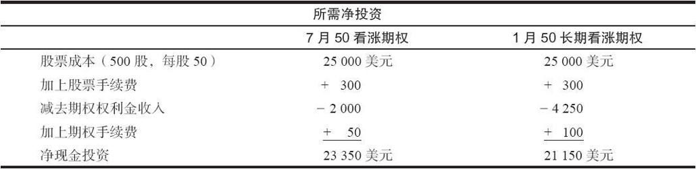
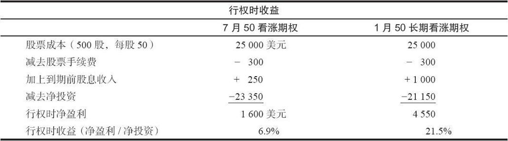
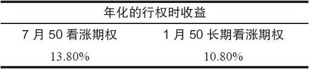
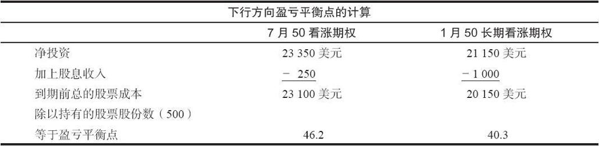
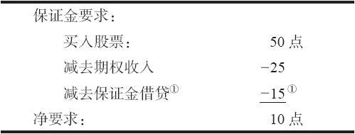
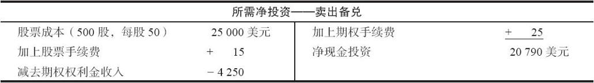
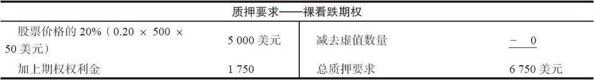
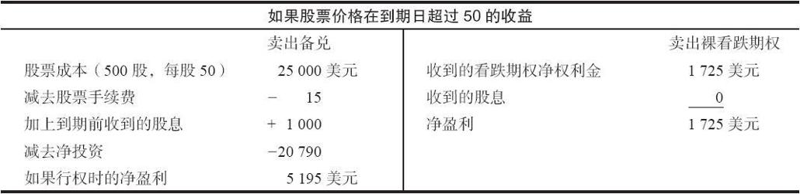
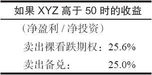

# 25.5　卖出长期期权

卖出长期期权的策略同卖出较短期期权的策略没有显著的不同。这一节的讨论将集中在长期期权的卖家需注意的两个主要区别。第一，长期期权的较慢的因时减值的速度，意味着那些习惯于坐在一边，看着卖出的期权的时间价值被消耗掉的短期期权的卖出者，在长期期权上不会经历同样的效果。第二，卖出策略的后续行动往往取决于是否能够在卖出的期权只有很少或者没有时间价值剩下来的时候将它们买回来。因为长期期权即使为大量实值或虚值的情况下仍然保留了时间价值，长期期权使用的后续行动就会涉及重新买回大量的时间价值。

### 25.5.1　卖出备兑

正如同短期期权一样，也可以就标的股票而卖出长期期权。这样做不需要额外的质押或投资。这样的头寸有有限的潜在利润，并在标的股票价格保持不变或下跌时增强盈利（同持有股票相比）。只要标的股票在到期日价格等于或者高于卖出的期权的行权价，卖出备兑就能实现它的最大潜在盈利。

长期期权的卖出备兑者在卖出长期的期权时，就价格而言，收到了大量的权利金。他应当将他从卖出长期期权中可以得到的盈利，同他反复卖出较短期看涨期权时的盈利进行比较。当然，没有人能够担保他可以在这长期期权较长的存续期内不断地卖出短期期权。

另外，使用卖出备兑的递增收益概念的策略家也许会发现卖出长期看涨期权相当有吸引力。这是一个他可以找到更高的目标价位的策略，在这个价位上他愿意卖掉他的普通股股票，而且，他可以顺便卖出看涨期权，赚得递增的收益（参见第2章中介绍的细节）。因为这一类卖出者所关心的只是账户中所买入的权利金的绝对水平，而不是类似行权时收益等事。因此，如果有可能，他就应当使用长期看涨期权，因为其中有最大程度的权利金。此外，如果递增收益卖出者眼下持有短期看涨期权，并且就要被指派，那么，他也许应当挪仓到长期看涨期权，以保住他的股票，并且得到更多的权利金。

这一节剩下的部分将从更平常的角度来讨论卖出备兑，这个投资者买入股票，同时就这个股票卖出一手看涨期权，以获得一个具体的收益。

【示例25-6】XYZ的售价是50。投资者正在考虑一笔500股的卖出备兑。他不能确定使用6个月的看涨期权还是2年的长期期权。7月50看涨期权的售价是4，离到期还有6个月；1月50长期看涨期权离到期还有2年。让我们进一步假设XYZ每个季度发放25美分的股息。

正如在第2章里那样，我们计算了所需要的净头寸，然后计算了收益（行权时收益），最后确定了下行方向的盈亏平衡点。

显然，长期期权卖出备兑者所需要的现金投资更少，因为他在卖出备兑中卖出了一个更为昂贵的看涨期权。请注意，在这两种情况里期权权利金都用来抵消一部分投资。在进行卖出备兑时，这是个正常的习惯。

现在，知道了所需要的净投资，投资者就可以计算出（行权时）收益。这个收益是假定股票价格在到期日时等于卖出期权的行权价，而且股票因为期权指派而被买走。短期卖出者可以收到2次股票的股息，而长期卖出者在到期时则收到了8次。

如果行权，长期期权卖出者有高得多的净收益，这也是因为他一开始卖出的就是更昂贵的期权。不过，为了合理地对这两种卖出策略进行比较，应当把收益年化。也就是说7月50卖出备兑在6个月内的收益是6.9%，因此，如果在今后的6个月内能够重复同样的表现，那它的年化收益就是这个数字的两倍。同样地，长期期权的卖出备兑者在股票被行权买走的情况下在2年内的收益是21.5%。不过，如果是以年度为基础计算，那么他的年化收益就只是这个数字的一半。

因此，如果以年化为基础，短期的卖出看上去更好。短期看涨期权通常比长期看涨期权有更高的年化收益率。下面我们会讨论年化的问题。

最后，对每一种卖出都可以计算出它们在下行方向的盈亏平衡点：

卖出的长期看涨期权的较大的权利金为长期期权卖出备兑提供了一个低得多的盈亏平衡价格。

如果投资者使用的是保证金账户，对用保证金做的卖出备兑也可以进行相似的比较。上面的步骤是卖出备兑者为了判别短期卖出备兑同长期卖出备兑之间的优劣而做的必要步骤。对它们的分析则不那么常见。如果投资者使用年化的收益率，似乎短期卖出要好一些。不过，年化收益在某种程度上是一个取决于若干假设的主观数字。

第1个假设是，在7月50看涨期权无价值到期或者股票被指派买走之后，在随后的6个月里，投资者仍然有可能产生相等的收益。如果股票价格相对没有变化，这个卖出备兑者必须用4点卖出一手从现在算起的6个月的看涨期权。或者，如果股票被指派买走，他必须在其他地方找到相同的投资。此外，为了达到长期卖出提供的2年时间长度，这个6个月的收益必须要反复再生成3次（离现在6个月、1年，以及1.5年）。这个卖出备兑者对假设这样的收益会每6个月重复一次根本没有任何把握。

在计算年化收益时采用的第2个假设是，1年过后长期看涨期权的行权时收益有一半可以兑现。但是，正如在这一章里反复说明的，一手期权的因时减值不是线性的。因此，1年之后，如果XYZ的价格仍然是50，1月50长期看涨期权的售价就不会是它目前价格的一半。如果其他条件没有变化，它的售价会在5.00左右。不过，考虑到长期看涨期权在利率、波动率或股息支付发生变化时的可变性，想要对1年之后的看涨期权的价格进行评估，是一件极其困难的事。因此，认为2年21.5%的行权时收益在1年之后将是10.8%，这很可能是一种错误的判断。

因此，卖出备兑者必须根据他所知道的信息来做出决定。他知道，如果是短期的7月50卖出备兑，要是股票在6个月被指派买走，他的收益就是6.9%，仅此而已。如果他选择较长期的期权，如果股票在2年内被指派买走，他的收益就是21.5%。哪个选择更好？这个问题只有每一个卖出备兑者自己可以回答。投资者对长期投资的态度在做出这个决定时会是一个主要的因素。如果他认为XYZ在长期内前景很好，而且他认为今后2年内保守的收益将在10%之下，那么，他也许就会选择卖出长期期权。不过，如果他觉得短期XYZ看涨期权的权利金中有暂时超量可以利用，而且他并不真想成为这个股票的长期持有者，那么他也许会选择短期卖出备兑。

下行方向保护。投资者或许也会考虑到实际的下行方向的盈亏平衡点。卖出长期期权的下行盈亏平衡点为40.3，这是已知的数量。无论XYZ在2年之内跌得有多深，只要它在到期之前反弹到略为高于40的地方，这笔投资至少会不盈不亏。如果股票很快跌到了40，那就会有问题。如果出现这样的情况，长期看涨期权仍然还有很大数量的时间价值。因此，如果投资者想要在这个时候将股票卖掉，同时买回他的看涨期权，那么他就会有亏损，而不是一个盈亏平衡的局面。

短期卖出只能将股票的下行风险保护到46.2。当然，如果在今后的2年中反复卖出6个月的看涨期权，可以将盈亏平衡点降低。问题是，如果XYZ价格下跌，投资者就不得不每6个月卖出一次6个月的看涨期权，那么他将被迫使用一个更低的行权价，如果权利金水平缩减，他就只能锁住较少的盈利（或者甚至是一笔亏损）。我们在第2章详细讨论过向下挪仓的概念。

这里有必要对向下挪仓再说一点。读者应当记得，向下挪仓就是买回目前卖出的看涨期权，同时卖出另一手行权价较低的看涨期权。虽然当标的股票价格不断下跌时，也许有必要进一步防范下行方向的亏损，但是，这样的行动在任何时候都会减小整个头寸的盈利能力。现在有长期期权可以使用，面临向下挪仓的短期卖出者于是可以考虑将长期期权用作工具，即使是向下挪仓，也可以带来有益的权利金。不错，这样做的确可以收到大笔的权利金。不过，要记住，在这样做的时候，投资者承担了按照比他原先想要的价格更低的价格卖出股票的义务。这就是为什么向下挪仓减少了最初的潜在盈利。如果向下挪仓到一手长期期权，他就减少了他在一段更长的时间内的最大潜在盈利。因此，投资者不应当无保留地将一手期权挪仓到存续期更长的合约。他应当仔细地分析他是否想要在标的股票下跌的情况下在一个头寸中投入这么长的时间。

总的来说，长期看涨期权提供的大量绝对的权利金会让卖出这些备兑看涨期权变得非常有吸引力。不过，投资者应当对可能的收益进行计算，看一看短期卖出是否能够达到同样的目的。即使长期期权的大量权利金有可能将最初的投资降低到微不足道的地步，但投资者也必须意识到，它同时也创造出了大量的杠杆，而杠杆有可能是危险的东西。

长期看涨期权提供的大量的下行方向保护是现实的，但是，如果股票跌得太快，在计算出的下行盈亏平衡点上无疑会有一笔亏损。最后，如果出现麻烦，投资者不应当总是将头寸挪仓到长期看涨期权，因为他将不得不在一个甚至更长的时段内按照比最初打算的价格更低的价格卖出他的股票。

### 25.5.2　“免费”卖出备兑看涨期权

在第2章里我们简单地介绍过一种卖出昂贵的长期期权的策略。在这一节里，我们将对它进行更为仔细的分析。有一种类型的卖出备兑看涨期权，其中使用相当昂贵的看涨期权，它有的时候会吸引交易者来搭“顺风车”。这个策略在一定程度上的确像在搭顺风车。不过，正如你可以想象到的，它也可能带来大麻烦。

一手基于保证金的卖出备兑看涨期权所需要的投资是股票价格的50%，减去从卖出这个看涨期权中所得的收入。从理论上说，一手期权有可能卖到股票成本50%之上的价格。如果是一个保证金账户，那就有可能“免费”建立一手卖出备兑。我们分别用两种看涨期权来讨论这一点：卖出实值看涨期权和卖出虚值看涨期权。

卖出虚值备兑看涨期权。这是考察这个策略的最简单途径。投资者有可能找到这样的长期期权，它只是略为虚值，售价是股票价格的50%。可以理解，这样的股票波动率会相当大。

【示例25-7】GOGO股票的售价是每股38美元。GOGO有场内期权，2年的行权价为40的长期看涨期权的售价是19美元。这手卖出备兑所需要的资本是零，虽然会有一些手续费。支出是每股19点，经纪人会在保证金的基础上借给你这个数目。

有的经纪公司要求有某种最低的保证金存款，不过，从技术上说，对这个头寸没有进一步的要求。当然，杠杆是无限的。假定投资者决定要买入10000股GOGO的股票，同时卖出100手备兑看涨期权。如果股票跌到零，他的风险是190000美元！这也正是他的账户中的支出。因此，就仅仅一笔投资，投资者有可能亏损到倾家荡产。此外，如果股票开始下跌，投资者的经纪人会要求维持保证金。他或许在股票下跌不到2点的时候就要求投资者存入保证金。如果投资者持有10000股股票，经纪人要求2点的维持保证金，那就意味着这个追加保证金的数额是20000美元。

盈利也不会像乍一看上去那么大。最大的潜在毛盈利是210000美元，如果股票是在40的价位上被指派买走的话。卖出备兑在每一股上盈利21点（40美元的卖出价格减去最初的成本19美元）。投资者必须为支出总额190000支付2年的利息。如果利率为10%，那么总的利息就是38000美元。在买入和卖出上还都有手续费要付。

总的来说，这是一个有巨大的甚至危险的杠杆的头寸。

卖出实值备兑看涨期权。如果期权在一开始的时候是实值的，那么情况就会略有不同。上面的保证金要求实际上并没有准确地说出使用保证金时的卖出备兑看涨期权。当一手卖出备兑是建立在股票上的时候，这里有一个条件：股票价格的50%或者行权价的50%，两者取其低者，才能被“借走”。因此，投资者实际上在一开始就需要比股票价格一半更多的资金。

【示例25-8】XYZ的交易价是50，有2年的行权价为30的长期看涨期权，售价为25点。投资者也许会认为一手卖出备兑看涨期权所需要的资金会是零，因为看涨期权的售价是股票价格的一半。但是，在实值看涨期权的情况下，并不是这样。

①行权价的50%或股票价格的50%，取其低者。

这个头寸仍然有很大的杠杆。投资者投资了10点，希望如果股票在30的价位上被指派买走，可以盈利5点。当然，如果头寸持有2年，投资者同时必须为15点的支出支付2年的利息。此外，如果股票跌到行权价之下，经纪人会要求维持保证金。

请注意，上面计算净要求的“公式”同样适用卖出虚值备兑看涨期权，因为在这种情况里，股票价格的50%始终是低于行权价的50%的。

总结一下这个“顺风车”策略：如果投资者决定要使用这个策略，他必须高度注意高杠杆的危险。无论最初的投资多么微不足道，投资者所冒的风险一定不能大于他亏得起的钱。同时，他必须有所计划，在投资的过程中能够应付保证金的要求。最后，选择实值期权也许更好一些，因为这样出现维持保证金要求的可能性小一些。

### 25.5.3　卖出无备兑长期期权

卖出无备兑期权是一个有活力的策略，特别是如果权利金的定价过高的话。长期期权可以按照与短期期权相同的保证金要求卖出。当然，取决于投资者的目标，长期期权的特性可以帮助或者伤害无备兑的卖出者。

卖出无备兑看跌期权。我们首先来谈谈卖出裸看跌期权，这是因为作为一种策略，它同我们刚刚讨论过的卖出备兑相等。两种期权如果在到期日的盈利图形相同，它们就是相等的。卖出裸看跌期权同卖出备兑看涨期权是相等的，因为它们的盈利图形相同（见附录D，图形I）。两者都有上行方向的有限潜在盈利和下行方向对大量亏损的暴露。一般来说，在两个相等的策略中，有一个会比另一个具有某种优势。

在这里的情况中，卖出裸看跌期权通常是两者之中更具优势的，原因是保证金设定的方法。在卖出裸看跌期权时，投资者不必实际有现金投资；他可以用质押来满足保证金的要求。这就意味着裸看跌期权卖出者可以用股票、债券、政府债券或货币市场基金作为质押。此外，所需要的实际质押数量也少于买入股票和卖出看涨期权所需要的保证金投资。这就意味着，投资者可以正常地操作他的投资组合：买入股票，然后把它卖掉，将收入放进政府债券，或者是买入另一只股票，与此同时，只要他满足了维持质押的要求，他的裸看跌期权头寸就不会受到干扰。

因此，买入股票和卖出看涨期权的策略家或许应当改用卖出裸看跌期权。这并不适用于那些就已经持有的股票的卖出备兑者，也不适用于那些使用卖出备兑的递增收益概念的人，因为股票的持有权是他们策略的一部分。不过，如果有这样的策略家，他们想要得到权利金，在标的股票价格相对不变或上涨的时候得到盈利，同时在下行方向有少量的保护（这是卖出裸看跌期权和卖出备兑这两个策略的定义），那么，他们就应当卖出裸看跌期权。作为一个例证，想一想前面所讨论的那个卖出长期备兑。

【示例25-9】XYZ的售价是50。投资者在斟酌，究竟是应当使用2年的长期看涨期权和500股股票来卖出备兑，还是应当卖出5手2年的长期看跌期权。1月50长期看涨期权的售价是8.50，离到期还有2年，1月50长期看跌期权的售价是3.50。我们进一步假设XYZ每个季度支付25美分的股息。

卖出备兑所需要的投资同上面的计算是一样的：假设每股股票的手续费是3美分，每手期权合约的手续费是5美元。

对卖出裸看跌期权的质押要求同对任何裸股票期权的质押要求是一样的：股票价格的20%，加上期权的价格，减去虚值的数量。最低的绝对质押要求是股票价格的15%。

请注意，这个裸看跌期权卖出者实际收到的权利金是1750美元减去手续费，例如，100美元，因此就是1650美元。这笔净权利金可以用来降低总的质押要求。

现在，我们可以对这两笔投资的盈利能力进行比较了：

现在可以比较它们的收益了。如果XYZ在长期期权到期时价格在50之上：

卖出裸看跌期权的收益率比较高，即使在没有考虑到以下的事实时也是如此。使用裸看跌期权的策略家不必在质押上花6750美元的现金。这笔钱可以放在政府债券里，在卖出看跌期权的2年时间内赚取利息。即使长期债券只有4%的年息，这也可以给这个卖出裸看跌期权头寸在整个2年里的收益增加8%，也就是到33.6%。这就使得事情很清楚：从策略的角度看，卖出裸看跌期权比卖出备兑看涨期权更优越。

即便如此，投资者也许有理由会想，卖出长期看跌期权是否比卖出较短期的股票看跌期权更优越。同卖出备兑看涨期权的情况一样，答案取决于投资者想要达到什么目的。短期看跌期权不能给账户带来那么多的权利金，因此，当它们到期的时候，投资者就不得不去卖出另一手合适的看跌期权，以替代到期的那一手。另一方面，卖出长期看跌期权带来大量的权利金，投资者在长期看跌期权到期之前不必去找替代。卖出长期看跌期权的不利一面是因时减值在短时间内帮不上忙，而且，即使股票价格运动得更高（从外表上来看这样对这个头寸有利），这个看跌期权的价格也不会大幅下跌，因为这个看跌期权的delta相对较小。

在决定是使用短期看跌期权还是长期看跌期权时，还有另一个因素需要考虑。有些看跌期权的卖出者实际上是想要用比市场价低的价格买入股票。也就是说，他们不在乎他们卖出的看跌期权被指派，他们愿意按照行权价减去卖出这个期权时所收入的权利金这个净成本来买入股票。如果他们没有被指派，他们就可以保持同他们最初卖出这个期权时收到的权利金相等的盈利。一般而言，只有对一只股票有信心的人才会用这种方式卖出看跌期权。因此，如果他在这个看跌期权上被指派，他会把这看作是一个买入标的股票的机会。这个策略同长期期权不怎么相配。因为长期看跌期权会有相当大数量的时间价值，在这个期权的存续期过去许多时间以前，很少有（如果有的话）看跌期权的卖出者实际被指派的可能。这就意味着看跌期权卖出者在近期内不太可能通过指派而变成股票的持有者。因此，如果投资者是想要通过卖出看跌期权最终被指派而买入普通股股票，那么他最好是使用较短期的看跌期权。

### 25.5.4　卖出无备兑看涨期权

在卖出无备兑看涨期权上，使用长期期权还是较短期的看涨期权之间没有多少区别，除了那些在讨论卖出无备兑期权时已经提到过的区别。时间价值的销蚀更为缓慢。而且，如果股票上涨，裸看涨期权必须得到保护。那么，看涨期权的卖出者通常就会付出比他习惯为看涨期权设置保护所支付的更多的时间价值。当然，投资者之所以要卖出裸看涨期权的理由，可以用来说明为什么要为这个目的而使用长期期权。

大部分策略家卖出裸看涨期权的主要目的是要在股票上涨到行权价之前得到时间价值。这些策略家一般对股票运动的方向有自己的看法，相信它或许被停在一个价格区域内，或者甚至会在短期内下跌。使用长期期权并不适合这样的策略，因为很难说股票价格会在这么长的一段时间内都停留在行权价之下。

卖出长期期权以替代卖空股票。卖出裸看涨期权的另一个原因是把它用作类同卖空普通股股票的策略。在这种情况里卖出的是实值看涨期权。它有三重好处：

（1）卖出看涨期权所需要的质押金额低于卖空股票；

（2）投资者在卖空一手期权时不必借入一手期权，而卖空股票则必须借入股票；

（3）卖出期权没有uptick规则的限制，卖空股票则必须遵守这个规则。

由于这三个原因，投资者或许应当选择卖出实值看涨期权以代替卖空股票。

这两种策略的潜在盈利有所不同。股票卖空者在股票大幅下跌的时候有极大的盈利，而实值看涨期权的卖出者只能得到看涨期权的权利金，不管股票跌得有多深。另外，在股票价格接近行权价时，看涨期权的价格下降缓慢。表述这一点的另一种方式是说，看涨期权的delta从一个接近于1的数字（这就是说这个看涨期权紧密反映股票价格运动）缩减到某个同在行权价上的更接近0.5的数字（这就是说看涨期权价格的下跌速度只有股票价格下跌速度的一半）。

看涨期权的卖出者可能面临的另一个问题是被提前指派，我们接下来就要讨论这个议题。如果一只股票在正常的卖空中借不到的话，投资者就不应当就它来运作卖出看涨期权的策略。如果借不到标的股票，一般来说就是有外在的力量在起作用；或者是有人提出并购或换股，或者是正在发生可转换组合。无论是哪种情况，如果借不到标的股票，投资者不应当误解为他因此可以卖出一手实值的看涨期权而不必为这个头寸担心。在这些情况里，看涨期权通常只有很小的或者没有时间价值，而且会被提前指派。如果确实发生了这样的指派，策略家就会变成卖空这只股票，由于借不到股票，他就必须到公开市场上去买入股票。这样，他起码也要为这个无利可图的策略支付某些手续费；在最糟的情况下，他还必须以更高的价格买入这个股票。

长期看涨期权可以帮助减轻这个问题。因为这些看涨期权期限很长，它们多半含有一些时间价值。有时间价值的实值看涨期权通常是不会被指派的。如果借不着股票，与其去卖空这样的股票，投资者不如试着卖出实值的长期看涨期权，不过只有在这个期权仍然含有时间价值的条件下。看涨期权离到期还有很多时间，并不一定意味着它一定含有时间价值，我们在下面的讨论里会看到这一点。最后，如果投资者确实卖出了长期看涨期权，他必须意识到如果股票价格下跌，长期看涨期权不会完全跟着股票的价格走。在股票价格接近行权价的时候，在长期期权中积累起来的时间价值甚至会更高。不过，裸看涨期权的卖出者在这个情况中仍然可以得到某些盈利，而且，这个策略比起根本无法卖空股票这种处境来是一种更好的选择。

提前指派。一手美式期权是一个在它存续期内的任何时候都可以行权的期权。所有场内的股票期权，包括长期期权在内，都是美式期权。因此，任何卖出的实值期权都有可能面临提前指派。要知道一手期权是否会被马上提前指派，只要看一看它是否还有时间价值。如果这手期权没有时间价值，也就是说，它是以持平价或贴水价在交易，那么，它就有可能很快会被指派。不想被指派的期权卖出者，在它不再有时间价值时应当买回这个期权。

长期期权也会面临提前指派。尽管这种可能性非常小，一手长期期权还是有可能失去它全部的时间价值，因此成为提前指派的对象。如果标的股票被兼并，或者是并购的提案快要完成，那么就肯定会发生这样的情况。不过，它也可能是因为悬而未决的股息支付，或者，更具体地说，因为股票快要除息而引起的。读者应当记得，看涨期权的持有者，包括长期看涨期权的持有者，是得不到任何由标的股票支付的股息的。因此，如果看涨期权的持有者想要股息，他就在股票除息的前一天将他的看涨期权行权。这就使他在恰如其分的时间成了普通股股票的持有者以得到这份股息。

是什么样的经济考虑使得他将这手看涨期权行权的呢？如果这个看涨期权中还有任何时间价值，这个看涨期权持有者的更好选择是在公开市场上卖掉这手看涨期权，同时在公开市场上买入股票。用这种方法，他仍然可以得到股息，但是，在卖掉他的看涨期权时他可以得到更好的价格。不过，如果这个看涨期权没有剩余时间价值，那么，他就不必费事在公开市场中进行两次交易，他只需要将他的看涨期权行权以买入股票就可以了。

这一切都不错，但是，这个看涨期权怎么会在到期之前就按持平价交易呢？这同任何看涨期权都有的套利有关。在这个情况里，套利不是我们在第1章里讨论这个题目时提到的简单的贴水套利。它是我们在第28章将更详细讨论的一种更为复杂的形式。这里我们只需要指出，如果股息大于从一笔同行权价相等的收入上所赚得的利息，那么，时间价值就会从这个看涨期权中消失。

【示例25-10】XYZ是一个价格为30美元的股票，它就要除息50美分。当时的短期利息是5%，有行权价为20的长期期权。

行权价20上50美分的季度股息，它的年度股息率就是10%（在这个行权价上）。因为短期利率远远低于这个股息率，从经济上考虑，套利者不可能在从信用账户中赚5%的同时为股息付出10%。

在这样的情况里，长期看涨期权就会失去它的时间价值，从而在股票除息的时候变成被提前行权的对象。

实践中情况要比这里说的更复杂，因为看跌期权的价格会在其中起作用。不过，这个示例显示出了套利者必须经历的一般推理过程。

有的套利者构建起这样的头寸：它们能够在同看涨期权行权价相等的收入数额上赚取利息。这样的头寸涉及卖空标的股票和买入看涨期权。因此，当股票要除息的时候，套利者就可以得到股息。如果股息的数量大于他从信用账户上可以赚取的利息，他就会把看涨期权平仓以回补他卖空的股票。这样的行动可以防止他为股票支付股息。

套利者将看涨期权行权，这就意味着有人要被指派。如果你是这个看涨期权的卖出者，这就有可能是你。全面理解这样的套利并不重要，市场上以持平价或贴水价交易的看涨期权就是反映这种效果的一种形式。因此，如果一手长期看涨期权是以持平价交易，即使它还剩有大量的时间，它还是有被指派的可能。

### 25.5.5　卖出跨式价差

卖出跨式价差同卖出比率是相等的，在这个策略中，投资者试图卖出（定价过高的）期权以生成一个期权卖出者从中可以盈利的股票价格范围。随着股票价格的运动，这个策略往往需要后续措施。策略家感到，他必须调整他的头寸来防止更大的亏损。长期看涨期权和看跌期权可以用在这个策略里。不过，它们的长期性往往对实现卖出跨式价差的目的没有什么帮助。

第一，考虑一下因时减值的影响。投资者在正常情况下也许是卖出一个3个月的跨式价差。如果股票“表现不错”，在过了2个月价格相对没有变化，那么，这个跨式价差的卖家就有理由预期他会有大约相当于最初跨式价格40%的盈利。但是，如果投资者卖出的是一个2年的跨式价差，而股票在2个月之后相对没有什么变化，那么他的盈利就只有最初卖价的大约7%。在知道了长期期权的销蚀过程之后，这应当不会让人感到惊讶。不过，因为这个原因，跨式价差的卖家在使用长期期权时就会存有戒心，除非他真有把握这些期权是被定价过高了。

第二，考虑一下后续行动。回忆一下第20章的内容，在那里我们说明过价格的上下拉锯对卖出跨式价差的人来说是死敌。如果投资者就价差的某一条腿采取保护性的后续行动（例如，他采取了某种看多的行动，因为标的股票价格在上涨，卖出的看涨期权在亏钱），结果股票反转过来，一路暴跌回去，这样就会出现上下拉锯。显然，离到期日越远，就越可能在采取后续行动之后出现拉锯，它的代价也越大，因为重新买回的期权中仍然有大量的时间价值。这也使得卖出长期期权的跨式价差不那么有吸引力。

长期期权的跨式价差看上去也许相当昂贵，因为它们的绝对价格很高，从而看上去是有吸引力的卖出跨式价差的候选对象。但是，这个价格常常是有它的道理的，而且，卖出长期期权跨式价差的人将同突发的股票价格运动进行斗争，然而在时间的流逝中得不到多大的好处。卖出长期期权的跨式价差的最好的时机是当短期利率很高，波动率也很高的时候（也就是说，期权被过高定价）。在这样的情况里，卖家至少可以从利率下跌或波动率下降中得到一些好处。
