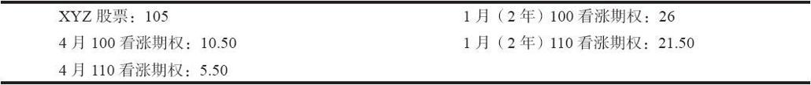
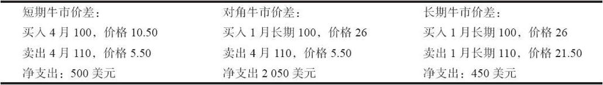
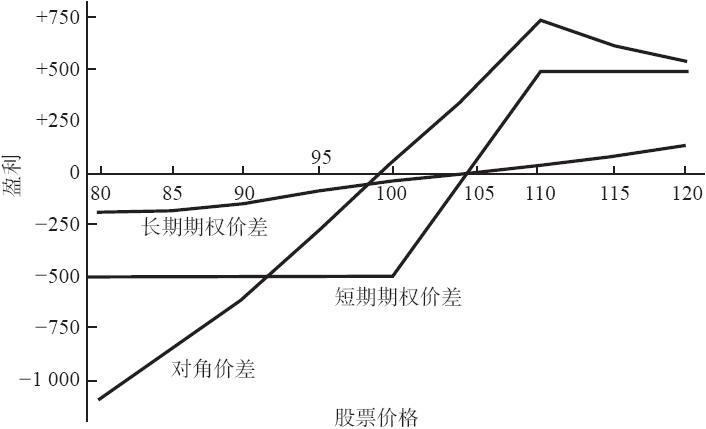
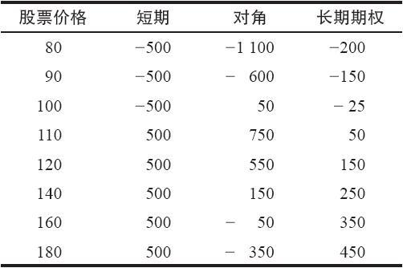
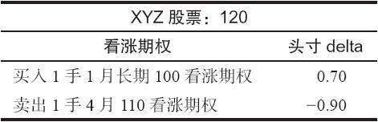
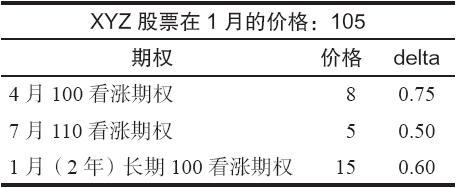

# 25.6　使用长期期权的价差

如果投资者愿意，前面讨论过的所有的价差策略都可以用长期期权来做。对长期期权价差的保证金的要求同对普通股票期权价差的保证金要求是一样的。有一种价差很适合长期期权：买入较长期的期权和卖出较短期的期权的策略。当然，因为长期期权是长期的因而也是昂贵的，投资者在这样的价差中一般会有大量的支出，如果股票出现反向的走势，就会有显著的风险。此外，还会有另一种风险。我们考虑一个简单的、使用看涨期权的牛市价差的示例，来说明这些事实。

【示例25-11】在1月份有下面的价格：

一个投资者正在考虑一个XYZ的牛市价差，但是不敢确定是应当使用短期看涨期权、长期看涨期权，还是两者的组合。下面是他可以有的一些选择：

请注意，为长期价差所付的支出要比为短期牛市价差所付的支出略低一些。这就意味着，在它们各自的到期日，它们的潜在盈利差不多是相同的。不过，策略家更关心的是怎样将它们直接进行比较。可以将它们进行比较的最明显的时间是在短期期权到期的时候。

图25-7显示了这3个头寸在1月到期时的盈利能力。我们假定以下因素在4月到期同在1月到期时是相同的：波动率、短期利率和股息。

图25-7　牛市价差在4月到期日的比较

请注意，短期牛市价差同第7章的盈利图形相像，它的最大盈利在110之上，最大亏损在100之下（见表25-4）。

表25-4　牛市价差在4月到期日的比较

在3个月的时间里，长期期权既不会产生很多盈利，也不会产生很大亏损。即使XYZ的价格上涨到120，这个长期牛市价差只有150美元的盈利。反过来看，如果XYZ跌到80，这个价差也只亏损200美元。这样的价格活动在长期牛市价差中是很典型的，在这样的价差里，两手期权都还保留了大量的时间价值。

对角价差则不同。典型情况下，一手牛市价差的最大潜在盈利是行权价减去所付的支出之后的差值。对这个对角价差来说，这就是1000美元减去2050，一笔亏损！显然，这个简单的公式不适用于对角价差，因为在卖出的期权到期时买入的期权仍然有时间价值。这幅盈利图形显示出，在这3个价差中，这手对角价差确实是最看多的。它在卖出期权的行权价上获得最好的盈利（评价所有价差的一个标准程序），这笔盈利在4月到期日（仍然是在波动率和利率没有变化这个重要的假设之下）比其他两手价差的的盈利都高。如果XYZ的交易价高于110，这手对角价差就会亏掉它的一些盈利；事实上，如果XYZ在非常高的价格上交易，对角价差实际上会输钱（见表25-4）。只要买入的长期看涨期权失去它的时间价值，对角价差的表现就不会那么好。

如果普通股股票价格下跌，这手对角价差的风险金额就最大。不过这不是百分比意义上的风险，因为它的初始支出最大。如果XYZ在3个月内跌到80，这个价差就会亏损将近1000美元，刚好超过它最初2050美元的一半。显然，在同一时候，短期价差会亏损掉它的全部初始投资，不过那只有500美元。

如果在卖出的期权到期时标的股票的价格接近卖出的期权的行权价，对角价差的盈利最大。不过，如果标的股票无论朝哪个方向有大幅的运动，对角价差就是3个策略中最糟的一个。也就是说，对角价差是一个中性的价差：投资者希望标的股票在近期期权到期之前保持在卖出的期权的行权价附近。即使对角价差以牛市价差的假象出现，就像在上面的示例里，这种论断也是正确的。

许多交易者喜欢买入长期期权，同时卖出虚值的近期看涨期权作为对冲。这样做需要小心。如果标的股票上涨得太快而且利率下跌或者波动率下降，这就会是一种糟糕的策略。对股票的看法是正确的，但是用错了期权策略，结果亏了钱，没有比这对心理造成的损伤更大的事情了。考虑一下上面的示例。看上去这个价差交易者对XYZ是看多的，这也是他选择牛市价差的原因。如果XYZ变成一只牛气十足的股票，在3个月里从100涨到了180，对角价差交易者就会亏钱。他不可能开心，没有人会。这是在使用一手长期期权进行对角价差时要记住的。

价差中期权的delta对这个期权的表现提供了一个很好的线索。读者应当记得，短期实值期权具有相当高的delta，特别是当接近到期日的时候。不过，实值长期看涨期权的delta不会特别地高，因为它保留有大量的时间价值。因此，投资者是在卖出一手delta高的期权，同时买入一手delta较低的期权。这些delta标志着如果标的股票价格上涨，这个投资者就会亏钱。考虑一下下面的情况：

在这个时候，如果XYZ价格上涨1个点，这个头寸的预期亏损就是20美分，因为期权空头的delta比期权多头的delta大0.20。

这种现象在长期期权的对角价差上也有反映。如果价差的两个行权价靠得太近，实际上就有可能建立一个股票上涨也会亏钱的牛市价差。这一点对许多交易者来说都很难接受。在上面的示例里，正如在表25-4里所显示的，事情正是如此发生的。解决这个问题的一个方法是扩大行权价之间的距离，使得即使股票暴涨也至少还有某些潜在盈利。要做到这一点并不容易，因为此时卖出的短期期权的权利金很小。

应当注意到，在某些特殊的情况里，对角价差甚至可以被看做是卖出备兑的替代。我们曾经说过，一手长期看涨期权有的时候可以用来替代普通股股票，投资者于是将长期看涨期权的成本同买入股票的成本之间的差额放在银行里（或者是长期债券里）。假定一个投资者是卖出备兑者，买入股票而且就它卖出相对短期的看涨期权。如果这个投资者想要用长期看涨期权来代替他的股票，他就有了一手对角牛市价差。这样一手对角价差的风险或许比上面提到的那手要小，因为投资者选择长期期权作为替代的理由应当是因为它“便宜”。但是，对角牛市价差的潜在陷阱也会出现在这个情况里。因此，如果投资者是一个卖出备兑者，这并不一定就意味着他可以用长期期权看涨期权替代买入股票而不必小心。由此产生的头寸也许不像他想的那样和卖出备兑相似。

这里的“底线”是，如果投资者所付的支出大于行权价之间的差距，股票上涨到足以基本上抹去两手期权的时间价值的高度的话，他最终有可能亏钱。如果投资者在标的股票下跌时将他的头寸向下挪仓，那么这种情况也会起作用。这样做的话，他最终有可能将行权价之间的关系倒转过来。也就是说，卖出的期权的行权价比持有的期权的行权价要低。在这种情况里，如果他收到的总收入低于行权价之间的差额（这是相当可能发生的事情），那么，他就锁定了一笔亏损。因此，那些认为这个策略可以保证有盈利的人，最好是好好想想。它几乎可以肯定不是这样。

后式价差。长期期权还可以用到其他流行的对角价差形式上，例如卖出实值近期期权，买入更大数量的长期（LEAPS）的平值或虚值看涨期权的那种策略（这就是在第14章里所称的对角后式价差）。这是一个出色的策略，在这个价差里，可以把长期期权用作期权多头。读者应当记得，这个价差的目标是股票高波动，特别是如果使用看涨期权的话在上行方向的高波动。如果这种情况没有出现，股票反而下跌了，那么，至少从卖出实值期权中得到的权利金会是一笔收入，可以用来抵消在买入的较长期的看涨期权中所遭受的亏损。这个策略也可以用看跌期权来建立，在这种情况里，价差交易者希望标的股票在价差存续期内急剧下跌。

不必深入到上面示例中的具体细节，对角后式价差的交易者应当意识到，他在价差中将有相当大数量的支出，而且，如果股票价格大幅下跌，其中相当大的一部分会被亏损掉。在上行方向，他的长期看涨期权会保留一些时间价值，而且会同标的股票的运动基本保持同步。因此，在建立一个中性头寸时，他也许不需要买入他以为会需要的那么多的长期期权。

【示例25-12】XYZ的价格是105，价差交易者想要建立一手后式价差。读者应当还记得，一个中性策略中期权的数量是通过两个期权的delta相除来决定的。假定有下面的价格和delta存在：

使用这些期权可以建立两种后式价差。在第一种里，投资者卖出4月100看涨期权，同时买入7月110看涨期权。他卖出的是3个月的看涨期权，买入的是6个月的看涨期权。中性的比率是0.75/0.50，或者说3对2。也就是说，每卖出2手看涨期权就买入3手看涨期权。因此，中性的头寸会是：

作为第二种选择，他可以在价差的多头腿中使用长期期权；他仍然卖出4月100看涨期权作为价差的空头腿。在这种情况里，他的中性比率就是0.75/0.60，或者说5对4。由此产生的中性价差就是：

注：疑原文有误，原文为110。——译者注

因此，一个使用长期期权的中性后式价差比一手使用6个月期权的中性后式价差在多头腿中需要买入较少的期权。这是因为长期看涨期权的delta更大一些。这里的要点是，由于长期看涨期权所包含的时间价值，即使是股票运动得较高的时候，也不一定非要买那么多。如果投资者不使用delta，而只是认为对任何对角后式价差3对2都是一个好比率，那么，如果他使用长期期权的话，他就是过度看多的。如果标的股票下跌，他就会有亏损。

跨期价差。长期期权也可以用在跨期价差（买入较长期期权，卖出较短期期权，两者的行权价相同）上。跨期价差是一种中性的策略，其中，价差交易者希望标的股票在短期期权到期时尽可能地接近行权价。一手跨期价差在股票价格运动得离行权价太远时有风险（见第9章和第12章）。买入一手长期看涨期权增加了风险的金额，但没有增加按百分比计算的风险，因为投资者在这个价差有更大的支出。

简单地说，跨期价差是使用相等数量的买入和卖出的期权来建立的。它常常并不是真正意义上的中性策略。正如在第9章讨论跨期价差时所指出的，投资者也许应当使用两个期权的delta来建立一个真正中性的跨期价差，特别是如果股票的价格最初不等于行权价时。如果期权是虚值的，投资者就应当卖出更多的期权。相反，如果期权是实值的，投资者就应当买入更多的看涨期权。从统计学角度来说，这两种策略各有各的好处，也各有各的吸引人的地方。在使用长期期权的delta来构建中性价差的时候，投资者一般需要买入的看涨期权比他认为的要少，因为长期看涨期权的delta更高。这同前面在对角后式价差的示例中所显示的现象是相同的。
