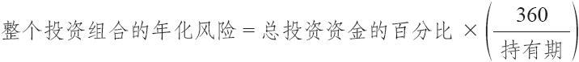
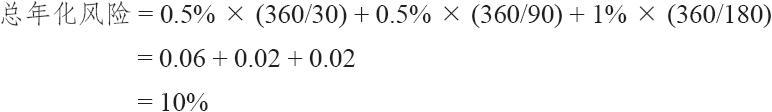

# 26.1　政府债券/期权策略是如何运作的

虽然运作这个策略涉及一定的细节，但它基本上是一个相当简单的策略。首先，在这个买入的期权的存续期期间，投资者可能的最大亏损是投资的10%，减去在投资组合的固定收益部分（其余90%）得到的利息。把买期权的投资分布开来，以致在1年的时间内总的风险保持在大约10%，这是一件简单的事。

【示例26-1】一个投资者也许会决定，将他2.5%的资金用来购买3个月的期权。这样，在1年的时间里，他承担的风险就是10%。与此同时，他把其余90%的资产投资于固定收益证券，这或许会有6%的总利息收入。这就使得他每年的总风险降低到4.6%的水平。

有更好的方法可以监控这个风险，我们在下面会讨论。对这个策略的潜在盈利的唯一限制是时间。投资者因为持有期权（假设是看涨期权），因此就可以从股票市场大幅的向上运动中得到丰厚的盈利。同其他任何风险有限而潜在盈利丰厚的策略一样，少量的大笔盈利就可以抵消大量的小笔亏损。当然，在实践中，他的盈利永远不会大到让人吓一跳，因为只有大约10%的资金投入在买入期权里。

需要注意的是，如果利率非常低，那购买政府债券的那部分投资就没有或只有很少利息。在这种情况下，投资者可能会考虑把这90%的资金投资于风险稍微比政府债券大一点的投资品种中。可能是AAA级公司债券，或者一些类似的投资品种。不过，投资者不应该把这部分资金投资于任何可能导致亏损的品种中，例如垃圾债。需要保证赚利息的那部分资金的安全，而让买期权的那部分资金承担风险。如果赚利息的那部分资金也承担了风险，那就会从根本上改变这个策略的目标。

总体上说，这个策略在有可能得到高于平均潜在盈利的同时，大大减小了风险。因为投资在期权中的10%的资金提供了很大的杠杆，因此，当市场出现有利条件时，这一部分的投资就有可能在短期内翻倍或翻3倍。这个策略同持有可转换债券（convertible bond）有些相像。可转换债券因为可以转换成普通股股票，价格就同标的股票的价格同步上下。不过，如果股票下跌幅度很大，债券就不会一路跟着跌下去，因为最后债券的收益会为这个价格提供一个“下限”。

有一种人们不常使用的叫做“合成可转换债券”的策略。投资者买入同一股票的公司债券和看涨期权。如果股票价格上涨，看涨期权的价格也会上涨，因此，这个公司债券同看涨期权的组合的表现，就与可转换债券在上行方向的表现很相似。另一方面，如果股票价格下跌，看涨期权就会无价值到期，而投资者则可以保留他大部分的投资，因为他仍然持有公司债券加上债券所赚得的利息。

将投资者90%的资金放进无风险的有利息的证券，用剩下的10%买期权的策略，比可转换债券或者“合成可转换债券”的策略都要好，因为在这个投资的绝大部分资金都没有价格起伏的风险。

政府债券/期权策略相当容易运作，虽然投资者在每一次购买新期权时都需要做一些工作。同时，需要进行周期性的调整，以保持风险水平在所有时间都大致相等。至于买什么样的期权，读者应当还记得在第3章和第16章对如何选择最好的买入期权的具体细则。这些标准可以大致总结如下。

（1）假定每一个标的股票在一个固定的时段（30天、60天或90天）里都能够随着它的波动率而上涨或下跌。

（2）对上涨之后的看涨期权的价格或下跌之后的看跌期权的价格进行评估。

（3）将所有潜在的购买对象按照潜在收益的高低从上到下排序。

使用这个策略的人只需要对那些按照这个排序提供了最高收益机会的期权感兴趣。在前面讨论买入期权的章节里，我们提到，投资者也许应当看一看他要买的期权的风险/收益比率，以得出一个更为保守的列表。不过，对政府债券/期权策略来说，这没有必要，因为总的风险已经受到限制。通过前面的标准对要买入期权进行排序，一般产生的是一个平值的或略微虚值的期权列表。这些不一定是“定价过低”的期权，虽然如果一个期权真的定价过低，比起“定价过高”的期权来，它就有更多的机会在这个选择的列表中排在高位。

许多数据服务商和经纪公司都根据同上面的标准相似的选择标准提供可买期权的列表。想要按这种方式选择可买期权的策略家会发现他不必在选择程序上花费大量的时间。读者应当注意到，这类可买期权的排序完全忽视了对标的股票的前景的看法。如果投资者宁愿按照标的股票的前景（最好是技术分析提供的前景）来购买期权，他就必须在选择程序上花更多的时间。虽然这对某些投资者来说可能有吸引力，从长远来看，由此产生的结果或许不如前面介绍的在可买期权上不带偏向的方法，除非这个策略家在挑选股票上非常在行。

### 26.1.1　保持风险水平相等

在这个政府债券/期权策略中，策略家必须要做的第2件事是保持他的风险水平在所有的时候都大致相等。

【示例26-2】投资者在开始这个策略的时候有90000美元在政府债券里，同时花了10000美元购买期权。过了一些时间之后，买入期权的部分效果不错，他现在有90000美元在政府债券里，有30000美元在期权上，再加上从债券中得到的利息。显然，他在固定收益证券里的资金不再是90%，在买入期权中也不再是10%。现在的比例是债券75%和期权25%。这个比率的风险过大，策略家于是必须卖掉一部分期权，用得到的资金买入更多的债券。因为他总的资金现在是120000美元，他必须卖掉18000美元的期权，将他的期权投资从30000美元的数字降低到12000美元，或者说，他总资金的10%。如果投资者在有了盈利之后没有将他的资金进行重新调整，他最终就可能会失去这些盈利。因为期权能够在很短的时间内失去它们很大比例的价值，投资者始终面临着会亏掉他投资于期权部分中的几乎全部资金。如果他将盈利都保留在这个策略的期权部分，那么他就一直在用积累起来的盈利在冒险。这是一个不聪明的做法。

投资者在出现亏损之后也必须调整政府债券同期权的比率。

【示例26-3】在第1年里策略家亏损掉了他最初放在期权里的全部10000美元。这就使得他的资金只剩下90000美元加上利息（利息有可能有6000美元）。他可以卖掉一部分债券，将所得的钱买入期权，把比例重新调整到90：10。如果投资者使用这个策略，他每年都用他资金的10%承担风险。因此，一系列的亏损有可能降低原始资金的价值，虽然1年的净亏损会小于全部资金的10%，因为还有从政府债券上赚来的利息。我们建议策略家按照这种方法来调整他的比率，不管市场是向上还是向下，这样，在所有的时候他都有基本上相似的风险/收益机会。

每一个人都可以按自己的需要将期权的挑选过程同债券/期权比率混合起来，以适应他自己的投资组合。较大的投资组合可以将资金分散配置到不同的持有时段，也可以经常调整比率，或许是每个月一次。较小的投资者应当将他的头寸集中在比较长的持有时段，同时不需要那么经常地调整他的比率。使用一些示例也许可以帮助说明持有大量资金的策略家和资金量较小的策略家各是如何运作的。应当注意到，政府债券/期权策略同样适用于数量相当小的资金，只要放入期权的10%的资金使得投资者有可能比较充分地加入市场的运动就行。下面同时也介绍了一个特别小的投资者可以使用的技巧。

### 26.1.2　将风险年化

在谈到投资组合的规模之前，让我们先来介绍一下年化风险的概念。投资者买入期权时也许想要将它们持有30天、90天或者180天。在任何时候他都不想让他持有的期权有大于10%的年化风险。在实践中，如果投资者买入了期限为90天的期权，但是只计划将它们在手里留30天，那么，他就不太可能在30天内将他的投资100%亏损掉。不过，为了计算年化风险的方便，假定无论这个期权离到期还有多少时间，风险在任何持有时段内都是100%。因此，一手买入的30天的期权代表了一个1200%的年化风险（每30天的100%的风险，乘以1年中12个30天的时段）。90天的购买有400%的年化风险，180天的购买有200%的年化风险。可以把这3个持有期的购买用多种方法组合起来，使得整个年化风险是10%。

【示例26-4】一个投资者可以将他的总的资金的2.5%在1年中分4次放在买入期限为90天的期权中。这就是说，他2.5%的资金面临着400%的年化风险；400%乘以2.5%等于总资金10%的年化风险。当然，剩下的资金将被放在无风险的有利息的证券中。有许多种类似的组合，其中一种可以把总资金的1%用来买入期限为90天的期权，同时将总资金的3%放在买入期限为180天的期权里。这样，投资者的1%的总资金有400%的年化风险，3%有200%的年化风险（0.01乘以400加上0.03乘以200等于整个资金10%的年化风险）。如果投资者喜欢用公式的话，年化风险可以这样来计算：

如果投资者能够将资金分散配置在不同的持有期，年化风险就是各个持有期的风险的总和。

有了这样的信息，策略家就可以组合使用1个月、3个月和6个月持有期的期权，最好是每一个各自都由同上面所介绍的相似计算机分析中产生出来。因为策略家知道年化风险，他知道在买入每一个持有期应该进行多少投资。

【示例26-5】假设有一个非常大的投资者，或者说一群投资者，他们有100万美元投资在政府债券/期权策略里。另外，假设这笔钱的0.5%用来购买30天的期权，并且准备每30天重新投资一次。与此相似，0.5%放在90天的购买里，1%放在180天的购买中。这样，总的年化风险是10%：

如果总资金是100万，这就意味着在30天购买的投资是5000美元，90天购买是5000美元，180天购买是10000美元。这笔钱在每一个持有期结束的时候将按相似的数量进行重新投资。

### 26.1.3　风险调整

在每一个持有期结束的时候，必须要不断地调整比率以反映10%的风险。虽然投资者保持投资比例的稳定是正确的，他必须保持清醒头脑，不要以为每一次都应当自动地重新投资同样的金额。

【示例26-6】在30天结束的时候，包括潜在期权盈亏和利息的整个投资组合的价值降低到了990000美元。这样，只有0.5%的资金应该投资到买入下一个30天期限的期权里，也就是4950美元。

按照这种方式（首先计算年化风险，通过事先确定的在不同持有时段中投资的百分比来进行平衡，然后，在每个持有期结束时重新调整实际的投资金额）进行运作的话，总的风险/收益比例就会保持在接近前面对这个策略的简单介绍中所说的水平。就策略家而言，这可能要求他进行较大数量的工作，但是，管理大型的投资组合通常就是需要辛勤地工作。

较小的投资者无法做到彻底的资产分散配置，不过他也不需要对他总的头寸进行频繁地调整。

【示例26-7】投资者决定在这个策略中投资50000美元。因为在买入30天的期权中有1200%的年化风险。因此，在这样规模的投资里买入这么短期限的期权就没有意义。他可以将他的资金的1%投资在买入90天的期权中，3%投资在买入180天的期权中。按照投资金额来计算，这就是500美元在90天的期权里，1500美元在180天的期权里。应当承认，这没有给分散配置留下多大的余地，但是买入短期期权会使投资者面临过大的风险。在实践中，这个投资者也许只将他的资金的5%投在180天的期权里，这也是10%的年化风险。这就是说，他可以只用期权买家的一种分析（180天的那个）来运作，并且在期权备选列表中选择一个来投入2500美元。

他没有办法像大投资者那样频繁地对他在买入期权中的投资进行调整，因为有手续费的考虑。每过180天他自然必须做一次调整，但是他也许希望能够调整得更频繁一些，例如，每90天，从而可以将他在180天上的投资分布到不同的期权到期周期中。同时也应当指出，买卖政府债券至少要10000美元，最小增加额度是5000美元。也就是说，投资者可以买入或卖出10000美元、15000美元、20000美元或者25000美元等，但是不能买卖5000美元、8000美元或23000美元的政府债券。对于有100万美元的投资者来说，这不是个问题，因为在买卖政府债券上要四舍五入到需要的5000美元的增额还占不到他的资金的1%。不过，对一个只有5万美元的中等投资者来说，这就有可能成为问题。虽然短期的政府债券确实代表了最好的无风险投资，中等投资者至少应当使用没有手续费的货币市场基金作为他有利息收入的资产的一部分。这样的基金比起政府债券来风险只是高出一点点，但它们允许任何数量的存款和提款。

真正的小投资者也许会感到这个策略跟他们没什么关系。有没有可能在只有很少的钱（如5000美元）的情况下运作这个策略呢？有这样的可能，不过它有一些劣势。

【示例26-8】在只有5000美元的时候，要想把年化风险控制在10%的水平之下是极其困难的。例如，每180天的5%的现金投资在每一个投资阶段只有250美元。因为上面所介绍的选择程序往往会选出平值的或略为虚值的看涨期权，许多这样的期权每手的价格都大于。这个小规模投资者也许应当决定将他的风险水平略为提高一些，不过不管实际投入的金额是多么小，年化风险水平永远不应当超过20%。超过这个水平会使得这个固定收益/买入期权策略的目的完全失效。显然，这个小规模投资者买不了政府债券，因为他总的可投资的资金水平低于债券买卖的1万美元的最低要求。他也许会考虑使用货币市场基金。很明显，这么小规模的投资者是在双重的劣势下运作的：他在购买期权中的小额投资有可能使他无法买入某些更具吸引力的期权；他的固定收益部分所得到的利率百分比要低于较大的投资者从政府债券或其他形式的相对无风险和有利息的证券中所得到的利率。因此，小规模投资者在实际投资之前，应当仔细地考虑他的财务能力以及是否愿意严格遵守这个策略的标准。

也许在读者看来，在这些示例里每次买入期权时实际放进风险的金额是相当小的。事实上它们相当小，但是正如上面所显示的，它们代表了10%的年化风险。这些示例都基于一个假设：每一手买入期权在持有期内的风险都是100%。这个假设的限制性是很强的，如果稍微放宽一些，那么在每个持有期内的投资金额都可以更大。不过，要假设在一个短到30天的持有期内持有一个看涨期权的风险小于100%是困难的和危险的。策略家也许觉得他有足够的能力在出现亏损时将头寸平仓，因此将持有的风险水平置放在100%之下。换一种情况，数学分析也许一般会显示出在一个固定的时段里预期风险是小于100%的。投资者也可以通过买入实值期权，来减小他在买入期权的交易中将所有钱都亏损掉的概率。虽然这样的期权更为昂贵，不过，即使股票没有像交易者所期望那样上涨，它们当然有更大的可能保留某些价值。执行任何一个这样的标准都有可能导致投资者变得过分激进，因而在买入期权中投资过多。坚持下面这个更为简单的、更严格的假设对投资者来说要安全得多：即使是在一个相当短的持有期内，每当买入期权的时候，投资者都是在用他的100%的投资在承担风险。

### 26.1.4　避免过度的风险

有一个最后的警告是必须提出的。投资者在使用他的有利息收入的那一部分资金时，不应当“标新立异”。对某些投资者来说政府债券看上去过于“温顺”，他们想要使用政府全国按揭协会证书（GNMA）、公司债券、可转换债券或者市政债券作为固定收益投资。虽然这些证券的收益也许会比政府债券略高一些，但它们的流动性较差，而且涉及的风险也比短期政府债券高。此外，有的投资者甚至考虑将他们剩余的资金放在其他地方，像高收益股票或卖出备兑看涨期权。虽然买入高收益股票或卖出备兑看涨期权是保守型的投资，但正如大多数投资一样，同买入90天的政府债券相比，它们应当被看作是高度投机的。在这个策略里，买入期权的那一部分投资代表了潜在盈利。短期债券上的收益足以抵消风险。投资者再想要从他投资的固定收益的这一部分得到更高的盈利，就必须非常小心。因为他也许会发现，他在原来根本不计划有风险的那部分资金上承担了风险。

在对这个策略的评价上有相当多的严密的数学研究。理论论文非常喜欢讨论研究此类问题。学者们一般只把买入看涨期权作为这个策略的风险部分。显然，策略家完全可以买入看跌期权而不伤害这个策略的总风险。在买入的只是看涨期权的时候，震荡的和向下的市场都对这个策略的表现不利。如果在买入期权的时候也买入一些看跌期权，只有在遇到震荡市场的情况下会产生最糟的结果。

这其中存在一个权衡。如果在买入期权之后，市场经历了大幅度的上涨，用来买入看跌期权的那部分资金就会被亏损掉。因此，在一个下跌的市场里，买入看跌期权同买入看涨期权的组合有可能比只买入看涨期权的策略要表现更好，但是，在一个上涨的市场里，它的表现会更差。就广义而言，如果投资者有资金需要分散配置的话，包括买入一些看跌期权是有一定道理的，因为市场上涨的概率没有把市场上涨和下跌结合起来的概率高。同时持有看跌期权和看涨期权的投资者无论市场朝哪个方向有大幅的运动都能够盈利，因为有盈利的期权能够克服不盈利的头寸所造成的有限亏损。
