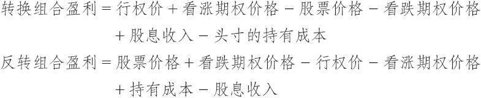

# 27.3　转换和反转组合

在对看跌期权进行介绍的时候，我们指出过，看跌期权和看涨期权是通过一种叫做转换的程序而相互关联的。这是一个套利的过程，其中交易者有时能够在绝对没有风险的情况下锁住盈利。转换组合是由买入标的股票，同时也买入一手看跌期权和卖出一手看涨期权来组成的，看跌期权和看涨期权的条款相同。如果这个头寸的总成本低于期权的行权价，它就有一笔锁定的盈利。

值得注意的是，如果这是一个无风险套利，那么标的和期权的条款就必须一致。例如，如果期权对应150股标的股票（假设近期股票发生了3对2的拆分），那么这个投机活动需要针对每个期权购买150股的XYZ股票。再举一个例子，如果不久前XYZ对每股持有的XYZ股票衍生出一股UVW股票，那么有些股权对应的是100股的XYZ和100股的UVW。在这种情况下，对于每手期权，投机者必须购买100股的XYZ和100股的UVW而且这些期权的条款必须将两只股票都包含在内。

【示例27-8】有下面的价格存在：

XYZ普通股股票：55

XYZ 1月50看涨期权：6.50

XYZ 1月50看跌期权：1

这个转换组合的总成本是49.50（买股票支出55，加上买看跌期权支出的1，再减去卖出期权收入的6.50）。因为49.50低于行权价50，在这个头寸里就有一笔锁定的盈利。要看一看这笔盈利确实存在，假定股票在到期时价格高于50。高于50多少这没有关系，结果都是一样的。当股票高于50的时候，看涨期权就会被指派，股票在50的价格上被卖掉。看跌期权会无价值到期。因此，盈利是0.50点，因为这个头寸最初的成本是49.50，而最终在到期日时以50的价格而平仓。如果XYZ在到期日时低于50，也会出现相似的结果。这时，交易者将他的看跌期权行权，按50卖掉股票，看涨期权则无价值到期。同样，这个头寸是按50的价格平仓的，因为它在建立时候的成本是49.50，同样也能获得0.50的盈利。无论在到期时股票价格是多少，这个头寸都有一笔锁定的0.50点的盈利。

这个示例有些过于简单，因为它没有包括两个非常重要的因素：股票有可能支付的股息和这个头寸在到期之前的持有成本。包括这些因素会使得事情在某种程度上变得复杂起来，所以我们将在解释完另一个相随的策略之后再来讨论它们。这个相随的策略是反转组合。

反转组合[或者说，反向转换组合（reverse conversion）]刚好是转换组合的反面。在反转组合中，交易者卖空股票，卖出一手看跌期权，同时买入一手看涨期权。同样，看跌期权和看涨期权的条款相同。如果反转组合最初的收入（卖价）大于这些期权的行权价，它就有利可盈。

【示例27-9】我们可以用一组不同的价格来描绘一个反转组合：

XYZ普通股股票：55

XYZ 1月60看涨期权：2

XYZ 1月60看跌期权：7.50

假设这个期权包含了100股XYZ。这个反转组合的总收入是60.50（卖股票得了55，加上从看跌期权中得到的7.50，再减去看涨期权的成本2）。因为60.50大于这些期权的行权价60，这里就有与两者的差额相等的0.50点的锁定盈利。要证实这一点，首先假设XYZ在1月到期时低于60。看跌期权就会被指派，在60的价格上买了股票，看涨期权会无价值到期。因此，这个反转组合头寸就按60的价格平了仓。因为这个头寸的最初的卖出价值（收入）是60.50，所以就有0.50点的盈利。另一方面，如果XYZ在到期时高于60，交易者就会将他的看涨期权行权，从而按60买入股票，看跌期权则无价值到期。同样，他是用60的成本将这个头寸平仓，并且会有0.50点的盈利。

在反转组合中股息和持有成本也是重要的。在这里我们来讨论一下这些因素。转换组合涉及买入股票，在这个套利存在的时期内只要有股息，交易者都能得到。但是，进行转换组合的交易者也必须付出相当大的资金来建立这个套利，而且必须从他的潜在盈利中减去这个头寸的持有成本。在上面的示例里，转换组合的头寸需要49.50点的成本来建立。如果交易者的资金成本是每年6%，于是他在持有这个头寸的每个月里就会失去0.06/12×49.50，或者说每个月0.2475点，这将近每个月0.25点。而这个示例中的潜在盈利是0.50点，因此，如果交易者将这个头寸持有两个月以上，他的持有成本就会吞掉他的盈利。在建立任何转换组合之前准确地计算他的持有成本，对套利者来说是至关重要的。

如果读者偏好公式的话，一手转换组合或反转组合的潜在盈利可以用下面的方式来表示：

请注意，在任何一个交易日里，这两个公式中唯一会发生变化的是所用证券的价格。其他的因素，股息和持有成本，在这一天都是固定的。因此，交易者可以准备一个简单的计算机程序，可以为这个股票罗列出适用于所有行权价系列的固定费用。

【示例27-10】假定XYZ股票在其持有期内将支付0.50点的股息，而且这个头寸将持有3个月，持有成本为每年6%。如果套利者对一个行权价为50的转换组合感兴趣，转换组合头寸对应100股股票，他的固定成本就为：

套利者知道，如果用简单的只涉及证券价格的公式计算出来的潜在盈利大于0.25点，他就可以建立一个包含所有成本的、最终有利可盈的转换组合头寸。当然，如果股票的价格是40或者60，持有成本就会不一样。因此，使用计算机计算和打印出每只股票上所有可能的行权价对交易者会很有用，因为他可以每天都迅速地从这个表格上找出他所需要的固定成本。
