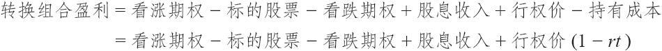
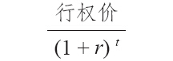

# 27.4　对持有成本的进一步套利

除了上面所说的方法，计算持有成本还有其他更为复杂的方法。简单地说，用头寸的支出乘以所付的利率和持有头寸的时间。也就是说，它可以用下面的公式来表示：

持有成本=行权价×r×t

其中，r是利率，t是持有头寸的时间。将这个持有成本的公式同上面的转换组合盈利的公式结合起来，就得到：

按照精算学，持有成本的表达要略为复杂一些。这个简单的（行权价×r×t）公式忽略了两件事：利率的复合效果和“现值”（未来某个数量在当前的价值）的概念。包括现值和复利效果的绝对正确的公式必须将盈利公式中的因子（1-rt）改换为因子

这样做的效果大吗？不大，如果r和t都不大的话就不大。在大多数期权计算中r和t都不大。每个月的利率通常小于1%，时间少于9个月。因此，使用简单持有成本的公式一般为套利者所接受，而且用在大多数的实际操作中。事实上，对套利者来说这常常是因为方便的缘故，如果他是用计算器计算持有成本而这个计算器又没有取幂的功能的话。不过，如果分析的是高利率和更长期限的期权，使用简单公式的套利者就应当再用正确的公式核实一下，以保证他的误差不至于太大。

为了简单化起见，下面的示例都用简单公式来计算持有成本。不过，读者应当记住，这只是一个当利率低且持有期短的时候所使用的一种近似。对利率的复合效果的讨论引出另一个有趣的问题：所有使用保证金的人从理论上说都应当使用复利的公式来计算他可能的利息开支。不过，在实践中只有极少的投资者会这样做。我们在第2章的一个示例中谈到过关于这种递增效果对卖出备兑看涨期权的影响。
