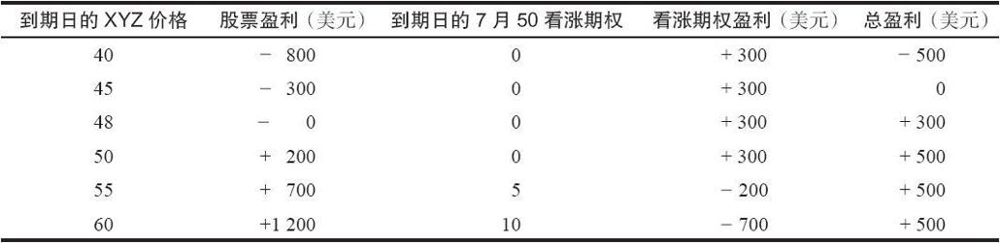
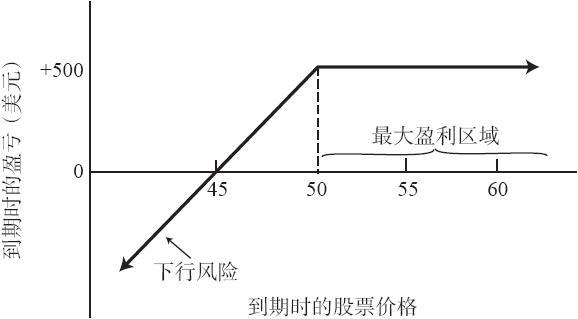

# 2.1　卖出备兑看涨期权的重要性

### 2.1.1　卖出备兑看涨期权对下行风险的保护

【示例2-1】某个投资者持有100股XYZ普通股，该股票现在的市场价为每股48美元。如果该投资者一方面仍继续持有该股票，一方面卖出一手XYZ 7月50看涨期权，那么，他就建立了一个卖出备兑看涨期权头寸。假设该投资者通过卖出这手7月50看涨期权得到了300美元的收入。如果XYZ在7月到期日低于50美元，所卖出的看涨期权就会无价值到期，该投资者就挣到了初始卖出期权时收入的300美元。因此，他得到了300美元，或者说3点的下行风险保护。也就是说，在总的交易中，即使XYZ股票下跌了3点，他还可以保持盈亏平衡。到时，如果他愿意，还可以再卖出一手看涨期权。

请注意，如果标的股价的跌幅超过3点，总的头寸就会出现亏损。因此，如果股票的下跌幅度超过了初始收入的看涨期权的权利金，卖出备兑看涨期权的风险就会成为现实。

### 2.1.2　股价上升时的好处

如果XYZ股票的价格适度上涨，交易者在两种情形下都得到最好的结果。

【示例2-2】如果XYZ在7月到期日刚好等于或者低于50，该看涨期权就会无价值到期，此时该投资者能从卖出期权的交易中得到300美元，再加上持有股票的过程中所得到的一小部分盈利。注意，他仍然持有这个股票。

如果股价在到期日上升到了50的水平之上，卖出备兑看涨期权的交易者就可以在不同的结果中进行选择。选择之一，他可以什么都不做，这种情况下，期权会被指派，股票会被其他人按50的行权价买走。这时，他的盈利就等于卖出看涨期权所得到的300美元，再加上按每股48美元的价格买入股票并按每股50美元的价格卖出的交易中所获得的利润。不过，在这种情况下，他将不再持有这个股票。另一种选择是，如果他想要继续持有股票，他可以选择从公开市场买回（或者说回补）先前卖出的看涨期权。采取这个决定有可能会导致卖出备兑看涨期权交易中的期权部分出现亏损，但是，从买入股票的交易中，他会有一个相对更大的盈利，尽管这个盈利还只是账面数据。使用一些具体的数字，你就可以看出第2种选择是如何运作的。

【示例2-3】XYZ的价格在7月到期日上升到60。此时它的看涨期权的卖价为10，接近其内在价值。如果投资者用10的价格买回了看涨期权，那他在期权的交易中就亏损了700美元。（他初始卖出看涨期权收入了300美元，而现在他要用1000美元的价格把它买回来。）然而，由于买回了看涨期权，他就不再有按照50（行权价）卖出股票的义务，因此在按48买入股票的交易中，他有12点的未兑现盈利。把兑现了的和未兑现的盈利加在一起，他的总盈利为500美元。

这个盈利与第一种选择（看涨期权被指派，股票被买走）的交易结果一模一样。如果被指派，他将保留卖出看涨期权而收入的300美元，并从股票的交易（48买入，50卖出）中赚得2点（200美元），总的盈利也为500美元。这两种情况的主要区别在于，当看涨期权被指派时，该投资者将不再持有股票；而在买回看涨期权的情况下，他将继续持有股票。在具体的情况中，很难说这两种方法究竟哪一种更好。

不管股价上涨到多高，卖出备兑看涨期权的盈利都被锁定了，因为卖出者承担了按照行权价卖出股票的义务。当股价上涨时，备兑看涨期权的卖出者仍会获得盈利，只是盈利的金额可能就不如没卖出看涨期权时的情形。另一方面，一旦卖出看涨期权，他就可以立刻得到300美元的现金收入，因为卖出者可以立刻收到权利金并随意使用。这笔收入为除标的股票当前支付的股息之外的额外收入，或者它可以用来弥补股票下跌时的部分亏损。

对于那些喜欢公式的读者来说，下面的公式总结了卖出备兑看涨期权的潜在盈利和盈亏平衡点：

最大潜在盈利=行权价-股价+看涨期权价格

下行盈亏平衡点=行权价-看涨期权价格

### 2.1.3　卖出备兑看涨期权的定量分析

表2-1和图2-1描述了示例中XYZ 7月50看涨期权的盈利图形。表中假设看涨期权是按持平价买回的。如果该股票由于看涨期权被指派而被买走，总盈利仍为500美元，只是股票的卖出价总为50美元，而期权的盈利也总为300美元。

表2-1　XYZ 7月50看涨期权

从这里可以得出若干结论。盈亏平衡点是45（总盈利为零），在45之下则存在风险。如果持有该头寸到期，可获得的最大盈利为500美元。如果股价没有变化，则盈利为300美元。也就是说，即使股价纹丝未动，备兑看涨期权的卖出者也能盈利300美元。

图2-1　XYZ卖出备兑看涨期权

所有卖出备兑看涨期权的交易的盈利图形都与图2-1相似。请注意，如果该头寸持有至到期，只要股价等于或高于行权价，就能获得最大盈利。不过，该策略有下行风险。如果股价下跌太多，那期权权利金就有可能不能补偿全部的亏损。我们会在后文讨论下行风险的保护策略，以限制下行风险。
