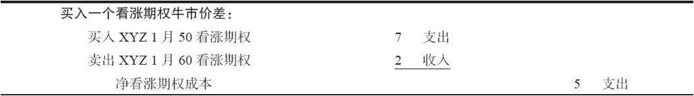
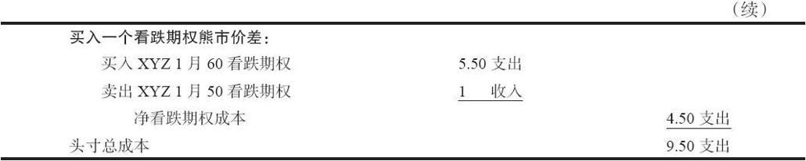
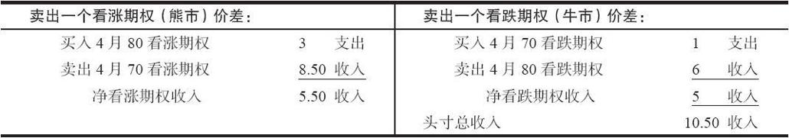

# 27.9　盒式价差

一个套利是由同时买入和卖出不同价格的相同证券或相等证券而构成的。例如，反转组合是由在卖出一手看跌期权的同时卖空股票和买入一手看涨期权而构成的。读者应当记得，卖空股票/买入看涨期权的头寸叫做合成看跌期权。也就是说，卖空股票和买入一手看涨期权同买入一手看跌期权是相等的。反转组合因此是由在卖出一手（场内的）看跌期权同时买入一手（合成的）看跌期权组成的。与此相似，一手转换组合只不过是在买入一手（场内的）看跌期权的同时卖出一手（合成的）看跌期权。为了套利的目的，可以将相等的策略组合起来。其中比较常见的一种就是盒式价差。

读者应当记得，我们说过，牛市价差或者熊市价差可以用看跌期权建立，也可以用看涨期权建立。因此，如果投资者同时买入一手（看涨期权）牛市价差和一手（看跌期权）熊市价差，他就有了一个套利头寸。从本质上说，他只是买入和卖出相当的价差。如果价格差异计算正确的话，就有可能出现一个无风险套利。

【示例27-15】有下面的价格存在：

XYZ普通股股票：55

XYZ 1月50看涨期权：7

XYZ 1月50看跌期权：1

XYZ 1月60看涨期权：2

XYZ 1月60看跌期权：5.50

在这个示例里，套利者可以通过执行下面的交易来建立一个盒式价差：

不管1月到期时XYZ的价位在哪里，这个头寸都会价值10点。套利者锁定了一笔0.50点的无风险盈利，因为他用9.50点“买入”了这个盒式价差，在到期时可以按10点把它“卖掉”。要证实这一点，让我们对这个头寸在到期时的情况作一个评价，首先，当XYZ价格高于60的时候，然后是当XYZ价格在50~60之间的时候，最后是当XYZ价格低于50的时候。如果XYZ在到期时高于60，看跌期权就会无价值到期，看涨期权牛市价差就会实现10点的最大潜在盈利，也就是行权价之间的差额。因此，如果XYZ在到期时价格高出60，这个头寸可以平仓，得到10点。假设XYZ在到期时价格在50~60之间，卖出的虚值期权会无价值到期（1月60看涨期权和1月50看跌期权）。于是就剩下一个买入的实值组合，由1手1月50看涨期权和1手1月60看跌期权组成。当XYZ在到期时价格在50~60之间时，这两手期权的总价值一定有10点（例如，套利者可以将他的看涨期权行权，用50买入股票，然后将看跌期权行权，按60将股票卖出去）。最后，假定股票在到期时在50之下。看涨期权就会无价值到期，但是剩下的看跌期权价差（实际上是一个看跌期权的熊市价差）就会实现最大的潜在价值10点。同样，这个盒式价差可以平仓，收入10点。

不过，套利者必须为持有这个头寸而支付成本，在前面的示例里，如果利率是6%，而且他必须将这个盒式价差持有3个月，那么，他就要付额外的14美分（0.06×9.5×0.25）。这样，他还是有盈利的空间。

说到底，这里是在卖出一个（使用看跌期权的）熊市价差的同时，买入一个（使用看涨期权的）牛市价差。我们用这些条件来描绘这个盒式价差，是为了说明套利者是买入和卖出相等的头寸这样一个事实。不过，使用盒式价差的套利者不应当用牛市或熊市这样的概念来思考问题。他关心的应当是用比两个行权价之间差额更小的成本来“买入”整个盒式价差。说“买入”这个盒式价差，意思是看涨期权价差的部分同看跌期权价差的部分都是支出价差。套利者只要发现一手看涨期权价差和一手看跌期权价差使用的是相同的行权价，并且两者都是支出价差，而且买入它们的成本低于行权价之间的差额加上持有成本，那么，他就应当实施这个套利。

显然，我们刚才介绍的策略有一个相随的策略。套利者有时候有可能“卖出”这两种价差。也就是说，他可以使用同样的行权价，建立一个收入看涨期权价差和一个收入看跌期权价差。如果这个收入大于行权价之间的差额，他就可以锁定一笔无风险的盈利。

【示例27-16】假定存在有另外一组价格：

XYZ普通股股票：75

XYZ 4月70看涨期权：8.50

XYZ 4月70看跌期权：1

XYZ 4月80看涨期权：3

XYZ 4月80看跌期权：6

通过执行下面的交易，可以“卖出”这个盒式价差：

在这个情况里，无论XYZ在到期时是什么价位，整个头寸都可以用10点买回。这就意味着套利者锁住了0.50点的无风险盈利。为了证实这个说法，首先假设XYZ在4月到期时高于80。看跌期权将无价值到期，看涨期权的行权价之间的跨度将扩展到10点（买回成本）。换一种情况，如果XYZ在4月到期时价格在70~80之间，买入的虚值期权就会无价值到期，实值组合的买回成本将是10点。（例如，套利者让看跌期权在80被指派，用这个价钱买入股票，然后将看涨期权按70行权，用这个价钱卖出股票，因此，将头寸平仓的净“成本”是10点。）最后，如果XYZ在到期时低于70，看涨期权就会无价值到期，看跌期权之间的行权价的跨度就会扩大到10点。它于是就可以用10点的成本平仓。无论是哪种情况，套利者都可以用10点将这个盒式价差买回平仓。

在卖出盒式价差中，持有头寸的期间可以就收到的收入赚取利息。

在盒式价差的盈利性中还有一个因素。因为卖出盒式价差产生了收入，卖出盒式价差的套利者就会从这笔卖出中赚一小笔钱。反过来，买盒式价差的购买者因为持有成本而必须负担一笔费用。因为在盒式价差中盈利余地很小，这些持有成本可能产生一定的影响。因此，盒式价差可能实际只卖了5点，即使行权价之间的距离只有5点，套利者仍然可能赚钱，因为他有利息收入。

这样的盒式价差不容易发现。如果它确实出现的话，套利行为本身很快就会使得套利成为不可能。事实上，任何类型的套利都是如此，它不可能被无限期地实施下去，因为光是套利活动自身就会强迫价格回到它该回到的地方。有的时候套利者能够发现他喜欢的期权报价，特别是在波动大的市场里，从而可以用盒式价差建立一个无风险套利。若要它的价值一眼就能看出来，只需回答以下两个问题。

（1）如果套利者要建立的是1手支出看涨期权价差和1手支出看跌期权价差，使用同样的行权价，那么，总的成本是否会小于行权价之间的差额加上持有成本？如果答案是“是”，那么套利就成立。

（2）换一种情况，如果套利者是要卖出这2手价差，建立1手收入看涨期权价差和1手收入看跌期权价差。那么，所收到的总的收入加上所赚的利息是否大于行权价之间的差额？如果答案是“是”，那么套利就成立。

在盒式价差中有一定的风险。其中的许多同套利者在进行转换和反转组合时所面临的风险相同。首先，股票有可能收盘价刚好等于两个行权价中的一个，这就是风险。这样的话，套利者就面临着是否要将买入的期权行权的两难境地，因为他不知道是否会被指派。此外，提前指派会改变盈利性：卖出的看跌期权的指派会因为由此买入的股票而产生大量持有成本；卖出的看涨期权的指派难免会在刚好要除息的日子之前，使得套利者亏损相当于股息的数量。

实际交易盒式价差的机会是不多的，但是这样套利的存在有助于将市场价格保持在合理水平。例如，如果一只标的股票开始迅速运动，订单量急剧增加，期权市场中的专业商和做市商也许忙于应付订单，无法肯定他们的市场报价是否正确。他们可以使用盒式价差的原则来将价格保持在合理水平。最活跃的期权是那些行权价最接近当前股票价格的期权。专业商可以迅速地将行权价高出但最接近股票价格的看涨期权和看跌期权的报价加起来，然后再加上行权价刚好低于股票价格的期权报价。这四者的总和应当得到一个围绕行权价差额的价格。如果行权价相隔5点，那么这四个报价的总和应当大致为4.50的买报价和5.50的卖报价。如果这四个报价加起来的价格使得交易者有可能建立起盒式价差，那么专业商就会对他的报价进行调整。
