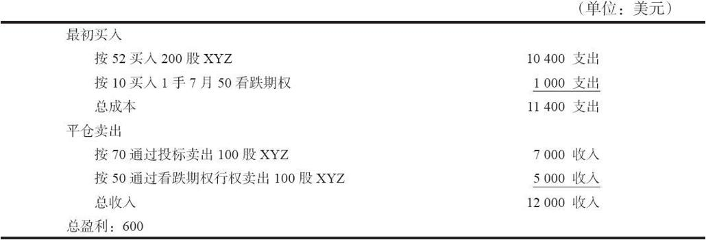

# 27.12　使用期权的风险套利

风险套利这个名字很好地介绍了这个策略。它基本上是一个套利（买入和卖出相同的或相等的证券）。不过，因为这个套利的成功通常取决于某个未来事件的发生，所以这个策略一般包含有风险。我们在上面讨论就一个标的股票将要支付的特别股息数量进行投机的时候，介绍过风险套利的一种形式。那个套利是由买入股票和买入看跌期权组成的，建立套利的时候看跌期权的时间价值要小于预期的特别股息。这里的风险在于套利者对预期特别股息的大小方面所作的投机。

### 27.12.1　并购

风险套利在股票市场中是一种历史悠久的套利。一般而言，它与提议的并购或兼并实际是否按所提议的方式完成进行投机有关。

【示例27-17】XYZ的售价是每股50美元，它提出要收购LMN，方案是每股XYZ股票兑换2股LMN的股票。这就意味着如果兼并按照所提议的完成，每股LMN就值25美元。在提出兼并的那一天，LMN股票或许会上涨到每股22美元。在这个兼并被LMN的股东批准之前，它的价格在交易中不会一路上涨到25美元。套利者如果觉得这个兼并会被批准，他就可以采取行动。他会卖空XYZ，同时，就卖空的每1股XYZ，买入2股LMN股票。如果并购成功，他就会盈利。他卖空XYZ同时又买入LMN是要保护自己，以防出现XYZ的市场价格在兼并被批准之前下跌。从本质上说，他是卖空XYZ，同时买入XYZ的相等物（如果兼并完成，2股LMN就等于1股XYZ）。这显然是一种套利。不过，这是一种风险套利，因为，如果LMN的股东拒绝这个收购的话，他就肯定要亏钱。他的潜在盈利等于LMN目前的市场价格（22）同兼并价格（25）之间还剩下的差额。如果提议的兼并完成了，这个差额就会消失，套利者就得到了盈利。

并购的最大风险是这个并购被取消。如果发生这样的事，被兼并的股票（LMN）的价格就会下跌，回到兼并前的水平。此外，兼并股票（XYZ）的价格有可能会上涨。因此，风险套利者就有可能在交易的两侧都亏钱。如果所提兼并涉及的股票中其中之一或者两只都有期权，套利者就有可能在策略中使用期权。

在并购的情况里，因为两只股票都有可能出现大幅的运动（它们一起运动），买入期权是更好的期权策略。如果并购公司（XYZ）有实值的看跌期权，那么，买入这些看跌期权就可以用来代替卖空股票。这样做的好处是，如果XYZ在等待并购完成期间急剧上涨，那么，套利者的盈利就会增加。

【示例27-18】同上面一样，假定XYZ的售价是50，它正在对LMN进行2对1的兼并。LMN的价格是22。假定XYZ在兼并结束时的价格为60。这就将LMN的价格拉到了将近30。如果投资者是用50卖空100股XYZ，按22买入200股LMN，那么他的盈利就是600美元（买入200股LMN有1600美元的收益，卖空XYZ有1000美元的亏损）。

把这个结果同相似的用买入看跌期权来代替卖空股票的策略比较一下。跟以前一样，假定它买入了200股LMN，不过现在是买入1手XYZ看跌期权。如果套利者可以用5.50点买入略有一些时间价值的XYZ 7月55看跌期权，那么，如果并购完成时XYZ的价格在55之下，他的盈利金额是相等的。

不过，在XYZ的价格上涨到60的时候，他的盈利额就增加了。LMN从22涨到30，他还是赚1600美元，但是，现在他在XYZ看跌期权上只亏损550美元，因此，同全交易股票的600美元相比，他现在的盈利是1050美元。

用买入看跌期权来代替卖空股票的缺点是，套利者没有从卖空股票中得到收入，因此没有按持有成本率赚钱。不过，这个缺点可能没有看上去那么严重，因为要借到并购方的股票来卖空，代价非常大，甚至不可能。如果借贷股票的成本非常高，或者根本找不到股票借，那么买入实值看跌期权就是一个有效的选择。买入一手实值看跌期权比买入一手平值或虚值要好。因为，如果XYZ的价格没有变化或者下跌，为后者所付的时间价值会吞噬掉太多的盈利性。如果并购失败而且XYZ上涨，这个策略还可以减少亏损。在买入的看跌期权上的亏损比卖空XYZ股票的亏损要小。

同时请注意，套利者可以卖出XYZ 7月55看涨期权和买入看跌期权。当然，这就是一个合成的卖空股票，纯粹是替代卖空股票的头寸。只有在套利者借不到并购方的股票时我们才建议使用这样的策略。如果他想这样，那就应当使用实值的看跌期权和虚值的看涨期权，因为如果在看涨期权上被指派，同卖空一样，他无法借到股票交割。使用一手虚值的看涨期权就减小了最终被指派的机会。

相随的策略是买入实值看涨期权而不是买入被兼并公司股票（LMN）。如果股票跌得太深，不管是因为兼并失败或者是因为兼并中的股票过度下跌，这个策略都有它的好处。此外，买入LMN股票的持有成本也没有了，虽然一般它是构建在买入看涨期权的成本之中的。看涨期权与看跌期权相比有较大的时间价值，使得这个策略不像用买入看跌期权来替代卖空股票那么有吸引力。

套利者也可以考虑卖出而不是买入期权。一般而言这不是一种高明的策略，不过，在某些场合里也有它的用处。卖出期权不高明的理由是因为它们在这个风险套利中没有限制风险，但是限制了盈利。例如，如果投资者就被兼并的公司股票（LMN）卖出看跌期权，那么他就有一个看多的情景。不过，如果被兼并的公司股票（LMN）上涨得太高，那就会有亏损。因为只要LMN涨过了行权价，卖出的看跌期权就停止赚钱。如果兼并价格朝LMN有利的方向发展，那么这就更让人失望。在兼并价格战中股票价格大幅上涨时买入LMN股票的套利者会有丰厚的盈利，然而看跌期权的卖家则无法得到相似的盈利。

用卖出实值看涨期权来代替卖空并购公司（XYZ）的做法在有的时候有它的好处。要卖空股票时，需遵守正点价差规则（a plus tick），即卖空的价格不得低于前一成交价。如果许多套利者在同时卖空同一股票，那就不容易在这个股票上卖空。此外，XYZ的自然持有者也许会看到套利者把价格压了下去，决定要卖掉股票而不是遭受在并购的过程中可能出现的股票价格下跌。另外，XYZ的买家变得提心吊胆，为了同样的原因而降低他们的买报价。所有这些叠加起来，就为卖空造成了一个非常困难的局面，即使能借到股票也是如此。卖出实值的看涨期权可以克服这种困难。这个看涨期权应当是深度实值的，而且离到期不能太远，因为套利者不想看到XYZ下跌到看涨期权的行权价之下。如果发生这样的情况，他就不再是对冲的；套利的另一条腿（买入LMN股票）会继续下跌，但是他不再有任何卖出的头寸来保护买入的LMN股票。

### 27.12.2　并购的限制

股票还有另外一种并购，对它更难套利，不过期权在这里可以起到作用。在有的并购情况里，并购公司（XYZ）许诺给被并购公司（LMN）的股东等于一个固定金额的股份数。即使并购公司的股票价格稍微有波动，都会付这个数量的股票。不过，如果XYZ跌得太深，它就无法向LMN的股东支付增长异常的股份数。因此，XYZ就在给LMN每份股票上所付的股份数设一个最大额限制，这样，XYZ的股东就有了保障。如果像在并购中常常发生的那样，XYZ的价格下跌，那么，他们公司的股票价值不会过分稀释，因此在下行的方向有了一定的保护。但是，如果XYZ跌得过深，那么LMN的股东得到的就更少。与这种下行方面的保护相似，XYZ通常也规定了将付给LMN股东的最低股份数量，即使XYZ股票剧烈上涨。因此，如果XYZ价格剧烈上涨，那么，LMN的股东的所得就会比他们预期的更好。用一个示例可以说明这一类的并购协议。

【示例27-19】假定XYZ的价格是50，它想要兼并LMN，用的是谈好的每股25美元的价格，像上面的示例里那样。不过，不是直接用2股LMN换1股XYZ。XYZ公司说，只要XYZ的价格在45~55之间，它就给LMN的股东每1股LMN价值25美元，按这个价格并购。有了这个信息，我们可以决定LMN股东可以得到的最高数额和最低数额的股份：最高数额是用底端的限制45去除谈好的价格25美元，或者说0.556股；最低数额是用高端的限制55去除谈好的价格25美元，或者说0.455股。

这种类型的并购通常是用将发行多少XYZ股份的方式来表达，而不是以XYZ有可能会运动到什么价格范围来陈述。无论是哪种情况，都可以从一种情况推导出另一情况来，因此，用什么方法来说明并购协议只是一个习惯问题。例如，在这样的情况里，并购可以说是价值25美元，每1股LMN至少价值0.455股XYZ，最多0.556股XYZ。请注意，只要XYZ的价格在45~55之间，这些比率使得这个并购价值等于25：45乘以0.556等于25，0.455乘以55也等于25。

如果并购的股票XYZ在并购完成时的价格在45~55之间，那么，每个LMN股东将得到的XYZ的股份数目就是按预定的方式决定的。一般来说，在并购宣布的时候，XYZ会说，在并购结束时候，它将用它的价格来建立正确的比率。另外一个稍有不同的方法是，有的时候并购公司会说，用来决定最后比率的是股票在一定时段中的平均收盘价。这个一定的时段有可能是并购结束前的10个交易日。

【示例27-20】假定XYZ在并购结束那一天的收盘价将用来决定这个比率。此外，假定XYZ在那一天的收盘价是51。这是在事先说好的范围之内，因此必须进行计算，以决定每个LMN股东可以得到多少股XYZ的股份。决定这个比率是用这一天的价格51去除说好的价格25。这样，最后的比率是0.490196。这个最后比率一般有很长的小数，以保证让LMN的股东得到尽可能接近每股25美元的价格。

上面的两个示例解释了这类并购是如何运作的。这种类型的并购被人说成是有“钩子”的，也就是有稳定价格的比率。这就使它很难套利。只要XYZ在45~55的范围内浮动，套利者就不会想要把卖空XYZ作为他策略的一部分，因为此时XYZ的价格不会影响到他最终从LMN得到的价格（25）。他会买入LMN并且等到这个并购基本要结束了才卖空XYZ。在等待的时候，他就会大致知道他应当为持有的每1股LMN卖空多少股XYZ。之所以必须在并购的结尾卖空XYZ，是因为在LMN的实物股票被重新组织进XYZ之前，通常会有一段时间。在这段时间里，如果他没有卖空XYZ来对冲，那么他买入的LMN就会有风险。

如果XYZ在并购完成很久之前就开始跌到45之下，也就是这个并购的低端的“钩子”之下，那就会出现麻烦。如果它停留在45之下，那么套利者就应当设立一个套利，例如就每1股持有的LMN卖空0.556股的XYZ。只要XYZ在并购完成之前停留在45之下，这就是正确的比率。不过，如果在建立了这个比率之后XYZ反弹回来，超过了45，套利者就会有亏损。XYZ的价格有可能继续上涨，在卖空的那条腿造成亏损。不过，LMN不会跟着上涨，因为并购的构建的方法是，LMN的价值就是25，除非XYZ上涨得过高。因此，买入的那条腿在卖空的那条腿向上运动得更高的时候并没有跟进。

另一方面，如果XYZ从它最初的价格50向上运动得太远，升到上端的“钩子”55之上，那就不会有问题。在这样的情况里，套利者已经买入了LMN，还没有卖空XYZ，因为并购还没有完成。LMN在XYZ的价格超过了55之后只是跟随它走得更高而已。

这是一种常见的两难局面。我们曾经说过，并购股票常常在并购一宣布之后就马上下跌。因此，XYZ有可能跌到或者跌过下端的“钩子”。有的套利者在XYZ开始跌到将近45时卖空少量的XYZ，然后，如果它跌到远离45的地方，就回补这个卖空，试图用这种方法对自己进行对冲。用这种方法来处理的问题是，套利者最后得到的是一个不正确的比率。从本质上说，他是在迫使自己对XYZ的运动进行预测。

如果并购股票跌到下端“钩子”之下，那么，如果这个股票有场内期权，就有可能在没有这些风险的情况下建立起一个对冲。这里的设想是，买入并购公司的看跌期权，这些期权的行权价接近或等于低端“钩子”的价格。然后买入合适数量的被并购公司（LMN）的股票以完成这个套利。如果并购公司接着反弹，回到谈好的价格范围，看跌期权的亏损被限制在行权价之外的区域，前面所介绍的问题就被解决了。

【示例27-21】公司宣布了上面示例所介绍的并购：XYZ要按照每股25美元的价格兼并LMN，补充规定是：每股LMN至少值0.455股XYZ，但最多只值0.556股XYZ。这些股份的比率同XYZ的45和55的价格相等。

假定XYZ价格在并购宣布之后立即下跌，一直跌到了40。此外，假定这个并购预计要在7月完成，而且市场上有XYZ 8月45看跌期权，它的售价是5.50。这就代表了只有0.50点的时间价值。套利者于是可以通过买入10000股LMN和56手XYZ的看跌期权来建立一手套利。较小的投资者可以买入1000股LMN和6手看跌期权。两者都大致符合1股LMN等于0.556股XYZ的正确比率。

### 27.12.3　要约收购

另一类符合广义的风险套利的公司兼并是要约收购（tender offers）。在要约收购中，兼并公司通常用现金交换被兼并公司的股票。有的时候，收购的是被兼并公司的所有股份，有的时候是其中一部分股份。在后一种情况里，了解剩下的股份会发生什么情况很重要。它们有可能同兼并公司的股份对换，也有可能折换为其他证券（最有可能的是债券），或者，对剩下的股份根本没有任何交换的计划。在有的情况里，一个公司会收购它自己的部分股票，因此，它事实上既是兼并者，也是被兼并者。因此，要想正确地套利，要约收购有时会过于复杂。使用期权可以减少风险。

在兼并公司用现金交换被兼并公司的所有股份（叫做“全现金”收购，“any and all”offer）的情况里，使用期权的主要用途是买入看跌期权作为保护。套利者在买入被兼并公司股票的同时买入这个公司的看跌期权。如果兼并由于某种原因失败，看跌期权可以在被兼并公司的股票下跌时防止灾难性的亏损。套利者在买入这些看跌期权时必须有一定的见识。如果它们过于昂贵或者过于虚值，或者，如果被兼并公司在兼并失败时股票未必会真的跌得很深，那么买入这些看跌期权就是一种浪费。不过，如果在下行方向有显著的风险，那么买入看跌期权是会有用的。

在“全现金”收购中卖出期权看上去常常是一个容易赚钱的机会，不过，这里也有风险。如果兼并完成，被兼并的公司就会消失，它的期权就会被摘牌。因此，卖出虚值的被兼并公司的看跌期权似乎常常看上去是合理的。如果兼并完成，在兼并结束时这些期权就会无价值到期。不过，如果兼并失败，这些看跌期权的价格就会急剧上涨，引起大笔的亏损。另一方面，卖出行权价比收购价格更高的裸看涨期权看上去也是容易赚到钱的。同样，如果兼并完成，这些期权就会被摘牌和无价值到期。在这个情况里的风险是，另一个公司对被兼并公司开出更高价格，而卖出的看涨期权是就这个被兼并公司的。如果发生这样的情况，价格会突然上跳，卖出的看涨期权会损失惨重。

在要约收购只针对部分股份的时候，期权可以起到更重要的作用，特别是当人们预期剩下的股票在部分收购完成之后会大幅下跌的时候。用一个部分要约收购的示例可以说明这种情况。

【示例27-22】XYZ提出要买回它自己的部分股票。它提出的收购价是每股70美元，它要买回公司的一半股份。对其他股份如何处理，没有任何计划。根据公司的基本面数据，可以预期剩下的股票大约会卖到40美元一股。因此，如果收购完成，XYZ的平均价格就是55（一半的卖价是70，另一半价值40）。在收购完成之前，XYZ的价格也许在每股52或53左右。投标一结束，XYZ股票会立刻跌到每股40美元的水平。

有两种方法可以在这种情况中赚钱。一种是在现有的价格（例如52）上买入XYZ股票，然后去投标。当投标结束，XYZ重新开盘的时候，剩下的股份会用较低的价格（例如40）交易。如果刚好是50%的股票在要约收购中被接受，那么，这个方法可以在每股上产生3美元的盈利。在现实中，通常被接受的比例要略为高一些，因为有的人会错失，没有去投标。因此，投资者的平均净价格会是每股56美元，在这个方法里每股有4美元的盈利。在这种情况里的风险是，当价格为70的收购结束之后重新开盘的时候，XYZ的价格会远在40以下。

从理论上说，另一种就这样的要约收购进行交易的方法是按52卖空XYZ的股票，然后在收购结束重新开盘的时候，用40的价格将它买回。不幸的是，这种方法无法实施，因为不会有可以借贷以供卖空的XYZ股票。所有的持有者都会将股票去投标而不是把它借给套利者。套利者懂得这一点，他们也懂得如果在最后一分钟想要卖空股票所必须承担的风险。他们会不得不用现金买回股票，或者不得不给从他们手里买走股票的人的一半的股票付每股相等于70美元的价格。由于某种原因，许多个体投资者认为他们可以使用这种策略而不必承担风险。他们卖空股票，以为经纪公司会有办法为他们借到股票。不幸的是，这种想法常常使得客户亏掉一大笔钱。

在想要从XYZ从52跌到40中得到盈利的企图中，使用看涨期权也帮不了什么忙。正常情况下，XYZ的实值看涨期权在要约收购刚好要完成之前会在持平价上交易。如果套利者卖出看涨期权来代替卖空股票，他可能会在要约收购过期的第二天收到指派通知，因此发现他自己也面临着同卖空股票同样的问题。

在这种价格跌落中唯一安全的运作方法是买入XYZ的看跌期权。这些看跌期权会非常贵。事实上，如果XYZ的价格在要约收购到期之前是52，而普遍的看法是XYZ在收购到期之后的价格会是40，那么，行权价为50的看跌期权的售价至少是10美元。这么贵的价格反映了对XYZ价格跌落的预期。因此，除非预见到股票价格会跌得比40深，否则买入这些看跌期权来作为对下行方向的保护是没有好处的。然而这里有买入XYZ股票同时也买入昂贵的看跌期权的套利机会。

在提供这种套利的一个示例之前，有必要对就卖空投标说几句话。卖空投标（short tendering）是不合法的。它出现在当一个交易者实际并不持有股票，但是向要约收购中投标股票的情况里。在一个要约收购中对什么构成股票的持有权有复杂的定义。在要约收购过期的那一天，投资者必须净买入所有他投标的股票股份。因此，他不能在收购过期的前一天投标股票，然后在第二天卖空股票（即使他能够借到股票）。此外，投资者如果就他的头寸卖出某种看涨期权，那么，他就必须减去为这些看涨期权所保护的股票的股份数目：所有行权价小于要约收购价的看涨期权都必须减掉。因此，如果他买入了1000股股份，同时卖出了10手实值看涨期权，那么，他就没有任何股份可以用来投标。无论是新手还是经验老到的交易者，都必须意识到这些定义，不应当违反卖空投标的规则。

现在让我们来看一下由买入股票和买入昂贵的看跌期权所组成的套利。

【示例27-23】XYZ的价格是52。同前面一样，有一个要约收购，收购一半的股票，价格是70，对剩下的股票没有计划。7月55看跌期权的售价是15，7月50看跌期权的售价是10。这很常见，两个期权对后市的预测是相同的：40。

如果套利者用52的价格买入200股XYZ，用10买入7月50看跌期权，只要要约收购完成，他就锁定了一笔盈利。他只买了1手看跌期权，这是因为他假设公司只会接受100股股票，其他的100股将还给他。一旦这100股股票还给了他，他可以将看跌期权行权，把头寸平仓。

下面的表格总结了这些结果：

这个策略没有了如果XYZ在收购之后开盘跳空，大幅低于40时会出现的风险。下行方向的价格现在被锁定在看跌期权里。

如果在要约收购中有50%以上的XYZ股票被接受，那么就会有更大的盈利。同时，如果XYZ接着在足够高的价格上交易，7月50看跌期权因此有某些时间价值，那么也会产生较大的盈利。（在这个情况里，套利者不会将这个看跌期权行权，而是分别卖掉股票和看跌期权。）

部分要约收购可以有不同的形式。上面示例里介绍的这种叫做“两级”收购（“two-tier”offer），因为收购价格同剩下来股份的价格有很大的不同。在有些部分收购里，剩下来的股份是用基本上相同的价格买入，或许是通过一个现金并购。上面的策略在这样的情况里就不适用，因为这样的并购同“全现金”收购差不多。在其他类型的部分收购里，在部分现金收购之后会发行并购公司的债务证券。这些债务证券的净价格有可能同要约收购的价格不同。如果是不同的话，上面的策略就有可能起作用。

总的来说，套利者应当小心看待要约收购。在“全现金”收购中，套利者应当小心，不要承担过分的期权风险。反过来，在部分要约收购中，套利者应当利用所有“两级”收购的情况，买入股票和买入看跌期权。

### 27.12.4　盈利性

因为风险套利情况中的潜在盈利有可能非常大，或许是每100股3或4点，公众可以参与到这种策略里。对公众客户来说，由于手续费的缘故，风险套利的盈利对他们来说没有套利者那么高。不过，潜在盈利常常大到使得这种类型的风险套利对公众客户来说也是切实可行的。

总的来说，风险套利者在他的策略里可以使用期权，来代替实际的股票头寸，或者是用来保护股票的头寸。虽然因为盈利微薄导致公众通常不能参与到套利的策略里，但风险套利常常会是例外。潜在盈利有可能大到使得公众客户可以克服手续费负担的地步。
