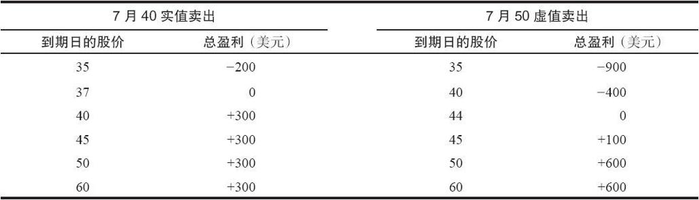

# 2.2　卖出备兑看涨期权的哲学

对大多数投资者来说，卖出备兑的主要目的是增加持股过程中的收入。越来越多的私人和机构投资者就他们所持有的股票卖出看涨期权。有两项事实是显而易见的：如果股价下跌的话，期权权利金可以部分弥补下跌的损失，并且期权权利金可以增加股票持有者的收入。在股价下跌、维持不变，甚至是稍微上涨的情况下，在持有股票的同时卖出看涨期权的策略，其表现要比只持有股票好。事实上，只有在一种情况下只持有股票的收益会比卖出备兑要好，那就是在该期权的存续期内股价相对来说有显著地上涨。此外，如果某个投资者就他的股票持续不断地卖出看涨期权，其投资组合的投资绩效在不同季度之间的变动就不会那么大。这个总头寸（买入股票和卖出期权）的波动率比只持有股票更小。因此，从季度的频率来看，卖出备兑的收益要比正常的持有股票更接近于平均值。这是一个很有吸引力的特征，对组合管理人而言尤其如此。

不过，并不是说卖出备兑的表现就一定会比持有股票更好。在股价大幅上涨的时候，只持有股票的策略的获利能力最大。备兑卖出者不应该在这个时候参与。持有股票的长期收益包括阶段性的大幅度盈利和时而阶段性的大幅度亏损。备兑卖出者无法得到那些最大的盈利，因为他的潜在盈利是有限的。

### 2.2.1　股票的实际所在地

在更深入地讨论卖出备兑策略之前，看一看持有什么样的股票可以卖出期权也许是有益的。还记得吧，本书的讨论适用于场内期权。如果某个投资者将他的股票保存在他的经纪公司处的现金或保证金账户里，那就不需要再满足任何额外的要求，他就可以就他所持有的每100股股票卖出一手期权合约。不过，即使在没有在经纪公司处实际存入股票的情况下，投资者也有可能可以卖出备兑期权。有好几种办法可以这样做，它们都涉及在一家银行中存入股票。

当把股票存进银行时，投资者就可以要求银行给他的期权经纪公司出具一份保管收据（escrow receipt）或是一份担保书（letter of guarantee）。这个银行必须是一家“得到批准”的银行，这样，经纪公司才会接受它的担保书，而且，不是所有的经纪公司都接受担保书的。这些东西是要花钱的，每卖出一次期权，就必须要有一份新的契约收据或担保书。如果所涉及的只是100股或200股股票，这样的花费就有可能变得不可接受。

对不想在经纪公司存入股票但又想卖出期权的客户来说，还有另一种办法。他可以将股票存在一家是存管信托公司（depository trust corporation，DTC）的会员银行里。存管信托公司向期权清算公司担保，如果看涨期权卖出者收到指派通知的话，它将事实上交割股票。对投资者来说，这是最方便的方法，也是大部分卖出备兑期权的机构投资者使用得最多的方法。银行一般对机构账户免费提供这项服务。不过，只有少数银行是存管信托公司的会员，而这些银行一般都规模较大，坐落于大城市。因此，对许多个体投资者来说，要利用这种存管信托公司的交易优势不是一件容易的事。

### 2.2.2　卖出备兑的类型

虽然所有的卖出备兑都涉及就持有的股票卖出看涨期权，但有不同的术语来描写不同类型的卖出备兑。有两个术语用得最为广泛，它们包含了所有的卖出备兑，一个是虚值卖出备兑（out-of-the-money covered write），另一个是实值卖出备兑（in-the-money covered write）。很明显，这两个术语指的是在初始建立头寸的时候，该期权自身究竟是实值还是虚值的。有时，卖出备兑的分类依据于所涉及的股票的性质（低价卖出备兑、高收益卖出备兑等），但这些都只是这两大类的子集。

一般而言，相对于实值卖出备兑来说，虚值卖出备兑能提供更高的潜在收益，但对风险的保护程度则较低。根据在建立合约时该看涨期权实值或虚值的程度，投资者可以建立一个进攻型或防守型的卖出备兑头寸。实值卖出更多地是防守型卖出备兑头寸。

让我们通过一些示例来说明，从一个策略家的角度来看，为什么某个卖出备兑比另一个更为保守。

【示例2-4】XYZ普通股股票的售价是45，有两个期权在考虑范围之内：售价为8的XYZ 7月40看涨期权以及售价为1的XYZ 7月50看涨期权。表2-2表示了在卖出备兑中使用7月40和7月50的盈利能力。7月40的实值卖出备兑在到期日可以提供8点，也就是18%的保护，可以保护到价格为37的程度（盈亏平衡点）。虚值的7月50的卖出备兑对到期日的价格下行风险只提供了1点的保护。因此，同虚值卖出备兑相比，实值卖出备兑提供了更大的对价格下行风险的保护。这个结论并不仅适用于这个示例，它是普遍正确的。

在金融世界的平衡中，凡是风险较小的投资头寸，它们的潜在收益也就较低，这是一个普遍真理。上面的示例也不例外。7月40实值卖出备兑的最大潜在盈利是300美元，在到期日，只要股价高于40，就可以实现最大潜在盈利。另一方面，7月50虚值卖出备兑的最大潜在盈利是600美元，在到期日，只要股价高于50，就可以实现最大潜在盈利。一般而言，虚值卖出备兑的最大潜在盈利都比实值卖出备兑要高。

表2-2　7月40看涨期权和7月50看涨期权的盈利或亏损

要对两个卖出备兑作真正的比较，你必须观察在到期日当股票价格在40~50之间时会发生些什么。在这个价格范围内，实值卖出会实现它的最大盈利。即使标的股价在到期日时下跌了5点，仍能让实值卖出者获得最大盈利。然而，只有在标的股价上涨的情况下，虚值卖出备兑才有可能实现最大潜在盈利。这进一步说明了实值卖出备兑的保守性。应当注意到，尽管潜在盈利比较小，但就其收益率来看，实值卖出备兑仍具有吸引力，特别是在使用保证金账户进行卖出的情况下。

投资者可以通过卖出虚值备兑看涨期权来构建一个更具有进攻性的头寸。在这种情况下，投资者对标的股票应当是看多的。如果投资者对股票的看法是中性的或者略微看空的，则进行实值卖出备兑就更为合适。如果投资者对所持有的股票确实看空，那么他应该卖出股票，而不是建立一个卖出备兑。
