# 28.1　布莱克–斯科尔斯模型

因为期权的价格是由股票价格、行权价、波动率、离到期的时间和短期利率决定的，从逻辑上说，应当有可能推导出一个公式，从这些变量中计算出期权的价格。自1973年期权开始场内交易以来，有过许多这样的模型。它们之中许多是想对最先出现模型进行改进。这个最先的模型就是布莱克–斯科尔斯模型（Black-Scholes Model）。这个模型是在1973年早期面世的，同场内期权开始交易的时间非常接近。它在这样一个时候公布于众，因此就有了相当多的信奉者。这个公式相当容易使用，公式很短，变量不多。

实际的公式是：
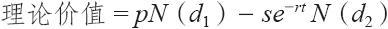
式中：
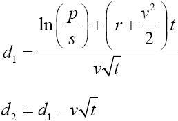
这些变量是：

p=股票价格；

s=行权价；

t=离到期的时间，用1年的百分比表示；

r=目前的无风险利率；

v=用年标准差衡量的波动率；

ln=自然对数；

N（x）=累积正态密度函数。

这个模型的一个重要的副产品是对delta（也就是说，期权价格中预期因为股票价格中的一个单元的变化而出现的变化数量）的精密计算。我们在第3章讨论买入看涨期权时介绍过delta，它的更正式的名字是对冲比率：

delta=N（d1）

这个公式非常简单，大多数能编程的计算器都可以很容易对它进行计算。事实上，在交易所的交易池里常常可以看到有人使用这样的计算器，因为有的比较偏重理论价值的场内交易者想对期权权利金的即时价值进行监控。当然，如果使用计算机就更容易也更快了。在很短的时间内就可以进行大量的布莱克–斯科尔斯的计算。

在大部分统计学书里都可以找到累积正态分布函数的表格。不过，为了计算的目的，反复地到一个表格中去查找值是一种浪费。因为正态曲线是一条光滑的曲线（它是一条“钟状”曲线，最多地用在描述人口的分布上），我们可以用一个公式来大致得出累积分布：
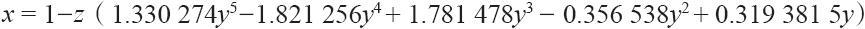
式中，
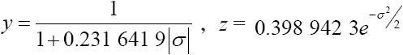
那么，如果σ＞0，N（σ）=x；或者，如果σ＜0，N（σ）=1-x

就给期权定价的目的而言，这个近似值是相当精确的。因为就期权价格而言，1‰点并不重要。

【示例28-1】假定XYZ的交易价是45，我们想对7月50看涨期权进行估计，它离到期还有60天。此外，假定XYZ的波动率是30%，无风险利率目前是10%。理论价值计算的细节都显示在这里，这样，想要为模型编程的读者就可以用来同他们自己的计算进行比较。

一开始先使用上面的公式得出t，d1和d2：
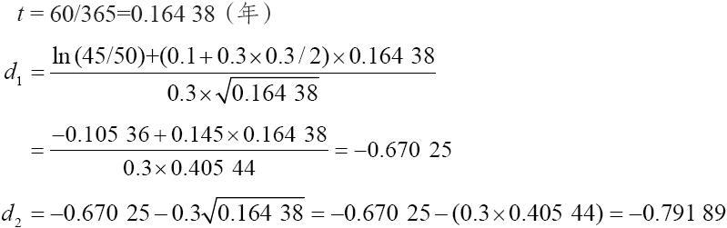
现在，使用上面的公式计算出d1和d2的累积正态分布函数：
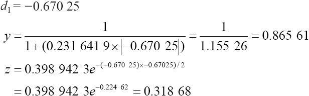
这个5次多项式的计算步骤太多。这里只给出结果：

x=0.74865

因为我们要确定的是一个负数的累积正态分布，这个分布是由1减去x而得到的。
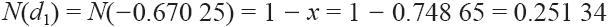
用同样的方式，它要求为x，y，z计算出新的值，
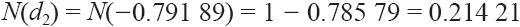
现在回到计算期权理论价值的公式，我们可以完成对7月50看涨期权理论价值的计算，这里简称“价值”：
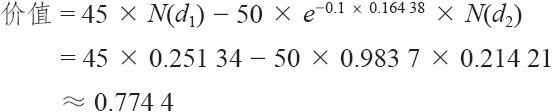
因此，7月50看涨期权的价值只是刚好略为高于3/4点。请注意，这个看涨期权的delta也根据N（d1）而计算出来，它刚好等于0.25。这就是说，在股票价格有小量变动的时候，7月50看涨期权价格的变化速度是股票价格变化速度的1/4。

这个示例应当回答了本书先前版本的读者提出的许多问题。如果读者对这个模型的更进一步的细节感兴趣，或许还包括实际的标准差，那么，他应当读一读《使用期权中的事实和幻想》[1]这篇文章。这个模型中存在的不怎么明显的关系之一是看涨期权的价格在无风险利率上升的时候会上涨（看跌期权的价格会下跌）。我们同时也可以看到，这个模型也证实了这样的关系：上升的波动率、较高的股票价格，或者离到期更多的时间等，都意味着更高的期权价格。

### 这个模型的特征

这个模型有些方面值得讨论一下。首先，读者会注意到，这个模型没有包括股票所付的股息。正如前面展示的，股息对看涨期权的价格有负面的作用。因此，直接使用这个模型会趋向于过高地估计看涨期权的价格，特别是在那些股息付得相对高的股票上。处理这问题有一定的办法。费希尔·布莱克，这个模型的发明人之一，建议使用下面的方法：调整公式里使用的股票价格，从现有的股票价格里减去在到期前有可能支付的股息的目前的价值，然后再计算期权的价格。第二种方法，假设期权是在实际到期日之前的那个最后的除息日以前到期的。同样是调整股票的价格，计算期权的价格。使用这两种计算方法计算出的较高的期权价格作为理论价格。

另一种不那么精确的方法是在看涨期权的价格上使用加权系数。这个加权系数是以股息支付为基础的，对高收益股票的看涨期权使用较大的加权。应当指出，在我们将要介绍的许多种应用中，没有必要知道看涨期权的精确理论价格。因此，这个股息“校正”不一定非要用在所有的策略决定上。

这个模型是建立在股票价格的对数正态分布上的。虽然正态分布是模型的一部分，由于将指数函数包括在内，这个分布就成了对数正态了。对那些对统计学不那么熟悉的人来说，一个正态分布就是一个钟状曲线。这是人们最熟悉的数学分布。使用正态分布的问题是，它允许有负值的股票价格存在，而这是不可能出现的现象。因此，股票价格一般使用对数正态分布，因为它意味着股票价格的范围只能是从零到无限大。此外，对数正态分布的向上（看多）的偏向从逻辑上来说也正确，因为股票价格最多只能跌100%，但是上涨不止100%。在布莱克–斯科尔斯模型之前的许多期权定价模型想要使用经验分布（empirical distribution）。一个经验分布的形状同正态分布或对数正态分布的形状不同。股票价格的合理经验分布同对数正态分布的相差并不太大，只是在股票是否会保持稳定的假设上，它们常常比对数正态分布认为这种情况的概率更大。布莱克–斯科尔斯模型的批评家宣称，在很大程度上因为这个模型使用的是对数正态分布，所以它往往会对实值看涨期权定价过高，对虚值看涨期权定价过低。在某些情况里，这个批评没有错。但是，这并没有显著地削弱这个模型在策略决定中所起的作用。不错，如果投资者只是根据他们计算出的价值来买入或卖出看涨期权，这会导致很大的问题。不过，如果策略的抉择是基于其他的比定价过高/定价过低更重要的因素时，有一些小差距就没有什么关系。

在数学应用中，如何计算波动率始终是一个困难的问题。在布莱克–斯科尔斯模型中，波动率的定义是股票价格的年化标准差。这里是对标准差的一般统计学定义：
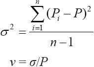
式中　P——所有Pi的平均股票价格；

Pi——当日股票价格；

n——所观察的天数；

v——波动率。

当波动率是用过去的股票价格计算出来的时候，它就叫做历史波动率。同一股票的波动率在不同的时间往往不同。有的因素可以预见得到，像一个大股票的分股会增加股票的流通量，这些因素可以降低波动率。一个公司进入更为投机的业务领域会增加波动率。其他界定没有那么清楚的因素也会改变波动率。因为波动率在定价模型中是一个非常关键的要素，对使用模型的人来说，合理地对当前的波动率进行估计就非常重要。人们现在意识到，年化标准差并不准确，因为它包括的时间阶段太长。近年来使用模型的人做了不少努力，这些努力说明，在得出目前的波动率的过程中，也许应当让短期股票的价格活动比过去股票的价格运动有更大的权重。这是一种可行的途径，不过，计算这样的因素而产生的错误，并不少于使用年化标准差所产生的错误。准确计算波动率的问题很关键，因为这个模型对波动率很敏感。

计算对数正态历史波动率。上面的计算并没有为布莱克–斯科尔斯模型提供正确的输入数据，因为这个数据假设价格变化的对数是服从正态分布的，而不是价格本身。这就是说，上面公式中Pi项应当改变。

【示例28-2】XYZ今天的收盘价是51，昨天是50。因此，它这一天的百分比变化是51/50=1.02。1.02的自然对数就是以这个波动率公式为基础的：

ln（51/50）=ln（1.02）=0.0198

用算术的方式说这个股票今天上涨了2%，但是用对数正态来表达的话，它只上涨了1.98%。

如果股票价格下跌，这个方法就会产生一个负数。假定XYZ在下一天从51跌回到50。在波动率公式中使用的数字就会是：

ln（50/51）=ln（0.9804）=-0.0198

使用这个概念就可以形成一个新的等式。它可以产生同布莱克–斯科尔斯模型相一致的波动率：
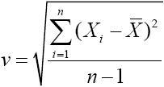
式中，Xi=ln（Pi/Pi-1）；Pi为第i天的收盘价；X为所需天数中Xi的平均值。

因此，要计算一个10天的历史波动率，就需要观测11天的数据。在下面的示例里，如果你不想自己计算波动率的话，不必担心全部的细节，它们是为需要检查他们工作的数学家和编程者提供的：
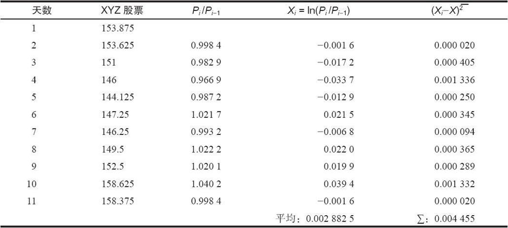
10天的lns（第4列）的平均值是0.00288。

然后，每一个ln与均值的差的平方之和（第5列）。例如，第1天该项是（-0.0016-0.00288）2=0.00002。这就是最右面那列的最上面的那个数字。在“ln”那列中的每个数字都可以按这样的程序进行计算。所有这些项的和是0.004455。
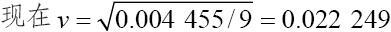
这是一个10天的波动率。将它转换为年化波动率，我们需要乘以1年里交易天数的平方根。因为在1年里大约有260个交易日，最后的波动率就是：
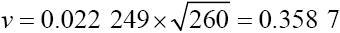
因此，你可以说XYZ的年化波动率是36%。

这是计算历史波动率的正确方法。显然，如果愿意的话，策略家可以计算10天、20天和50天以及年化波动率，或者其他任何的时段。在某些情况里，你可以从不同的波动率的相互比较中得到有关一个股票、期货和它的期权的宝贵信息。

[1] 费希尔·布莱克（Fisher Black），见《金融分析师杂志》（Financial Analysts Journal），1975年，第36~70页。
