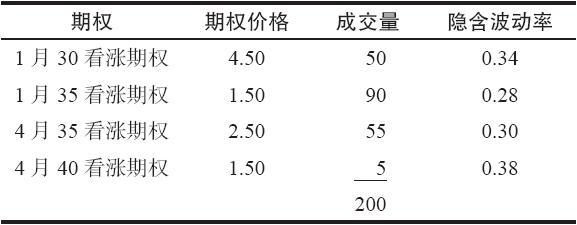
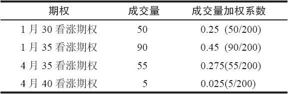
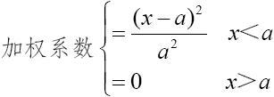
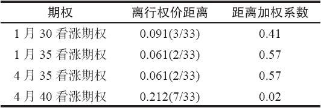
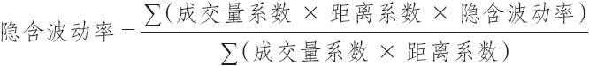
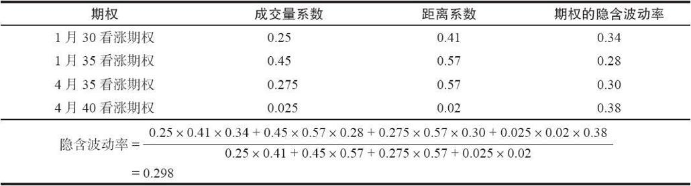
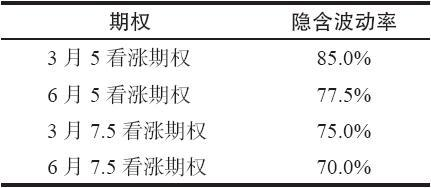

# 28.2　计算综合隐含波动率

事实上，策略家有一种可以让市场为他计算波动率的方法。这叫做使用隐含波动率，也就是说，市场自身隐含的波动率。这个概念的假设是：对行权价接近目前股票价格的期权和成交量相对大的期权，市场的定价是合理的。这有些像有效市场假设。如果在一个接近平值的期权中有足够的成交量，这个期权一般来说会按合理价格交易。如果一个期权的实际价格是合理价格，它就可以用来作为布莱克–斯科尔斯公式的一个固定值，而让波动率成为一个未知的变量。这个波动率可以通过迭代计算而得到。事实上，每一只具体股票的每一种期权都可以通过迭代的过程而计算出波动率。这可以为这只股票产生若干不同的波动率。如果交易者根据成交量和同实值或虚值的距离来加权，那么，就可以为这只标的股票得出一个单一的波动率。这个波动率是以这只标的股票在既定的一天中所有期权的收盘价为基础的。

表28-1　隐含波动率，收盘价格和成交量

【示例28-3】XYZ的价格是33，收盘价列举在表28-1。每一个期权都有一个不同的隐含波动率，这是通过决定每个期权的收盘价在布莱克–斯科尔斯模型中会产生什么波动率而计算出来的：这就是说，如果0.34用来作为波动率，这个模型就给1月30看涨期权算出作为价格。为了理性地将这些波动率结合在一起，必须先使用加权系数才能够得出XYZ股票自身的波动率。

表28-2　成交量加权系数

这个成交量加权系数很容易计算。每个期权的系数只是这个期权的日成交量除以所有XYZ期权的总成交量（见表28-2）。离行权价的距离加权函数也许不应当是线型的。例如，如果一个期权是2点虚值，另一个是4点虚值，前面期权的权重未必一定要是后面期权的两倍。一旦一个期权过度实值或者虚值，无论它有多大的成交量，它就不应当有多少权重，或者根本就不应当加权。下面形式的任何抛物线函数都足以说明问题：

式中，x是股票价格同行权价格之间距离的百分率；a是模型所用的最大的百分率距离。超过这个距离，使用模型的人就不再给期权的隐含波动率加权。

表28-3　距离加权系数

【示例28-4】一个投资者决定，如果期权的行权价超出目前股票价格25%，他就不再给这个期权加权。变量a在这时等于0.25。当XYZ的价格为33时，加权系数的计算可以用表28-3来表示。要把成交量和离行权价的距离这两个加权系数结合起来，用这个期权的隐含波动率乘以这两个系数。将所有涉及的期权的这些乘积加起来。这个总数然后除以这些加权系数的乘积的总和，表示成公式为：

在我们的示例里，XYZ股票由此算出的隐含波动率是29.8%（见表28-4）。请注意，这个隐含波动率0.298同任何单个期权的隐含波动率都不同。它是一个综合的数字，其中给成交量最大的近值期权以最大的权重，而成交量小的（5手合约）虚值的4月40看涨期权几乎没有给什么权重。这个隐含波动率仍然是标准差的一种形式。因此，凡是需要标准差波动率的地方，它都可以用。

表28-4　期权的隐含波动率

这种计算波动率的方法相对准确，它对股票的波动率的变化也很敏感。例如，随着市场变为看多的或看空的（产生大幅度的上涨或下跌），大部分股票会随之出现高波动的运动。期权权利金迅速上涨，这种隐含波动率的方法会迅速抓住这种变化。在最终得出股票的波动率之前，还有一项微调需要做。在日间运动中，一只股票（特别是它的期权成交量不活跃的股票）的价格波动有可能大于策略家想要看到的。通过得出最后20天或30天的隐含波动率的移动平均（moving average）可以起到平滑的作用。另一种不需要储存太多过去天数数据的方法是在隐含波动率上使用动量计算（momentum calculation）。例如，今天的最终波动率可以通过将今天的隐含波动率的5%加上95%的昨天的最终波动率而计算出来。这个方法只需要储存一个数据，就是昨天的最终波动率，但还是保留了一种“平滑”的效果。

一旦计算出了这个隐含波动率，就可以把它作为波动率这项变量用在布莱克–斯科尔斯模型（或者任何其他模型）里。因此，交易者可以使用股票的隐含波动率，根据布莱克–斯科尔斯公式计算出每一个期权的理论价值。因为股票的隐含波动率很有可能在某种程度上同这个具体的期权的隐含波动率有所不同，这样，在期权的实际收盘价同根据这个模型计算出的理论价格之间就会有所不同。这个差额代表了这个期权在理论上同这只股票的其他期权相比被过高或过低估价的数量。

### 计算波动率倾斜

没有一个单一的、确定性的方法来计算每只股票每一天在期权上的倾斜数值，但这里有一个可接受的方法。这个过程基本上如下。

（1）计算每个期权的单独隐含波动率。

（2）计算步骤（1）中每个期权系列的标准差。不用像计算综合隐含波动率那样为每个单独的隐含波动率赋权。而是仅仅计算这组隐含波动率的标准差。此外，在这个标准差的计算中，可以去掉那些没有或只有很少时间价值的期权，因为它们不是代表这只股票的“正常”期权。

（3）用步骤（2）的结果除以综合隐含波动率，计算过程如下文所示：

【示例28-5】XYZ交易价为6.50。它有多个场内期权交易，每个期权的隐含波动率都不同。

这四个数字的标准差是6.25。注意，这个数字并没有考虑单个期权的价格或成交量。然而，如果深度实值或深度虚值的期权的时间价值非常小，那它们将不在考虑范围之内。

此外，假定上述四个期权的综合隐含波动率（这需要使用成交量和实值或虚值的程度）为75.0%，那这个股票的“倾斜因子”就会是：

倾斜因子=6.25/75.0=8.3%

所有股票的倾斜因子都可以用类似的方法计算出来，并进行排序。具有最高倾斜因子的股票会有个非常明显的波动率倾斜（Volatility Skew）。对于有很大倾斜因子的特定股票，投资者应该看看其单个期权的隐含波动率，以便于知道是什么导致了这个倾斜。

如果即将发生某个“事件”（FDA听证会、诉讼判决、盈余公告等），就可能会导致一个水平的倾斜，即刚好在预期的事件之后到期的期权的隐含波动率会比所有其他期权都高。相反，在一个熊市中，则可能出现垂直的倾斜，例如，较低行权价的期权的隐含波动率会比较高行权价的期权更高。与这些倾斜相关的策略会在“波动率交易技术”一章中讨论。

一旦计算出综合隐含波动率和波动率倾斜因子，投资者就应该考虑为每个股票、指数、ETF和期货合约建一个日频价值的数据库。通过这些信息，投资者接下来就能计算出隐含波动率和倾斜在过去一段时间里的分位数。这些会是很有用的统计资料，可以帮助投资者确定某个特定股票的期权是否确实是昂贵或便宜，或者它们是否出现了不正常的倾斜。
