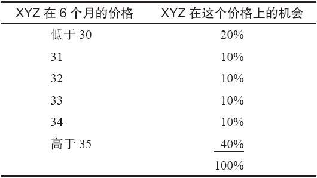
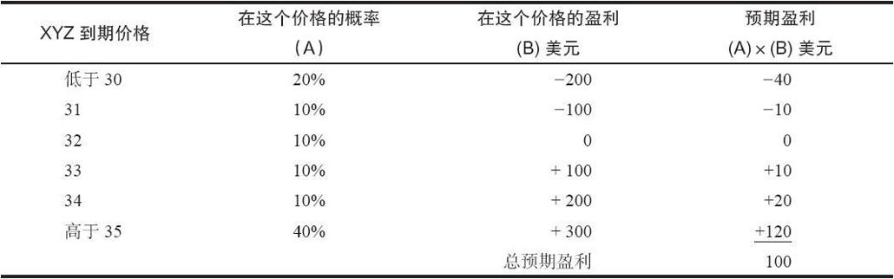
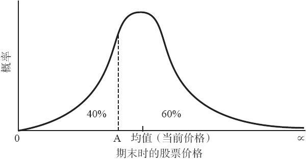
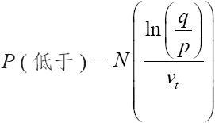
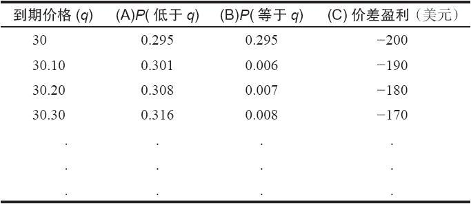

# 28.3　预期收益

有的投资者只有在历史部分对他们有利的时候才进入头寸。当投资者进入一笔交易时，他通常相信有可能盈利。例如，当买股票的时候，他会认为有“很大可能”股票会上涨或者公司收益会增加。投资者有可能有意识或无意识地对这种可能性进行估计。但是，投资者毫无例外的都是以对盈利的正面预期为基础的。因为期权的期限是固定的，相对于上面所说的靠直觉的评价来说，投资者对期权的预期盈利会进行更为严谨的计算。这种更严谨的方法包括对预期收益的计算。预期收益只不过是这个头寸在大部分情况中会产生的收益。

用一个简单的示例可以帮助解释这个概念。在计算预期收益中的一个重要的变量是列举出股票在未来某个时刻达到某一特定价格的概率。

表28-5　预期收益计算

【示例28-6】XYZ的售价是33，投资者想要知道XYZ在6个月时价格会是什么。假定XYZ在6个月内有20%的可能性会在30之下，有40%的可能性在35之上，最后，假定XYZ在6个月内有相等的10%的机会价格为31，32，33或34。为了简化起见，所有其他的价格都忽略。表28-5对这些假设做了总结。

因为总的百分比是100，从理论上来说，所有可能的结果都考虑到了。现在，假定2月30看涨期权的交易价是4，2月35看涨期权的交易价是2。买入2月30看涨期权并卖出2月35看涨期权就可以建立一个牛市价差。这个头寸的成本是2点，也就是说，它是2点的支出。如果XYZ在到期时在35之上，这个价差交易者就可以得到3点，也就是150%的收益。如果XYZ在到期时低于30，他就有100%的亏损。这个价差的预期收益可以通过将到期时每个价格的结果乘以在这个价格上的概率，然后将结果加在一起而得出。例如，如果XYZ在到期时低于30，价差交易者就亏损200美元。我们假定的是XYZ在到期时低于30的可能性是20%，因此，预期亏损是20%乘以200美元，或者说40美元。表28-6显示了所有这些价格的预期结果。总的预期收益是100美元。这就是说，预期收益（盈利除以投资）是50%（100美元/200美元）。这看上去是一个有吸引力的价差，因为价差交易者可以“预期”他的投资会有50%的收益（不计手续费）。

表28-6　计算预期盈利

这个示例真正计算的只是如果投资者历史上使用同一头寸反复投资时可以预期的长期收益。说一个具体的头寸有8%或9%的预期收益跟说普通股股票有8%或9%的长期收益没有什么区别。当然，股票的表现在牛市里要好得多，在熊市里要差得多。与此相似，这个有50%预期收益的牛市价差的示例在任何一种情况中都有获得最大盈利或100%亏损的可能。50%的预期收益是许多情况的总收益。根据数学理论，如果投资者反复投资在一个有正预期收益的头寸里，他赚钱的可能性就更高。

正如我们已经指出过的，为股票价格中的可能的结果选择什么样的百分比是一个关键的选择。在上面的示例里，如果投资者稍微改变一下他的假设，让XYZ在到期时低于30的机会等于30%，高于35的机会等于30%，那么，预期收益就会下跌很多，它就只有25%。因此，使用合理准确和一致的方法选择这些百分比是至关重要的。此外，上面的示例是过于简化的。它使用的收盘价全都是整数，没有类似32.50这样的分数价格。如果想要正确地计算出预期收益，那么就必须将这个股票的所有可能结果都考虑在内。

幸运的是，在计算某一给定股票在一个既定价格和一个既定时间段内的预期百分比概率方面，有一种直截了当的方法。这种计算方法涉及使用股票价格的分布。正如前面提到的，布莱克–斯科尔斯模型使用的是股票价格的对数正态分布，虽然今天许多设计模型的人使用非标准的（经验的或直观的）分布。无论是哪种分布，在分布曲线之下的任何两点之间区域的面积是在这两点之间的概率。

图28-1　典型的对数正态分布

图28-1是一个典型的对数正态分布的图形。顶部总是在分布的“均值”，或者说在平均数上。对股票价格的分布来说，在“随机游走”的理论里，“均值”一般被看作是目前股票的价格。有了这幅图形，投资者就可以将在任何一个价格点上的概率视觉化。应当注意，股票相对没有变化的概率相当大；股票价格不可能低于零；而且，在这幅图形中有看多的偏向（股票可以无限地上涨，虽然出现这种情况的可能性非常小）。

在随机游走的分布中，XYZ在这个时段的末尾低于均值的可能性是50%。这就是说，在图形上，在这个曲线之下的50%的区域在均值的左面，50%在均值的右面。注意一下图形上的“A”点。在图形上，在分布曲线下，有40%的区域在A点的左面，60%在A点的右面。这就意味着在这个时段结束时有40%的可能股票价格会低于“A”，有60%的机会它会高于“A”。因此，分布曲线可以用来决定计算预期收益所必需的概率。读者应当注意到这样的事实：这些概率适用于这个时段的结尾。对于在这个时段之内的时候，对XYZ的价格在“A”之下的概率是多少，它们一点也说明不了。要计算出这个百分率，必须要有相关的计算程序。

当波动率用标准差来表示时，这个分布图形的高度和宽度是由标的股票的波动率决定的。这同这一章前面所介绍的计算波动率的方法是一致的。当然，可以使用隐含波动率。因为使用期权模型的人一般感兴趣的时段不是1年，所以，一定要将所使用时段中的波动率转换为年化波动率。使用下面的公式很容易做到这一点：

式中　v——年化波动率；

t——按年计算的时间；

vt——该时间（t）中的波动率。

举例来说，一个3个月的波动率等于年化波动率的一半。在这个情况里，t等于0.25（1年的1/4），因此v0.25==0.5v。

我们为计算预期收益所必需的概率的计算提供了必要的基础。下面的公式计算了这样一个股票的概率，这个股票目前的价格为p，它在这个时段结束时在另一个价格q之下。这里用的是对数正态分布。

股票在时段t结束时价格低于q的概率是：

式中　N——累积正态分布；

p——股票目前价格；

q——既定价格；

ln——既定时段的自然对数。

如果投资者感兴趣的是在既定价格之上的股票价格，那么这个公式就是：

P（高于）=1-P（低于）

有了这个公式，使用计算机就可以很快计算出预期收益。投资者只需要从某个价格开始（例如，牛市价差中的较低行权价）一直到较高的价格（牛市价差中的较高行权价）。在两者之间的每一价格上，价差的结果乘以这个价格的概率，然后再累加起来。

简单地说，可以使用下面的迭代公式。

P（价格在x上）=P（低于x）-P（低于y）

式中y是接近但小于x的价格。一个示例可以是：

P（价格为32.4）=P（低于32.4）-P（低于32.3）

因此，一旦选择了低起点和决定了低于这个价格的概率，投资者只要使用上面的公式来迭代运算，就能够计算出高于这个价格的概率。在现实中，投资者是将这个信息同分布曲线结合起来使用的。如果想要的话，任何基本微积分中求积分近似值的方法，像梯形法则（Trapezoidal Rule）和Simpson法则等，都可以用在这里以求得更精确的结果。

下面是一个计算预期收益的典型示例。

【示例28-7】XYZ目前的价格是33，它的年化波动率是25%。按前面的示例建立一手价差：买入2月30看涨期权，卖出2月35看涨期权，支出为2点，这些都是6个月的期权。表28-7为计算预期收益提供了必要的组成部分。列（A），也就是价位在价格q之下的概率，是根据前面所给的公式计算出来的，其中p=33，vt=0.177（=）。第一个需要看的股票价格是30，因为在这个价格之下，这个牛市价差的所有结果都相同：价差会100%亏损。对从这个价格起一直到35之间的每个0.1点的价格进行计算。预期结果是将右面两列（B）和（C）相乘，再将结果相加而计算出来的。请注意，列（B）是将列（A）的相邻的数字相减而得出的。将这个示例演绎到底并没有特别大的意义，因为计算的其余部分同这里列举的相似，而且数目很大。

表28-7　计算预期盈利

从理论上说，如果投资者有足够的数据和功率足够大的计算机，他就可以每天对大量的策略进行评价，以预期收益为基础，选出最好的头寸。他或许会买入一些期权（看跌期权或看涨期权），一些牛市价差，一些裸卖出和比率跨期价差，少数几手跨式价差和卖出比率，以及若干卖出备兑看涨期权。这个理论要付诸实践是有困难的，因为涉及巨大数量的计算，也因为收盘价数据的准确性。我们在前面提到过，计算机所假设的是实际上有得到“不好的”收盘价的可能。这里说的“不好的”收盘价，指的是在这一天的后半段，期权并没有与股票同时进行交易，实际的期权市场在价格上同该期权收盘时所反映的价格有区别。将一个合约的日成交量进行“筛选”可以帮助减轻这个问题。例如，如果这个期权在前一天没有达到事先规定的最小成交量，投资者可以在他的计算中将这个期权剔除。如果为每一个期权都提供买报价和卖报价的数据，那么代价要大一些，不过结果会更可靠，而且可以减轻“不好的”收盘价所造成的麻烦。除了成交量筛选之外，另一种减少计算数量的方法是把策略限制在投资者感兴趣的范围内，或者是那些他有理由相信同他的投资目标相符的策略。不管投资者在计算数量上加以什么样的限制，还是需要有相当的计算机功率来计算预期收益。一个精密的可编程的计算器有可能提供即时的计算，可是永远无法用来对整个期权市场进行评价，对每天的有利的情况进行排序。网上也有使用即时价格进行这种类型计算的计算机程序。虽然即时价格有时会有帮助，但它们不是绝对必要的。

计算预期收益的另一个副产品是它可以用来作为另一种预测期权理论价值的模型。投资者需要做的只是计算出在期权到期日时在行权价之上的每个相邻价格的概率，然后将它们加起来。这个结果就是期权的理论价值。有的服务商提供这些数据，这些数据一般提供了与布莱克–斯科尔斯模型不同的理论价值。出现这样的区别的原因是布莱克–斯科尔斯模型包括了无风险利率，而预期收益模型中则没有。
