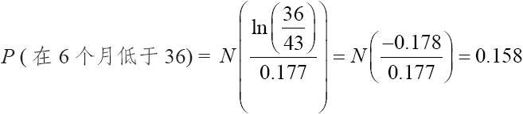
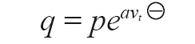
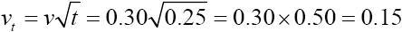
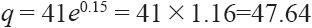
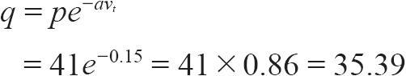
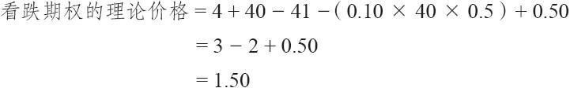

# 28.4　将这些计算用到策略决定中

### 28.4.1　卖出看涨期权

我们在第2章中介绍的将卖出看涨期权进行排序的一个方法，就是根据不亏损的概率来将所有至少能够提供最低可接受的收益水平进行排序。如果投资者对安全感兴趣，他也许会决定采用这种方法。假定他决定考虑所有年化总收益（资本收益、股息和手续费）至少是12%的卖出看涨期权，那就会取消许多潜在的卖出看涨期权，但是他每天还是有大量的可以使用的卖出看涨期权。他知道每个卖出看涨期权的下行盈亏平衡点。因此，可以很快算出在到期时股票低于这个盈亏平衡点的概率。最后卖出名单会把那些在到期时最不可能低于盈亏平衡点的卖出看涨期权列为最好的。同样地，这个排序是以预期概率为基础的。而且毫无疑问，没有人能担保股票在现实中不会低于盈亏平衡点。不过，在长期中，这样的名单应当能够提供最为保守的卖出看涨期权。

【示例28-8】XYZ的售价是43，6个月的7月40看涨期权的售价是8点。在包括了股息和1个500股股票头寸的手续费成本之后，在到期日的下行盈亏平衡点是36。如果XYZ的年化波动率是25%，那么就可以计算出在到期时有钱可赚的概率。6个月的波动率是17.7%（25%乘以0.5年的平方根）。使用这一节前面提供的公式，可以计算出价格低于36的概率：

XYZ在6个月里价格低于36的预期概率是15.8%。因此，这就是一个有吸引力的保守策略，因为它赚钱的概率很大（即会有85%的可能性价格在到期时不会低于盈亏平衡点）。这个示例里的行权时收益按年化计算大约为20%，因此，从盈利的角度看，它也是可以接受的。有计算机的帮助，对所有卖出备兑的候选对象进行类似的计算，是一件简单的事。

能够使用一个共同的分母（波动率）对下行方向的保护进行衡量，在其他类型的卖出备兑看涨期权的分析中也有用。卖出一个有较高盈利潜力的虚值看涨期权的投资者也会对了解他下行方向的保护感兴趣。例如，他也许决定想要在一个盈利可能性是60%的情景中投资。这不是一个很难实现的要求，因此会有许多有吸引力的、高潜在盈利的卖出看涨期权策略可供选择。用成功的概率来表述对下行方面的要求消除了不得不强加的主观的要求。典型的主观要求是，只使用卖价为1点以上的看涨期权，或者是下行的保护必须是股票价格的一定百分比等。对有着不同波动率的股票来说，这些显然是不够的。下行保护的标准应是用“下行保护的概率”来表述，或者用波动率自身来表述。按照这种方法，在高波动的和波动率中等的股票之间就可以进行统一的比较。

### 28.4.2　买入看涨期权

期权的买家也可以建设性地使用对波动率的衡量来帮助他做出买入期权的决定。在第3章里我们证明了，以标的股票波动率为基础来评价看涨期权的盈利能力是分析买入期权的正确方法。这里要介绍一种具体的分析方法。在这个分析中，某些变量可以修改，以配合看涨期权买家的具体需要。不过，总的逻辑对所有的情况都适用。

第一步，投资者应当用一致的股票运动来对买入看涨期权进行排序。投资者可以决定根据当标的股票随着它的波动率而上涨时它们会如何表现，来对所有的买入看涨期权策略进行排序。我们必须对“随着它的波动率”这个说法作一限定。例如，投资者决定采用所有的股票都会向上运动1个标准差，然后根据这个假设将所有的买入看涨期权策略进行排序。想要买入看涨期权的投资者还必须有一个固定的持有期。一般而言，投资者的持有期为30天、60天或90天。

分析盈利能力和风险的具体步骤如下。

（1）根据波动率，限定标的股票的向上或向下的运动距离。

（2）选择分析所针对的持有期。

### 28.4.3　盈利能力

（3）根据上面的假设，计算股票将向上运动到的价格。

（4）使用类似布莱克–斯科尔斯模型之类的定价模型，对期权在股票完成向上运动之后会有的价格进行估计。

（5）计算扣除手续费之后的百分比盈利。

（6）对这个股票所有的期权都重复第（4）步和第（5）步。

在对所有的股票都进行了第（3）步到第（6）步的操作之后，根据它们的百分比收益将这些买入看涨期权的策略进行排序。

### 28.4.4　风险

（7）在运用了第（1）步和第（2）步的假设之后，计算股票有可能跌到的价格。

（8）使用一个模型，计算股票下跌后的期权价格。

（9）计算扣除手续费之后的百分比亏损。

（10）计算收益/风险比率：用第（5）步得出的百分比盈利除以第（9）步得出的百分比风险。

（11）对这个股票所有的期权都重复第（8）步到第（10）步。

对所有股票都进行第（7）步到第（11）步的操作，然后根据它们的收益/风险比率进行排序，这样就可以建立一个不是那么激进的买入期权策略的最终排序名单。

较高盈利能力的买入期权策略的名单往往是那些平值的或略为虚值的看涨期权。根据收益/风险比率排序的没有那么激进的名单，往往是实值的看涨期权。

【示例28-9】第1步和第2步，假定一个投资者想要买入一个持有期为90天的期权，这里的假设是，每个股票在这段时间内都将向上移动1个标准差。（在给定的时段里，股票在某个方向上运动大于1个标准差的可能性只有16%。因此，在实践中，投资者在他的排序计算中可以使用较小的股票运动。）此外，假设以下数据是已知的。

XYZ普通股股票：41

XYZ年化波动率：30%

XYZ 1月40看涨期权：4

离1月期权到期的时间：6个月

第3步，计算股票向上的潜力。这是通过使用下面的公式来实现的：

注：原文为q=peavt，疑有误。——译者注

式中　p=当前股票价格；

q=潜在股票价格；

vt=在时段t中的波动率；

a=一个常数，见下述。

常数a和t是根据第1步和第2步的假设而确定的。第一个常数a是可以出现的运动的标准差数量。在我们的示例里，a=1。这就是说，这个分析所用的假设是股票只能向上运动1个标准差。第二个常数t是0.25，因为这里分析的是一个90天的持有期，也就是1年的25%。在这个示例里：

因此

因此，如果在90天内刚好运动1个标准差，这个股票就向上运动到将近47.64。

第4步，使用布莱克–斯科尔斯模型，可以对XYZ 1月40看涨期权定价。如果XYZ在47.60，而且这个期权的存续期少了90天，它的价值就大约为8.10。

第5步，计算潜在盈利。这个示例没有考虑手续费，但是，在现实的情况中，应当将它们包括在内。

百分比盈利=（8.10-4）/4=4.10/4=103%

因此，如果XYZ在今后90天内向上运动1个标准差，这个看涨期权预期会有的盈利就是103%。再回顾一下，股票实际上运动到这么远或者比它更远的可能性只有大约16%。不过，如果所有股票的所有期权都在同样的假设下进行排序，那么就可以对有盈利的期权进行合理的比较。

第6步从这个示例里省略掉了。它是基于XYZ在90天之后的价格是47.60的价差，对所有其他的XYZ期权进行相似的盈利分析（第4步和第5步）。

第7步，计算XYZ会下跌到多深。用来计算股票下行方面的可能性的公式与用来计算股票上行方面的可能性的公式是相同的：

如果下跌1个标准差，XYZ在90内将下跌到将近35.39。请注意，XYZ可能上涨和下跌的实际距离是不同的。上行的潜在距离是6.60点，而下行的潜在距离则是5.75点。造成这个区别的原因是使用的是对数正态分布。

第8步，使用布莱克–斯科尔斯模型，投资者可以估计，如果XYZ在90天后的价格是35.39，那XYZ 1月40看涨期权的价值就是1.10。

第9步，1月40看涨期权的潜在风险是：

百分比风险=（4–1.10）/4=2.90/4=73%

第10步，收益/风险比率只是用百分比收益除以百分比风险：

收益/风险比率=103%/73%=1.41

第11步，对所有XYZ的期权都进行这个分析，然后，对所有有期权的股票进行这个分析。按照它们的收益/风险比率对没有那么激进的买入看涨期权策略进行排序。比率越高，策略就越有吸引力。对更为激进的买入策略的排序所依据的只是它们的潜在收益（第5步）。

这就完成了买入看涨期权的示例。在结束这一节之前，应当指出，对买入策略中，假设标的股票运动了整整1个标准差之后才进行排序也许有些过分。比较中庸的假设是股票或许会运动0.7个标准差。在一个固定时段的结尾，有25%的机会股票会向上运动至少0.7个标准差。

### 28.4.5　看跌期权的定价

给看跌期权定价的理论模型是推导出来的，也就是说，它们同为看涨期权定价的模型是分开的。布莱克和斯科尔斯在他们最初的论文里展示了这样一个模型。不过，正如我们已经说明的，在场内期权市场里，由于转换和反转组合策略，看跌期权同看涨期权之间有一种相互关系。

如果投资者假设价差交易者会通过转换而有效地影响市场，那么，为了给看跌期权定价，他也可以使用基本的看涨期权定价模型。理论家会争辩说，这样的定价方法是假设始终有高效率的套利交易存在，可是这并不是事实。如果投资者想要决定这个看跌期权的定价过高或过低的精确性质，那么，这个“转换有效性”的假设就有可能是一个严重的缺陷。不过，如果投资者只是将各种不同的看跌期权策略在性质相同的假设上进行比较，那么，看跌期权定价的套利模型就能起到很好的作用。

可以使用看涨期权定价模型和套利公式来估计场内看跌期权的价格。读者应当还记得，套利交易者必须将持有这个头寸的成本和将要收到的股息考虑在内。

看跌期权理论价值=看涨期权理论价值+行权价-股票价格–持有成本+股息

“看涨期权理论价值”是通过布莱克–斯科尔斯模型得到的。持有成本是资金（利率）乘以行权价，再乘以离到期的时间。读者应当还记得，这是计算持有成本的近似公式（见第27章关于现值和复利的评论）。因此，如果XYZ是41，6个月的1月40看涨期权按照布莱克–斯科尔斯模型计算出的价值为4点，那么，就可以估计出这个看跌期权的理论价值。假定资产利率成本为每年10%，股票的6个月（t=1/2年）内会支付50美分的股息。

这就意味着，如果看涨期权可以卖到4点，套利交易者就愿意为这个看跌期权付1.50点来建立一手转换组合。套利交易者的价格被用来作为场内看跌期权估计的理论价格。

### 28.4.6　买入看跌期权

买入看跌期权的排序可以按照前面所介绍的为买入看涨期权排序所采用的非常相似的方法。当股票随着它的波动率而下跌时，就会出现盈利的机会。股票向上的运动对看跌期权的买家来说代表了风险。前面一节中在买入看涨期权策略中所采用的11个步骤全都适用于买入看跌期权的策略。第4步和第8步所必需的看跌期权的定价是根据刚才所展示的价差模型而得出的。

如果一个标的股票没有场内看跌期权交易，那就可以考虑合成的看跌期权。虽然所有在美国上市的股票在每个行权价上都既有看涨期权也有看跌期权，在权证中，特别是在国外，还有一些情况可以用到下面的讨论。回顾一下，合成看跌期权是有些经纪公司为客户创造出来的。经纪公司卖空股票，同时买入看涨期权。客户可以根据所涉及的风险数量以及标的股票要付的股息来买入合成看跌期权。除了不含持有成本之外，用在买入期权策略分析中第4步和第8步的合成看跌期权定价公式同场内看跌期权的套利公式是完全一样的：

看跌期权理论价值=看涨期权理论价值+行权价-股票价格+股息

在进行排序分析的时候，很少有合成看跌期权看上去是有吸引力的买入策略的候选对象。这是因为，当客户买入一手合成看跌期权的时候，他必须事先付出股息的全部成本，但是在卖空股票头寸上所得到的收入里，得不到任何降低成本的对冲。因此，相对而言，比起场内看跌期权来，合成看跌期权总是更加昂贵。不过，如果投资者对某个没有场内看跌期权的股票特别看空，那么，合成看跌期权仍然是有价值的投资。这里所建议的分析可以使他对这个投资的潜在收益和风险有所感受。

### 28.4.7　跨期价差

定价模型可以帮助决定什么样的中性跨期价差最具吸引力。读者应当还记得，在一个中性跨期价差里，投资者卖出一手短期看涨期权，同时买入一手较长期的看涨期权，建立头寸的时候，股票价格相对接近这些看涨期权的行权价。这个价差的目的是捕捉两个期权在因时减值方面的差异。中性跨期价差一般在短期期权到期时平仓。定价模型可以帮助价差交易者对价差的潜在盈利进行估计，同时帮助确定在短期期权到期时这个头寸的盈亏平衡点。

要确定这个价差的最大潜在盈利，假定短期看涨期权无价值到期，并且使用定价公式对较远期期权在股票价格刚好等于行权价时的价值进行估计。因为在价差交易中手续费相对较高，因此，最好是在计算中把手续费考虑进去。计算第2种潜在盈利（无变化时的盈利）有时也有用。要计算如果股票价格在期权到期时没有变化，这个头寸会有多少盈利，假定这个价差平仓时那手短期看涨期权的价值等于它的内在价值（如果股票当时低于行权价就等于零，如果股票在建立头寸的时候高于行权价，就等于股票价格同行权价之间的差价）。然后使用定价模型来估计当股票价格没有变化时那手较远期看涨期权的价值，这个期权这时仍然有3到6个月的存续期。由此产生的在短期看涨期权的内在价值和较远期看涨期权的估算价值之间的差额就是对这个价差平仓时的价格的估计值。当然，这里的盈利就是这个差额减去目前的（最初的）差额，再减去手续费。

在前面对跨期价差的讨论中，我们曾经指出过，在短期期权到期时，有一个上行方向的盈亏平衡点，还有一个下行方向的盈亏平衡点。使用定价模型，可以估计出这些盈亏平衡点。方法之一涉及对价差在相邻股票价格上的平仓价值进行估计。如果发现了与初始价值相等的平仓价值，再加上手续费，这就是盈亏平衡点。

【示例28-10】如果我们的价差使用的是行权价30，投资者可以从价格30开始计算盈亏平衡点。对价差在股票价格为30，29.90，29.80和29.70等价位上的平仓价值进行估计，直到发现盈亏平衡点。一旦通过这种方式找到了下行方向的盈亏平衡点，从行权价开始再迭代推演上行方向的盈亏平衡点。因此，投资者就会对股票价格在30，30.10和30.20等价位时的平仓价值进行估计。这种方法在某种程度上来说相当耗神费力，不过，有计算机的帮助它还是相当快的。如果采用更为复杂一些的迭代程序，那还可以减少需要计算的次数。

有了定价模型的帮助，还可以得到最后一项有用信息：价差的理论价值。重新计算短期和较远期看涨期权在当前时间和股票价格上的估计价值，在标的股票上使用隐含波动率。由此产生的在两个看涨期权的估计价格之间的差额可能会同实际的差额有很大的区别，或许会因此突出这个跨期价差的吸引力。投资者应当建立这样的价差，其中理论的差额大于实际的差额（也就是说，他应当买入“便宜的”跨期价差）。

一旦经过计算得到了这些信息，策略家就可以根据他的选择标准对价差的机会进行排序，找出最好的候选对象。对价差进行排序的逻辑方法是根据它们的无变化时收益。在短期到期日有最高无变化时收益的价差，是那些股票价格和行权价一开始就很接近的价差，这是中性跨期价差的基本要求。更复杂的排序体系应当包括价差的理论价值，或许甚至可以包括价差的最大潜在盈利。当然，类似的分析也可以用来判断看跌期权跨期价差，这时需要用到看跌期权的套利定价模型。

### 28.4.8　比率价差

比率价差涉及卖出裸期权。因此，策略家有很大的潜在风险，不管是在上行方向、下行方向，或者是两个方向上都有。他应当尽量认识到这种可能性。确定股价在未来某个时间高于或低于特定价格的概率的公式，可以给他提供所需要的这些概率。例如，在一个卖出跨式价差的情况里，策略家会想要计算出最大潜在盈利、无变化时收益、在上行盈亏平衡点或上行行动点的质押要求（在相反的股票运动中对裸期权的质押要求会增加），以及盈亏平衡点自身等。他也可以计算出在到期时高于上行盈亏平衡点或低于下行盈亏平衡点的概率。此外，在这个头寸上他还可以进行预期收益的分析，以决定这个头寸同其他股票上的同一类型的其他所有头寸相比，它的总盈利情况如何。这样的预期收益分析不必假设头寸会一直持有到到期日。不必付或付很少手续费的公司交易者也许会有兴趣看一看在一个短到30天或者更短的时段内，持有这个头寸的预期收益会如何。假设他们由于手续费的关系不会交易得那么频繁，公众客户可以使用更长的持有期。对比率价差的排序应当基于无变化时收益或者预期收益。

这里介绍的对跨期价差和比率价差头寸的分析不应当被看作是一成不变的真理。在上面所说的这种形式的分析里，策略家是在预测未来的期权价格和股票价格，他的前提是标的股票的波动率保持不变。虽然在某些情况中事情也许确实是如此，但是，很多情况下，在持有这个头寸的这段时间里，标的股票的波动率会发生变化。如果波动率下降，跨期价差的预期盈亏平衡点就会大大偏离行权价。因此，在某些价位上，虽然价差交易者预期会有盈利，但实际上出现了亏损。如果波动率上升，比率头寸的预期收益就会下跌，因为股票运动到盈利范围之外的概率会增加，因此亏损的概率也会增加。

从理论上说，在头寸建立之后仍然可以通过每天继续监控这个头寸，来抵消波动率的变化的影响。例如，在一个卖出跨式价差中，如果股票开始急剧运动，预期收益就会变得非常低。如果发生这样的情况，投资者可以对头寸做出调整，以改进这个头寸。对公众客户来说，这样的监控是很难付诸实践的，因为如果不断地对头寸进行调整，手续费很快就会累积起来。没有什么确定的方法可以用来对头寸进行偶尔的、阶段性的调整。不过，通过使用后续行动分析，公众客户有可能更好地把握调整一个头寸的时机。例如，假定一个投资者最初在股票价格为30时卖出了一个5点的跨式价差，过了一段时间，股票价格到了34。对一个5点的、行权价为30的、在股票价格为34的时候建立的、距离到期日更短的跨式价差，也可以计算出它的预期收益来。如果预期收益是负值，那么就需要进行调整。采取这种形式的调整可以将交易的次数保持在最小的范围内，同时策略家仍然有可能发现他的头寸在什么时候失去了恰当的平衡。当然，投资者将使用当前的波动率来做出这些决定。在这一章的后面我们将讨论另一种后续监控的技术，也就是使用期权的delta，我们在前面已经好几次介绍过这种技术。
