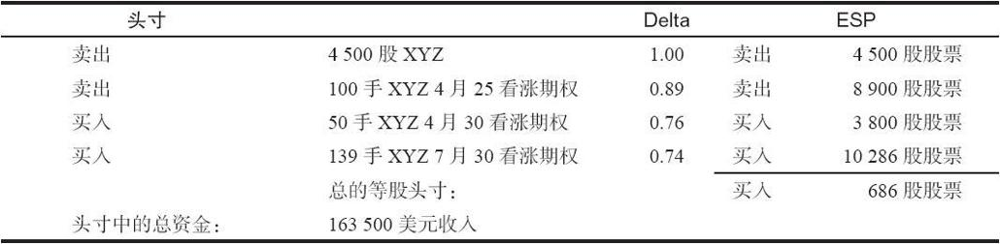
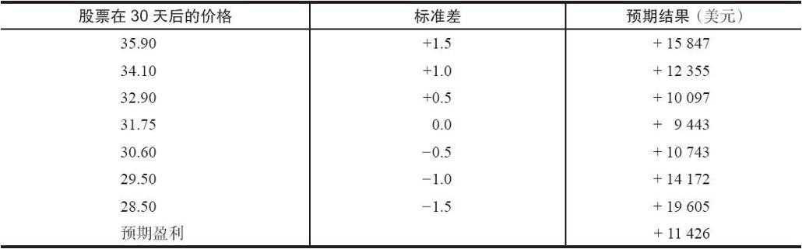

# 28.6　对后续行动的帮助

在监控头寸方面，计算机可以对策略家提供无价的帮助。策略家一般来说必须要有某种办法将他的头寸输入到一个储存数据库里，同时也必须有某种方法辨认出组合在同一交易头寸中的不同证券。一旦做到了这一点，计算机就可以同时读取定价数据（即时价格或者收盘价）和储存在数据库中的数据，以产生同所有头寸现有状况相关的信息。

及时的逐日盯市（盈亏）显然是有用的，它可以帮助交易者看到他在每一天的交易情况。计算机也很容易给交易者提供一组同他相关的警告，生成一份综合名单，其中包括那些可能需要采取行动的头寸。这是大部分策略所需要的，事实证明，策略家应当尽量避免提前指派。他需要计算出所有卖空头寸中剩下的时间价值，如果时间价值所剩无几（也许是0.10点或者更少），计算机就应当对交易者发出警告，这对计算机来说很简单。同样，交易者在临近到期的期权头寸（也许是离到期不到1个月）方面每天也应当有一份名单。就这个目的而言，因为快要到除息日而对交易者发出警告也是有用的。

如果交易者在数据库中输入另一则信息，计算机可以在采取另一种后续行动方面为他提供帮助。在我们介绍过的大部分策略里，特别是那些涉及未备兑期权的策略，交易者都会想根据标的股票的运动而采取某种后续行动。如果股票上涨很多，他也许想买回卖出的看涨期权或者买入其他的看涨期权作为保护。如果股票下跌过多，同样的操作也可以用在看跌期权上，或者是将卖出的看涨期权向下挪仓。如果交易者把股票价格输入到他想要采取的行动的策略中，计算机就能够逐日监控股票的收盘价，并且产生一份头寸名单，这些头寸已经在上行方向或下行方向超出了应当采取行动的价格点位。

计算机还可以对更为精密类型的头寸进行监控。回顾一下，我们曾经指出过，可以将一个头寸中涉及的期权的delta互相比较，以决定这个头寸究竟是看多的还是看空的。布莱克–斯科尔斯模型可以用来计算交易者头寸中期权的delta。然后计算机就可以决定净头寸是多少，因此告诉交易者他的头寸已经变成“买入delta”（看多的）、“卖空delta”（看空的），或者是中性的。如果他看到头寸是看空的，而他并不想他的头寸有这样的结构，那么，他就可以做出某些看多的调整。尽管所有更为复杂的卖出跨式价差和卖出受保护的跨式价差头寸都可以用这样的方法来进行有用的监控，delta价差和中性价差非常适合使用这种类型的后续行动。

决定一个头寸是净空头还是净多头的计算一般涉及计算“等股头寸”（equivalent stock position，ESP）。如果投资者拥有10手delta为0.45的看涨期权，他在这些看涨期权中的等股头寸就是10×100（每手期权合约所代表的股份数）×0.45=450。这就是说，根据它们的delta，持有这10手看涨期权等于持有450股标的股票。所有的看跌期权和看涨期权都可以简化为等股头寸，它们也自然可以同头寸中实际买入或卖空的股票结合在一起，产生整个头寸的等股头寸。由此产生的交易者每个头寸的等股头寸连同上面所说的那些项目都可以用计算机打印出来。

投资者还可以使用更复杂的方法。计算机可以产生一份到期日时的头寸结果表格。如果想要的话，这样的数据还可以用图表来表达，不过并没有这种必要。正如本书的示例所显示的，表格就足够了。只有在所有的头寸都同时到期时，这样的图表才有意义。如果不是这样，那么交易者就可以让计算机产生一个显示短期期权到期时结果的表格或图表。例如，在一个跨期价差中，交易者可以看到在将这个差价头寸平仓的时候他将面临什么样的盈利能力。

最后，计算机还可以为已持有的头寸计算出预期收益。这样，交易者对这个头寸就有一个更为动态的画面，而且这个预期收益通常是针对一个相对短的时段的。这个时段也许是30天或者是到期之前剩下的时间，这取决于哪个时段更短。对这个预期收益的计算同这一章前面所介绍的对预期收益的计算是相通的。第一，投资者使用股票的波动率来构建一个价格范围，使用这个价格范围来考察这个头寸。第二，投资者使用布莱克–斯科尔斯模型来计算这个头寸中的各种期权在未来某个时刻和各种不同股票价格上的价值。计算机程序用表格形式来展示一定的计算结果。正如上面介绍的，将股票在每一个价格上的概率同这个头寸在这个价格上的结果相乘，再将这些乘积相加，就可以得出预期盈利。再用预期盈利除以预期投资，就得到预期收益。因为保证金计算需要相关的计算机程序，所以这里忽略了这个最后的步骤，只是考察预期盈利。这对我们在这里的目的来说，已经足够了。下面的示例说明的是计算机所显示的在30天后一个头寸、等股头寸、到期时盈利和预期收益看上去会是什么样子。这是一个复杂的头寸，选择它的目的是要展示这些分析的价值。

【示例28-16】当XYZ为31.75时有下列的头寸存在。这个头寸本质上是和一个卖出反向比率价差（reverse ratio write）结合在一起的一个后式价差。它同一个买入跨式价差很像。其中，如果股票在到期日运动的幅度足够大的话，在上行或者下行方向潜在盈利就会增加。一开始的时候，计算机应显示出这个头寸和等股头寸。

使用等股头寸的优势是可以将这个相当复杂的头寸简化为一个单独的数字。整个头寸同买入686股普通股股票相等。对这样一个大头寸来说，它本质上接近于delta中性。计算机应当展示的下一项是这个头寸目前的总收入或支出。有了这个信息，如果可能的话，就可以绘制出到期日时的图形。在这个头寸里，因为有4月和7月期权的组合，所以无法画出一幅限定在一个到期日的图形。计算机应当画出的是一幅以4月到期或者更近的日期为基础的图形。

假定现在离4月到期日还有些距离，因此，计算机画出的是30天之后的图形。为了做到这一点，计算机使用这个股票的波动率来预测未来30天的价格。在下一个表格里显示了7个价格：它们分别代表了沿着这个股票的分布曲线上的7个点位，分布在从当前股票价格开始的-1.5个标准差到+1.5个标准差的运动轨迹上。这7个点自然没有包括股票价格的所有可能运动，不过，这是一个有代表性的样本。

显然，这个头寸在过去有过一些盈利的调整。这一点在这里并不重要，因为交易者只对将来感兴趣。如果这个头寸目前的逐日盯市价值超过11426美元，那么，他就应当考虑将这个头寸平仓，因为它的盈利已经超出了预期盈利。
