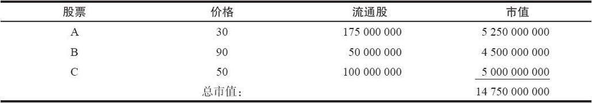
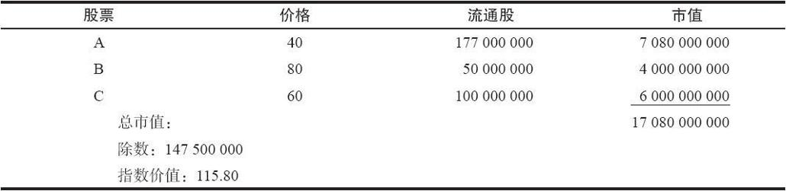
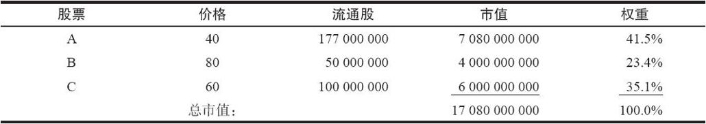
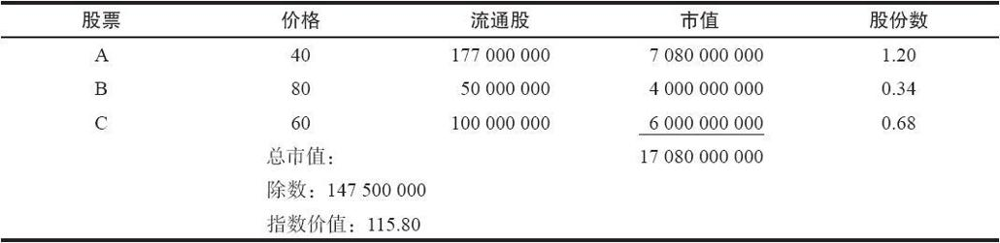
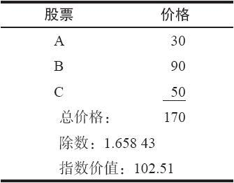
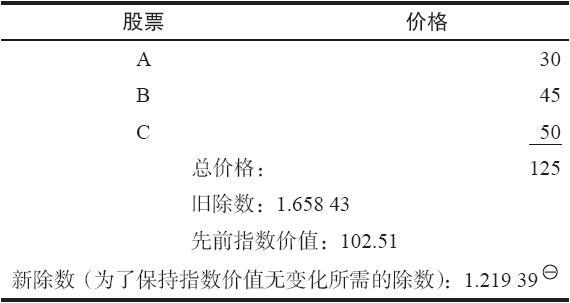

# 29.1　指数

因为许多现金交割期权或期货期权都以股票指数作为标的，因此，理解指数是如何计算的，对于投资者了解指数中的某一只股票的运动如何影响这个指数的总价值，是有帮助的。有期权交易的指数一般是股票指数，也就是说，构成这个指数的要素是股票。计算股票指数有两种主要的方法：市值加权和价格加权。

### 29.1.1　市值加权指数

一只股票的市值（capitalization）是它的证券在当前市场价格上的总价值。它是发行（流通）的股份数量和当前股票价格的乘积。在一个市值加权的指数中，需要计算所有股票的市值，并把它们加在一起得到这个指数的总市值。指数中每一股票的价格乘以这一股票发行的总股本（流通股），然后计算它们的总和。最后，这个总和被一个称为“除数”（divisor）数字所除，得到最终的指数价值。举一个示例可以帮助说明计算一个市值加权指数的价值这个概念。

【示例29-1】假定有一个指数，它包括了三种股票，这些股票的价格和流通股列举在下面的表格里。表格中也包括了价格和流通股的乘积（市值）。

大多数指数都会使用一个除数，因为直接说这个指数收盘收在14750000000，并不是一种聪明的做法（例如，想象一下怎样用这么大的数字来给道琼斯指数报价）。这个除数通常是一个任意的数字，最初用来将指数价值简化到一个使用方便的数量。在建立指数的时候，除数的设定也有可能只是为了使得指数一开始的时候是一个整数。假定在上面的示例里我们想要指数的（由既定价格和流通股所代表的）最初价值为100.00。那么，我们就会将最初的除数设定为147500000。这样，这个指数的总市值除以这个除数，得出的价值就是100.00。

在指数的成分股发生变化时，可以通过改变指数的除数来保持这个指数价值的连续性。请注意，当股票分股时，除数并不需要变化，因为价格自动向下调整的幅度等于该股票流通股所增加的幅度。注意一下上面的示例，如果股票B有2对1的分股，那么它的价格就会是45（90÷2）。而它的流通股就会从5000万股翻倍到1亿股。而股票B的市值仍然保持不变，还是4500000000美元。

不过，如果一只股票改变了它的市值而这种变化不会自动在价格中得到调整，那么这个除数就必须有所改变。例如，一个公司有可能增发股票（这样的事件不会导致股票价格在市场中自动发生调整）。为了保持在增发股票这一天和增发股票的前一天之间指数价值的连续性，就需要改变这个除数以保持指数有同样的价值。考虑一下下面的示例。

【示例29-2】使用前面的那个指数的示例，假定在某一天收盘时是有下面的价格：

现在，假设股票A当天傍晚增发了200万股，它的流通股就变成了1.77亿股。这样的变动会让指数的价值发生下列的变化：

不过，如果市场实际上没有变化，那么将指数的价值从115.25改为115.80没有什么意义。如果投资者认为由于增发，股票A的价格一定会下跌，那么完全可以这么做。但是，投资者态度的这种变化会随着股票价格的下跌而反映在指数的价值中。因此，为了在增发之后的第2天早晨使得指数的价值保持一致，必须改变除数以反映股票A多出来的200万股。这个新的除数等于新的市值（17080000000）除以旧的指数价值（115.2542373）。这样就产生了新的除数：

新的除数：148194117.6

正如上面的示例所表明的，一个市值加权的指数的除数有可能经常在改变。幸运的是，有负责维持指数及时反映市场情况的组织。每到需要改变的时候，他们都会对这个除数进行计算。因此，投资者如果需要知道什么是最新的除数，通过打电话或者访问相关的网站，一般就可以找到这样的信息。这比全靠自己去跟踪所有东西要便捷得多。

在市值加权的指数里，市值最大的股票在指数中的权重最大。这就意味着一个包含有巨额市值股票（像IBM、美国电话电报公司、通用电气、埃克森和通用汽车公司）的指数就被这些股票所左右。例如，标普500指数（S&P 500）按股票的数量（500）而言，是最大的市值加权指数之一。可是，在这个指数里，IBM的市值如此之大，它占了整个指数的5%。显然，在标普500指数中还有不少股票的权重几乎是无足轻重的。为了计算一只股票在这个指数所占的权重，只需用这个股票的市值去除以指数的总市值。使用前面的示例，我们可以看出这个权重是如何计算出来的。

关于指数另一个需要知道的有趣的统计数据是这个指数包含了每一只股票多少的股份数。在一个市值加权的指数里，每一只股票的股份数是用这只股票的流通股数除以指数的除数而得到的。在上面的和一个示例里，下面的表格显示了这个指数包含了每一种股票的多少股份数。

因此，如果股票A上涨1点，那么，整个指数的价值就会上升1.20点，因为在这个指数中有1.2股的股票A。你可以看得出计算这样一个统计数字的价值：它可以让你很容易看出，在一个交易日里每只成分股的运动是如何影响这个指数的运动的。在股票暂停交易而指数继续交易的情况里，这个信息特别有用。

【示例29-3】假定在上面的指数里，股票C暂停交易。在这个指数里有0.68股的股票C。假定股票C的价格预期要降低3点，但这个指数当前的交易价和前一天晚上的收盘价相比没有变化，因为股票A和股票B的价格这一天都没有变化。如果投资者想要给这个指数的期权定价，假设他使用这个指数当前的价格，那就错了。因为只要股票C开盘，指数价格就会有变化。不过，这并不要紧，因为投资者可以容易地看出，如果股票C开盘时下跌3点，那么，整个指数就会下跌2.04点（3×0.68）。因此，投资者在给这个期权定价时应当假设这个指数的交易价已经下跌了2点。当然，这一类预测的前提是知道股票C在这个指数里有多少股份数。

在试图预测一只股票对一个指数的长期效果时，还有一种相似的分析相当有用。如果你认为股票C可能会上涨30点，随后，你可以看到，这将导致指数上涨20点。知道了这样的相互关系，基于这样的假设，有时股票期权和指数期权之间的期权价差就会出现获利机会。

应当注意，股票在市值加权指数中的股份数不是每天改变的，因为它不是取决于指数中股票的价格。不过，每只股票在指数中所占的权重确实是每天随着价格的变化而变化。因此，股份数是一个更稳定的跟踪数据，同时，也是可以更直接使用的、在股票价格发生变化时能够预见到指数价值的数据。

市值加权指数是最通用的指数，大多数投资者都熟悉若干种这样的指数：标准普尔500指数、标准普尔400指数、标普100指数（也用它的代码来称呼：OEX）、纽约股票交易所指数以及美国证券交易所指数等。

### 29.1.2　价格加权指数

价格加权指数所包括的每一只成分股在指数中的股份数都是相等的。价格加权指数的计算是将指数中各只股票的价格加在一起，然后除以一个除数，以得到指数的价值。同样，除数最初也是一个任意的数字，用它来产生一个想要的最初的指数价值（例如，像100.00这样的数值）。我们用上面使用过的同样的3只股票来构建一个价格加权指数。假定在建立这个指数时的除数是1.65843。

和市值加权指数不一样，当交易所对股票价格进行调整时（就像在股票分股或分发股票股息的情况里），就需要改变这个除数。但是，当公司增发股票时，则不需要调整。也就是说，价格加权指数中的除数在股票的价格调整时会发生变化，但是在股票的市值发生变化时则不需要调整。

如果某只股票在增发中发行新股票，交易所不会自动对该股票的价格向下调整。因此，所有包含这只股票的价格加权指数的除数都不会发生变化，因为交易所没有调整这只股票的收盘价。

不过，在上面的示例里，如果股票B有2对1的分股，交易所就会将它的收盘价从90调整到45。甚至在市场开盘之前，这只股票在价格加权指数中的总股数就会发生变化。因此，需要改变除数来反映这个分股。下面的示例总结了在股票B 2对1分股之后所发生的情况。

计算这个新除数是用新的价格总和125去除以原来的收盘价102.51。因此，整个除数减小了，以产生出相同的指数价值（102.51），尽管指数中的价格总和现在是125而不是先前的170。请注意，这个新除数和旧除数之间没有依赖关系。

我们在市值加权指数中寻找的另一个统计数据是每只股票在指数中的股份数。在价格加权指数中，这个指数中所有股票的股份数都是相同的，这个数量等于1除以指数的除数。在上面最后的那个示例里，除数等于1.21939[1]。在这个指数中，每只股票有1/1.21939股，或者说0.82股。因此，任何股票在既定的一天内上涨1个点，都会在这个指数造成0.82点的向上运动。在这个分股之前，每只股票有0.60（1/1.65843）股。

观察在成分股分股之后价格加权指数修订的另一种方法是：如果一只股票分股，为了重新建立指数中每只股票股份数相同的这个事实，部分多余的（分股分出来的）股份就应当卖掉，然后在剩下的每一只股票中买入数量相等的股份。请注意，在分股之前每只股票有0.60股，在分股之后是0.82股。当股票B按2对1分股的时候，它的股份就从0.60增加到了1.20，因此，要重新平衡这个指数，就必须卖掉0.38股的股票B，用由此得到的收入为股票A和C各买入0.22股。

和市值加权指数的情况一样，价格加权指数的除数也可能会相当频繁的修订。这些除数是由负责制作这些指数的机构来维持的，只要给相应的机构打个电话，就很容易得到这方面的信息。最流行的价格加权指数是各种道琼斯指数（Dow Jones）。

价格加权指数中权重最大的股票是价格最高的股票，这和市值加权指数有显著的不同。在市值加权指数中，权重最大的股票是市值最大的股票。因此，在上面的示例里，指数中权重最大的股票是分股之前的股票B和分股之后的股票C。当然，一只股票的波动率和在指数价值变化中哪只股票有最大的权重有关系。因此，如果股票B在每股90美元时是价格最高的股票，但是波动率非常低，那么，它的价格变化就会很小。因此，它对指数价格变化的影响也许没有某些价格较低的股票的影响大。

一般来说，投资者对股票在市值加权指数中的权重远比他对股票在价格加权指数中的权重更为关心。也就是说，投资者也许注意到，在标准普尔100指数中，4或5只股票（例如，IBM、美国电话电报公司、埃克森、通用汽车和通用电气）就可以占到30%的权重，尽管就数量而言它们只是指数成分股数量的5%。然而，同样的5只股票在由100只股票组成的价格加权指数里或者只占大约5%，因为它们的价格和其他95只股票的价格没有什么显著的区别（尽管它们的市值和其他股票有显著的区别）。因此，如果投资者注意到IBM中有大幅的价格变化，他会知道，包括这只股票的市值加权指数也会在IBM运动的同一方向显示出不寻常的运动。当然，一个包含IBM的价格加权指数也会受到IBM价格变化的影响，但不会是超常的影响，因为IBM在价格加权指数中的权重要小得多。

### 29.1.3　部门指数

部门指数（sectors）这个术语是用来指这样一种股票指数，该指数的所有成分股都是同一行业的股票。有部门指数（以及该指数的期权）的行业包括计算机和技术、国际石油、国内石油、黄金、交通、航空，以及游戏与酒店等。这些指数的计算方法和上面所介绍的方法相同，要么是价格加权的，要么是市值加权的。它们的成分股数量一般比主要股票指数少。大部分部门指数都是由20~30只股票组成的，因为在任何一个特定的行业里最多也不过就是这些股票。大的指数一般被称作“宽基”（broad-based）指数，与此相对应的，部门指数常常被称为“窄基”（narrow-based）指数。

部门指数也有期权交易。这些期权的目的是要使投资组合管理者（常常以行业为方向的管理者）能够根据行业来对他们的投资组合进行部分的对冲。部门指数期权往往是现金交割期权。我们将在后面讨论它们的策略，不过，宽基指数期权的策略和窄基指数的策略之间并没有多大的区别。区别之一是，和窄基指数期权的卖出者相比，卖出宽基指数期权的投资者在保证金方面会有更好的优惠（也就是说，对他们来说，需要存放的质押要求比较低）。

[1] 疑原文有误，原文为1.21943。——译者注
