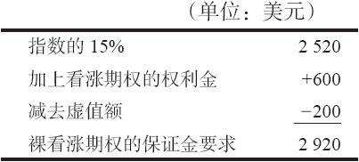
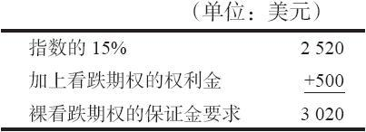

# 29.2　现金交割期权

现在，读者对指数已经有所了解，让我们来看一看最流行的场内指数期权：现金交割期权。

现金交割期权在期权合约中没有任何实体的标的物。如果期权行权或者指派，用来交割的只是现金，不涉及任何实物。这类期权一般是指数期权，例如标普500指数。对这样的指数来说，几乎不可能在行权或指派时实际交割标的证券。

因为许多投资者认为预测整个市场的运动比预测单只股票的运动要容易，于是现金交割的指数期权就变得非常流行。其他现金交割的指数期权的标的物包括纽约股票交易所指数、标普500指数、标普100指数（OEX，这是芝加哥期权交易所引进的一个指数）、纳斯达克指数（NDX）、道琼斯30工业指数（DJX），以及若干其他指数。在每一种情况中，指数中都有太多的股票，每一种股票中又有太多的变量，因此无法在行权和指派时处理实际股票的实物交割。有的现金交割期权的标的物是分类指数（subindex）。也就是说，像交通行业这样的较大的指数之下的分类组合。

### 29.2.1　行权和指派

在和这类期权打交道时，懂得行权和指派的结果很重要。当行权现金交割期权时，期权持有者收入的现金等于指数的收盘价与期权的行权价之间的差价。被指派的期权的卖出者必须支付相等的数量。下面的示例显示出一个看涨期权行权时的运作情况。在这个示例以及后面的示例里，我们将使用一个假想的代码为ZYX的指数（指数代码的最后一个字母往往是X）。

【示例29-4】假定投资者买入了一手ZYX 9月160看涨期权。后来，指数价格大幅上涨，在某一天收盘价为175.24。这个投资者认为现在是对看涨期权行权以提取盈利的时候了。假定ZYX合约的每1点价值100美元，和股票期权一样，他收到的现金就应当是100美元乘以指数收盘价和行权价之间的差额，也就是100美元×（175.24-160.00）=1524美元。通过行权，他不再有任何头寸或者权益，这个期权头寸从他的账户中消失了。通过行权他也没有得到任何证券，得到的只是现金。

指派运作的方式与此相似。期权的卖家必须要付出与指数收盘价和期权行权价之间的差额相等的现金。例如，假定一个交易者卖出了一手ZYX指数看跌期权：10月165看跌期权。之后指数价格下跌。有一天早上，这个看跌期权的卖家发现他被指派了（和股票期权的情况一样，他是在前一天就被指派的）。如果指数在前一天的收盘价是157.58，那么这个期权卖出者的账户里就会出现742美元的支出，也就是100美元×（165.00-157.58）。

### 29.2.2　欧式行权和美式行权

在讨论更多的指数期权行权和相随策略的示例之前，有必要引进两个新的定义。美式行权（American exercise）指的是一个期权在任何时候都可以行权。欧式行权（European exercise）指的是一个期权只有在它的到期日才能行权。许多现金交割期权都有欧式行权的特征。所有的股票期权和某些指数期权有着美式行权的特征。

引进欧式行权的特性是因为机构投资者，他们往往需要就所持有的股票投资组合卖出看涨期权，他们不想看到这种保护突然消失的情况，想要在这方面有所保障。因此，一些指数期权系列就变成了欧式行权。两个主要的示例是在标普500指数和道琼斯30工业指数上的现金交割期权。标普100指数仍然保留了美式行权的特性。

实值的欧式看跌期权比实值的美式看跌期权要便宜。这是因为套利者必须将欧式期权头寸一直持有至到期日，他无法将他的看跌期权行权，立刻将头寸平仓。事实上，深度实值的欧式看跌期权会按贴水价交易，短期利率越高，贴水幅度就越大。

这就会影响到长期欧式看跌期权的完整的保护能力。如果一个投资组合经理买入看跌期权来保护他的投资组合，而市场出现暴跌，看跌期权有可能变成深度实值。如果这些看跌期权具有欧式行权的特性，它们就会按较大的贴水价交易，因此就无法为这个投资组合经理提供他想要的所有价格保护。

关于美式行权的考虑。指数期权的持有者将期权行权的主要理由是提取盈利。你也许会想，如果持有者想要提取盈利，他可以简单地在公开市场上卖出期权。当然，如果他做得到的话，他会这样做。但是，在很多时候，深度实值的期权在交易时会有很深的贴水。深度贴水指的是1/2点~3/4点，或者更多。在交易日快结束的时候，这些期权往往会在只是稍微有一点贴水的情况下交易。无论是哪种情况，期权的持有者都有可能决定行权而不是按贴水价卖出。当然，如果他是一个看涨期权的持有者，而这个看涨期权在某一天早晨按深度贴水价在交易，如果他决定此时把期权行权，而到这一天结束的时候，和一开始就简单地按深度贴水价将期权卖掉相比，他也许会损失更多（如果市场下跌的话）。事实上，有的理论家认为，深度实值的现金交割期权在一个交易日中的“工作”就是试图预测市场的收盘价。当然，这不是一个可以始终精确完成的“工作”（如果它能做到的话，那么，你想象不出进行这样预测的交易者会多有钱）。

如果一手现金交割的看涨期权持有者对市场开始看空，那就是另一个行权的理由。没错，如果一手现金交割的看涨期权持有者看空，他就应当行权。因为这样做，就将看多的头寸平仓，提走盈利。这和股票期权这类以实物证券为标的的期权似乎是相悖而行的。它带来了一种有趣的情况。如果投资者在后半天转为看空，甚至在收盘之后，他会想要将他的看涨期权行权，将头寸平仓。交易所认识到这样的技巧并不对每个人都有好处，例如，投资者想要在行权之前等一等，看一看这个晚上的资金供应情况，比起卖出同一个期权的人来说，他显然就有了优势。在市场收盘之后，期权的卖出者再无法有效地对他们的头寸进行对冲。为了防止这种情况，在任何一个特定的交易日内，在交易所收盘的5分钟之后，就不再接受行权现金交割期权的通知（当然，到期日除外）。这样，持有者和卖出者就处于公平的地位。

对经纪公司的客户，无论是零售客户还是机构客户，还有一个与行权现金交割期权相关的有趣事实。大部分经纪公司对现金交割期权的行权和指派要收取手续费。在刚开始交易指数期权时，手续费相当高。不过，投资者目前一般应当只需付基于期权价格的手续费。

【示例29-5】在前面的示例里，投资者在到期日将一手ZYX 9月160看涨期权行权，当时指数的收盘价是175.24。差额是15.24。投资者应当付的手续费，就像是他按15.24的价格卖出看涨期权多头的手续费，仅此而已。

对现金交割期权的卖出者来说，情况和股票期权没有这么大的区别。因为期权是按贴水价交易，卖出者仍然受到被指派的威胁。如果不是按贴水价交易，它也许就没有被指派的危险。同时，因为这里不涉及股票，因此就没有股息的支付，现金交割看跌期权的卖出者只需要关心这个看跌期权是否在按贴水价交易，而不必像股票期权那样，担心它对标的股票除息后的价格是否在贴水价上交易。

不过，在现金交割期权中进行价差交易的交易者有他们特别需要关心的事。由于价差中的期权空头被提前指派，一个看上去风险有限的价差有可能面临比最初想象的要大得多的风险。考虑一下下面的示例。

【示例29-6】假定一个投资者在ZYX指数上建立了一个看涨期权熊市价差，他买入了11月160看涨期权，价格为1，与此同时，卖出了11月155看涨期权，价格为3。他在这个价差上的风险是300美元加上手续费。即假设他最多支付有限的500美元来买回这个价差，或者说，事情看上去的确如此。但是，假定指数价格大幅上涨，价差交易者所持价差中的期权空头被指派，当时指数的价格为175.24。因为被指派，他必须支付2024美元来“回补”每一手看涨期权空头：100美元乘以实值的数量：175.24-155.00，或者说20.24。他在第2天开始交易之前收到这个指派通知。请注意，他无法简单地将他的看涨期权多头行权。因为如果这样做的话，行权看涨期权多头的价格会是第2天的收盘价。在最坏的情况下，假定市场得到令人失望的经济新闻，开盘时价格低了很多，指数只有172。如果他用持平价格卖出他所买入的11月160看涨期权（1200美元），他就要付出一笔824美元的支出，这个金额大于他最初“有限的”500美元的最大理论支出。因此，他在这个价差上就亏损了624美元（824美元减去最初的200美元收入），比理论上的有限亏损300美元要高出一倍多。

如果市场开盘价低了很多并且向下交易，他的亏损额就可能比想象的还要大。因为现在他的多头头寸处于风险暴露中：在期权空头被指派之后，价差就不复存在了。当然，如果市场第2天上涨，这就对他有利。不过，这里的要点是，一手由现金交割期权组成的价差，如果价差中的期权空头变为深度实值，随时都可能被指派时，整个价差所面临的风险就要大于行权价之间的差额（在股票期权中这是最大的风险）。

### 29.2.3　裸期权的保证金

当一个指数被认定为“宽基”指数时，对裸期权卖出者的保证金要求就要低一些。一个指数是不是宽基的，是由美国证券交易委员会（SEC）决定的。宽基指数的保证金要求比较低，是因为标的指数的价格变化通常不会像股票或部门指数那么快。因此，从理论上来看，裸期权的卖出者在卖出裸宽基指数期权时的风险要小一些。

卖出裸宽基指数期权的保证金要求是指数的15%，加上期权的权利金，再减去期权的虚值额（如果有的话）。它也有一个最低的要求：对看涨期权它是指数价值的10%；对看跌期权它是行权价的10%。这两个最低的要求还需要加上期权的权利金。

【示例29-7】假定ZYX的价位是168.00，12月170看涨期权的售价是6，12月170看跌期权的售价是5。卖出裸看涨期权的保证金要求可以计算如下：

卖出裸12月170看跌期权的保证金要求会是：

两者都高于指数价值10%的最低保证金要求。

卖出裸窄基指数期权的保证金要求和股票期权是一样的：期权的20%，加上权利金，再减去虚值额，最低的保证金要求是指数价值的15%。

其他的保证金要求和股票期权的相仿。例如，如果投资者想要卖出裸12月170跨式价差，根据上面示例里的价格，他的保证金要求就会是3020美元，也就是看跌期权或看涨期权两者中较大的一个，这和在股票期权中的情况是一样的。对指数期权价差的保证金要求和对股票期权价差是完全一样的。那些符合组合保证金标准的账户将会获得更低的保证金要求，并不是上面所说的保证金要求。
