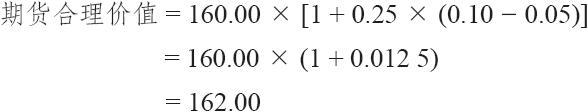
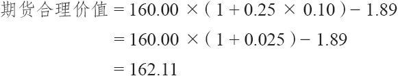
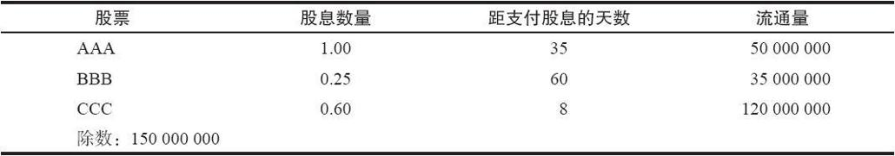
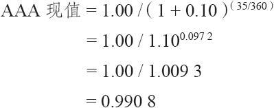

# 30.1　市场篮子

使用指数期货和期权的最流行的策略之一是买入一组表现同一个大盘指数表现相仿的股票组合，同时卖出定价过高的以这个指数为标的物的期货或期权。这组买入的股票组合通常被称作“市场篮子”（market basket）。这一章将介绍这些篮子是怎样被用来针对它们所模拟的指数进行交易的。这些指数可以是标普500，或者是范围小得多的指数，比如道琼斯30工业指数（DJX），或者甚至是小到只有几只股票组成的一个指数，这几只股票也许是某个投资者的股票组合。

一般而言，决定交易某个针对一组股票的衍生证券（期货或期权）是否能够获利的关键是这个期货合约自身中的升水。也就是说，如果标普500指数的价位在405.00，期货在408.00交易，那么就有3.00的升水：期货合约在比指数自身高3点的价位上交易。这个升水的绝对水平并不重要，重要的是这个升水与这个期货的合理价格之间的关系。我们在后面将考察如何确定这个合理价值。

期货是衍生证券的领头羊，特别是标普500指数期货。只要这些期货变得定价过高，其他衍生证券一般也会跟上。在本章中，如果我们提到标普500指数期货，要么是指合约乘数为每点250美元的“大合约”，要么是指合约乘数为每点50美元的迷你合约。

正常情况下，大部分衍生证券（期权和期货）都会跟随标普500指数期货的引导。当发生这种情况时，唯一定价合理的就只有指数自身，也就是股票。因此，对冲衍生证券的符合逻辑的方法是使用股票。如果这个指数足够小的话，例如包含30只股票的道琼斯指数（DJX），那么在期货定价过高的时候，投资者也许可以买入所有的30只股票，同时卖出期货。这是一个完整的对冲，而且事实上是一个套利。在更大的像标普500这样的指数里，只有最大的专业交易商才有可能买入所有500只股票，因此投资者可能会买入这个指数的一个较小的子集，希望这较小的一组股票会复制指数的表现，达到与买入整个指数类似的效果。我们将深入研究这两种类型的对冲。

即使投资者不准备使用这些对冲策略，对他说来，理解它们是如何运作的仍然非常重要。这些策略对整个股市的运动有一定的影响。为了预见到这些运动，必须对这些对冲策略有基本了解。为了实施任何一个这样的策略，首先必须知道如何确定一个期货合约的合理价值。

### 期货的合理价值

计算期货合约合理价值的公式极其简单，虽然要得到其中一个因素的信息有一些困难。首先，让我们来看一看简单的期货合理价值公式：

简单公式：

期货合理价值=指数×[1+时间×（利率–股息率）]

式中，指数是指数自身当前的价值；利率是当前的持有成本率（典型的是经纪商的借贷利率）；股息率是指数中所有股票的综合年股息率；时间是按年计算的在合约到期之前所剩的时间。

【示例30-1】假定ZYX指数在160.00交易，经纪商的借贷利率是10%，500只股票的股息率是5%，离期货合约到期刚好还有3个月。用年度来表示的时间就是0.25，因此，这个公式就变成了：

因此，期货应当在高出指数自身价值2点的价位上交易。期货高出指数的升水代表了不必买入并持有这500只股票所节省下来的资金利息，减去股票股息的损失（期货不付股息）。如果期货变得非常昂贵，在指数之上3.50或4点交易，那么就可以看作是高估了，那套利者就会来进场赚这部分钱。与此相似，如果期货交易价变得便宜，比合理价值要低出1点，那么在这种情况中也会有套利出现。

这个合理价值实际上是4个事物的函数：指数自身的价值，离到期的时间，当前的持有成本率和指数成分股在到期之前所付的股息。请注意，“指数的成分股在到期之前所付的股息”同我们在简单公式中使用的500只股票的股息率不是一回事儿。我们下面将进一步讨论两者的区别。

不过，在这样做之前，我们先看一看这个公式中变量的变化是如何影响期货合约的合理价值的。更重要的是，我们所感兴趣的是这些变量的变化是怎样影响这个期货合约相对指数价值的升水的。在交易市场篮子的时候，这是投资者应当主要关心的事。

随着指数自身价值的增长，升水的合理价值也会跟着增长。例如，如果像上面那个示例里，当指数在160时有2点的合理升水的话，那么，当其他变动都不变的情况下，如果指数价值为320，那么合理升水就会是4点。反过来说，如果指数下跌，升水的合理价值也会缩减。

升水的上升和下降同持有成本率以及距离到期日的时间也成正比。请注意，这个说法也适用于股票期权，理由是一样的：持有成本率越高，或者持有期更长，或者两者兼备，从持有成本中节省的钱就越多。在上面的示例里，如果离到期还有6个月而不是3个月，升水的合理价值就会从2点变为4点。同样的，如果时间缩短，合理价值就会变得更小。

有的投资者，主要是机构投资者，使用短期政府债券利率而不是持有成本率来决定期货的合理价值。他们这样做的理由是要决定他们手里的现金是放在短期政府债券中更好，还是放在像这样的套利策略中更好。后面我们还会再来讨论使用短期政府债券的利率。

股息的变化对升水价值的变化是反向的。指数总股息率的增加会使期货合约的合理价值减小。这是因为期货的持有者得不到股息收入。因此，由于股息的损失，期货合约就减少了价值。反过来看，如果股息收益降低，升水的合理价值就会增加。不过，这不是有关股息的全部故事。

回顾一下，我们在上面说过，股息率和股息的数量不完全是一回事儿。这是因为股票支付股息的方法各有不同。同不断支付收益的债券不同，股票通常是每年分4次支付。也就是说，在上面显示的简单公式中的股息率这个变量应当为在到期之前实际支付的股息数量所代替。这个事实使得对指数合理价值的计算变得有些困难。为了准确地计算出这个价值，你必须知道这个指数中每一只股票的股息数量和除息日。要知道所有这些信息比知道指数的股息率要难得多，因为指数的收益率会每星期都在好几个地方公布。事实上，你需要一台计算机才能计算得出一个包含100只或者更多股票的较大的指数的实际股息。

因此，实际的公式同上面显示的简单公式有些不同：

实际公式：

期货合理价值=指数×（1+时间×利率）-股息

在这个公式里，股息指的是在期货到期前所有股息的现值。

【示例30-2】在一个同简单公式里的示例相似的示例里，假设ZYX指数的交易价是160.00，经纪商的借贷利率是10%，在到期前的股息的现值是1.89美元，离期货合约到期还刚好有3个月。用年度表达的时间是0.25，因此，这个公式就变成：

为了计算一个指数的股息的现值，有必要知道每只股票的股息以及这个股息的除息日。为了计算这个指数的股息，投资者计算出每个股息的现值，将这个结果乘以这只股票在这个指数中的除数，以得到这个股息的正确权重。这个指数的总股息是这些单个股票计算结果的总和。每只股票的除数仅仅是用这只股票的流通股除以这个指数的除数来得到。在价格加权的指数里，没有必要对每个股息的现值进行调整，只需要将它们加在一起，然后除以除数。让我们以一个由3只股票组成的假想的指数为例，来看一看应当怎样计算一个指数的股息的现值。

【示例30-3】假定一个市值加权的指数是由3只股票构成的：AAA、BBB和CCC。另外，假定每只个股的股息数量和距支付股息的天数如下面的表格所示，每只股票的流通量也列在表格中。最后，假设这个指数的除数是150000000。

为了计算一个未来的数量的现值，我们使用这样的公式：

现值=未来数量/（1+利率）时间

其中利率是当前的短期利率，时间是用年度表示的。

假定当前的利率是10%。那么，AAA的股息的现值就是：

股息的现值永远小于实际股息。一个数量的现值是一笔这个数量的钱，这笔钱必须按照所说的利率（在这个示例里是10%）在今天投资进去以产生那个将来的数量。也就是说，99.08美分按10%的利率将会在35天之后变成刚好1美元。

BBB的股息的现值是0.2461，CCC是0.5987。读者应当自己核实一下，确认这些数量确实是正确的。你可以注意到，股息的现值并不比股息的实际价值小多少。不过，在一个较大的指数中，当投资者应对的是几百个股息时，现值同这些股息的实际总和之间就会有显著的差别，特别是当短期利率很高的时候。

因为我们假定这是市值加权指数，所有这些数字都必须按照股票的市值进行调整，这样才能给每个现值在指数中的恰当的权重。因此，对AAA来说，调整过的股息是0.9908乘以50000000（AAA的流通量），再除以150000000（也就是指数的除数）。这就得到了AAA调整的股息0.3303。对BBB和CCC也可以用相似的方法来得到调整的股息，它们分别为0.0574和0.4790。

因此，这个指数的股息的现值就是这3个调整过的现值的总和，即0.3303+0.0574+0.4790=0.8667美元。

注意：如果这个指数是一个价格加权指数，指数的股息就会是这3个现值（0.9908+0.2461+0.5987）的总和，再除以这个指数的除数。

上面的合理价值公式也可以用到期权上。例如，OEX指数没有期货。不过，可以用同样的方法计算出合理价值，然后，使用看跌期权和看涨期权可以构造出一个合成指数，这个合成指数可以与这个合理价值进行比较。

【示例30-4】假定OEX在364.50交易，一个9月OEX期货（如果有这样的期货存在的话）的合理价值是367.10。也就是说，这个期货会有2.60的升水。不仅期货在交易中会有理论升水，而且由行权价相同的看跌期权和看涨期权组成的“合成OEX”也应当有理论升水。因此，这个由期权构成的合成OEX也应当在367.10上交易。

也就是说，如果OEX9月365看涨期权的售价是4.60，9月365看跌期权的售价是2.50，那么，使用这两个期权构建的合成OEX的价格就会是367.10。读者应当还记得，决定这个合成头寸成本的方法是将行权价加到看涨期权的价格上，然后减去看跌期权的价格，也就是365+4.60-2.50=367.10。因此，这个合成头寸的价格同期货的理论价格是相同的。

同样的计算也可以用在任何有场内期权交易的指数上。现在，我们回到正在讨论的更大的主题：针对期货而交易市场篮子。
