# 2.4　计算投资收益

读者已对卖出备兑看涨期权有一些大致的了解，现在让我们来讨论一下如何计算投资收益率。投资者在建立卖出备兑头寸时，需要始终准确地知道潜在收益（包括所有费用）是多少。投资者是否使用折扣经纪商、电子经纪商，对手续费率的影响很大。在下面的例子中，我们总是假设股票的手续费为每股3美分，期权的手续费为每手5美元。投资者在实际计算其收益时，应该使用对应的手续费率。只有弄清楚了计算收益的过程，投资者才可以更合逻辑地决定哪种卖出备兑是最具有吸引力的。

在建立头寸之前，有三个关于卖出备兑的基本因素需要计算。第一个因素是行权收益（return if exercise）。这是在股票被交割的情况下卖出者会得到的投资收益。对虚值卖出备兑来说，要得到行权收益，股票的价格就必须上涨。然而，对实值卖出备兑来说，即使在期权到期时股价没有变化，仍然可以得到行权收益。因此，更有利的方法是计算无变化时收益（return if unchanged），即如果期权到期时标的股价不变时的收益。此时，投资者可以使用股价不变收益来对虚值和实值卖出备兑做更公平的比较，这时对股价变动就没有做过多的假设。备兑卖出者应当考虑的第三个重要的统计数据是在考虑了所有费用之后的下行盈亏平衡点（downside break-even point）。只要知道了这个盈亏平衡点，投资者就可以轻易地计算出他从卖出看涨期权中所得到的下行保护（downside protection）的比率。

【示例2-6】某个投资者在考虑下面的6个月看涨期权的卖出备兑：按43买入500股XYZ股票，按3卖出5手XYZ 7月45看涨期权。首先他必须计算出所需要的净投资（见表2-3）。在现金账户中，这项投资包括全额支付买入股票的金额，再减去从卖出期权中所得到的净收入。请注意，这里的净投资金额包括了所有为建立这个头寸所必须支付的手续费。（这里所用的手续费只是一些大概的数字，不同公司之间所收的手续费会有差异。）当然，如果投资者想要提走期权权利金（他完全可以这样做），这时他的净投资就会由股票成本加上手续费而组成。一旦知道了必要投资的金额，该卖出者就可以计算出行权收益。表2-4说明了它的计算过程。投资者首先需要计算出行权时的盈利，然后用其除以净投资以得到行权收益率。请注意，这个计算过程中包括了股息。假设在看涨期权的存续期里，500股XYZ股票将得到500美元的股息。另外，所有的手续费也都包括在内——净投资包括了初始买入股票和卖出期权的手续费，卖出股票的手续费是另外列出来的。

表2-3　所需的净投资—现金账户
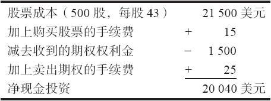
表2-4　行权收益—现金账户
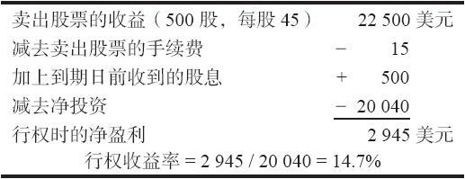
为了实现这里计算的收益，在到期日时，XYZ股价必须从现在的43上涨到45以上。正如前面所提到的，如果能够知道在价格没有变化时卖出者的收益，可能就会更有用。表2-5说明了计算股价不变收益的方法。股价不变收益也被称作静止收益（static return），有时还被不正确地称作预期收益（expected return）。同样，投资者首先需要计算出盈利，然后用盈利除以净投资，从而计算出收益率。有一点很重要，应当在这里指出：表2-5中没有计入卖出股票的手续费。这是最通用的股价不变收益的计算方法：这样做是因为在大多数情况下，如果价格没有变化，投资者会留下股票，然后就同一股票再卖出另一手看涨期权。不过，同时还要记住，如果卖出的期权是实值的，股价不变收益就与行权收益相同。因此，在这种情况下，卖出股票的手续费就必须包括在内。

卖出者在计算出必要的收益，以及对其可以从卖出备兑交易中赚多少钱有了一个大致的概念之后，下一步他就要计算出准确的下行盈亏平衡点，以确定这个卖出备兑可以提供怎么样的下行保护（见表2-6）。卖出备兑的总收益的概念，是在选择一个卖出备兑头寸时，综合考虑潜在收益和下行风险保护。如果股票持有至到期，并且收到了500美元的股息，那在股价为39.08的时候，该卖出者会实现盈亏平衡。同样地，卖出股票的手续费一般不包括在盈亏平衡点的计算中，因为此时所卖出的看涨期权会完全无价值到期，而卖出者可以就同一股票再卖出另一手看涨期权。我们会在后面讨论就已经持有的股票继续卖出备兑的问题。从许多情况中都可以看到，持续持有某个股票并持续卖出期权，相对于换一个股票来卖出期权要更有优势。

表2-5　股价不变收益—现金账户
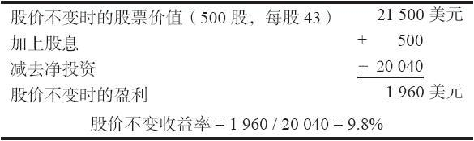
表2-6　下行盈亏平衡点—现金账户
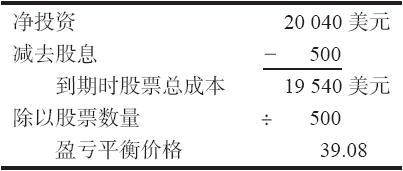
下一步，我们将盈亏平衡价格转化为下行保护百分比（见表2-7），这是一种方便的、用以在不同价格的股票之间比较下行保护的方法。我们在后面将看到，把下行保护同标的股票的波动率进行比较实际上更好。因为只知道下行保护而不知道标的股票的波动率是有问题的。例如，对于美国电话电报公司股票来说，10%的保护已经足够，而同样的保护比例对于更为波动的股票可能就稍显不足。第28章（数学应用）将提供用波动率来表示的下行保护的公式。

表2-7　下行保护百分比—现金账户
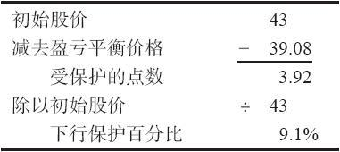
在接着讨论什么收益率究竟适用于什么样的情形之前，让我们先将同样的示例运用到一个使用保证金账户建立的卖出备兑（保证金卖出备兑）上。使用保证金可以提供更高的收益率，因为净投资会更小。不过，债务（从经纪公司所借的那部分钱）所需付的保证金利息会抬高盈亏平衡点，因而略为降低了卖出看涨期权对价格的下行保护。同样地，在净投资的计算里包括了所有为建立头寸而支付的手续费。

表2-8　所需的净投资—保证金账户
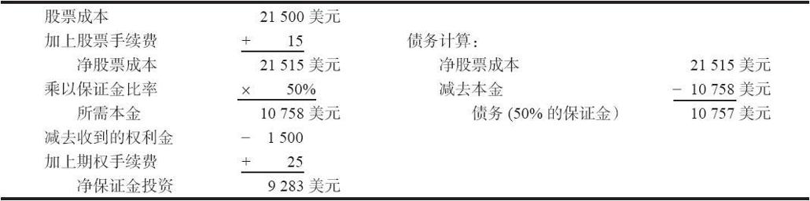
【示例2-7】使用现金账户进行卖出备兑（现金卖出备兑）的净投资是20040美元。当保证金融资比率（由联储银行设立）为50%时，保证金卖出备兑所需的投资不到现金的一半。如果投资者想把权利金从保证金账户中提走，他可以立刻这样做，只要他的账户里存入了足够的资产来购买股票。如果他提走权利金，那他的净投资会等于表2-8的右侧所显示的债务计算。

表2-9~表2-12说明了保证金卖出备兑的计算过程。如果投资者已经计算过了现金卖出备兑的情况，那他很容易就会使用方法二。方法一的计算过程则是第一次出现。

保证金卖出备兑的行权收益是25.6%。在示例2-6中，现金卖出备兑的行权收益为14.7%。因此保证金卖出备兑的行权收益要高得多。事实上，除卖出深度实值的备兑看涨期权的情形之外，保证金卖出备兑的收益总是比现金卖出备兑的收益要高。卖出的看涨期权的虚值程度越高，在计算行权收益时，现金和保证金卖出备兑的收益差异就越大。

表2-9　行权收益—保证金账户
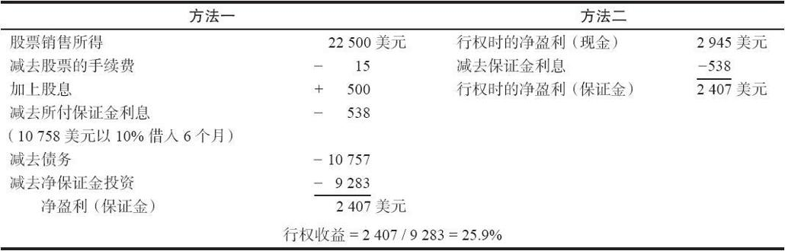
表2-10　股价不变收益—保证金账户
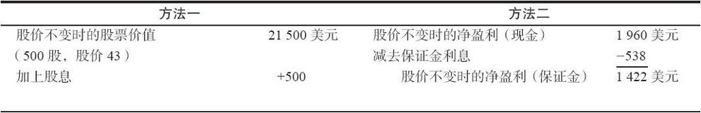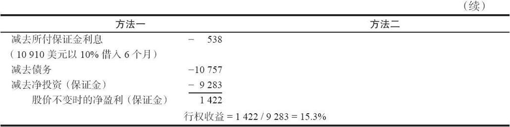
与计算行权收益时一样，对现金和保证金来说股价不变收益的计算方法类似。唯一不同的是要从盈利中减去所付的保证金利息。只要期权权利金足以弥补所付的保证金利息，保证金卖出备兑的股价不变收益也同样会比现金卖出备兑时高。在现金卖出备兑的示例中，其股价不变收益是9.8%，而在保证金卖出备兑时是15.3%。一般而言，无论初始股价在哪个方向上离行权价越远（虚值或者实值），保证金卖出备兑的股价不变收益超出现金卖出备兑时的数量就越小。事实上，当看涨期权为深度虚值或深度实值时，现金卖出备兑的股价不变收益会比保证金卖出备兑时要高。表2-11显示了保证金卖出备兑的盈亏平衡点（40.16），要高于现金卖出备兑时的盈亏平衡点（39.08，见表2-6），导致这一差异的原因在于保证金利息。类似地，我们也可以像表2-12那样计算出下行保护百分比。显然，由于保证金卖出备兑的盈亏平衡点比现金卖出备兑要高，那保证金卖出备兑的下行保护百分比就较低。

表2-11　盈亏平衡点—保证金账户
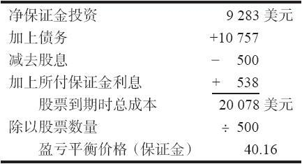
表2-12　下行保护百分比—保证金账户
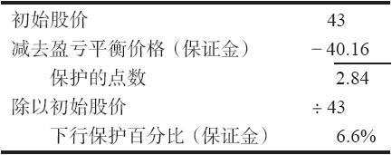
关于保证金卖出备兑，还有一点需要指出：经纪公司最多只会借给你为0.5倍行权价数量的资金。例如，你不可能按20买入一只股票，再以行权价为10点卖出一手深度实值看涨期权，从而免费进行交易。在这种情况下，经纪公司只会借给你5，即0.5倍行权价数量的资金。

即使是这样，还是有可能通过融资来建立需要很少甚至为零的自有资金的卖出备兑看涨期权。例如，假设某只股票的售价为38，某个长期的行权价为40的长期期权的售价为19。这样，自有资金的需求就是零。但是，这并不意味着你得到了什么免费的东西。确实，你的自有资金是零，但是你的风险仍然是19点。同时，你的经纪人会一开始就要求你存入某种最低要求的保证金，而且，一旦标的股票的价格下跌，自然会要求你追加维持保证金。此外，在这个长期期权的存续期里，你需要一直支付保证金利息。杠杆可以是件好事儿，也可以是件坏事儿，这个策略的杠杆很高，如果你要这样做，就一定要非常小心。

### 2.4.1　复息

机敏的读者应当已经注意到，我们对保证金利息的计算是非常简化的——利率的复合效果被忽略了。也就是说，因为利息正常情况下是按月加到账户中的，在卖出备兑的后期，投资者在付利息的时候，不但要为初始的债务付利息，还要为所有先前每个月的利息付利息。后面讨论套利技术的章节中会详细地描述这种效应。简单地说，不是用债务乘以利率再乘上到期前的时间来计算利息，而是应当使用：

保证金利息=债务[（1+r）t-1]

式中，r是每个月的利率；t是到期前的月数。（使用到期前的天数是不正确的，因为经纪公司是按月而不是按天来计算利息）

在上一节的示例二中，债务是10757美元，时间是6个月，年度利率是10%。使用这个更复杂一些的公式，所要支付的保证金利息就会是549美元，而用简单公式算出来的结果是538美元。就百分比而言，两者的差别不大。因此，在通常的实际操作中使用的都是简单的公式。

### 2.4.2　头寸规模

如果投资者在某个公司交易，没有最小固定手续费（即使交易的股数非常少，也要按照某个固定金额支付费用）的限制，那所交易的卖出备兑的股数就与收益不相关。然而，大多数经纪商都会收取最小手续费，即便是高折扣的电子经纪商也是如此。此外，全能经纪商经常对大客户收取很低的手续费率（相反，对小客户则收取较高的手续费率）。

备兑期权的卖出者需要记住这一点，更低的手续费率当然会带来更高的收益。即使是在高折扣经纪商处交易的投资者也应该确信他们所建立的卖出备兑头寸足够大，能够超过该经纪商的最小手续费标准。如果执行最小手续费标准时，只交易很少股数的卖出备兑头寸会显著地降低收益。

### 2.4.3　一毛钱会造成多大区别

与卖出备兑潜在收益有关的另一个重要方面，当然是交易中所涉及的股票和期权的价格。你买入股票时多付几分钱，或者卖出看涨期权时少收入一两毛钱，看上去似乎无关紧要，但是，即使是一个相对很小的数目也有可能导致潜在收益的数量发生令人惊讶的变化。虽然所有的卖出备兑都受此影响，但对实值期权的卖出者来说尤其如此。让我们使用前面的500股卖出备兑的示例来说明这一点，这里同样也包括所有的费用。

同前面一样，保证金卖出备兑的结果要比现金卖出备兑的结果明显得多。在两种情况下，盈亏平衡点的变化都不大。不过，潜在收益的变化则相当显著。请注意，如果某个投资者在股票上多付一毛钱，并且在看涨期权上少收入一毛钱（见表2-13里最右侧一栏），那么，他就会在很大程度上消除就更多数目股票而卖出备兑的效果。从表2-13中可以看到，在这些价格上（股价43，看涨期权价格3），就300股股票卖出备兑的收益，与股价是和看涨期权价格是时就500股股票卖出备兑的收益几乎是相同的。

表2-13清楚地显示出，以市价建立卖出备兑的指令不见得是一个深思熟虑的举动，特别是在你对潜在收益的计算是以报纸上的最新价或者收盘价为基础时。在下一节中，我们将深入讨论建立卖出备兑指令的合适程序。

表2-13　股票和期权价格对卖出备兑收益的影响
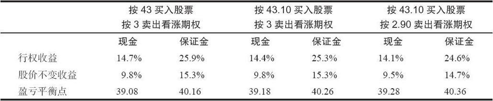
