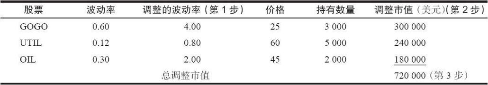
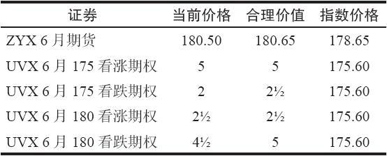
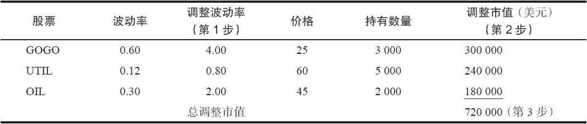

# 30.2　程序化交易

有两个术语往往会唤起人们对1987年股市崩盘和其他市场暴跌的回忆，它们是“程序化交易”（program trading）和“指数套利”（index arbitrage）。这两者自身并不能影响股市，因为它们是两条腿的交易策略，包括买入股票和卖出期货。从理论上来说，这种有两条腿的特征应当对市场不会产生什么影响。但是，在实践中，经常发生的情况是，这两条腿并不是同时执行的，结果导致股市要么上跳，要么下窜。

程序化交易只不过是就一个总的股票投资组合来交易期货而已。而指数套利则是针对构成指数的精确成分股来交易期货。

下面的讨论将以这样的假设为基础：交易者是要创造或者模拟指数自身，从而使用期货来对它对冲。这是一种套利的方法。不过，还有其他许多可以用期货来对冲的股票头寸。这些头寸包括投资者自己构建的多种股票的投资组合，或者是这样一组股票，在这组股票里，投资者想要消除（市场风险）。在正常情况下，投资者不会持有构成一个指数的所有股票，而是在他的投资组合里有一个独特的股票组合。这样的投资者也许想用期货来对他所持有的资产进行对冲。

投资者想要就他所持有的股票卖出指数产品的原因之一，可能是他现在对市场转为看空了，想要卖出期货而不是卖掉股票投资组合（并且以后再买回来），以避免股票换手的费用。与同样金额的股票换手相比，期货换手的手续费成本是相当低的。通过卖出一个指数（例如标普500）的期货，他就消除了投资组合的“市场风险”（假定标普500指数代表了这个“市场”）。在卖出期货之后所剩下的只是“跟踪误差”（tracking error）。股市的总的运动同任何个别投资组合之间的差距被称作“跟踪误差”。如果他的投资组合的表现优于标普500指数，投资者仍然可以赚钱，但是，如果他的投资组合的表现不如指数，那么他就会发现他没有完全消除亏损。请注意，如果市场上涨，除非跟踪误差对他有利，否则，这个投资者就无钱可赚。

### 30.2.1　消除投资组合的市场风险

股票投资组合的性质各有不同，它们未必都反映了期货合约标的物指数的构成。必须考虑到单只股票的特征，因为它们可能会比“市场”运动得更快或者更慢。让我们花一点时间来为股票的这个特征下一个定义，因为它非常重要。

### 30.2.2　波动率与贝塔

回顾一下，当我们最初在为布莱克–斯科尔斯模型使用的波动率（volatility）下定义的时候，我们说过贝塔（Beta）是不可接受的，因为它只是对一只股票的表现同股票市场表现之间相互关系的衡量，而不是对股票价格运动速度的衡量。现在我们关心的是股票的运动同整个市场运动之间是什么样的关系。这就是贝塔。

不幸的是，对期权策略家来说，贝塔的数据不像波动率的数据那么容易获得。许多期权交易者只需要在报价机器上按一个键，就可以得到波动率的估计值。得到贝塔的估计值则不那么容易，而且，可以找到的贝塔往往是包括一个非常长的时期，例如好几年。这些长期的贝塔对本章所讨论的指数套利是没有用的。因此，如果交易者无法获得短期贝塔的计算结果，那么他可以通过将个股的波动率同市场的波动率进行比较的方法来得到近似的贝塔。

【示例30-5】XYZ是一只相对高波动的股票，它的隐含波动率和历史波动率都是36%。总的市场的波动率是15%。因此，投资者可以根据下面的方法算出XYZ的近似贝塔：

贝塔的近似值=36/15=2.40

在有些情况里，这种近似值的效果不好，因为股票同整个市场没有多少或者根本没有互动关系（例如黄金或石油股票）。如果投资者的投资组合是由这类股票组成的，那么，他就应当认真地去找出它们的贝塔，因为刚刚介绍的贝塔的评估方式会不准确。这些股票有可能波动率很高，也就是说，它们的价格变化得相当快，但是它们的运动方向或许同整个股市的方向完全相反。因此，它们是高波动率和低贝塔的。因此，上面说的从波动率中求贝塔近似值的方法对它们就不适用。

在本章中下面所用的示例里，贝塔一词和调整的波动率一词是一个意思。调整的波动率就是上面所说的通过波动率得出的贝塔的近似值：股票的波动率除以市场的波动率。

### 30.2.3　投资组合对冲

在对一个分散的投资组合进行对冲的时候，必须使用贝塔或者调整的波动率，因为投资者不想卖出过多的或过少的期货合约。例如，如果这个投资组合是由低波动率组成的，而投资者对它卖出了过多的期货，那么，如果市场上涨，这个投资者就会亏钱，即使他的投资组合的表现优于市场。之所以会发生这样的情况，是因为市场的波动率更大，涨幅会比低波动率的投资组合更多。理想情况下，投资者应当卖出刚好足够的期货，因此，如果市场上涨，就不会有盈利或者亏损。有的只会是跟踪误差。反过来，如果投资者没有卖出足够的期货以保护一个高波动的投资组合，那么，如果市场下跌，就有亏损的风险，因为这个投资组合下跌的速度比市场更快。

每一个股票的贝塔或者调整的波动率都被用来确定对冲这个投资组合所需卖出的正确的期货合约数量。指数中每只股票的价值（市值）都被这个股票的波动率所调整，以给出这个股票的“调整市值”。然后，把它们加在一起，投资者就可以确定有多少“调整市值”必须用期货来对冲。我们在下面的示例里介绍了这里所建议的方法，它在每只股票上都使用了调整的波动率。

以下是确定对冲一个分散的投资组合需要卖出多少合约所要采取的步骤。

（1）如果你不知道贝塔是多少，用每个股票的波动率去除以市场（标普500）的波动率，这就是这个股票的调整的波动率。

（2）将持有的每只股票的数量乘以它的价格，然后再乘以从第1步得出的调整的波动率。这就得出了投资组合中这只股票的调整市值。

（3）把从第2步得出的每只股票的结果加在一起，得出这个投资组合的总调整市值。

（4）用指数价格乘以期货的合约乘数（标普500是每1点250美元），再用从第3步中得到的总调整市值来除以这个乘积，以确定需要卖出多少手期货。

【示例30-6】假定持有一个由三只不同的股票组成的投资组合：3000股GOGO，一只场外的技术股；5000股UTIL，一只主要的公用事业股；以及2000股OIL，一个大石油公司。这个投资组合的持有者对市场变得看空了，他想要卖出期货来保护这个投资组合。他需要决定应当卖出多少手期货。

这些股票的价格和波动率列在下面的表格里。假设这里假想的ZYX指数的波动率是15%。这就是“市场波动率”，我们用每只股票的波动率分别除以这个市场波动率，以得到它们的调整波动率（上面的第1步）。

现在，假定ZYX指数在178.65交易，在期货中，每1点的运动价值500美元。现在就可以计算出第4步的结果了：720000÷500÷178.65，或者说8.06手期货合约。因此，卖出8手期货合约就可以妥善地为这个分散的投资组合对冲。

在这个简单的示例中，有一个重要的细节：在所有对冲的计算中，是使用指数的价格而不是期货的价格。在这一章和下一章里有许多使用期货和期权为投资组合和市场篮子对冲的示例。无论是在什么情况里，在决定应当买入多少股票或者卖出多少衍生证券时，都应当始终使用指数的价值。

要注意，上面的投资组合示例的实际市值只有465000美元（GOGO有75000美元，UTIL有300000美元，OIL有90000美元）。可是，这个投资组合的波动率要大于总的市场，因为其中有两只波动率较高的股票。因此，有必要为一个720000美元的“市场”或者说调整市值进行对冲，从而弥补这个投资组合较高的波动率。

在大得多的投资组合里也可以使用相似的程序。波动率的估计当然是这些计算中的关键部分。不过，只要投资者是从相同的来源得到的波动率，他就应当有一个合理的对冲。没有办法对一只股票的未来表现同ZYX指数进行比较。因此，投资者应当预见到会有较大的跟踪误差。在这一类对冲中，投资者希望将跟踪误差控制在几个百分点以内。在一段足够长的时间内，这就可能是期货合约若干点的运动。当然，跟踪误差也可能带来对投资者有利的结果。在这里需要认识到的是，由于卖出了期货合约，持有投资组合的绝大部分风险就被消除了。投资组合上行方向的潜在盈利也被取消了。不过，建立这个对冲的前提是因为这个投资者对市场是看空的。

请注意，在投资者看空并对其投资组合进行对冲的时候，如果期货合约定价过高，那么他就会有额外的好处。这种情况会抵消一些负面的跟踪误差，如果有这样的误差出现的话。不过，没有人可以担保在投资者或者投资组合经理决定看空的时候，会有定价过高的期货存在。投资者最好在转为看空的时候就卖出期货，建立对冲，而不是等着，希望可以在卖出期货的时候能得到大量的升水。

### 30.2.4　用指数期权为投资组合对冲

正如前面提到的，凡是合适的地方，投资者都可以用期权来取代期货。如果投资者打算卖出期货，他就可以卖出看涨期权和买入看跌期权来代替。在这一节里，我们将对使用指数期权为股票投资组合对冲进行更为精细的考察。

首先，让我们来考察一下在前面的示例里投资者如何能够使用指数期权来为他的投资组合对冲。

【示例30-7】假定投资者持有同前面示例里相同的投资组合：3000股GOGO，5000股UTIL和2000股OIL。他决定用指数UVX来对冲，它的期权的合约乘数是每1点价值100美元。假定UVX的波动率是15%，这个投资者于是按照同上面的示例里相同的方法计算出了调整市值，得出的数字也是720000美元。

假定UVX指数在175.60交易。这个投资者想要用4100“股”UVX（720000美元÷175.60）来为他的720000美元的调整市值对冲。因为UVX期权每1点的运动价值100美元，这就意味着投资者要卖出41手UVX看涨期权和买入41手UVX看跌期权。他或许会使用175的行权价，或者是180的行权价，因为这些行权价是看涨期权最不可能被提前指派的价位。

凡是涉及卖出期权的地方，就像在上面的示例里卖出看涨期权那样，投资者都必须意识到会有提前指派，从而将投资组合暴露在市场风险中的可能。因此，如果市场在期货和“合成”UVX上有相同的升水（权利金），投资者在这种情况中就应当卖出期货，因为期货不会发生提前指派。不过，如果期权代表了一个比期货更高的“合成”价格，那么使用期权就更具有吸引力。

【示例30-8】假定同一个投资者决定要对他的调整市值为720000美元的投资组合进行对冲。他对是使用ZYX期货或者UVX期权无所谓。哪个为他提供更好的机会，他就使用哪个。下面的表格显示了他正在考虑的这些证券的价格以及它们的合理价值。

这个投资者基本上有三种选择：（1）使用ZYX期货；（2）使用UVX行权价为175的期权；（3）使用UVX行权价为180的期权。请注意，ZYX期货在它的合理价值之下15美分的价位上交易（180.50比180.65）。UVX指数的合理价值，正如期权的合理价值所显示的，是177.50。它可以通过将看涨期权的价格加到行权价上，再减去看跌期权的价格而计算出来。在两种行权价的情况里，UVX指数的合理价值都是177.50。

不过，实际的市场并不完全同合理价值相符。当使用实际价格时，投资者看到，无论使用175的行权价还是180的行权价，他都可以按178.00用期权合成的方法卖出UVX指数。因此，通过使用UVX期权，他可以通过合成，使用比合理价值高出1/2点的价格卖出UVX“期货”，而ZYX期货的售价在合理价值15美分之下。因此，期权看上去是更好的选择，因为65美分（UVX期权有50美分的高估，加上期货有15美分的低估）或许足以建立一个可以抵消提前指派可能性的优势。

在决定不再考虑使用期货之后，投资者现在必须决定选择使用什么样的行权价。因为他将要卖出看涨期权和买入看跌期权，同时，因为无论使用哪个行权价他都可以通过合成，按照178卖出UVX“期货”，因此，他将选择180的行权价。这应当成为他的选择，因为180看涨期权是虚值期权，因此被提前指派的机会更小。

### 30.2.5　用指数看跌期权来对冲

现在，让我们来讨论一下不是建立完全的对冲，而是承担一定风险的对冲方式。期权同期货之间的主要区别是，期货锁定价格，而期权锁定的是最糟情况的价格（代价是成本更高），同时为进一步的潜在盈利留下了余地。要说明这一点，考虑一下一个由卖出期货作为保护的买入股票的投资组合。在这个情况里，投资者失去了除了跟踪误差之外的上行方向的所有潜在盈利。但是，如果他买入看跌期权来代替，他花了钱（因而产生了一个比使用期货更大的成本），但是仍然保留了如果市场上涨就会有的潜在盈利。

投资者可以通过买入指数看跌期权或卖出指数看涨期权来为一个股票投资组合多头对冲。买入看跌期权一般是更具吸引力的策略，特别是如果看跌期权便宜的话。为了妥善地建立这个对冲，不但有必要根据贝塔来调整股票的金额，而且还必须考虑到这个期权的delta。下面的示例展示了如何使用看跌期权为一个不同种类股票的投资组合进行对冲。

【示例30-9】假设一个投资者有一个同前面的示例相同的由三只股票组成的投资组合：3000股GOGO，5000股UTIL，以及2000股OIL。他对总的市场的看法现在变为看空的，因而想要对他下行方向的风险进行某些对冲。不过，他决定使用看跌期权来对冲，以防出现市场进一步上涨的情况。

下面重印了前面的表格，它显示出了投资组合中每只股票的调整波动率和市值。同前面一样，这个投资组合的总的调整市值是720000美元。

投资者有以下两种方法使用看跌期权来为这个720000美元的投资组合进行对冲。

（1）作为灾难保险：买入足够的（虚值）看跌期权，因此，在这个看跌期权的行权价之下，这个投资组合是100%对冲的。

（2）作为对当前市场运动的对冲：买入足够的看跌期权，因此，所有当前的投资组合的运动都得到对冲。

【示例30-10】方法1：在这种方法中，投资组合经理想要的是一个灾难保险。他对防止在市场暴跌中出现大量亏损比就目前市场运动进行对冲更为关心。投资组合经理在灾难保险中常常使用虚值看跌期权。

假定他将使用UVX指数看跌期权，这个期权每1点的运动价值100美元。3月170看跌期权的交易价是1，对冲用的就是这个期权。当时指数的价格为178.00。

因此他可以用投资组合的调整市值（720000美元）去除以看跌期权的行权价的价值，行权价的价值是17000美元（100×170）。

要买的看跌期权=720000美元/17000美元=42.4[1]

42手看跌期权的成本：4200美元

42手看跌期权的行权价的价值：714000美元（42×17000美元）

买入42手看跌期权的成本是4200美元。它可以被看作为一笔价值为714000美元的资产所付的保险费。在指数目前的价格（178.00）与行权价（170.00）之间，他的投资组合有市场风险。在8点的下跌之内，这42手看跌期权可以对冲掉下跌中的部分风险，但是，完全的保护价值要等到它们跌为实值之后才能实现。当然，这不是一个1对1的对冲，因为UVX指数的表现在这个指数跌到170之下就会同这个投资组合的表现有所不同。不过，由于买入了这些看跌期权，投资组合经理无疑消除了大量的如果价格进一步下跌就会出现的市场风险。

【示例30-11】方法2：在这个方法里，投资组合经理想要为他的投资组合当前的价值进行对冲。他不想他的投资组合再有任何下行方向的亏损。在这种情况里，他一般会买入平值的或实值的看跌期权，而且会使用看跌期权的delta来构建一个完全的对冲。

同样，假设他要使用UVX指数看跌期权，这个期权每1点的运动价值100美元。不过，在这个情况里，当指数在178.00时，他考虑在对冲中使用的是3月180看跌期权，这个期权的交易价是，delta为-0.60。

在这个情况里，看跌期权的数量是通过使用同上面示例相同的公式决定的，然后再除以这个delta的绝对值：

要买的看跌期权=720000美元/（100×180）/0.60=67

保护的成本：67×450美元=30150美元

在这个情况里，投资组合经理在看跌期权上花了更多的钱。但是，由于这笔额外的支出，他的投资组合就立即有了保护。此外，在他买入的看跌期权中还有一些内在价值（2点，或者说67手期权的13400美元）。如果UVX指数下跌的话，这些看跌期权就会立刻开始对整个投资组合的亏损进行对冲。当然，如果市场上涨，他就会失去更多的保险支出。

当投资者使用期权而不是期货来为他的头寸进行对冲的时候，在期权的delta发生变化时，他就必须进行调整。在使用期货中就没有这种需要；在期货的情况里，投资者也许有时会重新计算投资组合的调整市值，但是，这不会在很大程度上影响到需要使用多少期货。但在看跌期权的情况里，当市场下跌时，delta的变化可能导致头寸delta变为delta空头，如果市场上涨，可能使它变为delta多头。这种情况同买入跨式价差多头相似：市场下跌，头寸变为delta空头；市场上涨，头寸变为delta多头。

基本上，这里需要做的调整同一个跨式价差多头的持有者要做的调整是相同的。如果市场上涨，这个头寸就变为delta多头，因为看跌期权的delta会缩小，它们不再为这个投资组合提供所需要的调整的金额的保护。在这种情况里，投资者可以将看跌期权挪到更高的行权价上，这样就可以基本锁定他在股票上的盈利。另外，他也可以按当前的（低）行权价买入更多的看跌期权以增加他的保护。

反过来看，如果市场在头寸建立之后立刻下跌，投资者会发现他变为delta空头。看跌期权多头的delta会增加，先前设定的保护实际上变得太多了。他可以使用的调整方法同那些持有跨式价差多头的交易者的方法是相同的：他可以卖掉一些看跌期权，从中得到盈利，同时仍然为股票投资组合提供所需要的保护。同时，他也可以将看跌期权向下挪到较低的行权价。不过，这种办法没有前面那种办法好。

### 30.2.6　用指数看涨期权来对冲

为股票投资组合对冲的另一种策略是在持有股票多头时卖出看涨期权来建立一个卖出比率。这种策略同使用看跌期权进行的保护相反，同卖出跨式价差更为相等。

【示例30-12】在上面那个示例里，3月180看跌期权的delta是-0.60。这样，3月180看涨期权的delta就应当是0.40。如果投资组合经理要使用卖出比率来给他的投资组合对冲，他可以使用同前面示例相同的公式：

要卖的看涨期权=720000美元/（100×180）/0.40=100

他将卖出100手看涨期权来为他的投资组合对冲。

这里所需要做的调整同一个跨式价差的卖出者所需要做的调整基本相同。如果市场上涨，看涨期权的delta就会增加，头寸就会变为delta空头。在这种情况里，投资者或许会买入看涨期权。一个实际卖出跨式价差的后续措施也许应当是买入一些标的证券而不是看涨期权，但是，在这个情况里，不可能这样做，因为这里所说的投资组合或许是固定的。

另一方面，如果在持有这个投资组合并卖出看涨期权之后市场下跌了，这个头寸就变成了delta多头，因为看涨期权的delta缩小了。在这种情况中通常的措施是将看涨期权向下挪仓，重新为这个投资组合建立恰当数量的保护。

总的来说，卖出指数看涨期权来为投资组合对冲不像买入看跌期权那样具有吸引力。正如同相对的买入或卖出跨式价差的相关优点一样，这主要是由投资组合经理想要达到的目的的性质所决定的。正如在前面所指出的，卖出跨式价差虽然有风险，但是根据统计数据，这是个出色的策略。不过，在这一节里我们讨论的不是买入股票然后卖出指数看涨期权的策略。我们面对的是一个既存的投资组合，而且，这个投资组合的经理对市场的看法变为看空了。因此，这个股票投资组合是一个固定的实体，指数期权或期货是围绕着它来建立起来的，以保护它为目的。

就保护的目的而言，买入看跌期权远比卖出看涨期权要强。原因是：第一，卖出跨式价差所需要的那种类型的调整常常涉及买入股票，或者至少是买入实值程度相对较深的看涨期权。一个投资组合经理或者持有一个股票投资组合的投资者也许不需要或者不想要卷入到一个有多重期权的头寸中。第二，使用看涨期权，如果市场大幅上涨，那么就有大量的风险。持有一个股票投资组合的人也许愿意放弃上行方向的潜在盈利（就像卖出期货那样），但是一般对在上行方向遭受大笔亏损会很恼怒。当然，使用看跌期权的话在上行方向就给潜在盈利留下空间。第三，卖出指数看涨期权有被提前指派的风险，虽然在这个情况中这一点并不重要，因为股票投资组合反正是买入股票的。可以在被指派之后立刻卖出其他的看涨期权。使用看跌期权唯一的真正缺陷是要付出权利金，而且，如果市场稳定下来，因时减值会导致看跌期权中的亏损。如果投资者确实觉得市场有可能稳定下来，那么，他就应当使用期货来为他的头寸对冲，而不是看跌期权或看涨期权。

[1] 计算结果为42.35，四舍五入为42.4，原文为42.3。——译者注
