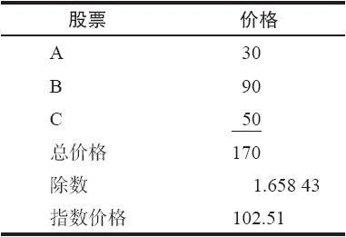
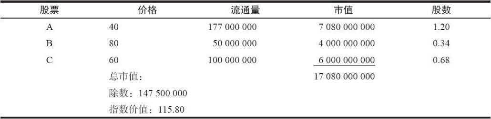
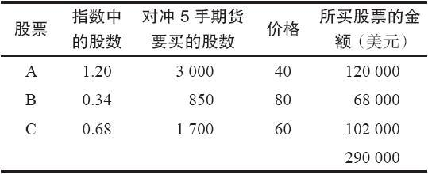
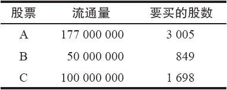

# 30.3　指数套利

正如前面所说的，指数套利是由买入一个指数的几乎所有的成分股，同时就这些股票卖出期货合约，或者是反过来。当指数期货出现错误定价的时候，也就是实际价格与合理价值不相符的时候，如果价格误差足够大，那么就会出现套利机会。当期货严重高估的时候，那就买入股票，卖出期货；当期货严重低估的时候，那就卖出股票，买入期货。无论是哪种情况，套利者都是想捕捉期货合约的合理价值与其实际买入或卖出指数的价格之间的差额。我们首先来考察一下完全对冲的情况，也就是在其中买入或卖出的是整个指数的情况。然后，我们将考察用来模拟整个指数表现的较小数量的股票组合的情况。

为成分股数量较少的指数进行对冲比为较大的指数进行对冲要容易。为一个价格加权的指数对冲大概是最简单类型的对冲。作为示例，我们将使用前面一章里建立的那些指数。

只要一个指数上有期货或者指数期权交易，就有可能为了套利而建立市场篮子。交易者事先应当决定为了复制这个指数，对于每个股票，他分别打算买入或者卖出多少股。当然，在一个价格加权的指数中，他要买入的所有股票的数量都是一样的。在市值加权的指数中，他买入的每个股票的股数都不相同。我们先来看一看如何确定股数。然后再讨论某些细节，例如对指数的买报价和卖报价的监控，以及指令的执行等。

### 30.3.1　买多少股数

在实际交易股票和期货或期权之前，交易者应当确定，在他计划要套利的指数中，在每一只成分股上，他究竟应当买多少股数。在正常情况下，交易者会先决定他一次会交易多少期货合约或期权合约，然后，再决定买入多少股股票作为对冲。基本上，交易者是要对冲相等的金额，也就是说，他会买入足够的股票来对冲由指数所代表的总金额。

【示例30-13】假定一个交易者决定他将使用50手ZYX期货来建立他的市场篮子。就这50手期货，他需要买入多少股票呢？期货合约的合约乘数是每点500美元。假定ZYX指数在168.89交易。于是，50手合约所代表的总金额就是50×500美元×168.89=4222250[1]美元。这个对冲者于是就会买入这个金额的股票来对出50手期货合约空头。

同样，请注意，用来决定需要卖出多少手期货合约的价格，是指数的价格而不是期货的价格。

在一个价格加权的指数里，交易者先是决定他计划要交易的总的价值，然后再用这个总的价值去除以指数的除数，这样就决定了要买入的股份数量。由此产生的数量就是为了复制这个价格加权指数所需要买入的每只股票的股数。

【示例30-14】假定我们有一个由3种股票构成的价格加权指数：A、B和C。下面的数据介绍了这个指数：

这个指数中每只股票的股数是1除以除数，或者说，1/1.65843=0.60298股。因此，如果我们在这3种股票的每只都买入0.60298股，那么我们就构造出了这个指数。

假定在这个指数上有期货合约在交易，这些期货的合约乘数是每1点价值250美元。也就是说，这个期货代表了一个总数等于指数乘以250的价值。有了这个信息，决定要买多少股的股票来为一手期货合约对冲就相当容易：250乘以每只股票的股数0.60298，也就是说，每只股票的股数是150.745股。

在正常情况下，交易者不只是卖出一手期货合约，并且用股票来为它对冲。他会使用一个比较大的数量。例如，他决定交易100手期货合约。在这样的情况下，他将对每只股票买入下列数量的股数：

股数=0.60298×250美元/点×100手期货合约=15074.5（股）

实际上，他或许是每只股票都买入15100股来对冲这个指数，每隔4手（100手期货对股票）就买入15000股票。在没有对小数进行处理的情况下，这会是一个比较接近的近似值。

这个交易者也许会使用指数期权而不是期货来进行对冲。在这种情况下，期权的行权价就起不了作用。典型情况下，他会用指数期权来完全对冲他的头寸。也就是说，如果他买股票，那他就会同时卖出看涨期权和买入看跌期权。看跌期权和看涨期权的行权价和到期日均相同。这就创造出一个无风险的头寸。这是一个转换组合。

【示例30-15】假定这个指数有现金交割的期权在交易，同股票期权一样，这些期权每1点价值100美元，这就是说，一手期权本质上就是合约金额为100股指数的期权。这个交易者打算买入100手6月105看跌期权和卖出100手6月105看涨期权来合成卖空这个指数。假设这个指数的数据同上面示例里相同，构成这个指数的是每只股票的0.60298股股份。要对冲这100手由期权合成的指数，需要买入多少股份呢？

股数=0.60298×100手合约×100股/合约=6029.8（股）

请注意，在价格加权指数的情况里，无论是指数当前的价值还是相关的期权的行权价（如果使用期权的话）都对要买的股数带来影响。上面的两个示例都显示出这样的事实：需要买多少股份完全是由价格加权指数的除数和期权或期货的合约乘数所决定的。

对冲一个市值加权指数要复杂一些，虽然在股数方面，构造市值加权指数的技术与上面的价格加权示例没有什么不同。回忆一下，我们可以通过用每只股票的流通量去除以指数的除数，来确定市值加权指数中每只股票的股数。计算每只股票要买的股数的一般公式是：

要买的股票N的股数=指数中N的股数×期货数量×期货的合约乘数

我们将使用前面一章中的假想的市值加权指数来说明这些问题。

【示例30-16】下面的表格说明了这个假想指数的相关事实，包括这个指数中每只股票的股数这个重要的数据。

因此，如果交易者要买入1.20股的A，0.34股的B和0.68股的C，他就可以复制出这个指数。之前提到，交易者通过用每只股票的流通量除以指数的除数，来确定该市值加权指数中每只股票的股数。

假定这个指数上有期货合约在交易，期货中每1点的运动价值500美元的盈利或亏损。这样，每只股票需买入的股数就等于500乘以该股票在指数中的股数。进一步假设该投资者决定交易5手期货。那为了对冲这5手期货头寸，该投资者对每只股票需买入的股数就是：

每只股票要买的股数=指数中该股票的股数×5手期货×500美元/手期货

下面的表格列出了这些信息，以及买入这些股票的总金额。我们将核实所买股票的金额确实是同期货所代表的指数金额是相等的。

因此，买入股票的价值是290000美元。从前面的一个示例里，我们看到了如何计算一手期货交易的价值。在这个情况里，指数是115.80，卖出的是5手期货，每1点价值500美元。因此，卖出的期货所代表的总金额=5×500×115.80=289500（美元）。这证实了我们为了对冲期货而买入的股票的数量是正确的。要注意，在股票买入金额与期货卖出金额之间有一些差别，这是因为在这个示例里，指数中的股数只保留了2位小数。

还有另一种方法来决定应当买入多少股份。在这种方法里，交易者首先决定他总的买入金额是多少。例如，他也许决定买入价值10000000美元的标普100指数（OEX）。接着交易者再计算他的买入金额占指数总市值的比例是多少。例如，10000000也许约为OEX总市值的0.02%左右。然后，交易者再分别计算这些OEX指数的成分股的流通量的0.02%是多少。在确定了每只股票应当买入多少股之后，交易者必须决定针对这些股票需要卖出多少期货，他可以用10000000美元去除以指数的价格，然后再除以期货的合约乘数。下面的示例说明了这个程序。

【示例30-17】假定交易者想要在一个同前面的示例相同的指数上建立一个套利。为了同那个示例进行比较，我们假定这个对冲者先要买入价值290000美元的股票。在现实中，交易者也许会使用一个像300000美元或500000美元的整数。不过，如果进行直接的比较，我们可以更容易看出这两种方法产生的答案是否相同。

第一，对冲者必须决定他想要买入的金额占指数总市值的百分比。在这个情况里，他是买入290000美元价值的股票，这个指数的总市值是17080000000美元（参考前一个示例开始时的那个表格）。这就意味着他是买入这个指数总市值的0.0016979%。

第二，他用这个百分比分别乘以每只股票的流通量。这就是说，他要买入这个指数中每只股票的流通量的0.0016979%。这就导致了下面表格所显示的结果：

将这些要买的股数同前面的示例进行比较。把数字四舍五入为整数之后，要买的股数是一样的。因此，这两种用来决定买入多少股份数的方法是相等的。

在结束这一节之前，应当指出，套利者也可以在期货定价过低时建立一个套利。他们可以卖空股票，同时买入定价过低的期货。建立这类套利要更难一些，因为卖空股票必须遵守“plus tick”规则。不过，当期货在相当长一段时间内定价过低的时候（也许是因为投机者的极度的悲观情绪），有可能从这个角度建立这样的套利。

### 30.3.2　套利的盈利性

在这个股票与期货的策略里，对许多套利者和机构投资者来说，关键是在去掉成本之后，是否还有足够大的收益。我们在前面用来计算期货合理价值的方法可以用来决定进行这个套利的总收益。

实施套利的主要成本是手续费成本。因为在交易指数的时候买入或卖出的是大量的股票，手续费一般来说都相当低。例如，机构投资者每股只需要支付3美分或者更低的价格。不过，这仍然可能是一笔显著的费用，特别是当买入的是像标普500指数这样的大指数的时候。如果使用一个计算机公司的服务来买入股票，即使专业套利者也可能必须支付手续费成本。下面一节将介绍这些交易股票的方法。

当某个投资者的手续费率已知时，他可以把这部分成本计入指数价格之中。他可以在当前指数价格中加入每股手续费率，并用这个结果除以指数的每股均价。下面的示例就描述了这个转换的方法。

【示例30-18】假定交易者要用每股3美分的手续费买入整个ZYX指数。这个指数在185.00交易。此外，假设这个指数的每股均价是45美元。使用这个信息，交易者可以决定他将支付多少手续费，按照金额计算。

指数手续费=（每股手续费×指数价值）/每股均价

=（0.03×185.00）/45=0.123

因此，每股3美分的手续费就折算为12.3美分的指数价值。

在上面的等式中，最难确定的因素是市值加权指数的每股均价。这里有一个捷径可以使用。对像道琼斯工业股平均指数（DJX）这样的价格加权指数来说，确定每股均价很容易。像OEX和标普500这样的大市值指数，它们的每股均价大约是DJX的每股均价的80%。

我们已经把手续费率转化为指数价值了，现在投资者可以确定其进行期现套利的精确盈利。当然他还必须把期货的手续费考虑进去。下面的示例显示了在考虑了所有费用之后，执行期现套利的净盈利。一旦计算出净盈利，就可以计算出收益率。

【示例30-19】假定ZYX指数在185交易，期货在2个月之后到期，它的合理价值升水是2.00点，不过它现在在188.50交易，实际升水为3.50。期货的每1点价值500美元。因此，这个期货很贵，交易者可以买入股票和卖出期货。他的净盈利包括在合理价值之上的升水，再减去开仓和平仓的所有费用。

正如我们在前面看到的，当股票的手续费是每股3美分的时候，我们为了建立这个头寸支付0.123的指数价值。同样的，我们需要支付0.123的指数价值来平掉头寸。因此，开平双边的净股票手续费大约是25美分的指数价值。

期货一般只有在平仓时才收手续费。一般在这类对冲中，一手标准普尔500指数期货合约的手续费可以降到每手10美元。因为185.0的指数价值代表了1/500的期货合约价值，因此，我们就可以用实际的手续费金额去除以500，得到一个同指数相关的数量来表达期货手续费。因此，就指数来说，期货的手续费是10/500，或者说0.02。因此，这个头寸开仓和平仓的手续费就是指数价值的0.266，买入和卖出股票各是0.123，期货单边是0.02。

净盈利=期货价格-期货合理价值-手续费成本

=188.50-187.00-0.27=1.23

将这个盈利年化，再除以当前的指数价格，我们就把这个绝对的净盈利金额转换为收益率。假定在到期之前刚好还有2个月。这样，收益率就可以用下面的方法计算出来：

增量收益率=[净盈利×（1/所剩时间）]/指数价格

=[1.23×（12/2）]/185.00=3.99%

在一个2个月的时段里，他的收益率差不多是1%的2/3。

初看上去，约为4%的收益率算不了什么。不过，我们计算的是增量收益率。也就是说，这个收益率是在我们用来确定这个期货的合理价值的利率之上的收益率。因此，如果一个机构要将现金投资到当前的短期利率上，而我们用来确定上面示例里期货合理价值的利率就是这个利率；那么，如果某个机构进行期货套利，而不是直接把资金放在短期货币市场里，这个机构就年化收益而言就会有4%的额外增量。

### 30.3.3　交易的执行

大部分客户对交易是如何执行的都不关心，因为他们给经纪人下指令，让经纪人去关心细节问题。不过，对那些对实际交易执行感兴趣的人，我们有理由对这个问题用简短的一节来做一些介绍。

理想情况下，投资者应当能够就买报价、卖报价和最新价对他的指数的进展进行监控。有一些现代的报价服务商可以让投资者进行这样的监控。知道买报价和卖报价很重要，因为当交易者实际执行这些交易时，他一般是就买报价和卖报价进行交易的，而不是最新价。

【示例30-20】假定期货合约的合理价值代表了1.25点的升水，但是，实际的期货交易有2.00点的升水。根据最新价，指数是165.75，期货是167.75。这看上去似乎有足够的“空间”来执行一手有利可赢的套利，买入指数的成分股，卖出期货。但是，指数的165.75的价值是由指数中每只股票的最新价组成的。如果交易者看一看每只股票的卖报价，然后重新计算这个指数，那么，他得到的指数价值也许要高出50美分。这就意味着他的套利空间是25美分再减去成本，这样的盈利空间是不够的。

类似地，当交易者想要将他买入的股票卖掉，同时买回期货的话，他需要知道这个指数的买报价，这样才可以看出他需要付出什么样的升水才能将头寸平仓。

下达指令的主要方法是完全电子化。计算机知道每只股票要买的数量，一旦被启动，就将这些买单通过电子通信线路送到交易池的某个自动订单执行系统去。大多数自动系统都能保证大量的股票按卖报价执行。在这个高度精密的下单方法里，整个指数的全部执行过程只需要大约1分钟。这种下单方法是如此之快和如此精确，以至于一些有这种能力的经纪公司可以向其他没有这种能力的经纪公司提供这样的服务，从中收取手续费。

### 30.3.4　机构策略

大规模股票投资组合的持有者可以利用期货和市场篮子策略的优势。有两种基本的策略可以很容易为大宗交易者所使用。一个是买入期货来代替买入股票，另一个是卖出期货来代替卖出股票。我们对这两种策略都将进行仔细的考察。

当一个这样的大机构有钱投资在买入股票的时候，买入政府债券和期货来代替股票也许更合理一些。当然，只有在要买的股票是以大盘为基础，也就是说，在某种程度上复制标普500的表现的情况下，这种替代策略才有意义。这个机构并不一定要买入同指数成分股刚好相同的股票，不过，如果买入的股票需要分散化的话，买入股指期货可以帮助实现相等的结果。但是，如果买入的股票需要专门针对哪一方面，那么，这个策略或许就不适用。

这个策略在期货定价过低时效果最好。如果买入的不是股票，而是相等金额的定价偏低的股指期货，那么，原来打算用来购买股票的所有的钱都可以存入政府债券里。读者应当还记得，如果期货出现浮亏，在期货账户中就必须存入现金（维持保证金）。即使是这样，如果期货的定价确实偏低，对这个机构来说，还是会节省大量的资金。

第2种策略适用于当期货定价过高，机构想要卖出股票的时候。在这样的情况里，卖出期货比卖出股票更为可取。第一，可以节省大量的交易费用（手续费）。第二，期货的定价过高的性质实际上意味着同卖出股票相比，卖出期货有额外的盈利。同样，这样的策略只有在投资者想要卖出一个分散化的股票投资组合时才有意义，像标普500大盘指数这样的投资组合。

当然，机构也有可能在不考虑他们的市场部位的情况下参与套利活动。也就是说，如果资金管理者有一笔钱，这笔钱他要放在短期的工具（或许是短期债券）里，在这种情况下，如果增量收益率足够大的话，他可以换一种方法，参与到这种股票同期货的套利里。在这一章前面的一节里，我们看到了如何确定增量收益率。如果资金管理者在短期债券中可以得到7%的收益，而在期货套利中可以得到11%的收益，他也许应当采用后者。

[1] 疑原文有误，原文为422225。——译者注
