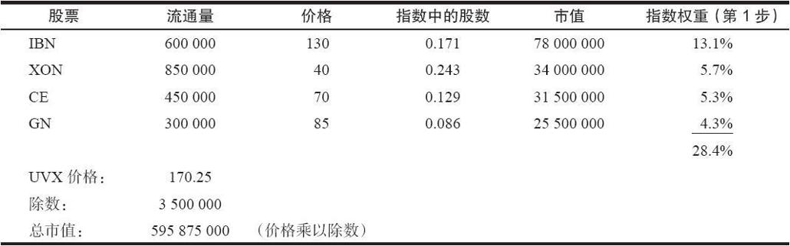
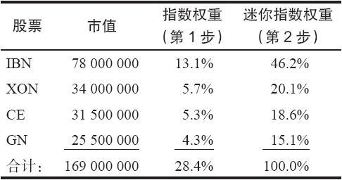
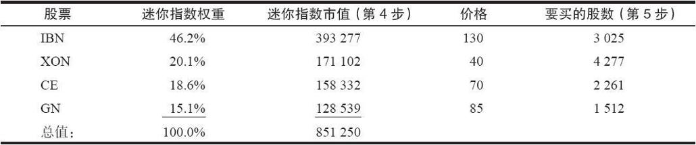
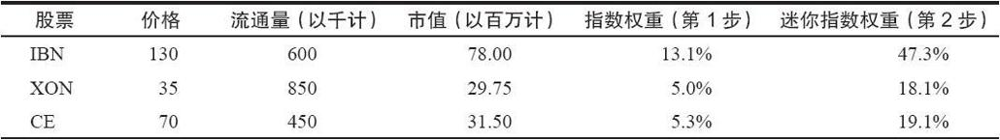
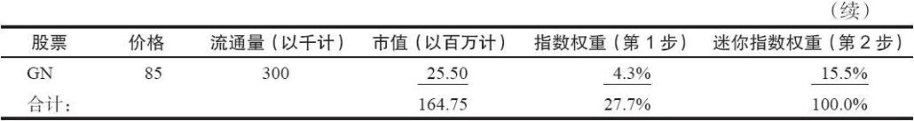
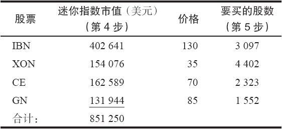
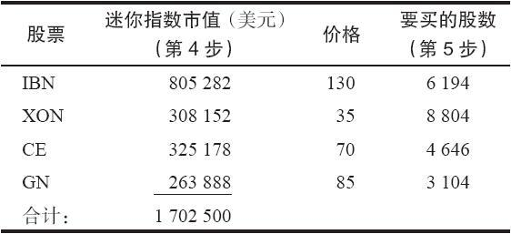
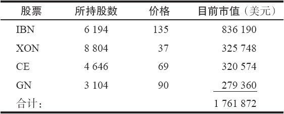

# 30.7　模拟指数

在前面一节的讨论里，我们假设的是交易者买入足够的股票来复制整个指数。由于各种各样的原因，对许多投资者来说，都无法做到这一点，最主要的原因是因为执行的能力和所需的资本，交易者做不到复制指数。不过，这些交易者显然仍然想要从期货合约的理论定价的差异中得到好处。通过对冲的方式而做到这一点的方法是建立一个有较少数量的股票组成的市场篮子，从而得到针对期货头寸的某种对冲。

在这一节里，将展示如何使用较少数量的股票来为期货头寸对冲的途径。这跟我们考察如何使用指数期货或期权来为单个的投资组合对冲不同，因为现在将要试图复制整个指数的表现，不过，我们用的只是这个指数成分股的一个子集。在每一个这样的情况里，都将使用一种叫做回归分析（regression analysis）的数学方法，来衡量这些投资组合或者是较小的市场篮子的表现。不过，我们将采用一种比较简单的方法，它不要求复杂的计算，但是仍然能产生所需要的结果。

### 30.7.1　使用高市值股票

读者应当还记得，在一个市值加权的指数里，最大市值（价格乘以流通量）的股票具有最大的权重。在许多这样的指数里，都有那么几只股票，它们的权重要远远大于其他的股票。因此，常常有可能创立一个只是由这些股票组成的市场篮子，用它来为期货的头寸对冲。虽然这类市场篮子自然不能准确地跟踪指数，不过，它同指数之间有一种确定的正相关关系。

交易者使用较小的市场篮子的目的，从根本上说，是要用指数所代表的价值来为股票所代表的相同金额进行对冲。如果所涉及的总金额不是接近相等，对冲就不可能成功。以下所列举的这些步骤在计算为了给较大指数的期货或期权对冲而创造一个“迷你指数”的过程中，在计算每只股票需要多少股的时候，是必不可少的。

（1）找出在这个大指数（标普100指数、纽约股票交易所指数、标普500指数等）中每只股票所占的权重。上市期货或期权的交易所一般都会公布这样的信息，它也可以通过在第29章所阐述的方法计算出来。

（2）通过将成分股的相对权重扩大到100%，找出这个将要构建的迷你指数中每只成分股所占的权重。

（3）找出指数在某个时刻的交易金额：指数价值乘以期货或期权的数量，再乘以期货的合约乘数。

（4）用第2步得出的每只股票的权重乘以从第3步得出的总金额得到需要在买入每只股票上花多少钱。

（5）用从第4步得出的结果去分别除以每个股票的价格，得到需要买多少股股票。

通过这些步骤可以构建起一个由较少数量的股票组成的迷你指数，这些股票是按照它们在大指数中权重的相对比例而组合在一起的，它们所代表的总金额足以针对需要对冲的期货或期权合约乘数进行交易。这种方法没有将波动率考虑在内。即使没有包括波动率，在使用高市值股票来为大盘指数对冲方面，这种方法还是合理的。

下面几页的示例用了四个虚构的大实值股票来说明要点（IBN，XON，GN和CE）。在不同的时候，市场中四个最大市值的股票可能会有不同。例如，通用汽车（GM）有一段时间是全世界市值最大的公司，不过它现在不是了。因此与其在这些示例中使用真实的股票代码，还不如用虚构的。

【示例30-25】假定我们想要为一个虚构的指数建立一个对冲，指数的代码是UVX，所用的股票是IBN，XON，GN和CE。下面的表格显示了在计算建立这个小型篮子时每只股票需要买入多少股时所必需的一些信息。

读者应当还记得这些数字是如何计算出来的：一只股票在指数中的股数是用这只股票的流通量去除以这个指数的除数。同时，指数权重（上面的第1步）是用该股票的市值（流通量乘以价格）去除以指数的总市值。最后，这个指数的价值是用指数的总市值去除以指数的除数。

有了这些信息，我们现在可以构建一个用来为UVX自身对冲的迷你指数。请注意，光是这4只股票就占了整个UVX指数的28.4%。在我们的迷你指数里，这4只股票每一只所占的相对权重应当同它在UVX中所占的权重一样。上面表格中这4只股票的市值总量同它们的相对权重显示在右面的表格里。

这4只股票各自在这个迷你指数中的权重，等于每只股票的市值与它们的总市值之比（上面的第2步）。在第2步中有两种计算的方法。第1种方法是，对IBN，用78000000（它的市值）去除以169000000（总市值）。第2种方法是，用第1步中IBN的权重13.1去除以总权重28.4%。两种方法得出的结论都是46.2%。现在，我们得出了迷你指数中每只股票的相对权重。请注意，它们之间的相互关系同它们在UVX指数中的相互关系是相同的。这样，一旦我们决定了针对这个迷你指数需要交易多少手期货，那么，将这些百分比转换成股票的股数，就是一件简单的事情。

当知道了要对冲的期货的总金额，知道了每只股票在这个指数中所占的权重，我们就可以计算出在这个迷你指数中每只股票的市值。最后，用市值去除以价格，就得到每只股票需要买入的股数。假定我们要使用UVX期权，它每点价值100美元，每一批为50手期权。当UVX价值为170.25时，这个指数的总金额就是851250美元（170.25×100×50）。这是通过第3步得出的。下面的表格显示了为了决定就50手期权合约需要买入多少股股票所必需的计算。

请注意，迷你指数中每只股票的市值是通过将所需要的交易金额（851250美元）乘以这只股票在迷你指数中所占的权重而得出的。这就完成了第4步。而第5步是这样的：用从第4步中得出的数量去除以这只股票的价格，就得到这只股票需要买的股数。例如，在上面的表格里，要计算所要买的IBM的股数，就是851250美元×0.462=393277.5美元；然后393277.5÷130=3025。

因此，交易者可以使用上面这4种股票中每一种的数量来为50手UVX期权合约对冲。从实践的角度说，交易者不会买入零股，而是将每只股票的数量四舍五入到整数：3000股的IBN，4300股的XON，2300股的CE以及1500股的GN。

随着迷你篮子中股票价格的变化，迷你篮子也需要重新计算。这是因为我们是用指数中各股票当前的价格来计算的这个迷你指数。因此，随着股票价格的变化，迷你指数的构成也开始偏离UVX的构成。

【示例30-26】假定石油股票的表现很不好，XON跌到了35（在我们构建迷你指数的时候它是40），而其他股票的价格同前面示例中的价格相同。最后，假定尽管XON的价格显著变化，整个UVX的价值仍没有变化，还是170.25。我们必须重新计算第1步，以决定每只股票在UVX中的权重。假设除数没有变化，每只股票的流通量没有变化，于是，权重就等于价格乘以流通量再除以总市值（595875000）。

请注意，在UVX和迷你指数中，XON的权重都下降了。其他三种股票的权重都相应地按比例上升。因为我们假设UVX的价值没有变化，迷你指数的市值仍然是851250美元（170.25×100美元/点×50手期权合约）。现在，如果我们完成第4步和第5步，那么就可以看到在新版本的迷你指数中每只股票需要有多少股份。

将这个示例中要买的股数同前面的示例里要买的股数做一个比较。实际上，在每一只股票上我们都买入了更多的股数。之所以会如此，有两个原因。对XON而言，我们买入了更多的股数是因为它价格下跌的幅度大于它在指数中的权重的下跌幅度。对其他股票来说，我们买入更多的股份是因为每只股票在迷你指数中的市值都增加了，而价格没有发生变化。

这个示例可以用来说明，随着迷你指数中股票价格的变化，每只股票所需要的股数也会发生变化。这意味着使用这种方法的对冲需要经常重新计算这个指数的构成，至少每星期要重新计算一次。在实践中，对冲者知道哪些股票的表现不好，哪些股票表现超常。因此，在实际进行计算之前，对应当做什么，他已经有了一些概念。

在使用这样的“迷你指数”方面有许多不同的方法。有的交易者是极度短线的，每天可以进出期货头寸一次或者几次，他们或许想只用1只股票来给他的期货合约对冲（一般是最大市值的股票，例如说IBN，除非有理由相信整个市场的运动方向与最大市值股票的运动方向有显著的不同）。

在其他的情况里，那些有较大资本和较多资源，但是不想对整个指数对冲的对冲者，也许会使用一个较大的迷你指数来对冲。在这样的情况里，对冲者一般对期货和股票的日内交易不感兴趣，而是像前面所介绍的那样，试图模拟针对合理价值的全面对冲。例如，标普100指数中市值最大的30种股票构成了整个指数的高于70%的市值。这就提供了非常精确的跟踪，而且，即使是对较小的交易公司来说，要执行这样的对冲也不是太困难。我们可以完全按照前面的示例所介绍的方法来计算一个30只股票的迷你指数。因为它代表了70%以上的指数，在跟踪这个指数方面，它就能起到很好的作用，尽管不可能是完美无缺的。

不过，如果对冲者想要用买入市值最大的50种股票来模拟标普500指数，那么，他持有的甚至还不到这个指数40%的市值。买入这50种股票并不能为他提供他所想要的精确跟踪。因此，如果对冲者想要对标普500指数进行对冲，那么，他就应当使用至少是200种股票。

### 30.7.2　跟踪误差风险

在所有这种模拟的指数投资组合里，就指数对冲而言，最大的风险是跟踪误差。所谓跟踪误差，指的是实际指数的表现同模拟指数投资组合的表现之间的区别。可以用统计学的方法来预测某个股票投资组合能够多么精确地模拟一个特定的指数。这同做民意调查的人在大选之前预测这场选举出胜的概率有多大是相似的。你也许听到过某个投资组合同它所想要模拟的指数之间的相关关系为98%的说法。

这种说法代表的是什么呢？首先，必须明白，在一组股票同另一组股票的相对表现方面，统计学无法预测出完整的信息，就像民意测验无法准确地预测出选举的结果一样。统计学可以告诉我们的是，一个投资组合的表现同另一个投资组合的表现接近相同的概率有多大。我们在前面介绍的预期收益的概念就同这种情况有些相似。这个统计学的数字不能保证投资组合在98%的时间内表现同指数相同，或者它绝对不会偏离2%。它只是一种用作比较的衡量标准，告诉我们这样一个投资组合同指数之间有着很大的相关关系。

使用一个模拟指数而不是指数自身的实际风险是无法完全衡量出来的。如果是那样的话，我们就可以精确地预测出这个模拟指数的表现，而我们刚刚才证明这是不可能的。不过，假设一个平均的表现，例如，模拟指数在1年的时间内会偏离实际指数2%。如果我们所谈论的是价位在415的标普500指数，那么，在1年的时段内的2%就会是9.30点，或者是在3个月的时段里的2.33点。如果考虑到在我们所讨论的大部分套利示例中可以得到的盈利都并不比这个数字高多少，那么，这样的运动幅度显然是显著的。这个风险的补偿因素是，模拟指数的表现有可能比实际指数的表现更好，对冲者可以从中得到比套利更高的盈利。如果交易者有足够的资本和足够的时间，持续地参与到这种模拟的策略中，经过一段时间之后，如果模拟指数同实际指数之间有很高的相关关系的话，他的跟踪误差就会相对比较小。

### 30.7.3　对对冲进行监控

一旦头寸建立起来，交易者应当有能力对它进行某种监控。理想情况下，他应当有一个可以即时计算迷你指数的计算机系统。这样，就可以随时对实际指数的运动同模拟指数进行精确的比较。当然，跟踪误差可能对交易者不利，也可能对他有利。

没有必要为指数对冲专门建立一个计算机系统。许多计算机化的系统都可以根据使用者的选择对一个投资组合的盈亏进行实时计算。对计算迷你指数的相对价值来说，任何一个这样的系统都可以处理。在计算投资组合的盈亏时，所用的程序必须能计算这个投资组合的净价值。只要能够做到这一点，对冲者就能够将它转换为一种可以用来同较大的指数进行比较的迷你指数的价值。这里的“技巧”是使用一个迷你指数的乘数，它是一个10的幂。也就是说，期货的合约乘数乘以期货数量是10的幂。例如，如果期货的合约乘数是250美元，就像在标普500指数期货合约中那样，那么，40的数量就会产生一个10的幂（250美元×40=10000）。这就意味着只进行小数点调整，这个迷你指数投资组合的总市值就能够读成“指数价值”。

【示例30-27】如果交易者是就一个每点运动价值500美元的期货合约进行交易，那么，它也许应选择使用20手期货来为他的迷你指数对冲。这样，这里的乘数就是500美元×20=10000美元。如果他所对冲的指数的价位是170.25，于是就买入价值10000美元×170.25或者说1702500美元的股票。他的迷你指数中的股票的总价值最初就是1702500美元，因此就可以通过将小数点移动4位来得到迷你指数的价值是170.2500。下面的表格总结了怎样使用上面示例中的4只股票来构建这样的指数。读者应当还记得，在前面的示例里，4只股票的迷你指数的总市值是851250美元。在这个示例里，我们的总市值将是它的两倍，也就是1702500美元。因此，要买的股票的股数以及市值都是前面示例的两倍。

随后，随着股票价值的变化，交易者使用计算盈亏的系统可以很容易计算出这个迷你指数的总市值。同时，通过将小数点移动4位而得出一个“迷你指数价值”，这个价值可以用来同实际指数（在这个示例里是UVX）进行比较，以决定跟踪误差。

【示例30-28】假定在这个迷你指数中的股票的价值要增加到1761872，如右表所示。

这个迷你指数的价值现在是176.1872（将小数点移动4位），或者说176.19。这就意味着迷你指数的价值从170.25上涨到了176.19，上涨了5.94。这可以同UVX在同一时期内的运动进行比较。例如，如果UVX在这个时段中上涨了6.50点，那么就很容易看出这个迷你指数的表现比UVX要差56美分。如果换个时间迷你指数的增长快于UVX，那么，在这样的情况里，就有了对我们有利的跟踪误差。

### 30.7.4　使用期权而不是期货

正如前面指出的，在对这些指数进行对冲的时候，我们可以使用期权来代替期货。假定交易者正在建立一个完全的对冲，在他为买入的市场篮子头寸进行对冲而使用期权的时候，就会有一个同转换组合相似的头寸。他可以卖出看涨期权同时买入行权价相同的看跌期权，从而创造出一个对冲。这同转换组合是相似的。

在为标普500指数对冲的时候，交易者可以使用标普500指数期货期权或者是标普500指数现货期权，不过，这样做未必比使用期货更具有吸引力。另一方面，在标普100指数中没有一个流动性强的期货合约，因此，在对这样的合约进行对冲时，交易者一般会使用标普100指数期权。正如前面提到的，在下一章我们将讨论指数间的期权套利，包括标普100指数同标普500指数之间的套利。

在通常情况下，无论在什么时候，都很难在这两者之间分出优劣来。不过，因为一个完整的期权对冲要求双向执行（卖出看涨期权和买入看跌期权），而期货只要求单一的执行。就这一点而言，期货也许稍微有些优势。

在这些关于指数的章节中的示例里，为了用期权来代替期货，交易者只需要使用同期货相当的正确数量的期权合约就可以。如果交易者要卖出的是标普100指数的看涨期权而不是标普500指数的期货，那么，他就要将期货合约的数量乘以5。使用5的乘数是因为标普500指数期货每点价值250美元，而标普100指数期权每点价值100美元，而且还因为标普500指数（SPX）的交易价格为标普100（OEX）价格的一倍（OEX在1997年11月有过一次2对1的分“股”）。因此，如果要使用看涨期权来代替卖出20手标普500期货，那么，相等的标普100期权的对冲就需要卖出100手看涨期权和买入100手看跌期权。

交易者可以使用期权而不是期货来建立不完整的对冲头寸。例如，他可以买入股票，同时只是卖出实值的看涨期权而不是卖出期货。这就创造出一个卖出备兑看涨期权。他仍然可以使用相同的技术来决定每只股票需要买入多少，但是，如果他决定不买看跌期权，那么，就有下行方向的风险。这样的头寸在看涨期权定价极度过高的情况下最有吸引力。

相似地，交易者也许想要买入股票和买入略为实值的看跌期权，但是不卖出看涨期权。这是一个合成的买入看涨期权的头寸：在上行方向有潜在的盈利，但是，如果指数下跌，就会有亏损。这样的头寸可以在看跌期权低估，看涨期权高估的时候建立。
