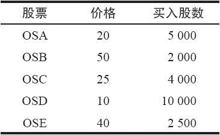
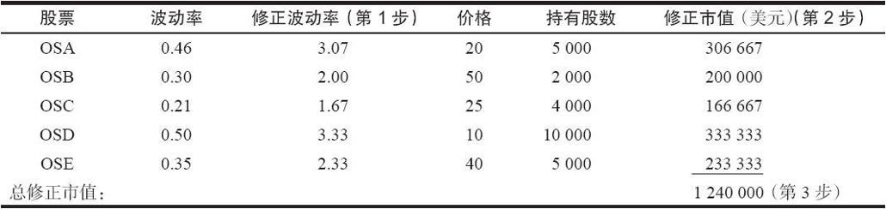

# 30.8　交易跟踪误差

交易者就一个股票投资组合卖出期货的另一个原因是实际上想要捕捉跟踪误差。例如，如果交易者对石油钻探股票是看多的，而且预期它们的表现会比总的市场要好，他就可以买入一些钻探公司的股票，卖出标普500指数期货。卖出的期货从本质上将“市场”从钻探股票的集合中剥离出来。剩下来的是这样一个头寸：它所反映的是这些钻探公司的股票相对总的市场的表现。如果它们的表现更好，这个投资者就会赚钱。在这一节里，我们将要考察一下实施这种对冲策略的方法。这个投资者对预测市场走向并不特别关心：他想要做的只是从他手里的这组股票中将“市场”剥离出去。在这样的情况下，他希望如果这些股票的表现确实比大盘市场要好，他就可以获利。这里我们也不准备使用回归分析，而是把注意力集中在实施更简单的那些方法上。

投资者和投资组合经理常常以行业组合来考虑问题。例如，投资者会认为石油钻探股票的表现会比总的市场好，或者汽车工业的股票会不如总的市场。在这两种情况里，投资者通过卖出期货把市场的行为剥离出去，把市场同行业之间的差异转化为盈利。在某种意义上说，投资者创造了一个对冲，在其中，他想要通过跟踪误差而获得盈利。在前面的讨论里，跟踪误差不是我们想要发生的事。但是在这里的，投资者是利用预测到的跟踪误差的方向，并且就它进行交易，从中获得盈利。

建立这样的对冲的技巧同在这一章开头的示例里所用的技巧是完全一样的，在那里我们考察的是为一个具体的股票投资组合对冲。不同的是，现在投资者必须决定应当买入哪些股票。一旦这一点决定了，他就可以使用上面所说的四个步骤来决定，针对这些股票需要卖出多少手期货合约。

第1步：用每只股票的波动率除以市场的波动率，以计算每只股票的修正波动率。如果这组股票的运动同总的市场不存在较大的相关关系，则使用贝塔系数（beta）。

第2步：将每只股票的数量同价格相乘，以得出修正的市值。

第3步：将这些数字加在一起，以得出整个投资组合的总市值。

第4步：用指数的价格除以总的修正市值以决定需要买多少手期货合约。

【示例30-29】假定有一位投资者认为石油钻探股票的表现会比市场好。他决定投资50万美元买入金额相等的5只钻探股票。在这种情况里交易者一般会在每只股票上花费相等数量的钱。他会选择5只有代表性的股票，在这些示例里，股票的代码可能是OSA，OSB，OSC，OSD和OSE。第1个表格显示的是每只股票的价格和要买的股数，每只股票上都投资10万美元。

现在，如果投资者知道了这些股票的波动率，就可以进行必要的计算。这些计算可以告诉他就整个钻探股票的投资组合需要卖出多少手期货。在下面表格里所提供的波动率和计算是假设市场波动率为15%。首先，用股票的波动率除以市场波动率，得出修正波动率（第1步）；再用股票价格乘以股票数量得出修正市值（第2步）；把这些数字加在一起，得出总的修正市值（第3步）。

假设投资者想要给假想指数ZYX对冲，ZYX期货每点价值500美元。如果ZYX指数的价格是175，那么，投资者就必须就这个钻探股票的投资组合卖出14手期货合约：1240000美元÷500美元/点÷175≈14（第4步）。

在一个类似这样的情况里，交易者在建立头寸时不必对市场看多或者看空。他需要的是把握交易这个行业的表现的机会。与此相似，决定什么时候将这个头寸平仓也不是根据对市场的看法。交易者也许有一笔未兑现的盈利，现在想要提走它，也许在这个行业中发生了一些基本的变化，导致投资者认为这个行业不再具有超出市场的潜力。

如果在投资者开始研究这个策略时，期货是定价偏低的，他就不应当建立这个头寸。从跟踪误差中得到的获益会在期货的理论价值中失去。因为投资者是在基本相同的时间建立对冲的两条腿（股票和期货），因此，他就有可能等到期货的价格变得具有吸引力再进行。这不是说期货的价格在建立这个头寸的时候必须是定价偏高的。不过，如果期货定价偏高的话，可以增强这个头寸的盈利性。

如果投资者认为某个特定的行业的表现将低于整个市场，他只需要决定每只股票需要卖空多少股，然后可以决定针对卖空的股票需要买入多少手期货，从而捕捉跟踪误差。如果投资者决定用这种方法来获得反向的跟踪误差，必须小心不要买入定价偏高的期货。他应做的是等到期货接近合理价值时再建立这个头寸。

### 质押要求

在这一章所讨论的所有投资组合对冲策略里，在期货和期权中都没有降低对保证金的要求。也就是说，股票必须是付全价或者是用保证金，就像是它们不存在任何保护一样，而对冲的证券（期货或者期权）也必须支付全部保证金。买入看跌期权必须支付全价，卖出期货必须支付正常的保证金，而且必须通过追加保证金来满足逐日盯市，卖出看涨期权的交易者必须按照裸期权的情况支付保证金，同时也必须满足逐日盯市。当然，一个持有股票的交易者可以用这些股票来满足裸看涨期权的保证金要求。
