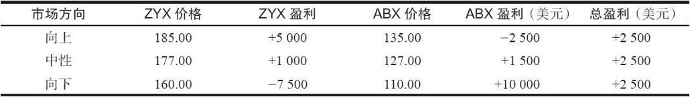
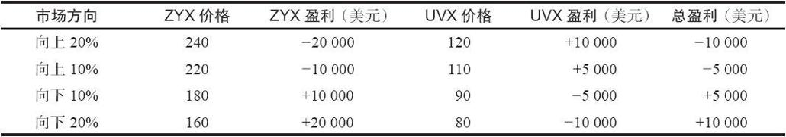
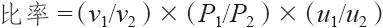
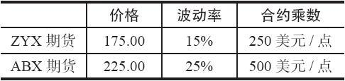
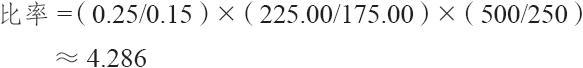
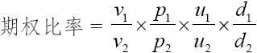

# 31.1　指数间价差交易

在许多股票指数之间都有着一般的相互关系，不管是美国的股票指数还是世界各国的股票指数。交易者常常可以利用对这两个指数之间的相互关系的看法通过指数间价差交易获利，而不必实际预测股市的运动方向。请注意，这常常也是许多期权价差交易背后的哲学。

有的时候，一个分析家会说他预期低市值股票（small-cap）的表现会比高市值股票（large-cap）的表现要好。这个分析家应当考虑使用标普500指数同价值线指数（Value Line Index，它包括许多低市值股票）间的指数价差，或者是标普指数同以纳斯达克为基础的指数之间的价差。如果他买入包括较小股票在内的指数，卖出标普500指数，假设他的分析是对的，不管股票市场是上涨还是下跌，他都有钱可赚，他所需要的只是买入指数的表现比卖出指数的表现要好。

有的时候，同指数自身的定价相比，指数期货或期权的定价会出现错误。如果发生这种情况，交易者就可以从价格的差异中获利。有的时候，两个指数上的指数产品之间价差的交易价格同这两个指数自身之间价差的交易价格会相差很大。当发生这种情况的时候，就有可能进行指数间价差。

对这些价差的保证金要求常常没有那么高，因为一个指数上的期货可以对另一个指数上的期货起到对冲作用，这是为保证金规则所认可的。

在两个指数之间选择一个期货价差来交易的一般规律是：将相应期货之间的价格差异同指数自身之间的实际价格差异进行比较。如果期货间的差异与指数现货价格间的差异有显著不同，那么，交易者就卖出比较贵的期货，买入比较便宜的。在这一章里我们将讨论一些具体的价差。

交易者进行价差交易，无论是因为他想要预测现货指数之间的相互关系，还是因为他知道两个相应的期货价格有偏差，都必须决定究竟用什么样的比率来建立价差。在这个问题上有两种思考方法。第1种是，只买入一手期货和卖出一手期货（当然，是就两个不同的指数）。许多图表书和价差历史图形都是按这种方式来绘制的：它们以1比1为基础将一个指数同另一个指数进行比较。

【示例31-1】一个价差交易者想要买入ZYX指数期货，同时就它们卖出ABX期货。它们的合约乘数都是每点500美元，不过ZYX目前的价位是175.00，ABX是130.00。因此，目前的价差是45.00点。这个价差交易者认为这个价差会进一步扩大，从而可以从中盈利。下面的盈利表显示了不管市场朝哪个方向运动，如果这个价差扩大到50.00，他是如何获得2500美元的盈利的。

请注意，在每一种情况中，指数ZYX和ABX之间的价差都是50.00点。不管总的市场运动方向是上涨，相对无变化或者下跌，盈利都是一样的。

价差交易者通过买入45.00的价差，并且在50.00的价位上卖掉它而得到5点的盈利，这个头寸2500美元的盈利就是这5点的盈利（5.00点×500美元/点=2500美元）。

指数价差的第2种方法是在两种指数之间使用一个比率。这种方法常常是在两个指数的价格显著不同时所采取的。例如，如果一个指数的价格是另一个指数的两倍，而且这两个指数的波动率相似，那么，使用1比1的价差就会给价格较高的指数过多的权重。2：1的比率要更好一些，因为它给价差两侧的指数以相等的权重。

【示例31-2】UVX是一个股票价格指数，它目前的价格是100.00。ZYX是另一个指数，它目前的价格是200.00。这两个指数有某些相似之处，因此，价差交易者也许会想就其中的一个而交易另一个。它们的波动率也相似。

如果投资者买入一手UVX期货，同时卖出一手ZYX期货，他的价差就过分侧重于ZYX的价格运动。下面的表格列出了这一点，它显示出如果两个指数有相似百分比的运动，1比1价差的盈利就被ZYX期货的盈利或亏损所控制。假定两个期货都是每点价值500美元。

这算不上一个对冲。如果交易者想要反映出ZYX指数的运动，他只需要交易ZYX期货就可以了，不必这么麻烦建立一手价差。

不过，如果交易者使用指数的比率来决定需要买入和卖出多少手期货，那么，他的头寸就会更为中性一些。在这个示例里，他会买入2手UVX期货，卖出1手ZYX期货。

提倡使用指数比率的人只是想要尽量捕捉住两个指数之间所有表现上的差距。他们并不是想要预测股市的总的方向。

从技术上说，合理的比率应当包括两个指数的波动率，因为波动率也是决定它们相对运动有多快的一个因素。

式中　P1，P2——指数的价格；

v1，v2——各自的波动率；

u1，u2——合约乘数（例如，每点500美元）。

将波动率包括在内可以保证价差基本是建立在每个指数的相等的“波动率金额”上。此外，如果两个期货的合约乘数不同，这样的区别也应当考虑在内。

【示例31-3】ZYX指数波动率不是很高，只有15%。交易者对就它同ABX指数价差有兴趣，ABX指数的波动率相当高，它的历史波动率为25%。下面的数据对这个情况做了总结。

经过四舍五入，交易者或许会就每手ABX期货交易4手ZYX期货。

### 在指数价差交易中使用期权

一般来说，如果有期货的话，使用期货比使用期权更容易交易指数价差。不过，还是有许多指数价差交易的策略使用期权。投资者可能希望构造期货或ETF的价差，以表示世界上各个市场：SPX、标普500指数交易所交易基金（SPY）、纳斯达克100（NDX、QQQ）、罗素2000（IWM）、中国（FXI）、新兴市场（EMM）等。

当两个指数都有期权交易时（大多数情况都是这样），策略家会发现他可以用期权来实现他的优势。他不单单可以用合成期权头寸来替代期货头寸（例如，用相同行权价的看涨期权多头和看跌期权空头来代替期货多头），还有其他两个选择。首先，他可以用实值期权来代替期货。其次，他可以用期权的delta来构造一个有更高杠杆的价差。当投资者对交易现货指数的价差感兴趣时，这些选择很有用处。不过它们不能用于交易期货之间升水的价差的短期策略。

用实值期权来代替期货有一个额外的优势：如果现货指数朝某个方向移动了非常大距离，该价差交易者仍能挣钱，即使他对于现货指数之间的关系预测错了。

【示例31-4】市场上有以下价格。

ZYX：175.00

UVX：150.00

ZYX 12月185看跌期权：

UVX 12月140看涨期权：11

假定交易者想要买入UVX指数和卖出ZYX指数。他预期这两个指数之间的价差（目前是25点）会缩小。他可以买入UVX期货，卖出ZYX期货。不过，假定他不是这样做，而是买入ZYX看跌期权，同时买入UVX看涨期权。

12月185看跌期权的时间价值是1/2点，12月140看涨期权的时间价值是1点。这是一笔数量较小的时间价值。因此，只要两手期权保持在实值的价位，这样的组合所产生的结果同期货价差的结果就基本相似；唯一的区别是期货价差的表现好一些，超出的部分等于所付时间价值的数量。

虽然投资者为这个买入的期权组合头寸支付了一些时间价值，比起期货价差来，他却有了获得更大盈利的机会。事实上，即使现货指数之间的差距拉大了，如果指数波动率高的话，他还是可以盈利。要了解这一点，假定在整个市场出现了一个大幅上涨之后，有了以下的价格。

ZYX：200.00

UVX：170.00

ZYX 12月185看跌期权：0（基本上一文不值）

UVX 12月140看涨期权：30

这个最初用点买入的组合头寸现在价值30，因此，这个价差有了盈利。再看看在现货价差中发生了什么：它的价差从最初的25扩大到30点。这同投资者最初所希望的运动方向相反，但是期权头寸仍然盈利。

这个示例中的期权组合即使在现货价差出现不利运动的情况下仍然能够赚钱，是因为两个指数的价格上涨幅度都非常大。最终持有的看跌期权变得一钱不值，但是看涨期权多头则随着市场的上涨而继续积累盈利。这个情况同持有一个宽跨式价差多头（买入行权价不同的看跌期权和看涨期权）类似，不同的是看跌期权和看涨期权是以不同的指数为标的物。我们在第35章讨论期货价差的时候，将更详细地讨论这个概念。

指数价差中使用期权的第2种方法是使用实值程度没有那么高的期权。在这样的情况里，投资者必须使用期权的delta来准确地计算合适的对冲比率。他可以使用上面所给的指数比率的公式来计算需要买入和卖出的期权的数量，这个公式结合了价格和波动率，然后再乘以一个因数来把delta包括在内。

式中　vi——指数i波动率；

Pi——指数i的价格；

ui——合约乘数；

di——指数i所选期权的波动率。

【示例31-5】以下价格已知。

ZYX：175.00，波动率=20%

UVX：150.00，波动率=15%

ZYX 12月175看跌期权：7，delta=-0.45，每点价值500美元

UVX 12月150看涨期权：5，delta=0.52，每点价值100美元

假定投资者决定建立一个头寸：如果两个现货指数之间差距缩小就会盈利。他现在决定要使用平值的期权而不是深度实值。他要使用期权比率公式来决定需要买多少手看跌期权和看涨期权（在这个公式中，不考虑看跌期权delta的负号。）

期权比率=（0.20/0.15）×（175.00/150.00）×（500/100）×（0.45/0.52）≈6.731

为了每手买入的ZYX看跌期权，他要买入7手UVX看涨期权。

在前面的示例里，使用实值期权，投资者在时间价值上只有很小的支出，如果指数是高波动的，即使现货指数之间的差距没缩小，他也可以盈利。这个头寸中要支出很大的时间价值，但是，如果指数有较小幅度的运动，它也可以产生盈利。当然，如果现货指数朝着有利的方向运动，两个头寸都能盈利。

波动率的差异。有的时候会出现一个理论“优势”，就是波动率差异。假定两个指数的波动率应当基本相同，或者是两者之间至少应当存在某种关系，那么，如果这种关系改变，投资者就有可能建立一个期权价差。在这种情况里，两个指数中期权的定价都有可能符合它们的合理价值，因此，现在是波动率的差异存在不一致，而不是期权的定价。

在标普100指数和标普500指数的期权交易中，隐含波动率基本上是相同的。因此，如果一个指数的期权的隐含波动率比另一个指数期权要高，那么，就有价差的可能。在通常情况下，只有在隐含波动率的差异至少在2%之上，投资者才应当因为波动率而建立价差。

无论是什么情况，不管建立价差的理由是因为投资者认为现货指数的相关关系会发生变化，或者是因为一个指数的期权的价格相对另一个期权来说过于昂贵，或者是因为波动率中的不一致现象，价差交易者都必须使用期权的delta以及指数之间的价格比率和波动率来建立价差。

行权价的差异。期权交易者可以用另一种方法来利用指数之间的相关关系。如果在建立期权价差时使用的是行权价与目前指数价格相距甚远的期权（也就是说，它们是深度实值或虚值的期权），那么，投资者可以使用指数之间的比率来决定哪些行权价是相等的。

【示例31-6】ZYX的交易价是250，ZYX 7月270看涨期权的定价过高。期权策略家也许会想卖出这个看涨期权，同时用另一个指数的看涨期权为它对冲。假定他注意到UVX指数的看涨期权的交易价接近合理价值，UVX的价位是175。他应当买入什么样的UVX的行权价才能保持同ZYX 270的行权价相等呢？

交易者可以用指数之间的比率来乘以ZYX的行权价，也就是270，以得出需要使用的UVX的行权价：

UVX行权价=270×（175/250）=189.00

于是，他可以买入UVX 7月190看涨期权作为对冲。要决定究竟需要买入多少手看涨期权，可以使用前面提供的期权比率的公式。
