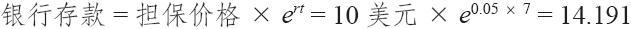

# 32.3　内嵌看涨期权的成本

很少有结构化产品会支付股息[1]。因此，拥有一个这样的产品的“成本”就是失去的利息，因为你的钱不在银行里（或者是货币市场基金中），而是套在持有这个结构化产品上。

继续使用上面的示例，假定你在银行里存了10美元，而不是花10美元买了这个结构化产品。进一步假设，存在银行的钱有5%的利息，连续复利。在7年之后，经过连续复利，10美元就会价值：

通常有人会对这样的计算表示异议。即使是以年度复利，总数也是14.07。单是把钱存在银行里，你就可以有大致40%的盈利（不考虑税务）。暂时不考虑结构化产品，这就意味着，为了超过银行存款的表现，大盘股市的价值在7年内需要增长至少40%。

在这个意义上，内嵌在这结构化产品中的看涨期权就是这笔失去的利息（4.19左右）。这看上去似乎是一个相当昂贵的期权，不过，如果考虑到这是一个7年的期权，那么它就显得不那么昂贵了。事实上，你可以对这样一个看涨期权的隐含波动率进行计算，并且把它同所关心的指数的当前的期权进行比较。

在这个情况里，如果股票的价格为10，行权价也是10，没有股息，利率是5%，离到期是7年，一个价格为4.19美元的看涨期权的隐含波动率是28.1%。标普500指数的看涨期权很少有这么昂贵的。因此，你可以看到，你是在为这个看涨期权支付“某种东西”，尽管它采取的形式不是一开始就要支付的成本，而是失去的利息。

从另一方面来看，这个结构化产品的发行商也不太可能为买入的这个看涨期权实际支付这么高的隐含波动率，但是，他是在要求你支付这个数目。这就是发行商赚钱的地方。

上面的示例假定结构化产品的持有者可以分享标的指数在行权价之上的全部的上涨获益。如果不是这样的话，那在计算这个内嵌期权的时候就需要做出调整。事实上，你必须计算指数的价值在到期时需要产生什么样的现金价值，才能够同上面的“银行存款”的计算相等。然后使用指数的这个价值来计算内嵌看涨期权的价格。这样的话，才能发现这个内嵌看涨期权的真正价值。

你也许会问：“为什么不用分享率去除以那个‘银行存款’公式呢？”如果分享率始终是用行权价的百分比来表述的，那么，这种方法是可行的，但是，有的时候不是这样，我们在考察更复杂的示例时将会看到。这一章中关于结构化产品的进一步的示例将演示这种计算内嵌看涨期权成本的方法。

[1] 不过，确实有付股息的。在一个叫做“道琼斯10大获益指数”（Dow-Jones Top 10 Yield Index，代码：XMT）的不很流行的指数上就有一种这样的结构化产品。这类指数被称作“道琼斯之狗”（dogs of Dow）。因为拥有一个“道琼斯之狗”产品的原因之一是股息是表现的一部分，这个结构化产品的创造者（美林）申明，在到期日投资者最低的收入会是12.40美元，而不是始初价10美元。因此，这个特别的结构化产品有一笔“股息”构建其中，其形式是在到期日的提高了的最低价格。
