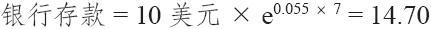
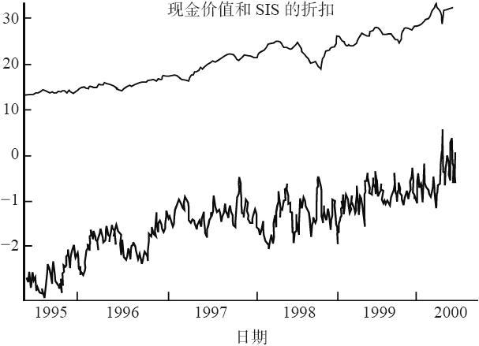
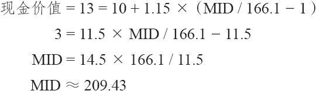

# 32.5　SIS

我最先注意到的这类结构化产品之一，是在美国股票交易所（AMEX）交易的一种产品，名叫“股指收益证券”（stock index return security，简称为SIS）。它的交易代码也是SIS。这个产品在1993年发行，2000年到期，因此，我们对它的运动有一部完整的历史。它的条款如下：标的指数是标普400中市值股票指数（代码：MID）。1993年6月发行时的价格是10美元，发行那天MID的交易价位是166.10，因此，它就是行权价。此外，买家有权利得到MID在行权价之上增值部分的115%。因此，现金价值的公式是：

SIS现金价值=10美元+10美元×1.15×（MID价值-166.10）/166.10

其中：担保价格=10美元

标的指数=标准普尔400中型资本指数（MID）

行权价=166.10

分享率=MID在166.10之上增值部分的115%

SIS在7年之后到期，即2000年6月2日。在发行的时候，7年的利率是5.5%，因此，“银行存款”公式显示出投资者如果使用无风险的政府证券，10美元的投资可以得到大约4.7点：

不过，我们不能简单地说这个内嵌的看涨期权的成本就是4.7点，因为这里的分享率不是100%，它要更大一些。因此，我们需要找出MID的最终价值，它产生的现金价值同“银行存款”所产生的相等。使用现金价值公式，输入除了MID的最终价值之外的所有条款，我们就有了下面的等式。请注意：MIDMIB代表的是从“银行存款”的现金价值产生的MID的价值，正如上面所计算的。

14.70=10+10×1.15×（MIDMIB-166.10）/166.10

求出MIDMIB，我们得到的是价值233.98。现在，将它转换为行权价以上的百分比的增值：

内嵌看涨期权价格=233.98/166.10-1=0.4087

因此，这个内嵌看涨期权的成本就是担保价格的40.87%。在这个示例里，担保价格是10美元，这就意味着这个内嵌看涨期权的花费是4.087美元。

这样，从这个示例里，我们可以构建一个更为概括的计算内嵌看涨期权价值的公式。不过，这个公式只有在分享率是行权价的一个固定的百分比时才起作用。

内嵌看涨期权价值=担保价格×（最后指数价值MIB/行权价-1）

式中，最后指数价值MIB同“银行存款”计算得出的现金价值相等时的最后指数价格；银行存款=担保价格×ert；r=无风险利率；t=到期前的时间。

因此，这个内嵌看涨期权的计算出的价值是将近4.087点，这是一个刚好超过26%的隐含波动率。在这个时候，MID的场内短期期权的隐含波动率大约是14%，因此，就它的初始成本而言，这个看涨期权是相当昂贵的。

不过，你应当记得，拥有SIS使得投资者在7年中得到比MID本身的增值还要大的收益，而且几乎没有风险。这也是一种价值。

事实证明，MID在这7年的时间内相当强势，SIS最后每份价值30美元。因此，结局是，SIS的拥有者在7年中资产价值翻了3番，而且在一开始的时候就没有风险。这不是一种不好的方案。

### 32.5.1　股指收益证券跟踪记录

不过，SIS同时告诉我们的还有它在存续期内的交易跟踪记录。图32-1显示了SIS在它存续期内的交易折扣。就是图形下方的那根线条。上方的线条是在同一天相应的现金价值。请注意，上方线条的形状同标普400中型资本指数（MID）的线条形状是完全一致的，因为它只是MID指数同某个运算常数相乘而已。折扣的曲线显得“凹凸不平”，因为它使用SIS的最新价来计算折扣。在现实中，因为SIS是波动率较低的证券，最新价并不总是代表SIS收盘时的买报价–卖报价。不过，这幅图形显示出在图形的左侧（1995年）折扣大于2点，然后逐步减小，直到在接近到期时（2000）达到了零。

图32-1　SIS的折扣交易

至少，这个折扣使得SIS的买家可以在他投资的总收益上加进额外的一个部分。同时，在某些情况里（当MID在行权价之下交易的时候）SIS实际上有一个担保的收益，正如持有债券有利息收入，持有股票有股息收入一样。下面一节中的示例考察了这些情况。

### 32.5.2　SIS在同现金价值打折扣的情况下交易

当SIS在对现金价值打折扣的情况下进行交易时，SIS的买家实际上在下行方向得到某种保护。

【示例32-5】1996年后半年的某一天，MID收盘价为238.54，SIS收盘价为13。在MID的这个价格上，SIS的现金价值是：

现金价值=10+10×1.15×（238.54/166.10-1）≈15.02

所以，SIS的交易价同现金价值有几乎是刚好2点的折扣。这是一个相当大的折扣（15.4%，2/13≈0.154）。

可以从这个角度看待这个问题：投资者就他的投资赚取“额外的”15.4%。这就是说，如果MID在到期日时刚好是这个价格，现金价值就会是结算价（15.02）。换句话说，由MID衡量的“股市”一点都没有改变。不过投资者能够得到15.4%的收益，这是因为他是按折扣价买入SIS的。

事实上，不管MID在到期时在什么价位，投资者都会感觉得到因为用折扣价买入而产生的正面效果。

因此，这个折扣可以而且应该被看作是在拥有这个结构化产品的总收益之外的好处。在结构化产品中，出现这样的对净资产价值的折扣是常见的事。不过，还有另一个考虑它的角度：它提供了下行方向的保护。

【示例32-6】使用同样的价格，MID是238.54，SIS是13，对现金价值15.02有一个15.4%的折扣。另一种分析折扣的含义的观点是把它看作下行方向的保护。换句话说，MID在到期时价格可能下跌，即使是这样，投资者还能够保本。下行方向保护的数量是可以准确地计算出来的。基本上说，投资者想要知道的是，当MID是什么价格时现金价值会是13？

解出下面的MID的方程就可以得到想要的答案：

因此，如果MID的价位是209.43，现金价值就会是13，也就是投资者目前为SIS所付的价钱。这是从238.54的当前价格向下的12.2%的保护。也就是说，即使MID在到期时下跌了12.2%，从当前价格238.54跌到209.43，买入SIS的投资者仍然可以盈亏平衡，因为它的现金价值仍然是13。

当然，这个折扣也可以使用SIS的价格13或15.02来计算，不过，许多投资者宁愿根据标的指数来观察问题，特别是如果标的物是一个流行的、常用的指数，像标普500指数或道琼斯指数。

从图32-1里可以清楚地看到，在这个产品的存续期里，折扣始终存在，直到到期时才略呈直线地缩减掉。

### 32.5.3　SIS按相对担保价格的折扣交易

在前面的示例里，投资者可以按SIS相对它的现金价值计算的折扣而买入SIS。但是，如果股市大幅下跌，在他买入SIS的13美元的价格到担保价格10美元之间，他仍然会有风险暴露。同MID指数自身相比，这个折扣可以减少他的百分比亏损。但是，这仍然是一笔亏损。

不过，有的时候，结构化产品的交易不但对现金价值有折扣，而且对担保价格也有折扣。在SIS早期的交易时期，这种情况经常出现。从图32-1里可以看到，1995年时的现金价值将近11，而SIS的交易折扣要高于2点。换句话说，SIS的交易价低于它的担保价格，而现金价值实际上高于担保价格。出现这种情况，对投资者来说就是一笔“双重红利”。

【示例32-7】在1995年2月，存在下列的价格：

MID：177.59

SIS：8.75

我们暂时不考虑现金价值。如果投资者要按8.75的价格买入SIS，而且在以后的5.5年里一直把它留在手里，一直到到期，那么，在他的8.75美元的投资上，就可以赚得1.25美元，这是一个5.5年的14.3%的收益。至于复合利率，这是一个年复利为2.43%的收益。

考虑到当时无风险的政府债券利率几乎是2.43%的一倍，一个2.43%的收益是不足取的。不过，在这个情况里，你持有一个股市中的看涨期权，只要你拥有这个看涨期权，你每年就可以有2.43%的收益。换句话说，“他们”付钱让你拥有一手看涨期权！在场内期权的世界里，这样的情况是不常见的。

如果我们将现金价值引入这个计算，这里的差异就更加大了。使用177.59的MID价格，计算出现金价值就是：

现金价值=10+11.5×（177.59/166.10-1）≈10.80

因此，在这个时候，当SIS价格为8.75，它实际上是按对现金价值10.80的极大的19%的折扣在交易。即使股市下跌，仍然能保证他至少能获得10美元的担保价格。

在实践中，在现金价值高于担保价格的时候，结构化产品在正常情况下不会同它的担保价格打折扣交易。这种情况出现的情况比较少。

有的时候，股市在这些产品存续的时期下跌幅度比较大。我们可以观察一下这时它们交易中的折扣，看一看如果股市在初始发行日之后下跌的话，它们在股市下行中实际是如何表现的。考虑一下下面这个相当典型的示例：

【示例32-8】1997年，美林发行了一种结构化产品，它的标的指数是日本的日经指数（Nikkei）。在这个时候，日经指数的交易价位是20351，因此，这就是行权价。分享率是日经指数在20351之上增值部分的140%，这是一个很吸引人的分享率。这个结构化产品的交易代码是JEM，它设计的到期日是5年之后，即2002年6月14日。

后来的事实证明，这实际上是在日本市场的顶峰。到1998年10月，全球市场在处理俄罗斯债务和美国的一家主要对冲基金的失败方面面临难题，日经指数暴跌到13300。因此，单是要回到行权价，日经指数的价格就必须上涨50%。因此，看上去JEM不可能比它所担保的10美元价值多出多少。

因为有了实际的JEM的历史价格数据，我们可以回过头来看看市场是如何看待这种情况的。在1998年10月，JEM实际在8.75交易，只比它的担保价格低1.25点。这个折扣等于3.64的年复合利率。换句话说，如果投资者按8.75买入JEM，它在40个月之后按10美元到期，那么，他的收益就会是为3.64%的年复合利率。从它自身看，这似乎微不足道，但是，投资者必须记住，他同时也就日经指数持有一个看涨期权，这个期权在上行方向有140%的分享率。
