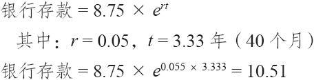

# 32.6　在标的物以折扣价交易时计算内嵌看涨期权的价值

当结构化产品自身在相对它的担保价格打折扣交易时，我们有可能计算出内嵌看涨期权的价格吗？是的，前面展示的公式任何时候都可以用来计算内嵌看涨期权的价值。

【示例32-9】我们再使用一次JEM这个日经指数结构化产品的示例，回想一下，它的担保价格是10美元，不过目前是按8.75美元的价格在交易，到期日是40个月之后。假设当时的无风险利率是5.5%。假设用连续复利，今天投资的8.75美元在40个月之后会价值10.51。

因为这个结构化产品在到期时价值为10，看涨期权的价值就是0.51。

还有另一个几乎相等的方法可以用来决定这个看涨期权的价值。它涉及如果这个结构化产品完全是发行经纪商的零息债券，它将在什么价位交易。在这个价值同这个结构化产品的实际交易价格之间的差异就是这个内嵌看涨期权的价值。

结构化产品的发行商的信用评级在决定折扣为多少方面是一个重要的因素。读者应当记得，担保价格是否可信取决于发行商的信用等级。在到期日要支付现金结算价值的是发行商，而不是上市交易这个产品的交易所，也不是任何的清算所或其他企业。
