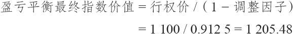
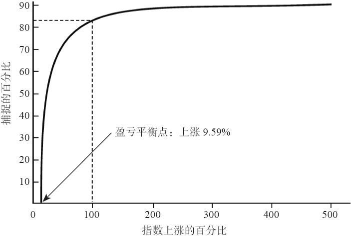
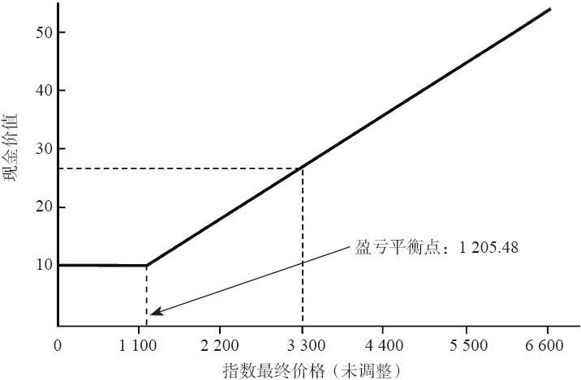
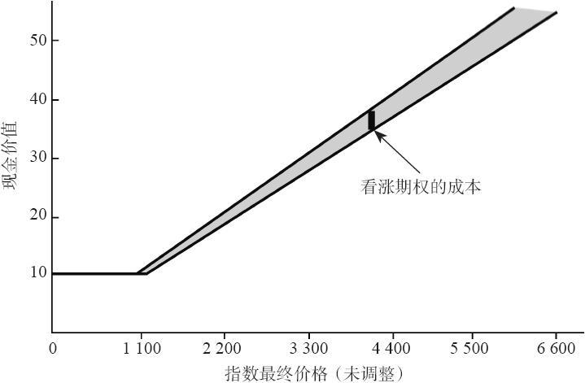

# 32.7　调整因子

近年来，有的结构化产品在发行时使用一个调整因子（adjustment factor）。调整因子对投资者一般而言是一个负面的因素，尽管发行商想要用让人无法发现其实际含义的复杂语言来装饰它。简单地说，调整因子就是一个乘数（小于100%），这个乘数在计算最终现金价值之前用在标的指数的价值上。调整因子大概是在指数期权的隐含波动率开始比以前高得多的水平上交易的时候（从1997年起）出现的。

【示例32-10】一个结构化产品是按10美元的价格发行的。从表面上看，凡是标普500指数在1100.00的价位以上的增值部分他都可以分享。但是，仔细考察一下，这个产品真正提供给投资者的是分享在一个调整价值之上的标普500指数（SPX）的增值部分，这个调整价值是SPX价格的一个百分比，而不是实际价格的本身。产品说明书中对现金价值结算公式的说明是：

现金价值=10+10×（调整的SPX-1100.00）/1100.00

这个公式看上去同这一章前面的“普通”的现金结算公式相似，不过，我们还没有给“调整的SPX”下一个定义。事实上，它定义为SPX最后价格的一个百分比，在这个示例里它是91.25%。在现实中，产品说明书会谈到有关SPX的最后价格将向下调整所带来的影响，这个调整使用的是一个年度调整因子1.25%。因此，在7年到期之后，总的调整因子将是1.25%乘以7，也就是8.75%。调整的价值因此就是100%减去8.75%，或者说，91.25%。

对投资者来说，这个调整因子是个沉重的负担。它意味着在决定SPX的最后价值会比行权价1100.00高出多少（如果还能够有增值的话）之前，先要减去调整因子的那部分。

【示例32-11】假定SPX在上面那个示例中的结构化产品的存续期内价格刚好翻了一倍。这就是说，它结束在2200.00，刚好是行权价的两倍。在决定现金结算价值之前，SPX必须得到调整：

SPX调整价值=0.9125×2200.00=2007.50

于是最终现金结算价值就以SPX的这个调整的价值为基础：

现金结算价值=10+10×（2007.50-1100.00）/1100.00=18.25

因此，事情并不像你可以预期的那样。虽然SPX指数价格翻了一倍，但你的钱并没有翻一番，而是“仅仅”增长了82.5%。

另一个看待这个问题的方法是：如果指数翻倍，那么，结构化产品的价值就“应当”是初始价格的一倍，或者说20。可是，事实上它的价值是20的91.25%，也就是18.25。

将这个示例再略微延伸一下，假定SPX在到期日时价格翻了三倍，变成了3300。在这样的情况里，现金结算价值就会是：

SPX调整价值=0.9125×3300.00=3011.25

现金结算价值=10+10×（3011.25-1100.00）/1100.00=27.375

或者，换一个角度，如果指数价格翻了三倍，那么，这个结构化产品的价值（在使用调整因子之前）就会是它的初始价格的三倍，即30，那么30×0.9125=27.375。

这个示例开始的时候只是展示这个调整因子会有多么沉重。请注意，如果标的物翻倍，你到手的钱并不是“翻倍”的数字减去8.75%（调整因子），而是“翻倍”的数字减去这个数字乘以调整因子（17.5%）。如果是翻三倍，你的收入就要减少3×8.75%，或者说26.25%（也就是说，这个结构化产品的价值变成了27.375，而不是30。因此，百分比的增值是173.75%，而不是200%，按照初始投资而言，这里有一个26.25%的区别）。怎么会这样呢？这是因为在计算盈利（现金结算价值）之前，调整因子已经被运用到SPX的价格上了。

### 32.7.1　盈亏平衡的最终指数价值

在进一步讨论调整因子之前，我们需要再说明一件事：除非是标的物在到期时价值增值了至少是一个固定的数量，结构化产品的持有者所能得到的就只是它的基础价值。换句话说，标的物的价格必须增长到一定程度，它的最终价格乘以调整因子才会大于结构化产品的行权价。我们将这个价格称作盈亏平衡的最终指数价值。

让我们用一个示例来说明这个概念。

【示例32-12】正如在前面的示例里，假定这个结构化产品的行权价是1100，调整因子是8.75%。在什么样的价格上最终现金结算价值才会大于基础价值10呢？这个价格可以用下面的简单方程计算出来：

一般而言，标的指数的价值必须增长到一定的数量才能实现盈亏平衡。在这个示例里，这个数量是：

1/（1-调整因子）=1/0.9175=1.0959

换句话说，标的指数的价值在到期时必须增长9.5%以上，才能刚好克服调整因子的作用。如果指数增值的数量小于这个数目，这个结构化产品的持有者在到期时就只能满足于他的基础价值（10）了。

前面的示例全都显示出调整因子不是一件小事。一眼看上去，投资者也许不会意识到它会带来多大的负担。说到底，你会问自己，每年1.25%有多大关系吗？但是，投资者看到了，它确实有关系。事实上，我们在上面的示例甚至没有包括其他的当投资者的钱处于风险时他会面临的成本，也就是持有成本，或者是如果他只是把钱存在银行里的话会得到什么样的收益。

### 32.7.2　衡量调整因子的成本

随着标的物的增值，调整的幅度也会增加。这是一个不寻常的概念。我们知道，结构化产品在一开始的时候就有一个内嵌的看涨期权。在这一章的前面，我们试图给期权定价。不过，随着调整因子概念的引进，我们发现看涨期权的成本原来不是一个固定的数量。它的变化取决于标的指数的最终价值。事实上，期权的成本是指数最终价值的一个百分比。因此，在一开始无法真正为它定价，因为我们不知道指数的最终价格会是什么。事实上，我们不得不停止认为这个期权的成本是一个固定数目的想法。如果你愿意，你可以称它为一个几何成本，因为它随着标的物的增值而增值。

也许，我们可以换一种方法来思考这个问题，用形象化的方法显示出，如果这个成本按比率来表示，那它会是什么样的。图32-2比较了前面示例里的结构化产品所捕捉住的指数中的增长率。图形中的x轴是指数的增长率。y轴是结构化产品实现的增长率。条款同前面示例相同。行权价是1100，总的调整因子是8.75%，结构化产品的担保价格是10。

虚线说明了前面显示的第一个示例，当指数价值翻倍（100%的增长），将价值带到2200，结构化产品价格因此增值83.5%。因此，这一个点位（100%，83.5%）是在图形线条中上虚线相交的地方。

图32-2　结构化产品所捕捉住的增长率

图32-2指出了如果标的指数在结构化产品的存续期内只有小量增值，投资者能够捕捉住的百分比增长是多么的少。我们已经知道，单是为了达到盈亏平衡的最终价格，指数就必须增长9.59%。这个点位是图32-2中曲线同x轴相交的地方。

在盈亏平衡价格之上，图32-2中的曲线增长迅速，然后，在指数的增值达到100%左右的时候，开始变平。它所描绘的是，对于指数中小额的增长率来说，8.75%的调整因子（它是对指数价格向下的调整）占去了大部分的增长率。只有当指数价格翻了一倍左右的时候，曲线才不再如此迅速地上升。换句话说，指数的价值增长得已经足够多了，因此，结构化产品（它永远不可能捕捉住全部的增长率）现在捕捉住了大量的指数价值增值。

在此之后，图32-2的曲线就急剧变平。在91.25%的时候就几乎完全变平。这就是说，指数已经增值到足够的程度（大约3000%或者更多），这时结构化产品最终现金价值将反映出指数自身全部增值的91.25%。这种增长率在7年中基本上是不可能达到的。在现实中，如果指数有所增值，它的增长也许同图32-2中x轴所显示的价值更成比例。在这些情况里，特别是在增长100%或更少的情况中，调整因子的压力会显著地损害这个结构化产品的收益。

如果有用的话，你可以用另一种方式来将图32-2形象化。用实际的指数价值：2200、3300，4400，5500和6600来代替x轴上所显示的价值：100，200，300，400和500。这样，x轴就代表了这个指数的最终价值（在调整之前）。这有助于说明指数必须得上涨多少才能克服下行的调整。

图32-3显示了对到期日的指数价值同结构化产品的现金价值进行比较的一种更通用的观点。例如，虚线显示出，当指数（未调整的）的最终价值是3300时，结构化产品的最终现金价值是27.375，正如前面的示例所显示的。图32-3中的线条看上去像是持有一个看涨期权的线条：风险有限，上行方向有很大的潜在盈利。从这幅图形中，要说明调整因子对结构化产品的价值有如此重要的压力，就要困难得多。图32-2和图32-3从数学角度说都是正确的。不过，只有图32-2描述了拥有一个有调整因子的结构化产品的真正成本。

图32-3　结构化产品到期时的现金价值

图32-4是关于这个主题的最后一幅图形。它显示了调整的结构化产品的现金价值（跟图32-3中的线条相同）与一条未调整的线条的比较。例如，未调整的线条显示出了如果指数价值翻倍的话，这个结构化产品的价格会真正翻倍。两根线条之间的区别（阴影区域）可以看作是这个内嵌看涨期权的成本，或者，至少是这个调整因子的成本。从图32-4中可以看到随着标的指数价值的增长，这个看涨期权的“成本”是如何增长的。

图32-4　到期时调整同未调整的现金价值的比较
