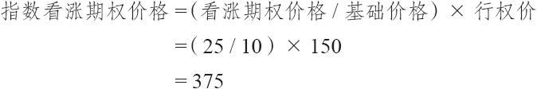
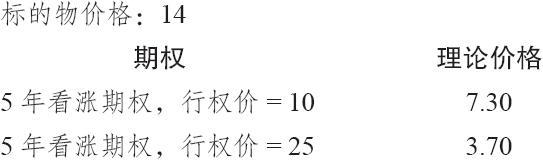
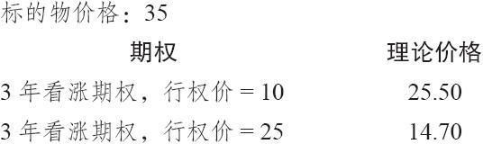
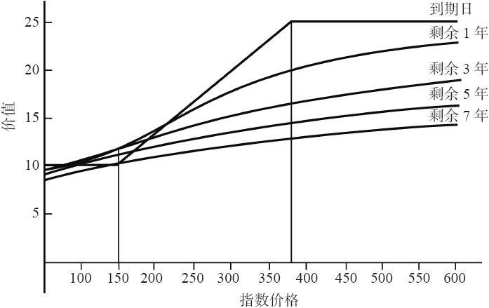

# 32.8　其他构建方法

多年来，创造结构化产品的金融工程师发明了若干种不同的构建方法。有的同价差相似，有的是将两三种不同的产品包装在一起。事实上，凡是有可能想到的都想到了。这里，需要的只是发行商觉得在某个地方有足够的人感兴趣，他因而有可能创造出产品，定出价钱，卖给不管是谁，只要有兴趣的人就行。在这一节里，我们将讨论若干不同的构建方法，也就是那些在过去已经出现在公众市场的产品。

### 32.8.1　牛市价差

有些结构化产品实际上代表的是一种牛市价差。有些情况下，对结构化产品条款的解释同那些最终现金价值用最小和最大价值来界定的看涨期权价差几乎是一样的。例如，它有可能是这样的：

“这个（结构化）产品的最终现金价值同基础价格10相等，加上标的指数超出行权价的所有增值，最高价格不超过20”（行权价在其他地方说明）。

很容易看出这同一个牛市价差有多么相像：正如前面所描写的所有的结构化产品的情况一样，你面临的最糟的结果是拿回10美元，可以假定这是初始价格。然后，最重要的是，在指数价格超出所申明的行权价时，你可以得到一部分增值，这同样也跟前面讨论产品相似。不过，在这里，有现金价值的最高值：20。换句话说，结构化产品在到期时的价值是有天花板的。这同使用10和20这两个行权价的牛市价差完全相同。在现实中，这个结构化产品一定是同使用两个行权价相等的。我们后面会再来讨论。

还有另一种情况，其中，发行商有时也是用结构化产品的条款来说明，但事实上这个产品就是一个牛市价差。产品说明书有可能按照标准的方法来描绘这个结构化产品，但是，它在某个日期可以按某个价格（或者更高的价格）赎回。换句话说，别人有可能在某一天将你的结构化产品买走。事实上，你是针对你的结构化产品卖出了一个行权价更高的看涨期权。因此，通过通常的买入结构化产品以及用更高的行权价卖出一手看涨期权，你就拥有了一个内嵌的看涨期权。这同样也是一个牛市价差的定义。

在分析这种产品的时候，投资者必须注意，这里有两个看涨期权需要定价，不仅是要决定最终价值，而且，更重要的是，是要决定在到期之前，在它的存续期之内，你预计这个结构化产品的交易价会达到什么样的水平。期权策略家知道，如果离到期日还有相当多的时间的话，一个牛市价差不会扩展到实现它最大潜在盈利的程度，除非是标的物的上涨不但超出价差的较高行权价，而且超出许多。因此，投资者应当预计到，这类结构化产品应当有相似的表现。

在这一节剩下的部分里我们将使用这样的一个基于实际“牛市价差”的结构化产品，它是在公开市场中交易的。

【示例32-13】假定这是一个同网络指数相连接的结构化产品。基于指数价值的行权价是150。如果网络指数在7年以后的到期日时价位在150以下，那么，这个结构化产品的价值就是它的基础价格10。这里没有调整因子，也没有分享率因子。这只是一个同前面讨论的较简单的示例中所看到的同样的定义。最终现金价值可以简单地表述为：

现金结算价值=10×（网络指数最终价值/150）

不过，产品说明书也规定，这个结构化产品在它存续期的最后一个月可以按照25的价格赎回。

这个赎回的特征意味着，事实上，在标的物的价格上有一个帽子。在实践中，这个赎回的特征可以发生在较长或较短的时段内，也可以是远在到期之前就可赎回。这些因素只是决定了“卖出”的内嵌看涨期权的到期日。

投资者应当做的第1件事是将行权价转换为与标的指数相等的价格，这样，他就可以看到较高的行权价相对于标的指数价格在哪里。在这个示例里，根据结构化产品的说法，较高行权价是基础价格的2.5倍。因此，按指数的说法，较高行权价就是行权价的2.5倍，或者说375：

因此，如果网络指数上涨到375之上，赎回的特性就会被“实施”（也就是说，卖出的看涨期权就会变成实值的了）。我们可以预计到结构化产品在到期日交易的价值将等于基础价格加上行权价为10和25的牛市价差的价值。

对牛市价差进行定价。正如单行权价的结构化产品包含了一个内嵌的看涨期权，它的价值可以推导出来，双行权价的结构化产品也是这样。相同的分析方法可以用下面的等式：

“理论”现金价值=10+牛市价差价值-持有成本

持有成本指的是持有基础价格（在这个示例里是10）的成本。

使用一个期权模型以及对牛市价差的知识，交易者可以计算出这个结构化产品在它存续期内任何时候的理论价值。此外，交易者可以决定它究竟是昂贵的还是便宜的，这个因素会导致是否要买这个结构化产品的决定。

【示例32-14】假定网络指数在价格210交易，我们预计这个结构化产品会在什么价位上交易？答案取决于已经过了多少时间。假设自从这个结构化产品发行以来已经过了2年（因此，在这些期权中还剩下5年时间）。

当网络指数在210时，它比这个结构化产品的较低行权价150高出40%。因此，这个结构化产品的相等价格是14。另一种计算这个价格的方法是使用现金价值公式：

现金价值=10×（210/150）=14

现在，我们可以使用布莱克–斯科尔斯（或者其他的）模型来对这两个看涨期权进行定价，一个的行权价是10，另一个的行权价是25。使用预计的波动率50%，再假设标的物价格是14，这两个看涨期权的价值大致为：

因此，这个牛市价差的价值就大致是3.60（7.30减去3.70）。这个结构化产品于是就会是13.60（基础价格10，加上这个价差的价值）：

“理论”现金价值=10+3.60-持有成本=13.60-持有成本

说结构化产品的价值实际低于现金价值，听上去似乎有些奇怪。但是，这是因为其赎回的特征而引起的：它将这个结构化产品的价值降低到现金价值公式所指出的价值之下。

有了这些信息，我们就可以预测出这个结构化产品在到期之前任何时候的交易价格。现在，我们来看一个更为极端的示例，其中，这个网络指数大幅上涨。

【示例32-15】假定网络指数在这个结构化产品到期之前所剩的4年时间里上涨到了525。这就大大超出了指数相等看涨期权价格375。同样，有必要先用获益率或者现金价值公式将指数价格转换为结构化产品的相等价格：

现金价值=10×（525/150）=35

同样，使用布莱克–斯科尔斯模型，我们可以得出下列的理论价值：

现在，这个牛市价差的价值是10.80（25.50减去14.70）。实值程度最深的期权是按几乎接近持平的价格交易的，但是，这个（卖出）的期权只有10点的实值，因而仍然有相当大的时间价值，因为离到期还有3年的时间：

“理论”现金价值=10+10.80-持有成本=20.80-持有成本

因此，即使网络指数的价位是525，远远高于相等看涨期权价格375，这个结构化产品预计还是会按远远低于它的最高价格25之下的价格交易。

图32-5显示出在一个宽的价格范围和不同的到期日的价值。读者可以清楚地看到，除非离到期日很近，或者是标的指数上涨到非常高的价格，否则结构化产品的价格离它的最大价格25都一直相当远。特别是，注意一下当指数价位在较高行权价375时（图形中有一条垂直线帮助辨认这些价值），这个牛市价差产品的理论价值是哪里。无论是哪种情况，这个结构化产品的价值都没有到过20，在离到期日较远的时候，它的价值甚至不到15。因此，由于赎回的特性，整个产品在上行方向的潜在盈利受到非常大的限制。

图32-5　牛市价差结构化产品的价值

图32-5中的曲线假设波动率为50%。如果波动率在这个结构化产品的存续期内有显著的变化，那么，这些价值也会发生变化。如果波动率降低，曲线就会升高，更接近于“到期日”的线条；如果波动率增高，曲线就会更加朝下。

### 32.8.2　多重到期日

有些情况下，在结构化产品发行时涉及不止一个到期日。这些产品同在这一章最先讨论的那些简单的示例非常相似。不过，到期日在这里不是局限于一个日期，用来决定结构化产品的最终现金价值的最终指数价值是标的指数在两个或三个不同的日期的价格的平均值。

例如，某只这样的场内产品是在1996年发行的，它使用标普500指数（SPX）作为标的指数。同一般情况相同，行权价是SPX在发行日的价格。不过，它有三个到期日，分别在2001年4月、2002年8月和2003年12月。用来决定现金结算价值的最终指数价值是SPX在这三个到期日的收盘价的平均值。

事实上，这个结构化产品实际是3个结构化产品的总和，其中每一个到期日都不同。因此，其中的每一个内嵌看涨期权的价值都可以用上面展示的方法分别进行计算。然后取这3个价值的平均值，用它来决定这个结构化产品的内嵌看涨期权的总价值。
