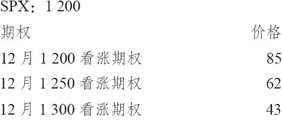

# 32.9　涉及结构化产品的期权策略

因为前面介绍的结构化产品同我们熟知的期权策略（买入看涨期权和牛市价差等）相似，因此，有可能将场内期权同结构化产品结合起来使用，以产生其他的策略。这些策略实际上相当简单，它们遵循本书前面章节所讨论的那些调整策略的逻辑。

【示例32-16】假定投资者在不久前买入了15000份的某个结构化产品。它从本质上说是一个标普500指数（SPX）的看涨期权。这个产品的发行价是10，这也是它的担保价格。行权价是700，这也是当时SPX的交易价格。不过，现在SPX的交易价位是1200，远远高于行权价。这个产品的现金价值是：

10×（1200/700）≈17.14[1]

另外，假定在这个结构化产品到期之前还有2年的时间，投资者对市场有些感到不安。他想要卖掉他持有的这个结构化产品，或者是对他的头寸进行对冲。不过，这个产品自身的交易价格是16.50，同它的理论现金价值有64美分的折扣。他并不是很想按这样的折扣卖掉，但是他意识到在目前的价格同担保价格10之间有很大的风险暴露。

他或许可以考虑就他的头寸卖出一个看涨期权。这就可以将它转换为同牛市价差相等的头寸，因为通过拥有这个结构化产品，他已经持有同一手买入看涨期权相等的头寸。假定他到交易SPX期权的芝加哥期权交易所去询价，发现了在12月到期的6个月的期权上有下面的价格：

假定他觉得价格为62点的12月1250看涨期权比较合适，那么，他需要就他的头寸卖出多少手看涨期权才能得到一个稳妥的对冲呢？

首先，投资者必须计算出一个乘数，可以告诉他多少份结构化产品同1“股”SPX相等。在简单的示例中，可以用担保价格除以行权价而得到。

乘数=行权价/基础价格

=700/10=70

这就意味着买入70份结构化产品等于买入1股SPX。为了证实这一点，假定投资者最初按10的价格买入了70份结构化产品，当时SPX的价位是700。后来，假定SPX价格翻了一倍，到了1400。由于这个产品的简单结构，它有100%的分享率，没有调整因子，因此它的价格也应当翻倍到20。因此，70份用10买入的份额按20卖出就可以产生700美元的盈利。至于SPX，每股用700买入用1400卖出指数也可以产生700美元。这就证实了70对1的比率是正确的乘数。

于是这个乘数可以用来计算按SPX来衡量的与当前的结构化产品头寸相等的头寸。回忆一下，这个投资者最初买入了15000股。因为乘数是70对1，15000股就等于：

SPX相等股数=所持结构化产品股数/乘数

=15000/70=214.29

这就是说，在目前的价格上，拥有这些结构化产品的份额同拥有214股SPX相等。因为一个SPX看涨期权是一个100“股”SPX的期权，因此投资者就应当卖出2手看涨期权（经过四舍五入）来对结构化产品的盈利对冲。因为SPX 12月1250看涨期权的售价是62，这就为他带进了12400美元（减去手续费）。

请注意，卖出这些看涨期权在12月到期日之前事实上在这个投资者总头寸的潜在盈利上“戴了帽”。如果SPX在1250之上有大幅度增值，因为卖出了这2手看涨期权，他的盈利就是“戴了帽”的。因此，他将合成买入看涨期权的头寸有效地转换成了一个牛市价差（如果你愿意的话，也可以说这是一个戴领圈的指数基金）。

在现实中，任何就结构化产品卖出的看涨期权都必须像裸看涨期权那样支付保证金。从根本上说，这15000股结构化产品“保护了”卖出的2手SPX看涨期权，但是保证金规则不承认这种区分。从本质上讲，卖出2手SPX看涨期权构造了一个牛市价差。换一个角度，如果投资者认为这个结构化产品是一个完全为看跌期权所保护的买入指数的头寸（这是另一个考虑问题的方法），那么，卖出这个场内的SPX看涨期权就产生了一个“领圈价差”。

当然，如果投资者的账户里需要保证金的话，他可以卖出2手以上的SPX看涨期权，这就会创造出同一个看涨期权比率价差（call ratio spread）相等的头寸，而且会带有这个策略的特性：当价格等于卖出的看涨期权的行权价时潜在盈利最高，下行方向潜在盈利有限，但如果SPX迅速地大幅上涨，从理论上说就有无限的上行方向的风险。

在任何一个这些卖出期权的策略里，针对他的结构化产品，投资者也许应当周期性地和持续地卖出虚值的、短期的看涨期权。如果标的指数在这些卖出的期权的存续期内没有迅速上涨，这样一个策略就能够产生很好的结果。不过，如果指数涨过卖出的看涨期权的行权价，这样的策略就会减少结构化产品的总收益。

改变行权价。如果投资者想的话，他可以使用的另一个策略是建立一个看涨期权垂直价差（vertical call spread），从而有效地改变这个（内嵌的）看涨期权的行权价。例如，如果自从买入这个产品之后，市场有大幅的上涨，这个内嵌的看涨期权从理论上说就会有很好的盈利。如果投资者将它卖掉，再买入另一手行权价更高的相似的看涨期权，他就有效地将他的看涨期权向上挪仓。这样做可以提高行权价，同时大幅地降低下行的风险（代价是略为减少了上行方向的潜在盈利）。

【示例32-17】使用同前面的示例相同的产品，假定拥有这个结构化产品的投资者想要采取另一种方法。在前面的示例里，他对通过卖出略为虚值的场内看涨期权来有效地生成一个领圈的头寸或者一个牛市价差这样的可能性进行了评价。这样做的问题是，它限制了上行方向的潜在盈利。如果市场继续上涨，他所能分享的只有到较高行权价的增值（加上收入的权利金）。

一种更好的选择可以是将他的内嵌看涨期权向上挪仓，从而提走头寸中的一部分资金，但仍然保持上行潜在盈利。读者应当记得，这个结构化产品有下列的条件：

担保价格：10

标的指数：标普500指数（SPX）

行权价：700

正如在前面的示例里那样，投资者拥有15000份结构化产品。此外，假定离结构化产品到期还剩下2年，目前的价格同前面示例里一样：

结构化产品当前价格：16.50

SPX当前价格：1200

为了简化，让我们假设标普指数有2年的长期期权（LEAPS），它们的价格是：

标普500指数2年长期期权，行权价700：550

标普500指数2年长期期权，行权价1200：210

在现实中，标普500指数长期期权通常是减值的期权，意思是，它们是指数价值的1/10，因此，售价也是1/10。不过，为了这个理论上的示例，我们假设存在这里显示的全值的长期期权。

在前面的示例里，我们显示过，投资者要交易2手看涨期权，才能同他的结构化产品中内嵌的看涨期权的数量相等。因此，这个投资者要买入2手1200看涨期权并卖出2手700看涨期权，从而将他的行权价从700挪到1200。每手挪仓可以带进两倍的340点；或者说，68000美元，减去手续费。

可以看到，因为行权价之间的差别是500点，而只收入了340点，他在这个向上挪仓中还留了一些东西“在桌子上”。在向上挪仓时这是常见的：投资者失去了垂直价差中的时间价值。不过，从所实现的成果这个角度来看，投资者仍然会发现这样的挪仓是值得的。他现在将看涨期权的行权价提升到了1200，以标普500指数为基础，而且在这样做时收进了68000美元。因为他拥有15000份结构化产品，这就意味着他每份收入了4.53（68000/15000）。现在，举个例子，如果标普500指数在今后2年里暴跌，在到期日跌到了700之下，他仍然可以每股收回10美元的担保价格，再加上从挪仓中得到的4.53美元，也就是说，一个总数为14.53美元的“担保”价格。因此，他在下行方向保护了自己。

不过，请注意，他在下行方向的风险并没有完全消除。这个结构化产品眼下的价格是16.50，它在现有标普500指数的价位上的现金价值是17.14（见前面示例中对此的计算），因此，在这些价位向下到14.53美元的价格之间，他还是有风险的。

他的上行方向的盈利仍然是没有限制的，因为他净买入了2手看涨期权：标普500指数2年长期看涨期权，行权价为1200。他卖掉的2手行权价为700的长期看涨期权有效地将行权价为700的结构化产品中的内嵌看涨期权给抵消掉了。

这个示例显示了投资者在标的物上涨之后，如何能够有效地将他的结构化产品的行权价向上挪仓到更高的价格。每个投资者必须自己决定，是否值得为所得的下行方向的额外保护而牺牲潜在盈利。当然，这在很大程度上取决于场内标普500指数的价格，而这个价格反过来又取决于类似波动率和到期时间等因素。

当然，同在前面两个示例里一样，对有大量盈利积累的结构化产品的持有者来说，还有另一种选择：他可以卖掉手里的产品，买入另一个行权价更接近标的指数当前市场价的产品。当然，并不是总有可能这样做。不过，只要每隔几个月就有这样的产品被发行商引入市场，那么，就会有许多行权价可以选择。换成另一种结构化产品可能出现的缺点是，投资者有可能不得不延长他的持有期，不过，这未必一定就是坏事。

如果标的指数在买入结构化产品之后下跌的话，我们所面临的就是另外一种情况。在这样的情况里，投资者拥有一个合成看涨期权，这个期权有可能相当深度地虚值。使用场内看涨期权价差从理论上说有可能降低这个看涨期权的行权价，这样，如果出现上涨运动，就更容易产生盈利。在这样一种情况里，投资者可以卖出一手行权价等于这个结构化产品行权价的场内看涨期权，同时买入一手行权价更低的场内看涨期权，它同目前的市场价值更为相近。换句话说，他要买入一个场内看涨期权牛市价差，同他的结构化产品相匹配。当然，无论他为这个看涨期权牛市价差所付的支出是多少，都会增加他在下行方向的风险。不过，作为回报，他获得了如果标的指数的价格上涨到新的、较低的行权价之上，就可以更快获得盈利的能力。

当然，还可以构建出许多其他的涉及场内期权和结构化产品的策略。不过，这里所讨论的这些策略是一个投资者应当考虑的基本策略。要分析一个策略，只需要记住，这类结构化产品只不过是一个合成的买入看涨期权的头寸。一旦把握了这个概念，那么，任何由此产生的涉及场内期权的策略就都不难分析。例如，买入一个行权价基本同结构化产品的行权价相等的场内看跌期权，会生成一个同买入跨式价差相似的头寸。读者可以自己去理解和分析其他类似的策略。

[1] 疑原文有误，原文为17.4。——译者注
