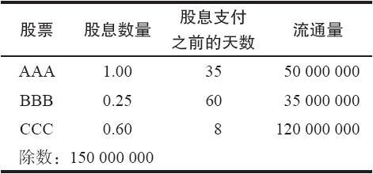
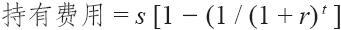
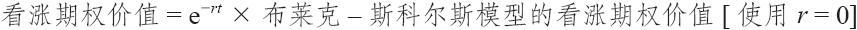
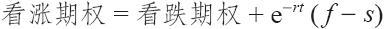
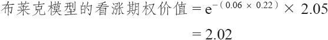
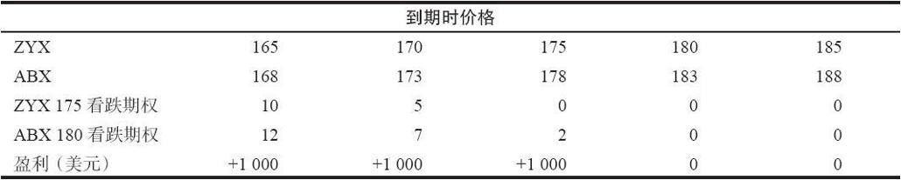
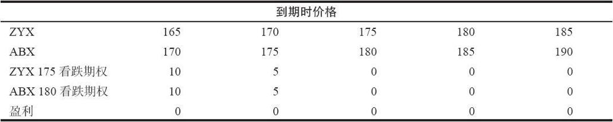
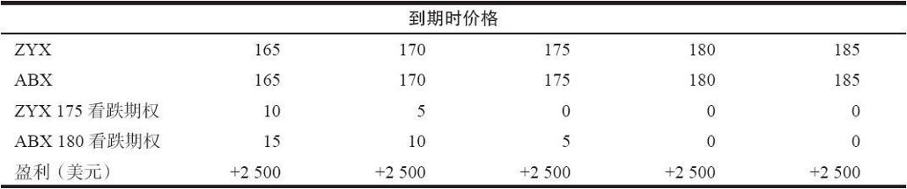

# 33.2　数学应用

下面的材料旨在为论述数学应用的第28章提供一些补充。指数期权有一些独特的属性，在想要通过模型预测它们的价值时，必须将这些特性考虑在内。

布莱克–斯科尔斯模型仍然是首选的期权模型，即使在指数期权上也是如此。虽然有其他的模型出现，但是布莱克–斯科尔斯模型似乎仍然能够提供准确的结果，而不必涉及大部分其他模型的极度复杂性。

### 33.2.1　期货

使用模型来预测大部分期货合约的合理价值是一项困难的任务。在处理这个任务方面，布莱克–斯科尔斯模型没有什么用处。读者应当还记得，我们在前面看到过，指数期货的合理价值可以通过计算股息的现值以及弄清期货合约同买入指数中实际股票相比而节省的持有成本来计算出来。

### 33.2.2　现金交割的指数期权

市值加权指数的期货合理价值模型需要知道指数中每只股票的准确股息、股息支付日以及市值（对价格加权指数来说，不需要知道市值）。这是得出模型使用的准确股息的唯一途径。在使用布莱克–斯科尔斯公式之前，对所有其他的指数，都必须进行同样的股息计算。

在实际的模型中，对现金交割指数期权来说，使用股息的方法同在股票期权中使用股息的方法相同。从指数的价格中减去股息的现值，使用调整的股票价格来对模型进行评价。在股票期权中，还有一种选择：将到期时间缩短到同除息日相等，在指数期权中这种方法行不通，因为有许多除息日。

我们来看一个示例，它使用的假想的股息信息和指数同我们在第30章讨论股票指数对冲策略时所使用的相同。

【示例33-4】假设我们有一个由3只股票组成的市值加权指数。下面的表格提供了这3只股票的同股息和流通量相关的信息。

交易者首先计算出每只股票的股息的现值，乘以流通量，然后再除以指数的除数。每只股票计算结果之和为这个指数的总股息。这个指数的股息的现值是0.8667美元。

假设这个指数目前的交易价是175.63，我们想要计算7月175看涨期权的理论价值；这样，使用布莱克–斯科尔斯模型，我们可以进行下列的计算：

（1）从现有股票价格175.63中减去股息的现值0.8667，得出调整的指数价格174.7633；

（2）使用174.7633作为股票价格来评估这个看涨期权的合理价值。所有其他的变量都同它们在计算股票期权中一样，包括无风险利率的实际价值（例如，10%）。

使用套利的模型，看跌期权的理论价值的计算方法同股票期权理论价值的计算方法相同。对现金交割指数期权来说这就足够了，因为有可能（尽管困难）通过买入或卖出整个指数来对这些期权进行对冲。因此，这些期权应当反映出这些套利的潜在性。当然，看跌期权的价值应当反映出对这个指数的股息套利的潜在性。在第28章讨论的套利评价模型需要使用股息，对于这些指数看跌期权，交易者需要使用指数上股息的现值，同在评估看涨期权的前一个示例中一样。

### 33.2.3　隐含的股息

如果交易者无法知道得出计算“股息现值”所必需的所有股息信息（也就是说，如果他是个人投资者或公众客户，他没有订阅基于计算机的股息“服务”），那么，他还是有一种办法，可以对股息的现值进行估计。他所需要的只是对做市商所知道的股息现值进行假设，并且根据这个假设来给期权定价。个体的公众客户可以使用这个信息来推导股息的大小。

【示例33-5】OEX的交易价是1400，6月期权还有30天到期，短期利率是10%，有下面的价格存在：

6月1400看涨期权：38.00

6月1400看跌期权：30.00

交易者可以使用布莱克–斯科尔斯模型的迭代演算来决定OEX的“股息”是多少。在这个情况里，根据计算的结果，它大致是2.10美元。

简单地说，下面就是交易者需要采取的步骤，以发现这个股息：

（1）假设股息为0.00美元；

（2）使用假定的股息，使用布莱克–斯科尔斯模型以发现看涨期权的隐含波动率，看涨期权的价格是已知的（在上面的示例里是38.00）；

（3）使用从第2步得出的隐含波动率和假设的股息，从第2步结束时布莱克–斯科尔斯模型计算中得出的满足套利条件的看跌期权的价值是否大致等于这个看跌期权的市场价值呢（上面的例子中是30.00）？如果是，你的工作就完成了。如果不是，在假设的股息上增加某个标准量，例如0.10美元，再回到第2步。

这样，即使得不到完整的股息信息，投资者也可以使用市场提供的信息来估计一个指数期权的股息。投资者的唯一假设是做市商应当知道股息是多少（几乎可以肯定他们确实知道）。请注意，期权的隐含波动率是在决定隐含股息的同时决定的（上面的第2步）。这个简单的“隐含股息计算器”是一个有用的工具，它可以加到任何一个使用布莱克–斯科尔斯模型的软件中去。

### 33.2.4　欧式行权

在处理欧式行权中，交易者基本上不去注意实值看跌期权的最小价值是它的内在价值这个事实。欧式行权的看跌期权可以按照同内在价值有贴水的价格交易。从一个转换组合的角度考虑一下这样的情况。如果交易者买入股票，买入看跌期权，并且卖出看涨期权，他就有一个转换组合。如果这是一个欧式行权的期权，他就不得不将这个期权一直持有到到期日才能将它平仓。他不能提前行权，也不会被提前指派。因此，他的持有成本始终是到期前的最大值。这些持有成本就是看跌期权价值的贴水部分。

对一个深度实值的看跌期权来说，这个贴水等于将这行权价一直保持到到期日所需要的持有费用：

实值程度没有那么深的看跌期权，也就是说，那些delta小于-1的看跌期权，不需要这个完整的贴水因子。在这种情况下，投资者可以将贴水因子同这个看跌期权的delta的绝对值相乘，以得出适当的贴水因子。

### 33.2.5　期货期权

布莱克模型（Black model）是一个修正过的布莱克–斯科尔斯模型，它可以用来对期货期权进行定价。读者可以参见论述期货的第29章中对期货的讨论。这个修正基本上是这样的：在布莱克–斯科尔斯模型中使用0%作为无风险利率，得出一个看涨期权的理论价值；然后对这个结果进行贴现。

布莱克模型：

式中　r——无风险利率；

t——以年计算的距离到期的时间。

期货看涨期权理论价值同看跌期权理论价值之间的关系也可以根据这个模型进行讨论：

式中　f——期货价格；

s——行权价。

【示例33-6】有下面的价格存在：

ZYX现货指数：174.49

ZYX 12月期货：177.00

离到期还有80天，ZYX的波动率是15%，无风险利率是6%。

为了计算ZYX 12月185看涨期权的理论价值，需要采取以下的步骤。

（1）使用行权价185，股票价格177.00，波动率15%，所剩时间0.22（80/365）和利率0%，用标准布莱克–斯科尔斯模型进行定价。请注意，在这个模型里作为股票价格输入的不是指数价格，而是期货价格。

假定由此产生的结果是2.05。

（2）对步骤1的结果进行贴现：

在这个情况里，布莱克模型同布莱克–斯科尔斯模型之间的差别相当小（3美分）。不过，对长期期权或者深度实值的期权来说，这个贴现因子是相当大的。

我们在第28章论述数学应用时讨论过的其他有数学性质的项目对指数期权也都适用，不需要进行改动。预期收益和隐含波动率的意义是相同的。隐含波动率可以通过使用上面阐明的布莱克–斯科尔斯公式计算出来。

中性头寸的含义也没有变化。读者应当记得，作为一个副产品，上面所有的对理论价值的计算都提供了期权的delta。在维持一个中性头寸方面，这些delta可以用在现金交割的期权上，也可以用在期货期权上，正如它们用在股票期权中那样。当然，这是通过对等股头寸（在这里，可以是相等“指数”头寸或相等“期货”头寸）的计算而实现的。

### 33.2.6　后续行动

适用于股票期权的各种类型的后续行动也同样适用于指数期权。事实上，当交易者的期权价差是在同一个标的指数上时，这些行动基本上是相同的。不过，当交易者进行指数间价差交易时，还有另外一种类型的有用的后续行动。之所以如此是因为，这个价差的不同结果不光是以一种指数的价格为基础的，还以这个指数同另一个指数的相互关系为基础的。

例如，有这样的可能：一个指数间价差的略为看多的策略即使在指数价格上涨的情况下实际上可能赔钱。当另一个指数的表现不尽如人意的时候，就有可能发生这样的情况。如果交易者使用计算机“勾画”出一幅若干不同结果的图形的话，那么，他对策略的潜在盈利就会有一个更为清楚的认识。

【示例33-7】假设在ZYX和ABX指数之间建立了一个看跌期权价差。用3.00买入了1手ABX 6月180看跌期权，用3.00卖出了1手ZYX 6月175看跌期权，建立头寸的时候ZYX是175.00，ABX指数是178.00。如果ZYX和ABX的价格有显著不同的运动方式，那么，这个价差显然会有不同的结果。

从表面上看，这似乎是一个看空的头寸（买入行权价较高的看跌期权，卖出行权价较低的看跌期权）。不过，如果指数运动得当，即使市场上涨，整个头寸也可能赚钱：例如，如果在到期的时候ZYX和ABX都在179.00，那么，卖出的期权就会无价值到期，买入的期权仍然价值1.00。这就意味着这个价差有1点的盈利，或者说500美元（卖出ZYX看跌期权有1500美元的盈利，减去在ABX看跌期权上的一笔1000美元的亏损）。

反过来看，如果股市下跌，并不一定就能盈利。如果ZYX跌到170.00，而ABX跌到175.00，那么，这两手看跌期权在到期时的价值都是5，因此，在这个价差中既没有盈利，也没有亏损。

为了更好地理解他的头寸，策略家需要一种“滑动尺度”的图形。也就是说，大部分后续图形提供了（例如在到期时）在各种股票或指数价格上整个头寸会有的结果。这仍然是需要的：例如，在这个示例里，交易者想要知道当ZYX价格在165~185之间他的头寸会有什么结果。但是，在这个价差中，还需要有其他的东西：这个结果也应当考虑ZYX同ABX之间的关系如何。因此，交易者需要有3个（或者更多）表格来显示结果，每一个表格都显示了当ZYX的价格在到期日时从165~185时会有的结果。交易者也许首先要显示，如果ZYX低于ABX例如5点的话，这些结果会怎么样；然后，在另一个表格里显示如果ZYX和ABX的相互关系同建立头寸时没有变化的话（3点的差异），这些结果又会怎么样；最后，用另一个表格来显示出如果ZYX和ABX在到期时价格相同的话会怎么样。

如果这两个指数在到期时它们的相互关系是3点的差异，这样的一个表格看上去会像这样：

这幅图形显示出这个头寸是中性到看空的，因为即使指数没有变化，它还是赚钱。不过，将这个表格同在到期时ZYX的价格比ABX低5点的情况进行比较。

在这种情况里，这个价差没有任何潜在盈利，即使市场崩盘了也一样。因此，即使是类似这样的熊市价差，如果指数间的关系发生了不尽如人意的变化，还是有可能赚不到钱。

最后，看一下如果ZYX强劲上涨，赶上了ABX的话，会发生什么情况。

这些表格可以被称作“滑动尺度”表格，因为交易者实际上做的是，每一次在保持ZYX的尺度不动的时候，稍微拉动ABX的尺度。请注意，在上面两个图表里，ZYX的结果没有变化，而ABX则稍微滑动了一些，以显示出不同的结果。对于使用不同的标的指数的期权进行价差交易，或者进行指数间价差交易的策略家来说，这样的图表是必需的。

机敏的读者会注意到，上面的示例可以通过绘制一幅三维的图形来总结。X轴是ZYX的价格；Y轴是价差的盈利金额；Z轴不是“滑动尺度”，而是ABX的价格。有这样的软件，它们可以绘制三维的盈利图，虽然这些图形不是很容易读懂。上面的表格于是就会是这个三维图形的多个水平面。

到这里，我们就结束了论述无风险套利和数学模型的这一章。之前提到，股票期权中的套利行为会影响到股票的价格。这里描述的套利技巧并不影响指数自身。它是通过市场篮子对冲来实现的。我们也知道，在这里不需要对新的模型进行评价。对于指数期权，交易者只需要对标准的布莱克–斯科尔斯模型中使用的股息进行正确的估计。对期货期权的定价，可以通过将布莱克–斯科尔斯模型中的无风险利率设定为0%，再把这个结果贴现，这就是布莱克模型。
