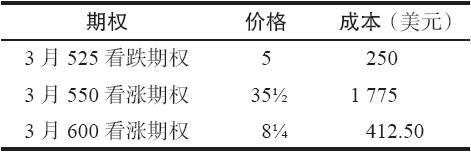
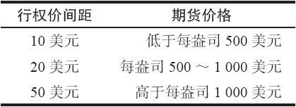
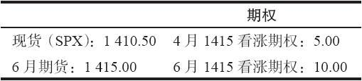
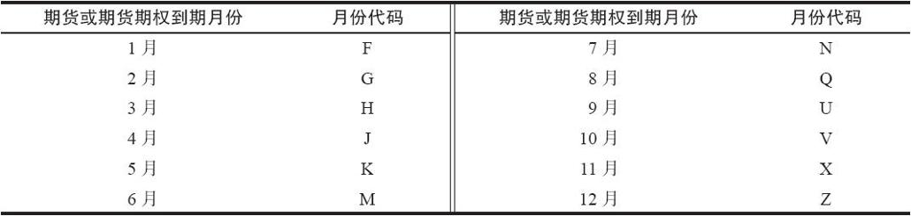
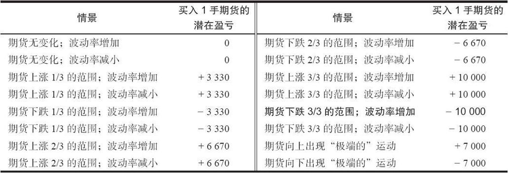
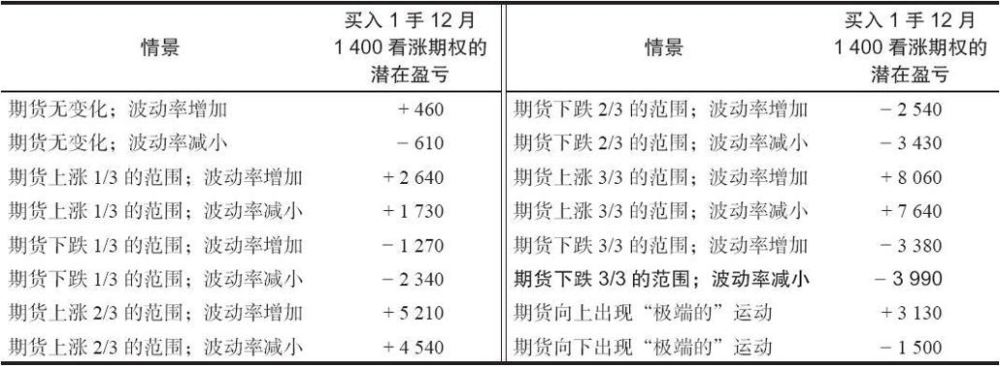
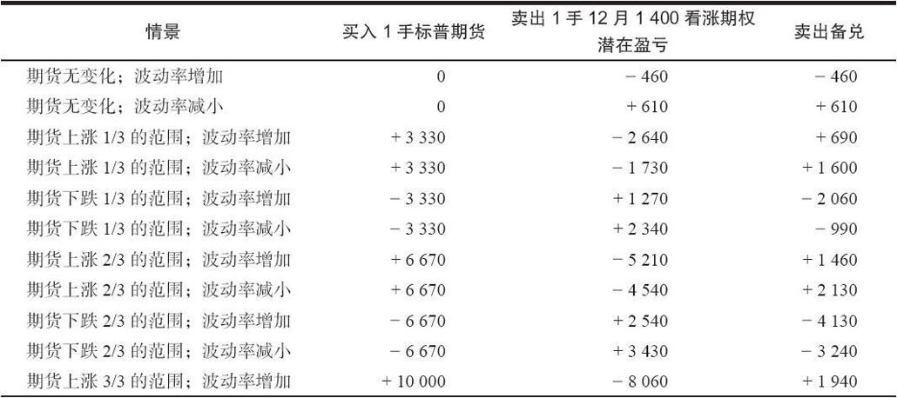
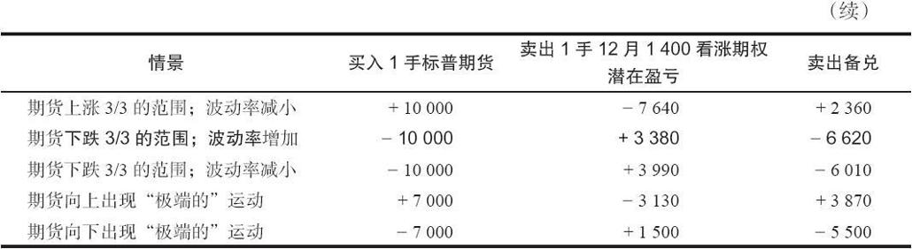
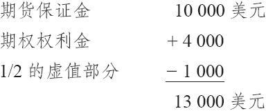

# 34.2　期货期权

在见过指数期货期权的这么多示例之后，读者对于期货期权多少有些熟悉了。期权的商业用途是锁定同一个未来价格相对的最坏情况中的价格。前面示例中的那个美国商人卖出瑞士法郎期货来锁定一个未来的价格。然而，他也许会决定买入瑞士法郎的期货看跌期权来对他下行的风险进行对冲。但是，如果货币市场朝对他有利的方向运动的话，他在上行方向仍然给自己进一步的盈利留下了余地。

### 34.2.1　描述

一个期货期权是一个标的期货合约而不是标的现货商品的期权。因此，如果交易者行权或者指派一手期货期权，他买入或者卖出的是这个期货合约。这些期权通常对应一手标的商品期货合约。同股票期权不同，分股和调整不适用于期货市场。期货期权一般是按与期货本身相同的最小变动价位来交易的（这个规则有一些例外，例如，长期债券期权的最小变动价位是1/64点，而它的期货的最小变动价位是1/32点）。

【示例34-4】我们用大豆期权来说明上面所说的期货期权的特性。

假定3月大豆的售价是575。

大豆是以美分报价的。因此575就是5.75美元，也就是说，每蒲式耳大豆价值5.75美元。一个大豆合约代表5000蒲式耳大豆，因此，每1美分的运动价值50美元（5000×0.01）。

假定有下面的期权价格。期权的成本也罗列在内（1美分价值50美元）。

对期权策略家来说，为了决定某个策略的盈利性，他不一定非要知道实际的成本。例如，如果交易者买入3月600看涨期权，他需要3月大豆期货的价格在到期时高于608.25才能有盈利。这是看涨期权买家在到期时观察他的盈亏平衡点的正常方法：行权价加上看涨期权的成本。为了知道到期时的盈亏平衡价格是608.25，没有必要知道大豆期权每点价值50美元。

如果这个期货是现金交割的期货（欧洲美元、标普500指数，以及其他指数），那么，期货和期权一般是在最后交易日结束时同时到期（实际上，标普500是在第2天早晨开盘时到期）。不过，实物期货的期权是在实际期货合约的第1通知日之前到期，目的是给交易者一定的时间在收到交割通知之前将他们的头寸平仓。期权在标的期货到期之前到期这个事实有一个略为奇怪的效果：期权常常在它代码中显示的那个月份的前一月到期。

【示例34-5】3月大豆期货的期权被称作“3月期权”。它们实际上并不是在3月到期，不过，大豆期货是在3月到期。

大豆期权最后交易日的更拗口的定义是：“在合约月前那个月的最后交易日前的那个最后的星期五之前的至少5个工作日。”

因此，3月大豆期权实际上是在2月到期。假设2月的最后一个星期五是23号。如果在2月19号到23号这个星期的工作日内没有节假日，那么，大豆期权就在2月16号这个星期五到期，它距离2月的最后那个星期五有5个工作日。

不过，如果“总统节”碰巧是在2月19日的那个星期一，那么，在19号到23号的那个星期里只有4个工作日，因此，期权就会在前一个星期五到期，也就是2月9日。

不是那么简单，是吧？最好的办法是有一本可以用于查阅期货和期权到期日的日历。《期货杂志》在它12月那一期中刊登有下一年的日历，在一年的每个月也刊登有月度日历。另外，经纪人也应当能够为你提供这方面的信息。

无论是什么情况，3月大豆期货期权是在2月到期，比3月大豆的第一通知日要早得多，3月大豆期货的第一通知日是在到期月的前一个月的最后的那个工作日（在这个情况里是2月28日）。期货期权的交易者必须小心，不要假设在期权到期日同期货合约的第一通知日之间有很长一段时间。在有的商品中，期货的第一到期日是在期权到期之后的那一天（例如活牛期货）。

因此，如果交易者是买入看涨期权或卖空看跌期权，因而通过行权或指派会得到一个期货合约多头的话，他就必须知道这个期货合约的第一通知日是哪一天；如果不注意，他就会在没有准备的情况下就期货多头头寸而收到交割通知。

### 34.2.2　其他条款

行权价间距。正如不同实物商品的期货有不同的条款一样，这些期货期权也是如此。行权价间距是一个主要的示例。有的期权的行权价间距为5点，有的则只为1点，它们反映出期货合约的波动率。具体地说，标普500指数期货期权的行权价间距为5点，大豆期货期权的行权价间距为25点（25美分），而黄金期货期权的行权价间距为10点（10美元）。此外，正如股票中常常出现的那样，如果商品自身的价格变化很大，这个具体商品的行权价间距也会发生变化。

【示例34-6】黄金是按每盎司多少美元来报价的。根据期货合约价格的变化，行权价的间距也会有变化。目前的规则是：

因此，当黄金期货变得太贵的时候，行权价之间的距离就变得更远。请注意，黄金还从来没有达到过每盎司1000美元的价格，而交易所已经为出现这种情况做了准备。

行权价之间的这种变化在许多商品中都是常见的。事实上，有的商品在改变行权价的间距时，不但会考虑期货自身的实际价格，还会考虑到距离到期还有多少时间。

意识到行权价间距有可能变化（也就是说，在合约接近到期时会有新的行权价出现），对计划有些策略可以有帮助，因为这可以给策略家在使用什么期权对冲或调整头寸方面更多选择。

自动行权。同股票期权一样，所有的期货期权也都有自动行权的规则。总的来说，即使只是实值一个最小变动价位（tick），期货期权也会自动行权。如果你愿意的话，你可以下达指令，让期货期权不要自动行权。

### 34.2.3　系列期权

系列期权（serial options）是指到期月同它们相应的标的期货的到期月不相同的期货期权。

【示例34-7】黄金期货在2月、4月、6月、8月、10月和12月到期。在这些月份也有到期的期权。请注意，这些到期日之间各自相隔2个月。因此，当一个黄金合约到期时，离下一个到期还有2个月。

大部分期权交易者意识到，最活跃的期权系列是最短期的期权。如果最短期的期权离到期有2个月，交易者对它的交易兴趣可能就不大。

意识到这个事实，交易所决定，除了正常的到期之外，需要有一个在最近的非期货到期月份的期权合约，也就是说，最近的那个没有实际黄金期货到期的月份。因此，如果目前是1月1日，那么，就会有在2月、3月、4月等到期月份的黄金期权。

因此，3月期权就会是一个系列期权。没有实际的3月期货存在。事实上，3月期权的行权是用4月期货来结算的。

系列期权的行权是通过在这个期权到期日之后的最短期的实际期货合约来实现的。系列期权的到期合约数量取决于标的商品。例如，根据上面用斜体字标出的定义，黄金始终有至少一个系列期权在交易。有的期货的不同到期日之间有3个月（标普500指数以及所有的货币期权），它们在最短期的、没有实际期货合约对应的2个月份有系列期权。另一方面，白糖每年只有1个系列期权（12月），以衔接在正常的10月和3月白糖期货到期日之间存在的空缺。

策略家在交易可能有系列到期日的期权时，应该对如何评估他的策略特别小心。例如，可以根据标的标普500股指在到期时的价位来计划6月标普500期货期权的策略，因为6月期权的行权导致6月期货合约的交割，而6月期货的结算价格同指数自身在最后交易日的价格是相同的。但是，如果交易者交易的是4月标普500期权，他就必须根据6月期货合约在4月到期日的价位来计划他的策略。4月期权的行权导致在4月到期日得到6月的期货合约。因为6月的期货合约在4月时仍然有一些时间升水，那策略家就无法根据标普500指数在4月的实际价位来计划他的策略。

【示例34-8】标普500股指（代码：SPX）在1410.50的价位交易。有下面的价格存在：

如果交易者用10.00的价格买入6月1415看涨期权，他知道，如果他购买的看涨期权要做到盈亏平衡，SPX指数在6月到期时就必须上涨到1425.00。因为SPX目前的价位是1410.50，为了在6月到期日达到盈亏平衡，现货指数就必须上涨14.50。

然而，同样的分析就不适用于对4月1415看涨期权在4月到期日的盈亏平衡的计算。因为买入1415看涨期权支付了5点，4月到期日的盈亏平衡价格就是1420。但是，什么东西需要在1420的价位上呢？6月期货，因为这是4月看涨期权行权所得到的。

6月期货目前的价格相对现货指数有4.50的升水（1415-1410.50）。可是，在4月到期日，这个升水的合理价值就会缩小。假定这个合理价值在4月到期预计为3.50的升水。这样，SPX就必须是1416.50，此时6月期货的合理价值才会是1420.00（1416.50+3.50=1420.00）。

因此，SPX现货指数必须上涨6点，从1410.50到1416.50，6月期货在4月到期日才会在1420的价位交易。如果这样的情况发生，买入的4月1415看涨期权在到期日才会实现盈亏平衡。

期货期权的报价代码近年来有了很大的改进。大部分数据商使用数字这种方便的方法来表明行权价。唯一需要的“字符”是到期的月份。表34-1显示了期货和期货期权到期月的字符。因此，3月（2002年）大豆600看涨期权用的是类似这样的代码：SH2C 600，其中S是大豆的代码，H是3月的代码，2意味着2002，C代表了看涨期权，600是行权价。比起股票代码来说，这要简单得多，也灵活得多。没有必要像股票那样用字母来代表行权价，这样只会让每个人都变得惊慌和混乱。

表34-1　期货或期货期权的月份代码

买报价–卖报价差价。一般来说，大部分期货期权的实际市场价（买报价和卖报价）都无法从数据商那里得到（在芝加哥商业交易所交易的期权是一个令人愉快的例外）。期货合约也是如此。交易者可以经常性的从交易池索要这样的报价。但是，如果交易者想要分析大量的期权，这就是一个很费时间而且难于付诸实践的过程。习惯于同股票或指数期权打交道的策略家会发现这是非常不方便的。这种情况持续了许多年，至今不见改进的迹象。

手续费。期货的交易者一般只在平仓的时候付手续费。如果投机者先是买入黄金期权，他在买入的时候不需要付手续费。后来，当卖出买入的头寸时，也就是平仓的时候，他就要付手续费。这也叫做“回合”手续费（round-turn commission），这样命名的原因一目了然。许多期货经纪公司对期货期权也采取同样的方法，只收回合手续费。股票期权交易者习惯于每次买入和卖出的时候都付手续费，一些期货期权经纪商在期货期权上也使用相同的方法。这是一个重要的区别。考虑一下下面的示例。

【示例34-9】有一位期货期权交易者单边支付15美元的手续费，也就是说，每次他买入或卖出一手合约时，他就支付15美元手续费。有一天，他的经纪商告诉他，他们将根据每回合收30美元，交易前就支付，而不是单边支付15美元。这是大部分期货经纪公司现在收取手续费的方法。单边15美元同每回合30美元，交易前付清，这是一回事儿吗？不，它不是一回事儿！如果你买了一手期权，它无价值到期了，那会怎么样？你已经付了手续费的交易实际上从来没有发生过。但是，你是无计可施的，因为对期货期权收取回合手续费已经成了行业的标准。

无论是哪种情况，许多交易者通过协商将手续费改为按合约数计算的费用。低收费的期货经纪商（也就是经纪公司）常常用这种方法来招徕生意。一般来说，这种支付手续费的方法对客户有好处。不过，它确实有期权交易者应当注意的看不见的效果。由于这种效果，交易某些期货期权比交易其他期货期权潜在地更有盈利性。

【示例34-10】一个买了玉米期货的客户在期权交易中付的是每回合30美元。因为玉米期权每点价值50美元（1美分），每一次他交易玉米期权的时候，他为每一点支付0.60（30/50=0.60）。

现在，考虑一下同一个客户交易标普500期货。标普500期货和期货期权每点价值250美元。因此，在交易标普500期权时，他为每一点只支付0.12（30/250=0.12）。

相对于玉米期权，他在标普500期权中显然有高得多的机会获得盈利。他可以用5.00买入一手标普500期权，然后按5.20卖出，获得0.08的盈利。然而，在玉米期权里，如果他用5买入一手期权，他需要卖到才能赚钱，这是两个合约之间的一个显著区别。事实上，如果他参与到价差策略中，并且交易许多手期权的话，这个区别甚至就会更重要。

期货期权有持仓限额。金融期货中的持仓限额一般比较大，其他期货，特别是农产品，持仓限额则可能比较低。一个进行价差交易的大投机者有可能会不小心超出了较低的限额。因此，交易者在持有一个大头寸之前应当向他的经纪人查询，弄清楚各种期货期权的准确的持仓限额。

### 34.2.4　期权保证金

期货期权的保证金要求一般比股票和指数期权的要求更符合逻辑。例如，如果交易者有一个转换或反转组合，他的保证金要求在期货期权中就接近零。而在股票期权中则可能数额很大。此外，期货交易所引进了一种给期货和期货期权投资组合计算保证金的更好方法。

SPAN保证金。几乎所有的交易所都使用标准投资组合风险分析（Standard Portfolio ANalysis of risk，SPAN）保证金系统。SPAN是设计来确定一个投资组合的整体风险，包括所有的期货和期权。它是一个独特的系统，通过预测一个交易者的投资组合中期货合约的价格运动和期权隐含波动率的可能变化，来确定期权的保证金金额。比起在此之前实行的在某种程度上是任意的保证金要求（叫做“客户保证金”系统），或者是那些在股票和指数中使用的保证金体系来说，这种方法创造了对风险更为现实的估量。

不是所有的期货清算公司都自动按SPAN系统来计算他们的客户的保证金。有的在大部分期权账户上使用较老的客户保证金系统。使用SPAN系统对策略家有利。因此，交易者应当在能够提供SPAN保证金的经纪人处交易。

SPAN保证金对策略家有两个主要的好处。首先，它对裸期权的保证金要求一般会比较低；其次，它对有的买入期权头寸的保证金要求也会降低。第2点听上去好像有些不寻常：买入期权头寸的保证金？SPAN计算出目前有风险的买入期权的价值数量。显然，如果在到期之前还有时间价值存在，即使标的期货的交易跌停，看涨期权仍然还有价值。如果这个价值低于这个期权的市场价格，多余的部分就可以用在投资组合中的其他的保证金要求上！显然，在这样的系统里，实值期权有更大的多余价值。

SPAN是怎样运作的。期货交易所设定某些基本的要求，例如，期货合约的运动数量必须有保证金（维持保证金）。在知道了这一点之后，交易所的计算机基于期货在一定价格范围内的运动和波动率的变化，为明天的交易生成一个可能的盈利和亏损的序列。这些结果被储存在一个“风险序列”（risk array）中。每一个期货合约和每一个期权合约都有自己不同的风险序列。清算会员（你的经纪人）或者你都不必做任何计算，所需要的只是看一看，根据SPAN风险序列中的盈利和亏损，你的投资组合中的期货和期权头寸会受到什么样的影响。交易所进行各种必需的数学计算，预测出盈利和亏损。这些计算的结果都表现在风险序列中。

在风险序列里有16个项目：对7种不同的期货价格，SPAN预测出在波动率增加和波动率减小的情况下会出现的盈利或亏损，这就是14个项目。SPAN同时还对一个“极端的”上行运动和一个“极端”的下跌运动预测潜在的盈利或亏损。究竟什么是“极端”的，由期货交易所来决定，“增加”的或“减小”的波动率，也是由交易所来定义的。

SPAN“保证金”也适用于期货合约，虽然波动率的考虑对实际期货的风险评估不起任何作用。第1个示例，考虑一下SPAN是如何评估一个期货合约的风险的。

【示例34-11】这个示例用的是标普500期货。假定芝加哥商业交易所确定这个期货所需要的维持保证金是10000美元，它代表了这个期货合约的一个20点的运动（读者应当记得，标普500期货每点价值500美元）。此外，交易所还确定“极端”的运动是14点，或者说7000美元的风险。

这16个序列项目总是按照这样的顺序排列的。请注意，因为这个序列的对象是一个期货合约，“波动率增加”和“波动率减小”的情况始终是一样的，因为这里提到的波动率是用来作为期权定价公式的输入变量的。

请注意，产生这个序列并不需要这个期货合约的实际价格。SPAN保证金总是等于这个序列中的最大潜在亏损。因此，如果交易者买入1手标普500期货合约，他的SPAN保证金要求就是10000美元，它出现在“期货下跌3/3”的情况里。这是一个期货合约始终需要的维持保证金。

现在，让我们考虑一个期权的示例。在这类计算中，交易所使用标的期货合约中的相同运动，计算期权在下一个交易日会存在的理论价值。其中之一的计算同波动率增加相关，另一项同波动率减少相关。

【示例34-12】使用相同的标普500期货合约，下面的序列描绘了一个买入12月410看涨期权的风险序列。交易者不需要知道期权或期货的价格就可以使用这个序列；交易所将这些信息结合到用来得到潜在盈利或亏损的模型中。

这个风险序列中的项目全都相当符合逻辑。在一个买入看涨期权的头寸中，期货向上的运动会产生盈利，期货向下的运动会产生亏损。另外，最后的结果总是通过使用同较高的波动率相对的较低的波动率而得出的。在这个具体的示例里，SPAN保证金要求是3990美元（“期货下跌3/3；波动率减小”）。也就是说，SPAN系统预测，如果期货跌过了预定的整个价格范围并且波动率下降（最糟的情况），你就会在这个看涨期权中亏损掉3990美元。因此，这就是要保持这个买入期权的头寸所必需的保证金数量。

虽然交易所并不告诉我们他们使用的波动率增长或减少的幅度是多少，看一看这个表格的前两行，就可以有一个大概的概念。交易所是说，如果期货明天没有变化，但是波动率“增加”，那么，这个看涨期权的价值就会增加460美元（92美分）；不过，如果它“减小”，这个看涨期权就会亏损610美元（1.22点）的价值。这些是很大的价格变化，因此，你可以假设，他们对波动率的变化的假设是相当大的。

使用SPAN风险序列的真正轻松之处是在需要对比较复杂的头寸进行评估的时候。交易者只需要将头寸中的每个期权或期货的风险序列因素结合起来，就可以得出总的保证金要求。

【示例34-13】使用上面的两个示例，你可以看出对一手卖出备兑的SPAN保证金：买入标普期货和卖出12月1400看涨期权。

跟预料中一致，对卖出备兑的最坏情景预测是期货价格下跌，隐含波动率上涨。如果发生这样的情况，SPAN系统对这个卖出备兑的预测是要亏损6620美元。因此“期货下跌3/3；波动率增加”是SPAN的保证金要求金额：6620美元。

作为比较，在旧有的“客户保证金”的期权保证金系统之下，对卖出备兑的保证金要求金额是期货的保证金，加上期权的权利金，减去虚值部分的一半。在上面的示例里，假设期货价格是408，看涨期权价格是8。于是客户卖出备兑的保证金就会是SPAN保证金的两倍：

显然，你可以相当容易地改动风险序列中使用的数量。例如，如果交易者有一个买入3手期货和卖出5手12月410看涨期权的比率价差，他可以很容易地将预测的期货的盈亏乘以3，将预测的期权的盈亏乘以5，再将这两个乘积加在一起，得出总的保证金。一旦完成了这一步计算，他的SPAN保证金就是SPAN系统为下一个交易日所预测的最糟的预期亏损。

在实践中，SPAN的计算甚至还要更精密一些：它们考虑到一个最低期权保证金（针对深度虚值的期权）、考虑到同一商品上不同期货合约的价差（不同的到期月）、加进交割月费用（如果在第1通知日之后还持有一个头寸），甚至允许对相关但不同的期货价差少量地降低保证金（例如，短期债券同长期债券）。

如果你对自己计算SPAN保证金感兴趣，你的经纪人也许能够为你提供可以这样做的软件。不过，更可能的是，他会在你建立头寸之前提供计算SPAN保证金的服务。因此，你可以从你的经纪人那里索取得到SPAN保证金要求的细节。

### 34.2.5　实物货币期权

外汇期权不时有场内期权。有时这些场内期权要求实物交割。外汇期权有一个很大的场外市场。因为这些期权的实物商品标的是货币，就这个词儿的某种意义而言，这些也是现金交割的期权。不过，这些期权的现金标的物不是美元，而是欧元、瑞士法郎、英镑、加拿大元或者日元。在芝加哥商业交易所有同样的货币期货交易。因此，许多实物期权的交易者使用芝加哥的期货来对冲他们的头寸。

同股票期权不同，货币期权没有标准化的条款，在不同的情况里，期权合约的标的货币数量各不相同。行权价间距和交易单位也不一样。不过，因为只有6种不同的合约，也因为它们的条款同期货合约的细节相对应，所以这些期权相当成功。外汇市场是世界上最大的市场，它们的规模反映了这些货币期货的流动性。

我们将用日元合约来说明外汇期权是如何运作的。其他类型的外汇期权的运作机制大致相仿，虽然它们代表了不同数量的外汇。一手外汇合约所对应的外汇数量就是其交易单位，正像股票期权的交易单位是100股股票一样。日元期权的交易单位是62500日元。货币自身一般是用美元报价的。例如，日元0.50的报价意味着1日元价值0.50美元。

请注意，当交易者持有外汇期权（或者期货）头寸时，他同时在美元中持有一个相反的头寸。也就是说，如果交易者持有一个日元的看涨期权，他是买入日元（至少是delta多头），同时，这也意味着他是在卖空美元。

日元期权的行权价间距是1美分，并且其价格也是用美分来表示，而不是美元。这就是说，如果日元在50美分的价位上交易，那么就有可能有48，49，50，51和52的行权价。知道了交易单位和以美元表述的行权价，交易者就可以计算出涉及外汇行权或指派的总美元金额。

【示例34-14】假定日元在0.50交易，行权价有48，50和52，代表着每日元所对应的美分数。如果交易者要将一个行权价为48的看涨期权行权，那么，行权涉及的美元金额就是125000（交易单位）乘以0.48（用美元表示的行权价），或者说60000美元。

期权权利金是用美分来表示的。也就是说，如果一个日元期权的报价是0.75，那它的成本就是0.0075美元乘以交易单位125000，或者说937.50美元。权利金以1/100点来陈述。也就是说，0.75的下一个价位是0.76。因此，对日元期权来说，每一个最小变动价位或者每1/100点等于12.50美元（0.0001×125000）。

满足指派通知的实际证券交割必须在货币所在国进行。也就是说，货币的买家必须在货币的发行国安排交割货币。在行权或指派的时候，货币的卖家或者是被行权的看跌期权的持有者，或者是被指派的看涨期权的卖出者。因此，如果交易者卖空瑞士法郎看涨期权，他被指派了，那么，他就必须将瑞士法郎交割到瑞士的一家银行。这基本上意味着，如果你预期要行权或者被指派的话，在你的公司或者经纪人同外国银行之间必须有某种安排。行权或指派的实际支付发生在经纪人同期权清算公司（OCC）之间，是用美元进行的。OCC然后能够在货币发行国接受或者交割外汇，因为OCC同这些国家的银行之间都有一定的安排。

### 34.2.6　ETF期货

我们在第32章介绍了交易所交易基金（ETF）。大量的ETF都与期货有直接关联。这让那些没有期货账户的投资者也可以参与到特定水平期货的价格运动中。

与期货关联的ETF有两种构建方法。第一种是，该ETF实际持有实物商品。例如，黄金ETF（GLD）就是这样做的。因此，这类ETF实际上是与黄金的现货价格精确对应的。

另一种构建商品ETF的方法是买入标的期货，而不是实物商品。大量的ETF都是用这种方法来构建的。例如，原油ETF（USO）、天然气ETF（UNG）和波动率ETF（VXX）等。这些ETF可能不能完全对应标的现货市场的表现，因为它们需要在持续持有和挪仓期货合约过程中支付时间价值。

这就产生了一个问题，当更长期的合约变得比更短期的合约更贵时，该ETF就必须支付这个差额。

【示例34-15】当前月份的原油期货要到期了，因此它的价格会接近现货价格。假设该价格是75。原油ETF此时需要卖出原持有的当月的期货，并买入下一个月的期货，例如以76.50的价格。

一个月之后，假设现货价格仍为75，没有变化。当时以76.50买的期货现在的价格只有75。因此该ETF在这些合约上就损失了1.50，即使现货市场没有发生变化。此外，此时它还需要买下一个月的合约，可能价格为76.50。

一段时间之后，所有这些以更高价格向前挪仓的期货交易的累积效应，相对于现货市场，会“拖累”该基金的表现。此外，该ETF只有有限金额的资产，这些损失最终会实际上导致该ETF在理论上耗尽现金。
