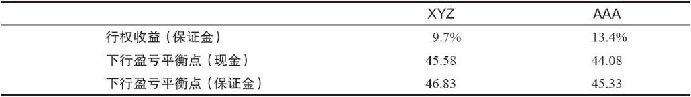

# 2.7　就已持有的股票卖出备兑

就已持有的股票建立卖出备兑头寸涉及其他的因素。通常情况下，某个投资者虽然持有股票，他的股票也有期权交易，不过他觉得与市场上现存的其他卖出备兑相比，他卖出期权收益太低。这种看法也许有它的道理，但是，它通常是由这样的事实造成的：这个投资者看到过计算机产生的一览表，其中显示，同其他价格相近的股票相比，他的股票收益显得较低。他应当意识到，这样的一览表通常是以为建立卖出备兑而买入股票为假设的，并不会计算和公布就已持有的股票进行卖出备兑的收益数据。有可能由于交易费用的原因，卖出某只股票并买入另一只会显著地影响收益，因此投资者总是就已持有的股票进行卖出备兑。

【示例2-9】某位持有XYZ股票的投资者，在就XYZ进行卖出备兑与就AAA进行卖出备兑作比较。如果AAA的波动性比XYZ更大，现有的价格可能会是这样：

不考虑太多的具体细节，这两笔卖出的其他重要方面包括：

看到这些计算结果，XYZ股票的持有者也许会感到不应当就已持有的股票来卖出看涨期权，甚至感到应当卖掉XYZ，买入AAA，然后再就AAA来建立卖出备兑。这两种做法都是错误的。

在场内期权交易的早些年，交易费用很高，投资者不会愿意通过换股来获得更大的收益，因为换股过程会导致很大的交易费用。事实上，如果读者当前的手续费率很高，他就应该仔细地评估这两笔卖出备兑的收益。他需要计算不需要买入手续费的XYZ交易的收益，并与AAA交易的收益做比较。不过，今天大多数交易者的手续费已经很低，因此手续费已经不再成为影响换股的重要因素。

手续费并不是唯一需要考虑的因素。每个投资者都还需要考虑，换成AAA所增加的收益是否值得，因为他可能换成了一个波动更大且不支付股息的股票。虽然静态的卖出备兑收益可能较高，但在做出最终决定时，应该考虑到以波动率为基础来计算的风险。

同样的逻辑也适用于某个投资者已经在做卖出备兑的情况。如果他持有某个期权已经到期的股票，他将不得不决定是否要就这一股票再卖出期权，或者是把股票卖掉，再买入新的股票来做卖出备兑。在高手续费的时代，他可能会想继续就现有股票进行卖出备兑，即使这样做的收益已经不再具有吸引力，仅因为换股的手续费较高。不过在现在的低手续费率时代，这不再是一个问题。卖出者需要寻找能带来最佳总收益的卖出备兑。事实上，月复一月，季复一季，即使没有收益也只就已持有的股票进行卖出备兑，很可能是个错误。

### 警示

某个股票持有者，如果他从先前的交易中获得了股票，之后考虑就这个股票卖出看涨期权，那他就必须意识到他的处境：他有可能由于指派而失去股票。如果他一定要持有股票，那一旦标的股票价格上升，他也许就不得不亏本买回先前卖出的期权。本质上，他限制了股票价格的上涨空间。如果某个投资者会在股票价格上涨时因为不能获得全部收益而烦恼和失望的话，他一开始就不应该卖出看涨期权。也许他应当使用卖出备兑递增收益（incremental return）的概念，本章的后面将讨论这部分内容。

正如前面所强调的，卖出备兑策略涉及把股票和期权看作是一个总头寸。它不是指某个股票持有者在交易他所持有的股票的期权。如果该股票持有者因为股价将要下跌而卖出看涨期权，那该笔期权交易自身就是有利可图的，则他可能就把自己放在一个微妙的处境里。如果是这样的话，他也许只有在他的期权交易盈利时才会满意，而不管标的股票中未兑现的结果将会如何。这一哲学同卖出备兑策略的哲学是相矛盾的。这样的投资者（他事实上已经成了交易者）应当仔细地考虑一下他卖出看涨期权的动机，并且事先想到如果卖出看涨期权后股价大幅上涨，他应该怎么做。

说到底，就你不想出手的股票卖出看涨期权同卖出无备兑看涨期权没有什么不同。如果股价上涨到你卖出的看涨期权的行权价之上，你就会非常痛苦，甚至会睡不着觉，那么，你所经历的考验和磨难同那些卖出无备兑看涨期权的人在同样的股价运动中所经历的没有什么不同。对一个真正的卖出备兑策略家来说，这样的痛苦是不可接受的。

仔细想一想。如果你有一些买价很低且又不想出手的股票，可是你又想就这些股票卖出看涨期权，那么你希望会发生什么呢？你最可能希望期权会无价值地到期（也就是说，你的股票不会因为行权而卖掉）——这正是一个无备兑的卖出者所期望的。

如果股价上升，问题就会变得复杂起来，这时你决定把这些看涨期权挪仓（roll）。与其付出一小部分资金来平仓亏损头寸，投资者可能更愿意把头寸挪仓到到期日较远和行权价较高的合约，从而继续带来一些收入。最后，当更低的行权价消失的时候，他就没有其他选择了。此时，他要么卖掉一些股票，要么付出一大笔资金来买回先前卖出的看涨期权。因此，如果标的股票持续上涨，卖出者在“同市场作斗争”时就会在情感上经受折磨。我们看到过若干经典的墨菲定律[1]的示例，在其中，刚好在该股票或是整个股票市场崩溃之前，期权卖出者不愿意因指派而卖出他们的“不可碰”的股票，而情愿亏损一大笔钱来买回期权。

如果某个投资者不想卖出自己的股票，那么在就这些股票卖出看涨期权时，他就必须非常小心。如果某个投资者因为某种原因（例如税收考虑或是感情上不舍得等）而不能卖出股票时，他就确实不应当就这样的股票卖出看涨期权。对这样的股票持有者来说，买入保护性看跌期权（后文会讨论）也许会是一个更好的策略。

[1] 墨菲定律：凡是可能出错的事均会出错。——译者注
