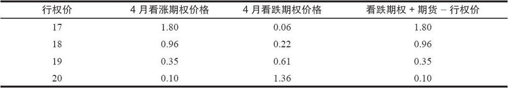
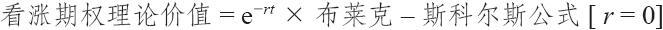
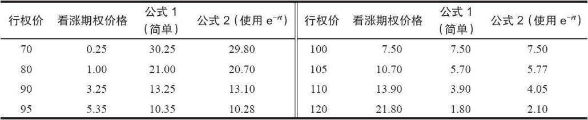
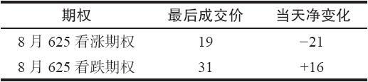
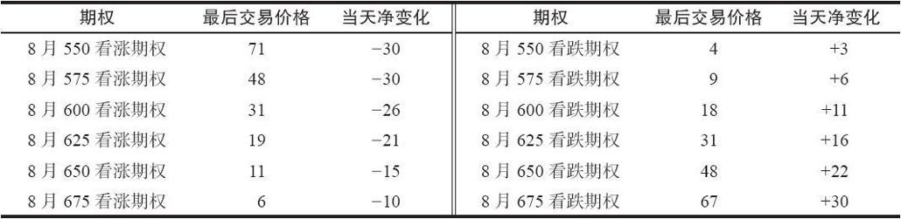
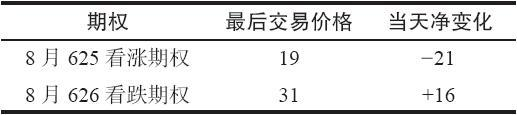
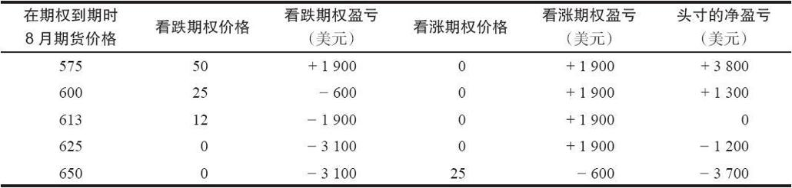

# 34.3　期货期权交易策略

这里介绍的策略是期货期权交易所特有的策略。虽然它们同股票和指数期权策略有一些一般性的关系，但这些策略的大部分只适用于期货期权。我们同时也要表明（在后式价差和比率价差的示例里），无论标的工具是什么（股票、期货等），交易者都可以通过把所有的东西分析为“点数”而不是“金额”，用同样的方法来计算一个期权价差的盈利性。

在讨论具体策略之前，观察一下期货期权的一些关系和它们相互之间的价格关系以及它们同期货合约自身之间的价格关系，应当是有用的。在股票和指数期权的价格里已经包含了持有成本和股息，因为标的工具支付股息，而且交易者必须付出现金以买入或者卖出股票。在期货中的情况就不是如此。买入一手期货合约所需要的“投资”并不是一开始就要投入的现金。请注意，同期货相关的持有成本一般指的是持有现货自身的持有成本。这个持有成本除了同决定期货自身价格有关之外，对期货期权的价格没有影响。此外，期货没有股息或者类似的支出。甚至美国政府长期债券期权也是如此，因为现货债券的利率支付是构建在期货的价格之中的。因此，基于期货价格而不是直接基于现货价格的期权，就不一定非要有持有成本，因为期货自身一开始并没有相关的持有成本。

简单地说，我们可以这样来表述：

期货看涨期权=期货看跌期权+期货价格-行权价

【示例34-16】4月原油期货的收盘价是18.74（每桶18.74美元）。有下面的价格存在：

请注意，在每个行权价上，上面的公式都是正确的（看涨期权=看跌期权+期货价格-行权价）。这些不是理论价格；它们来自某个交易日的实际结算价格。

在现实中，当涉及深度实值或长期期权时，这个简单公式就不起作用了。但对大部分具体的近期期货合约上的期权来说，它是够用的。查一查今天的报纸，你可以自己证实一下我们这么说没有错。

这个观察的另一个细节：当期货合约刚好在行权价的时候，使用这个行权价的看涨期权和看跌期权会按相同的价格交易。注意一下，在上面的公式里，如果你将期货的价格设定在同行权价相同的价位上，最后的两项就相互抵消，剩下的就是：看涨期权价格=看跌期权价格。

在讨论策略前要做的最后一个观察是，对行权价相同的看跌期权和看涨期权：

看涨期权净变化-看跌期权净变化=期货净变化

对股票和指数期权来说也是如此，这是一个值得记住的有用规则。如果市场中的最新价不符合上面的规则，那么，至少有其中一个最新价或许没有代表期权的真正市场价。

### 34.3.1　delta

因为我们是在讨论定价，也许应当提一下delta。期货期权的delta同股票期权的delta有着相同的意义：期权价格因为标的期货合约价格每一点的运动而增长的数量。同时我们也知道，它是通过从期权定价模型得出的一阶导数而得到的即时的衡量尺度。

无论是哪种情况，一个平值的股票或指数期权的delta大于0.50；离到期时间越远，delta就越高。简单地说，这同将行权价的价值持有到期权到期日的持有成本有关。不过，部分的原因是由于股票的价格分布：有一个向上的偏向，由于离到期的时间较长，这个偏向就使得看涨期权的运动比看跌期权的运动更为突出。

期货的期权没有我们需要应对的持有成本的特性，但是，在它们的价格分布中确实有正向的偏向。同股票一样，一个期货合约可以增值到100%之上，但是不能跌过100%。因此，平值的期货看涨期权的delta略大于0.50。离期货期权到期日越远，平值看涨期权的delta就越高。

许多交易者都错误地相信，平值期货期权的delta是0.50，因为在期货的转换和反转组合中没有持有成本。这样的看法是不对的，因为期货的价格分布同样也影响到delta。

同股票和指数期权一样，在期货期权中，始终出现的情况是，一个看跌期权的delta同一个行权价和到期日相同的看涨期权的delta是相互关联的：

看跌期权delta=1-看涨期权delta

最后，等股头寸的概念也适用于期货期权策略，当然，它被称作等额期货头寸（equivalent futures position，EFP）。EFP是用下面这个简单公式计算出来的：

EFP=期权delta×期权数量

因此，如果交易者买入8手delta为0.75的看涨期权，那么，这个头寸的EFP就是6（8×0.75）。这就意味着买入这些看涨期权等于买入6手期货合约。

请注意，在股票的情况里，等股头寸的公式中有另一个因素：每手期权代表的股份数。这个概念不适用于期货期权，因为它们都是一手期货合约之上的期权。

### 34.3.2　数学的考虑

这一小节将讨论对期货期权和实物期权的建模考虑。

期货期权。用来给期货期权定价的是布莱克模型（见第33章对指数期权的数学考虑）。读者应当还记得，期货是不支付股息的，因此，在这个模型里就没有必要进行股息调整。此外，期货也不涉及持有成本，因此，交易者唯一需要做的是把0%作为对布莱克–斯科尔斯模型的利率输入项。这是一种过于简化的说法，特别是对深度实值的期权。交易者在买入一手期权时支付了一些钱。因此，布莱克模型在布莱克–斯科尔斯模型的价格里将这个因素贴现出去。因此，实际用来为期货期权理论价值定价的模型是布莱克模型，它只是用0%作为利率的布莱克–斯科尔斯模型，然后再贴现：

我们在上面说过：

期货看涨期权=期货看跌期权+期货价格-行权价

实际的关系是：

式中　r——短期利率；

t——离到期的时间，以年计；

e-rt——贴现因子。

这里必须要用短期利率，因为当交易者为一手期权支出的时候，从理论上说，他就失去了如果把钱存在银行里就可以赚得的利息，在银行里的钱可以按短期利率获得利息。

在这两个公式之间的区别对不是深度实值的近期期权来说是如此之小，它通常小于期权中买报价同卖报价之间的差别，所以，可以使用第一个等式。

【示例34-17】下面的表格对使用这两个公式计算出的理论价值进行了比较，其中r=6%，t=0.25（1/4年）。更进一步，假设期货的价格是100。行权价列在第1列里，看跌期权的价格在第2列。根据每个公式预测出的看涨期权价格列在后面的两列里。

对于20或30点实值或虚值的期权，在这些3个月的期权中，有明显的差异。不过，对那些接近行权价的期权来说，差异很小。

如果离到期的时间比上面示例里使用的时间要短，这些差异会小一些；如果时间更长，差异会放大。

实物期权。确定类似货币这样的实物期权的合理价值要复杂一些。计算实物期权合理价值的正确方法同计算股票期权的很相似。回忆一下，在股票期权的情况里，在计算期权价值之前，我们首先从股票现有的价格里减去股息的现值。在确定货币或者其他实物期权的合理价值时，我们也使用一个相似的程序。在所有这些情况里，标的证券都持续产生利息，而不是像股票那样，以季度计算。因此，我们需要做的只是从标的价格中减去在期权到期之前要付的利息的数量，然后将累积要付的利息的数量加起来。其他所有在布莱克–斯科尔斯模型中输入的数据都保持不变，包括无风险利率等于90天的政府债券。

同样，实践的期权策略家有近路可抄。如果交易者假设为了给货币定价的各种必需的因素基本上已经结合进了芝加哥的期货市场，那么，他就可以只是使用期货价格作为标的物的价格，用它来评估费城的实物交割期权。在近期合约上这种方法的效果不好，因为期货的到期日比费城期权的到期日早一个星期。此外，它忽略了费城期权的提前行权的价值。不过，除了这些小差异之外，这条近路能够得出策略选择中所需要的理论价值。

【示例34-18】在4月的某个时候，交易者想要计算费城6月欧元实物交割期权的理论价值。假定交易者知道布莱克–斯科尔斯公式必需的4个基本数据：离到期60天、行权价68、利率10%，以及波动率18%。但是，用什么来代表标的欧元的价格呢？就使用芝加哥的6月欧元期货合约的价格。

### 34.3.3　同涨跌停板相关的策略

大多数期货交易所都有涨跌停板存在这个事实，对期权的买家和卖家都可能造成伤害。不过，有的时候，涨跌停板有可能提供一个独特的机会。下面一节的注意力就集中在谁有可能从期货的涨跌停板中得到好处，以及谁不能。

读者应记得，期货合约中的涨停板是这个合约可以交易的离前一个收盘价的上涨或下跌的绝对点数。因此，如果债券中的涨停板是3点，它们昨天晚上收盘价为74 21/32，不管现货债券市场中发生什么情况，它们在第二天交易的价格都不能超过77 21/32。涨跌停板制度在许多期货合约中都存在，为的是保证市场不至于被某些人操纵，迫使价格在某个方向有巨大的运动。涨跌停板制度存在的另一个理由从表面上看是只允许有一个固定的、同初始保证金覆盖的数量大致相等的运动，这样，如果需要的话，就可以追加维持保证金。不过，涨跌停板制度也被用在没有必要的情况里。例如，在政府债券里，由于流动性之大，没有人能够操纵得了市场。此外，在政府债券期货合约同现货债券之间进行套利是一件相对容易的事。这也增加了流动性，使得期货合约不可能长期在同理论价值有显著差异的价格上交易。

有的时候市场实际上需要快速地大幅度运动，但是因为涨跌停板而无法做到。也许在涨停板的限制是3点的时候，现货债券上涨了4点。这没有造成什么区别，当期货合约上涨到它一天之内可以上涨的最大幅度，它就在那里形成了买报价（这个情况叫做“停板买报价”），而且，只要标的商品继续上涨，通常就不会重新交易。当然，有这样的可能，一个期货出现了停板买报价，结果，在同一个交易日的晚些时候，标的商品价格下跌，交易者开始卖出这个期货，使得它脱离了停板价格。同样的情况也有可能出现在下行方向，在那里，期货被交易到最大的可能价格，它就有了“停板卖报价”。

正如前面所指出的，期货期权有的时候也有强制的涨跌停板。这些停板的幅度同期货的停板一样。在其他的市场中，期权可以被自由交易，即使期货已经因为触及涨停板或跌停板而暂停交易时。不过，即使在期货期权自身有涨停板限制的情况里，也有没有触及停板的虚值的期权可以交易。

在期权还在交易的时候，交易者可以使用它们来推测如果没有涨停板限制的话，期货会在什么样的价格上交易。

【示例34-19】由于大家对干旱的恐惧，8月大豆大涨，星期五收盘在650（每蒲式耳6.50美元）。不过，周末中西部下了很大的雨，看上去干旱的恐惧是过火了。大豆开盘时跌了30美分，跌到620，跌到了30美分的停板。此外，在这个价位上没有买家，8月大豆合约被锁定在跌停板上。没有进一步交易。

交易者可以使用8月大豆期权作为一个价格发现的机制，看一看如果没有停板的话，8月大豆会在什么价位上交易。

假定有下面的价格存在，即使8月大豆因为被锁定在跌停板上没有交易：

期权策略家知道可以通过买入一手看涨期权和卖出一手看跌期权来创造一手合成的期货多头头寸。或者反过来创造一手合成的期货空头。知道了这一点，策略家可以预测期货的交易价格是什么：

如果期权的价格是上面所显示的，策略家可以创造出一个价格为613的合成期货头寸。因此，在这个示例里，推测8月大豆期货的隐含价格是613。

请注意，这个公式只不过是本章前面展示的一个公式的另一个版本。

在上面的示例里，这两个期权都没有运动到30点的停板限制，在大豆期货期权中也像大豆期货中那样有停板制度。如果它们到了停板的话，在推测期货价格的公式中，它们就没有用处。只有自由交易的期权（没有涨停板也没有跌停板）才能用在上面的公式里。

如果更全面地看一看大豆期货期权在某个交易日中，在开盘之后跌到停板然后停留在那里的情况，那么就可以看到，它们之中有些也是不能交易的。

【示例34-20】将上面的示例继续下去。8月大豆在这一天锁住在30美分的跌停板上。下面的表格显示了更多的期权价格。所有在那一天涨30美分或跌30美分的期权都碰到了它们的停板限制，因此，就不能用在上面的确定8月大豆期货合约的隐含价格所必需的程序里。

深度实值看涨期权，8月550和8月575，和深度实值看跌期权，8月675，它们都在停板上。所有其他的期权在自由交易，因而可以被用来进行上面的8月期货隐含价值的计算。

你也许会问，在期货不能自由交易的时候，做市商怎么能够为期权做市呢？他们是根据现货报价给期权定价的。知道了现货价格，他们就可以推测期货的价格（在这个情况里是613），于是他们也可以为期权做市。

在期货被锁定在涨停板的价位时，能够使用期权的真正价值，自然也能够为投资者的头寸对冲。简单地说，如果交易者开始是买入8月大豆期货，然后，它们像前面的示例里那样在跌停板的价位被锁住，那么，交易者可以使用看跌期权和看涨期权来有效地将他的头寸平仓。

【示例34-21】同以前一样，8月大豆的价格为620，因为跌了30美分而停板。交易者开始交易的时候是买入期货，现在，他变得非常担心。他无法将买入的头寸平仓，而且，如果大豆明天开盘时继续跌停板，他的钱就全输光了。这时，他可以使用8月期权将他的头寸平仓。

我们已经证明了下面的公式是正确的：

买入看跌期权+卖出看涨期权=卖空股票

当然，它也同卖空期货相等。因此如果这个交易者买入一手看跌期权，卖出一手行权价相同的看涨期权，那么，他就有了一个同可以对冲他的买入期货头寸相等的卖空期货的头寸。

使用下面的价格（它们同上面相似），那么，交易者可以看出他的风险限制在由此产生的期货价格613上。也就是说，买入看跌期权和卖出看涨期权与卖出一手价格为613的期货是相同的，在这个交易日下跌了37美分。

现有价格：

头寸：

按19买入8月625看跌期权

按31卖出8月625看涨期权

这个盈利表显示出按19买入8月625看跌期权加上按31卖出8月625看涨期权与按613卖出8月期货相等，也就是说，它们的潜在盈利相同。因此，如果交易者买入看跌期权和卖出看涨期权，他实际上就按照613卖出了他的期货，承受了亏损。

在买入看跌期权和卖出看涨期权之后，他由此产生的结果就是一手转换组合（买入期货，买入看跌期权，卖出看涨期权）。在期货市场里，对转换和反转组合的保证金要求是零。保证金规则承认这样的策略的无风险性。因此，在他付清了期货中未兑现的亏损之后，多余的钱可以用来进行新的交易。

如果期货交易者不想的话，他不必对他的头寸进行百分之百的对冲。他可以决定只是买入一手看跌期权来限制下行方向的风险。不幸的是，在期货已经被锁在跌停板上之后，这样做也许是不够的，而且太晚了。他可以建立多种的部分对冲：买入一些看跌期权，卖出一些看涨期权，使用不同的行权价，等等。

因为涨停板而无法对他的头寸进行对冲的裸期权卖出者可以使用相同的或相似的策略。他也可以使用仍然在自由交易的期权来创建一个合成期货头寸。

期货期权一般有足够的虚值行权价，其中有一些会仍然在自由交易。凡是持有亏损但因为停板而无法交易头寸的人都可以利用这个事实。只是懂得怎样使用这一种期权交易策略，就可以为许多期货交易者带来值得努力的好处。
