# 34.4　常见的错误定价策略

期货期权有的时候会出现严重的错误定价。当然，任何产品的期权有时都会出现错误定价。但似乎错误定价出现在期货期权中比股票期权中更为频繁。下面的关于策略的讨论集中在一种特别的、常常出现的期货期权错误定价的模式上。它常常出现在虚值期权过于便宜，实值期权过于昂贵的情形中。这种现象的真正名字叫做“波动率倾斜”，我们在第36章论述高级概念的时候将对它进行讨论。在这一章里，我们将把注意力集中在如何发现它和如何从中获得盈利上。

有的时候，股票期权也在一定程度上表现出这个特性。一般而言，当投机者认为股票将突然出现大幅度价格上涨的时候，在股票交易中就会出现这种情况。他们争相买入虚值看涨期权，特别是近期的，想利用他们看多的观点来赚取盈利。在有兼并传言的时候，股票期权表现出错误定价的模式。当然，错误定价是一个同统计学相关的术语；从错误定价中无法印证兼并传言的可靠性。

我们将花一定的时间来讨论这个议题，因为期货期权交易者将有充分的机会观察到这样的错误定价模式，并且利用它来获得盈利；它不是某种罕见的东西。因此，交易者应当对此有所准备，利用它为自己服务。

【示例34-22】1月大豆的交易价是583（每蒲式耳5.83美元）。有下面的价格：

1月大豆：583
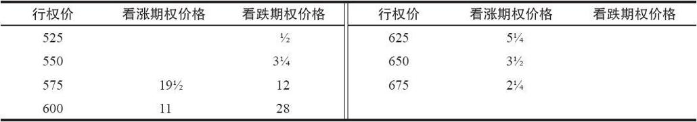
假定交易者知道，根据历史模式，这些期权的“合理价值”是在下面表格里列出的价格：
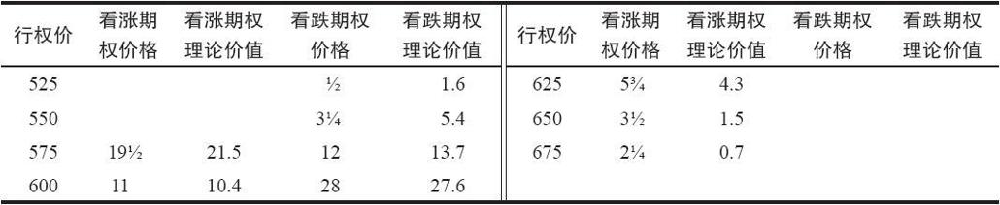
请注意，虚值看跌期权的定价远在它们的理论价值之下，而虚值看涨期权的定价则在它们的理论价值之上。行权价为575和600的期权在价格上要比虚值期权距离它们的理论价值要近得多。

还有另一种方法来看待这个数据，就是观察这个期权的隐含波动率。我们在第28章讨论数学应用时讨论过隐含波动率，它基本上就是交易者为了使得定价模型的理论价值同实际市场价格相符而必须输入期权定价模型的波动率。换句话说，它是实际市场所猜测的波动率。这个示例中的每个期权的波动率都不同，因为它们的错误定价将价格扭曲得很厉害。表34-2显示了这些波动率。这些期权的delta也显示在表中，因为后面的示例里要用到这个数据。

表34-2　大豆期权的波动率斜率
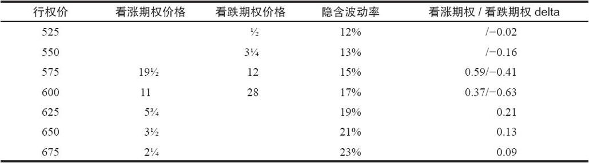
这些隐含波动率说的是同样的故事：虚值看跌期权的隐含波动率最低，因此是最便宜的期权；虚值看涨期权的隐含波动率最高，因此是最昂贵的期权。

因此，不管你从哪个角度看问题，是通过期权价格同理论价值的比较还是通过比较隐含波动率，显而易见的是，这些大豆期权的价格之间互相失衡。

在许多商品期权中这种错误定价的扭曲都相当普遍：大豆、白糖、咖啡、黄金和白银都不时会出现这样的价格扭曲。这样的扭曲在有的商品中（例如，大豆）是固有的，在有的商品中则是因为投机者变得极度看多才出现。

这种明确无误的错误定价模型在期货期权中是如此盛行，策略家应当不断地对它的出现保持警觉。想从这个模型中获取盈利有两种主要的方法，两种都有吸引力，因为交易者是买入比卖出相对更便宜的期权。这样的策略如果实施在当期权出现错误定价的时候，机遇就在策略家的一侧，它们可以为这个头寸创造出正的预期收益。

在理论上有两个具有吸引力的策略：

（1）买入虚值看跌期权，卖出平值看跌期权；

（2）买入平值看涨期权，卖出虚值看涨期权。

交易者可以只是买入一手便宜的期权，卖出另一手昂贵的期权，这是一个看跌期权的熊市价差，或者是一个看涨期权的牛市价差。不过，最好是使用买入和卖出的期权数量不等的比率来实施价差。也就是说，第1个涉及看跌期权的策略是一个后式价差，而第2个涉及看涨期权的策略是一个比率价差。通过使用比率，这两个策略就更是一个中性策略。我们来分别考察一下这两个策略。

### 34.4.1　看跌期权的后式价差

后式价差策略在交易者预期会有大幅度的波动率时能最好地发挥作用。使用看跌期权来实施这个策略意味着标的期货价格大幅下跌时会产生最大的盈利，虽然如果期货上涨，也可以产生有限的盈利。请注意，到期前的价格中等程度的下跌对这个价差来说是最坏的结果。

【示例34-23】使用上面示例的价格，假定交易者决定要建立一个看跌期权后式价差。假设下面的价差有一个中性的比率：
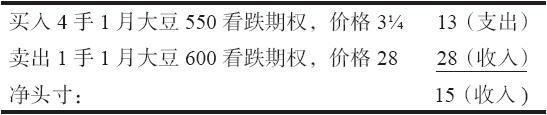
在计算这个中性比率的时候，使用了这些期权的delta（见表34-2）。

图34-1显示了这个价差的潜在盈利。这是看跌期权后式价差的一幅典型图形：上行方向的有限潜在盈利和在大幅下跌运动中的巨大潜在盈利。请注意，这个价差最初是以15美分的盈利建立的。无论1月大豆在哪个方向有大幅度的运动，这个头寸都能获利。显然，下行方向的潜在盈利会更大一些，这个头寸在下行方向买入的看跌期权更多。不过，如果大豆不是下跌而是上涨，这个价差交易者仍然可以盈利15美分（750美元），也就是头寸的最初收入。
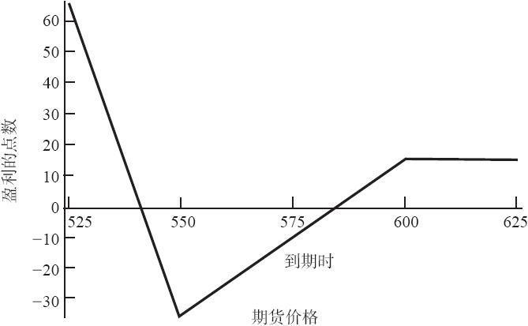
图34-1　1月大豆，后式价差

请注意，为了确定盈亏平衡点和最大潜在盈利，交易者可以用对待股票期权价格的方法来对待大豆期权价格。大豆期权每点价值50美元（在讲到大豆时，这是美分）和股票期权每点价值100美元这个事实，并不改变在一手看跌期权后式价差中的这些计算。

最大上行潜在盈利=头寸初始支出或收入=15点
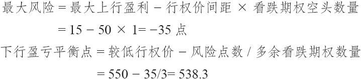
因此，交易者有可能使用相同的方法来分析一个期货期权头寸或股票期权头寸：将所有的数量都简约到点数，而不是金额。显然，在计算盈利或亏损的时候，最好还是将点数折回到金额。不过，可以注意到，将所有的数量都以“点数”来考虑，是一种非常有效的办法。你可以在后面使用每点价值多少美元来得到实际的成本金额。大豆每点价值50美元，股票或指数100美元，活牛期权400美元，咖啡期权375美元，白糖期权1120美元，等等。用这种方法，你就没有必要为期货合约的合约条款所限制；在分析这头寸时你可以使用同样的方法来得到所有的数量。当然，在下达指令时，你还是必须遵守相应的合约规则，但是，这是在完成了分析之后。

### 34.4.2　看涨期权比率价差

回到我们讨论的问题上来，也就是捕捉期货期权中这个特殊的错误定价现象，读者应当还记得在这种情况中的另一个有吸引力的策略是看涨期权比率价差。这个头寸在高于当前期货价格的价位上有最高的潜在盈利，因为这些卖出的看涨期权是虚值期权。

【示例34-24】我们再来使用前面示例里的1月大豆期权，假定交易者建立了下面的看涨期权比率价差。使用看涨期权的delta（见表34-2），下面的比率在建立头寸的时候是中性的：
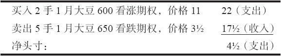
图34-2显示了这个看涨期权比率价差的潜在盈利。这是一幅相当典型的比率价差的盈利图：有限的下行风险暴露，价格等于卖出看涨期权行权价时的最大盈利，以及无限的上行风险暴露。
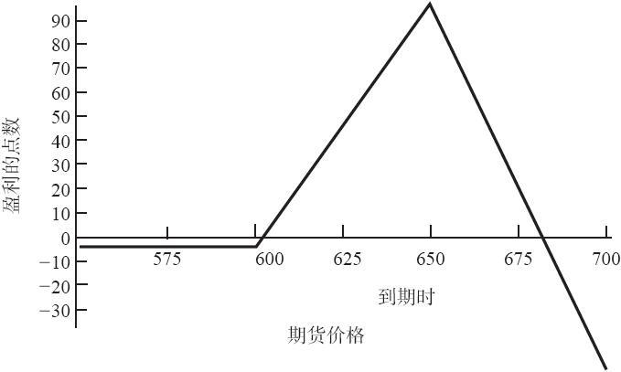
图34-2　1月大豆，比率价差

因为建立这个价差时使用的是两个虚值期权，交易者需要1月大豆期货有某些向上的运动时才能有利可盈。不过，过多的运动不是一件好事（虽然在这样的情况里可以使用后续策略）。因此，这是一个略微看多的策略，交易者应当认为标的期货在到期之前有机会有一定的上涨运动。

同样，为了计算出有意义的盈亏点数，分析家应当使用大豆运动的点数而不是美元或美分来分析这个头寸。回到论述看涨期权比率价差的第11章，看一看对看涨期权比率价差的这些公式的最初解释：
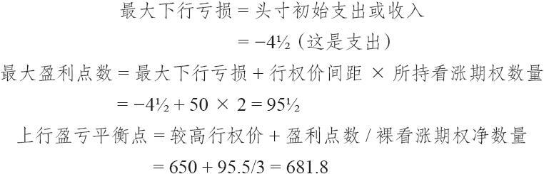
这些是在到期时才有意义的盈利性的点数。交易者不必关心交易单位是什么（例如，对大豆来说是美分），也不必关系每一交易单位涉及多少美元（对于大豆和大豆期权来说是50美元）。他只用点数就能进行分析，而且也应当这样做。

在对后式价差和比率价差如何利用错误定价的期货期权进行比较以前，我们应当指出，认真的策略家不但应当分析他的头寸在到期时会如何表现，而且应当分析它们在短期内的表现。我们在第36章论述高级概念时会进行这样的分析。

### 34.4.3　使用哪个策略

看跌期权后式价差的潜在盈利显然同看涨期权比率价差有很大的不同。它们都为策略家提供了就错误定价的期权进行价差交易而获得好处的机会，在这一点上它们是相似的。考察一下期货合约的技术画面（图形）也许可以帮助我们决定究竟选择哪个策略（假定看跌期权和看涨期权的流动性相同）。读者应当记得，比起股票交易者来，期货交易者往往更偏向于技术分析，因此，懂得基本图形模式是有好处的，因为其他人也在观察它们。如果有足够的人看到了相同的模式，而且就此采取行动，那么，这个图形模式就会成为正确的模式，即使不是因为其他理由，只是从“自我实现的预言”这个角度看，也会是如此。

因此，如果期货被锁住在一个（平滑的）下跌趋势中，那么，就应当选择看跌期权，因为它提供了最好的下行方向的盈利。反过来，如果期货是在向上的平滑的趋势里，看涨期权是最好的选择。

如果在策略家建立了看涨期权比率价差之后期货价格暴涨，这就会产生最坏的结果。在某些情况中，非常看多的流言（像干旱或厄尔尼诺的天气预报，农场或矿井的工潮，俄罗斯买入谷物等）会导致这样的错误定价的现象。在这样的情况里，策略家在使用看涨期权比率价差策略时就应当多加质疑，即使是虚值的看涨期权看上去而且确实是贵得出奇。如果这个流言被证明是真实的，或者，如果有过多的卖空头寸受到挤压，期货价格有可能运动得过远和过快，对那些持有看涨期权比率价差的交易者就会造成伤害。他的保证金要求会随着期货价格运动得更高而迅速增加。期权权利金会居高不下，或者，如果期货价格迅速上涨的话，甚至可能膨胀，从而超出了因时减值可能带来的好处。另外，如果基本面因素随即发生变化，或者流言被证明是误传（天下雨了，工人复工了，俄罗斯人筹集不到所需的谷物信用），那么，期货价格就会迅速暴跌下来。

因此，如果关于基本面因素的流言在期货市场中引入了波动性，那么就实施看跌期权后式价差的策略。看跌期权后式价差是用来利用波动率所产生的机会的，这里所描写的基本面的情况显然是高波动的。看上去因为市场就要向上暴涨，建立一个看跌期权价差好像是浪费时间。可是，这仍然是在一个高波动市场中最明智的决定，而且，总是有这样的可能：一个暴涨的运动会迅速转变为暴跌，特别是当这个上涨是建立在流言或隔夜就可能变化的基本面消息之上时。

在看涨期权比率价差方面有几项“不可以做”的事情。在类似上面所介绍的那种情况里，不要使用比率价差策略，它在一个缓慢上涨的情况中效果最好。同时，不要使用深得出奇的虚值期权来实施比率价差，如果期货没有现实的机会上涨到卖出期权的行权价，交易者就是在浪费他的理论优势。最后，不要试图使用过分大的比率来得到最大的理论优势。这是一个重要的概念，下一个示例对这一点有很好的说明。

【示例34-25】假定1月大豆期权有我们至此讨论的那种定价模式。1月大豆的交易价是583。一个（新入门的）策略家看到，略为实值的1月575看涨期权是最便宜的，而深度虚值的1月675看涨期权是最贵的。这可以从前两个表格中得到证实：或者是一个显示同“理论”价格相比较的实际价格的表格，或者是显示隐含波动率的表34-2。

同样，交易者可以使用delta（见表34-2）来创建一个中性价差。这两个期权之间的中性价差涉及每买入1手看涨期权，就卖出6手另外的看涨期权。

图34-3显示了使用这个高比率可能出现负作用。如果大豆在1月到期时价格为675，交易者可以得到94点的盈利，如果大豆穿破上行方向的盈亏平衡点，他就会迅速将他的盈利亏损掉，而上行方向的盈亏平衡点只不过是693.8。前面的示例可以用来证实这些最大盈利和上行方向盈亏平衡点的计算。上行方向盈亏平衡点同行权价过于接近，无法采取妥善的后续行动。因此，从实践的角度看，这不是一个有吸引力的头寸，只不过猛看上去，它从理论上来说似乎是吸引人的。
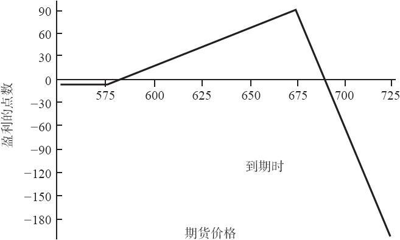
图34-3　1月大豆，高比率价差

看上去，如果中性价差所“建议的”是一个6：1的比率，交易者就会有麻烦。在现实中，如果策略家看不到整个画面的话，那么是将他自己带入了麻烦。统计数字只是一种帮助，一种工具。策略家必须按照他自己的情况来利用这种工具。同时应当指出，直到目前为止，我们的工具箱中还缺少一件工具。确实有统计数据清楚地说明这类高比率价差的风险。在这样的情况里，这个工具是期权的gamma。第40章将介绍如何使用gamma和其他更多的高级统计工具。在那里，我们将扩展对这个示例的讨论，将gamma的概念引入我们的讨论中。

### 34.4.4　后续行动

在股票期权中使用的相同的后续策略也可以用在这些期货期权上。我们在这里就不再重复它们的细节，更详细的解释可以在前面的章节里找到。这里对通常使用的后续策略做一个总结：
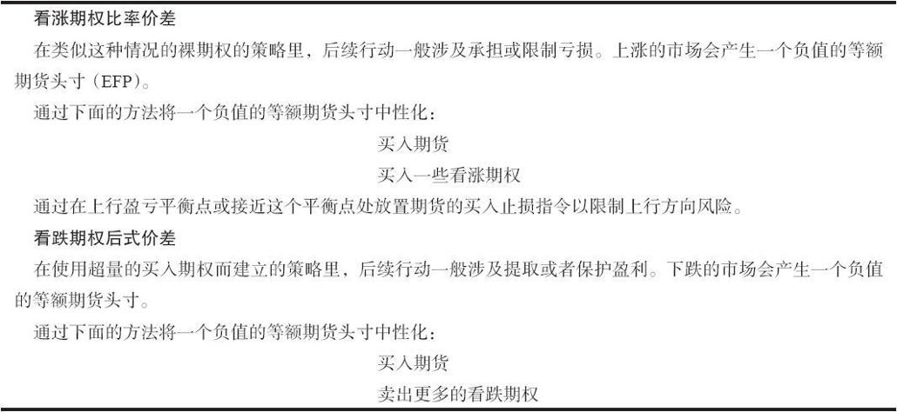
读者在本书的前面已经见到过这些后续行动的结果。不过，这里有一个重要的新概念：无论标的期货合约的价格是什么，这种错误定价的情况会自我传播。平值期权的定价总是会接近它们的合理价值；它们有着平均的隐含波动率。

【示例34-26】在前面的示例里，1月大豆的交易价是583，行权价为575的期权的隐含波动率是15%，行权价为600的是17%。交易者因此可以得出结论，平值的1月大豆期权的隐含波动率会大约在16%。

表34-3　波动率倾斜的传播
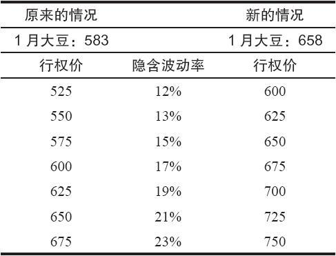
如果大豆在525或675的话，这仍然会是正确的。其他期权的错误定价会从现在是平值的行权价上延伸开来。表34-3显示了交易者有可能会看到的，1月大豆价格上升了75美分，从583到658。

请注意，在原有的和现在的情况中，同样的错误定价的情况都存在：58点虚值的看跌期权的隐含波动率只有12%，而92点虚值的则有23%的隐含波动率。

这个示例不是用来推断一个平值的大豆期货期权的波动率永远是16%。它可以是任何数值，取决于期货合约自身的历史和隐含波动率。不过，即使期货价格上涨或者下跌，波动率倾斜会始终存在。

这个事实会影响到这些策略在标的期货合约运动时的表现。首先，看一看当股票跌到买入的看跌期权的行权价时的看跌期权后式价差。

【示例34-27】这个看跌期权后式价差是根据下面的条件来建立起来的：
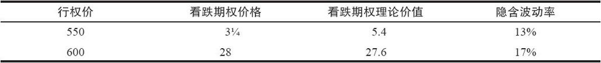
如果1月大豆期货跌到了550，交易者就会预期所持的1月550看跌期权的隐含波动率会大约是16%或17%，因为它们在这时候是平值期权了。这就导致了这样的假设：平值看跌期权有大约为17%的隐含波动率，这是它们在头寸建立时的隐含波动率。

因为这个策略涉及买入大量的1月550看跌期权，随着期货价格下跌而造成的这种隐含波动率的增长对这个价差是有好处的。

请注意，1月600看跌期权的隐含波动率也增长了，这对价差有小量的负面影响。不过，因为这里只有一手看跌期权空头，而且，当期货在550的时候，它是相当深度虚值的，这个负面影响无法同1月550看跌期权多头中隐含波动率的扩展相抗衡。

看涨期权价差也会按照相似的方式得到好处。卖出期权的隐含波动率随着期货价格的上涨实际上会下降，因为比起建立价差时最初的虚值程度来说，它们现在的虚值程度要小了。虽然同样的情况也发生在价差中买入的看涨期权中，但是，因为卖出的数量超出买入的数量以及多余的期权是裸期权这个事实，这个价差总的来说就能获利。

简而言之，期货期权策略家应当对上面所介绍的这种错误定价情况保持警觉。在有的期货中这种现象经常发生，在有的期货中它们会不时出现。看跌期权后式价差策略风险有限，因此对更多的个体交易者具有吸引力；它最好是用在下行趋势或高波动的市场中。不过，如果期货是在平滑的上行趋势中，在一个波动率较低的市场里，看涨期权比率的策略就更好。无论是哪种情况，策略家都建立了一个在统计学上具有吸引力的价差，因为他卖出的期权的价格比他买入的期权的价格要高。
