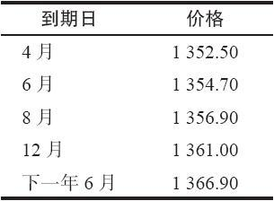
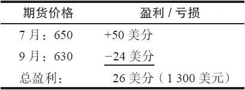
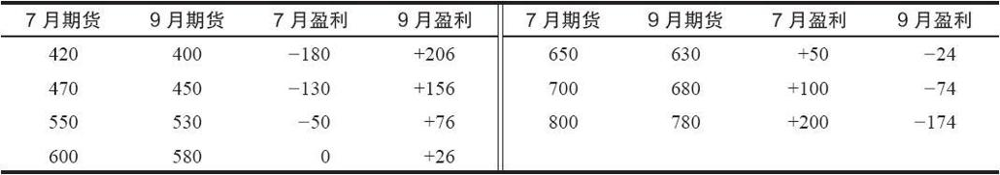
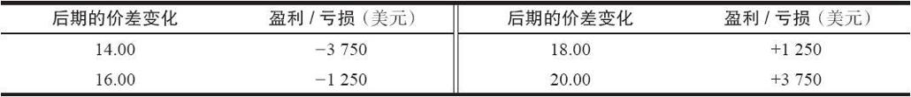
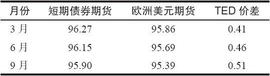
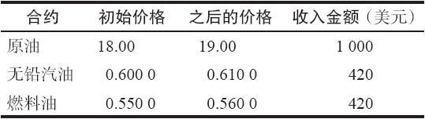
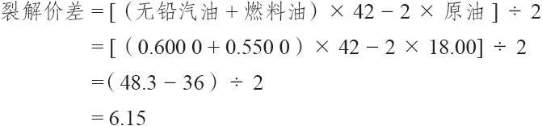
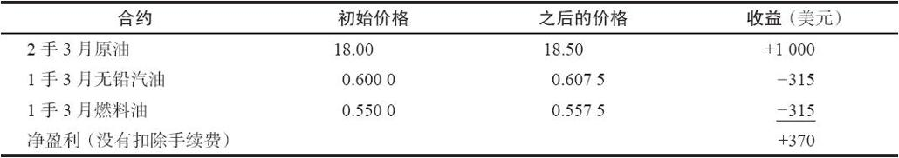

# 35.1　期货价差

在讨论期权策略之前，有必要对期货价差下一个定义，同时考察一下常见的期货价差策略。

### 35.1.1　期货定价差异

前文已经说过，任何一个具体的实物商品在任何时候都有若干个在不同月份到期的期货合约。石油期货每个月都有到期日；白糖期货在任何一个日历年中只有5个到期月。到期月的频率取决于所讨论的期货合约。

同一标的商品上的期货在不同的价格上交易。导致这种差异的有许多因素，而不仅仅是像股票期权中只有一个时间因素那样。其中一个主要的因素是持有成本，也就是在到期日之前交易者将花多少钱来买入和持有实物商品。不过，其他因素也在起作用，包括供需关系的考虑。在正常的持有成本市场里，期货到期日越晚就越贵。

【示例35-1】黄金这种商品的期货就表现出向前的或正常的持有成本特征。假定现在是3月1日，现货黄金的交易价是351。这样，各个黄金期货合约的价格有可能像下面所显示的：

请注意，每一个合约都比它前面的合约要贵。在前3个到期日中，每两个合约之间的差价都是2.20，在多余的到期时间中每个月之间等于1.10。不过，对9个月之后到期的12月合约来说，这个差异没有那么大，15个月之后到期的6月合约也是如此。之所以会如此的原因，有可能是长期利率比短期利率要稍微低一些，因此持有成本也稍微小一些。

不过，并不是所有期货的价格都这样井然有序。在有的情况里，不同的月份可以实际代表不同的产品，尽管两者都以同一实物商品作为标的。例如，小麦并不总是小麦。有夏小麦和冬小麦。尽管两者总的来说是相关的，在7月小麦期货合约同12月小麦合约之间有显著的差别。这些差别同利率几乎没有什么关系。

有的时候短期需求可以控制利率的效果，一个系列的期货合约的排列表现为短期期货更贵。这叫做反向持有成本市场，或者叫做贴水。

### 35.1.2　期货跨期价差

有的期货交易者想要预测同一标的实物商品的不同到期月份之间的相互关系。也就是说，交易者可以买入7月大豆期货和卖出9月大豆期货。当交易者同时买入和卖出不同的期货合约，他就是在做价差交易。当两个合约的标的实物商品相同的时候，他就是在交易跨期价差。

这个价差交易者并不是要预测总的价格方向。他是想要预测7月同9月合约之间的价格差异。对大豆是涨是跌他并不关心，只要7月同9月之间的差异按照他所希望的那样变化就行。

【示例35-2】有一个价差交易者注意到历史价格图形显示出，如果9月大豆相对7月大豆变得过于昂贵，这个差异通常在1或2个月内就会消失。建立这手交易的机会通常出现在这一年的早期：2月或者3月。

假定今天是2月1日，而且有下面的价格存在：

7月大豆期货：600（每蒲式耳6美元）

9月大豆期货：606

这里的价格差异是6美分。它很少会比12美分更差，而且常常反转到7月期货比9月期货更贵的地步，有的年份甚至会贵到100美分。

如果交易者就历史情况而交易这个价差的话，他因此就有大致6美分的风险，而盈利有可能达到100美分之大。如果历史适用于当今的话，这显然是一个很好的风险/回报比率。

假定交易者建立了这样一个价差：

买入1手7月期货，价格为600

卖出1手9月期货，价格为606

过了一些日子，出现了下列的价格以及盈亏。

这个价差倒转了过来，从最初的9月比7月贵6美分，到了7月比9月贵20美分。这个价差交易者因此赚了26美分，或者说1300美元，因为大豆中的1美分价值50美元。

请注意，从下面的任何一对价格中都能够获取同样的盈利，因为7月和9月之间的价格差异在所有的等类中都是20美分（7月是两者之间更贵的）。

因此，无论大豆是在一个严重的熊市，还是在一个飚扬的牛市，或者甚至没有变化，都能同样有26美分的盈利。这个价差交易者所关心的只是价差是否能从6美分扩大到更大的数值。

图形（有时包括了数年的历史）保留了不同到期月之间的各种相互关系。价差交易者常常使用这些历史图形来决定在什么时候进入或退出跨期价差。这些图形展示了使得各种不同合约之间的关系扩展或者缩小的季节性倾向。对造成这些季节性倾向的基本面因素的分析同样也可以成为建立跨期价差的动机。

跨期价差交易（以及其他一些类型的期货价差）所要求的保证金比在期货自身中投机所需要的保证金要少。之所以如此的原因是，这些价差的风险被看作比直接交易期货的风险要小。不过，交易者仍然有可能在价差中获得大量的盈利或者亏损大量的钱（无论是按百分比衡量，还是以绝对的金额衡量），因此，不能把它看作是保守型的，它只是比直接进行期货投机风险要小。

【示例35-3】使用上面示例里的大豆价差，假设投机的初始保证金要求是1700美元。于是价差的保证金要求就可能是500美元。如果价差的每一条腿都需要分别置放保证金的话，交易者需要准备的初始保证金就会高得多，在这样的情况下，他需要3400美元保证金。

在前面的示例里，我们看到大豆期货之间的价格间距有可能扩展到100点（1.00美元），这是一个一旦出现就价值5000美元的运动。虽然这个价格差异未必真的会达到历史高度，但它确实有可能会扩展20或30美分，这也是一笔价值1250~1500美元的盈利。

在如此短的时期里，对于500美元来说，这显然是很高的杠杆，因此，交易者必须将价差归类到风险策略里。

### 35.1.3　期货跨品种价差

另一类期货价差是交易者在一个市场中买入某个期货合约，在另一个或许相关的市场中卖出另一个期货合约。当期货价差的交易是在两个不同的市场里的时候，它就是一个跨品种价差。跨品种价差同跨期价差同样普遍。

有一种类型的跨品种价差涉及直接相关的市场。它的示例包括两种不同国际货币的货币期货价差、两种不同长期、中期或短期债券合约之间的金融期货价差，或者是一种商品以及它的产成品（例如，原油、无铅汽油和燃料油）之间的期货价差。

【示例35-4】美国和日本的利率都很低。因此，两国的货币同欧洲货币相比价格都比较低，因为欧洲的利率一直比较高。交易者相信全球的利率将趋于一致，从而导致日元相对欧元的升值。

不过，因为他不能肯定日本的利率会上升，或者欧元的利率会下降，他不想在任何一种货币中直接持有头寸。于是他决定使用一个跨品种价差来实施他的交易想法。

假定他用下面的价格建立了一个价差：

买入1手6月日元期货：147.00

卖出1手6月欧元期货：130.00

在这两个货币期货之间最初的价格差异是17.00。他希望这个差异会扩大。这两个合约的美元交易条款是相同的：每1点的运动（例如，从130.00到131.00）价值1250美元。于是他的潜在盈亏就是：

在某些情况里，交易所承认经常交易的跨品种价差，允许对它们减少保证金要求。这就是说，如果一手期货是卖出，另一手是买入，交易所承认它们是相互对冲的。

这些货币间的价差叫做交叉货币价差（cross-currency spreads），它们的交易量很大，因而有其他特别的交易工具（期货和权证），这些工具让投机者可以将它们作为一个独立的实体来交易。不管怎么说，在使用这两手期货的时候，它们可以被看作是跨品种价差的一个重要的示例。

在上面的示例里，假设直接投机的保证金在两个货币期货中都是每手合约1700美元。这个价差所需要的保证金大约也是1700美元，同这个价差的一条腿的投机保证金相等。因此，从保证金的目的看，这个价差头寸是个对冲头寸。这里的保证金的处理没有像跨期价差那么宽松（见前面的大豆示例），但是，如果这个价差的两条腿必须分开满足保证金要求的话，交易者的初始保证金要求就将是这个价差保证金的一倍。

其他的跨品种价差也可以享受降低的保证金要求，虽然粗看起来，它们之间的对冲关系似乎不像上面的货币那么直接。

【示例35-5】TED价差是一个普通的跨品种价差，它的一条腿是美国政府短期债券期货，另一条腿是欧洲美元期货。政府债券代表了可以找得到的最安全的投资，它们是有担保的。不过欧洲美元是没有保险的，因此代表了有风险的投资。因此，欧洲美元的收益要高过政府债券。这里的关键是高出多少，因为随着收益差异的扩大或缩小，在短期债券期货同欧洲美元期货的价格之间的差距也会扩大或缩小。基本上，当金融市场稳定，投资者有信心的时候，收益的差异就小，因为没有保险的存款同有保险的存款在金融形势确定的时候差别不大。不过，在金融界为不确定性和不稳定性所左右的时候，其间的差距就会扩大，没有保险的存款会因为它们承担的较高的风险而要求有相对较高的收益。

假定单是短期债券期货或欧洲美元期货的初始保证金要求是每个合约800美元。而TED价差的保证金只是400美元。因此，交易者交易这个价差所需要的保证金只是如果分开交易价差的两条腿所需要的保证金数量的1/4。

这里的保证金有更多优惠的理由是在这个价差中没有多大的波动率。从历史上看，它的波动率的变化范围是0.30~1.70。在这两个期货合约里，1美分（0.01）的运动价值25美元。因此，这个价差的整个的140美分的历史变化范围只代表了3500美元（140×25美元）。

我们在后面讨论在跨品种价差中使用期货期权时将进一步讨论TED价差。有的时候使用期权而不是期货来建立这个价差要更合乎逻辑一些。

关于TED价差还有一点是必须说的：它有持有成本。也就是说，如果交易者买入一个价差，将它留在手里，时间越长，价差之间的差距就越小，因而给价差持有者带来小量的损失。当利率很低的时候，持有成本也很低（大约3个月有0.05）。如果短期利率上涨，它就会变大。表35-1中的价格显示了对长期合约来说，这个价差的成本比较高。

表35-1　TED价差的持有成本

许多跨品种价差都内在地包含着某种持有成本，价差交易者应当意识到这个事实，因为这有可能影响到他的盈利。

关于跨品种价差最后的也较为复杂的一个示例是裂解价差。有这样两个主要领域，其中有一种基本商品在交易，还有两种同该商品相关的产成品在交易：一个是原油、无铅汽油和燃料油；另一个是大豆、豆油和豆粕。一个裂解价差涉及同时交易3者：基本商品和它的两个副产品。

【示例35-6】这个裂解价差是由买入2手原油期货合约和卖出1手燃料油合约和1手无铅汽油合约所组成的。

表35-2　石油产品合约的条款

这个价差的交易单位同3种期货的交易单位都不同。原油期货是一个1000桶石油的合约；它的交易单位是每桶的金额，因此，原油价格中1美元的增长（例如，从18.00~19.00）对这个期货合约来说就价值1000美元。燃料油和无铅汽油期货合约的规格要小一些，但是它们同原油不同。这两种期货都是每个合约42000加仑的产品，而且它们是按美分交易的。因此，每1美分的运动（汽油从60美分1加仑到61美分1加仑）价值420美元。表35-2总结了这里的信息，它显示出价格中每1单元变化的价值。

下面的公式一般用在石油裂解价差上的：

有的交易者不用“2”的除数，因此，使用上面的数据，他们得出的结论就是12.30。

无论是哪种情况，价差交易者可以跟踪到这个价差的历史，买入原油和卖出其他两个合约，或者反过来，从而在这3个产品运动时可以得到一笔总盈利。假定价差交易者认为汽油和燃料油相对原油价格太高。于是他可以用下面的方法实施这个价差：

按18.00买入2手3月原油期货

按0.5500卖出1手3月燃料油期货

按0.6000卖出1手3月无铅汽油期货

因此，在建立这个头寸时，这个裂解价差是6.15。假定价差交易者看对了，期货价格变化到了下面的价位：

3月原油期货：18.50

3月燃料油期货：0.6075

3月无铅汽油期货：0.5575

这个头寸的盈利显示在表35-3中。

表35-3　裂解价差的盈亏

你可以计算出，在新的价格上，这个裂解价差缩小到5.965。因此，价差交易者在预测这个价差要缩小这一点上是看对了，于是就有了盈利。

保证金要求对这类价差也是有利的，它一般比2手原油期货的投机保证金要求要略低一些。

上面的示例展示了一些期货价差交易者紧密关切和大量交易的不同种类的跨品种价差。它们常常在交易者无须预测市场实际运动方向的情况下提供了一些最可靠的盈利机会。在这里，重要的只是价差的变化。

交易者不应当假设所有的跨品种价差都会有对交易者有利的保证金要求。只有那些具有传统关系的价差才有这样的优势。
