# 35.2　在期货价差中使用期货期权

在考察过上面的示例之后，可以看出，期货价差同我们知道的典型的期权价差不是同一回事儿。不过，期权合约在期货价差策略中也可以派上用场。它们常常可以用非常小的风险提供额外的潜在盈利。无论是在跨期价差还是跨品种价差中都是如此。

我们先来讨论一下期货期权跨期价差。使用期货期权的跨期价差同使用股票或指数期权的跨期价差是不同的。事实上，与其将它看作期权价差策略，不如将它看作期货跨期价差的一种替代。

### 35.2.1　跨期价差

我们仍然可以用熟悉的方法来构建一个期货期权跨期价差：买入5月看涨期权，卖出行权价相同的3月看涨期权。不过，在期货期权跨期价差同股票期权跨期价差之间有一个主要的区别。这个区别是，一个使用期货期权的跨期价差涉及两种分开的标的工具，而用股票期权的跨期价差则不是这样。当交易者买入5月600大豆看涨期权，卖出3月大豆600看涨期权的时候，他是买入了一个5月大豆期货合约的看涨期权，同时卖出了一个3月大豆期货合约的看涨期权。因此，期货期权跨期价差涉及这两个分开但是相关的期货合约。可是，如果交易者买入IBM 5月100看涨期权和卖出IBM 3月100看涨期权，这两个看涨期权就是建立在相同的标的工具上：IBM。这是这两种策略之间主要的不同，虽然两者都叫做“跨期价差”。

对于习惯将跨期价差形象化的股票期权交易者来说，这个期货期权的变形一开始会使他感到困惑。例如，一个股票期权交易者有可能得出结论说，如果他能够用5点买入1手4个月的看涨期权，用2点卖出1个2个月的看涨期权，他就有一个很好的建立跨期价差的机会。这样的分析在期货期权中没有意义。如果交易者可以用5点买入5月大豆600看涨期权，用3点卖出3月600看涨期权，这是不是一个好的价差？没办法讲，除非你知道5月同3月大豆期货合约之间的关系。因此，为了分析期货期权跨期价差，你不但必须分析期权之间的相互关系，还必须分析期货合约之间的相互关系。简单地说，当交易者建立一个期货期权跨期价差时，他不只是在时间方面的价差，就像他在股票期权中那样，还是在标的期货的相互关系方面的价差。

【示例35-7】交易者注意到，比起远期期权来，大豆近期期权价格过高。他觉得有理由建立一手跨期价差，因为他可以卖出定价过高的近期看涨期权，买入相对便宜的远期看涨期权。考虑到这些期权的理论价值，这是一个不错的情况。他用下面的价格建立了这个价差：
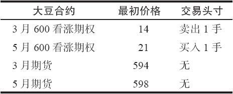
5月/3月600看涨期权跨期价差的建立用了7点的支出。离3月到期日还有2个月。目前，5月期货交易相对3月期货有4点的升水。这个价差交易者想，如果3月期货在3月期权到期时基本没变化，他就可以有漂亮的盈利；因为3月看涨期权在目前是定价略高的，而且，在今后的2个月里，它们的因时减值速度会比5月看涨期权要快。

假定他是正确的，3月期货在3月期权到期时价格没有变化。这并不等于说他的盈利就有保证了，因为交易者同时必须知道5月期货的交易价格。如果在5月同3月期货之间的价差表现很差（5月相对3月下跌），那么，他仍然有可能亏钱。从下面的表格看一看3月同5月期货之间的价差是如何影响到整个跨期价差的盈利性的。在期货的价差最初是+4的时候，这个跨期价差的成本是7点的支出。
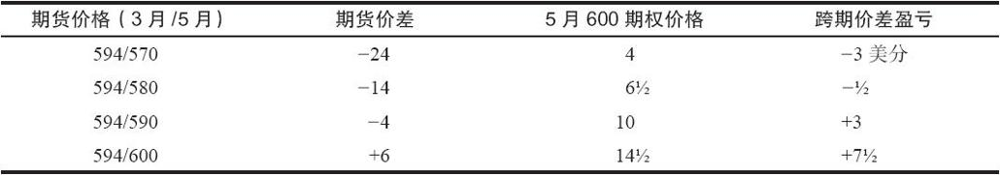
因此，即使3月期货价格没有变化，这个跨期价差仍然有可能亏损，就像这个表格的上面两行所显示的。如果期货价差扩大，它的表现有可能比预期的更好，就像这个表格的最后一行所显示的。

跨期价差的盈利性同期货的价差有很大的关系。在上面的示例里，即使3月期货合约的价格从一开始建立这个跨期价差之后没有发生变化，还是有可能亏损。在股票期权中这样的情况不会发生。如果交易者在IBM上建立了一个跨期价差，股票在近期期权到期时价格没有变化，那么这个价差几乎在任何时候都可以盈利（除非隐含波动率急剧下跌）。

因此，期货期权跨期价差的交易者是同时在交易两个价差。第1个与两个期权之间的相对定价差异有关（例如，波动率），同时与时间的消逝有关。第2个是两个标的期货合约的相互关系。所以，要画一幅普通的盈利图就很难。交易者必须用下面的方法来解决这个问题：

1.使用横轴代表期货价差在近期期权到期时的价格；

2.画若干盈利曲线，其中每一条曲线代表了近期期货在近期到期月的一种价格。

【示例35-8】把上面的示例扩展一下，这个方法可以说明如下。

图35-1显示了如何解决这个问题。横轴表示3月和5月大豆期货在3月期权到期时的价差。同以往一样，纵轴表示从这个跨期价差中预期的盈亏。

在这幅盈利图形同标准的盈利图形之间的主要不同是现在有好几组盈利曲线。每一条曲线代表了交易者想要在他的分析中加以考虑的3月期货的一个价格。前面的示例显示出的只是3月期货的一个价格：没有变化的594的价格。但是，交易者无法只是仰赖3月期货价格不发生变化这样的情况，他必须从不同的3月期货的价格来看这个跨期价差的盈利性。
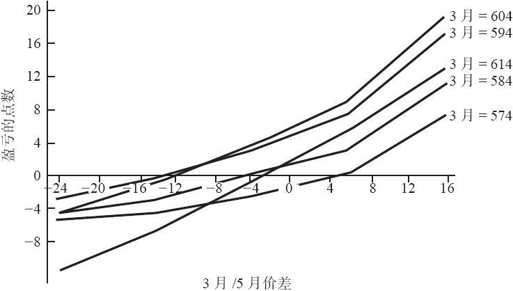
图35-1　大豆期货跨期价差，在3月到期日

表35-4总结了画在图35-1上的数据。有的事情一看就相当清楚。第一，如果期货价差增大，整个跨期价差一般会赢更多的钱。这些是在图形的最右面和表35-4的底部的点数。第二，如果这个期货的价差表现很糟，这个跨期价差几乎可以肯定会输钱（图形左面和表格顶部的点数）。

表35-4　大豆看涨期权跨期价差的盈亏
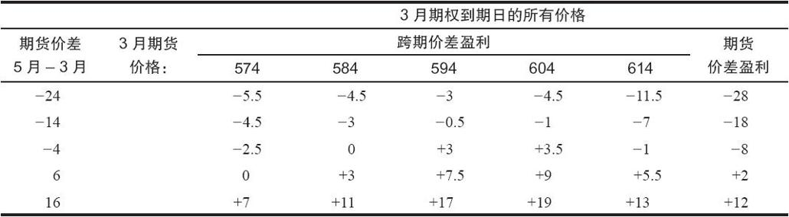
第三，如果3月期货价格上涨过高，这个跨期价差的表现就会很差。事实上，如果3月期货价格上涨，而且两个期货之间价差缩小，交易者的损失就会大于他最初的支出（图形中左面底部的点数）。部分的原因是，如果3月期货价格上涨，交易者就要亏损买回3月的期权，而且，如果5月期货的价格同时下跌，他也许还不得不亏损卖掉他的5月的期权。

第四，正如可以预见到的，如果3月期货略为上涨或者保持不变，期货之间的价差也保持相对不变，那么，就会出现最好的结果（图形右上角1/4区域的点数）。

在表35-4中，右面的一栏显示的是如果交易者在买入5月和卖出3月时，5月合约比3月合约高出4点，在不使用任何期权的情况下，他会得到的结果。

这个示例说明了期货价差影响能够有多大。这个跨期价差的盈利主要来自于期货价差的变化。因此，即使从理论的角度来看，这个跨期价差是具备吸引力的，但是由于期货价差的影响，它的结果似乎并不反映出理论的优势。对于习惯同股票期权打交道的跨期价差交易者来说，另外需要记住的重要的一点是，如果标的期货之间的价差倒转过来，在一个期货跨期价差中，交易者的亏损有可能大于他的初始支出。

不过，在期货期权的跨期价差中，还有另外一种观察问题的方法，它可以是取代或者替补一个期货合约本身的跨期价差的一种方法。再来看一看表35-4，注意一下最右面的一栏。这是一个大豆跨期价差，交易者分别用初始价格598和594买入5月和卖出3月时会有的盈利或亏损。对于一个价格显示在这个示例里的跨期价差来说，跨期价差的表现一般要更好。这是这个跨期价差的真正的理论优势发挥作用的地方。因此，如果交易者正在考虑建立一个跨期价差，他应当首先看一下期货期权跨期价差。如果期权有理论定价优势，这个跨期价差就会明显地比标准的跨期价差的表现要好。

研究一下表35-4。请注意，只有在价格下跌而价差扩大时（表的左下角），这个跨期价差的表现才更好。在所有其他的情况里，跨期价差策略都更好。当然，交易者不能指望事情总是会如此；这个示例之所以会有这样的结果，部分是因为卖出的3月期权与买入的5月期权相对要贵。

总之，期货期权跨期价差同股票或指数跨期价差相比要更为复杂。因此，使用期货期权跨期价差没有使用股票期权跨期价差那么受欢迎。不过，这并不意味着策略家应当忽视这个策略。策略家知道，他常常可以在看起来复杂的情况中发现最好的机会，因为这里可能有无效率的定价。运用这个策略的人主要是也懂得使用期权的跨期价差交易者。

### 35.2.2　买入组合

期权的另一个有吸引力的用途是替代两个彼此相对交易（trade one against the other）的工具。因为跨品种价差和跨期价差涉及两个彼此相对交易的工具，所以，期货期权在这些类型的价差中能起到很好的作用。你也许还记得，在配对交易（pairs trading）以及某些风险套利策略和指数期货价差中我们也谈到过相似的观念。

在任何一类期货价差中，交易者都有可能用期权替代实际期货。他可以在价差的多头腿中买入看涨期权而不是实际买入期货。同样，他可以在价差的另一条腿中卖出看涨期权或者买入看跌期权而不是卖出期货。不过，在使用期权时，他需要避免两个问题。第一，他不应当增加他的风险。第二，他不应当支付过多的会浪费掉的时间价值，否则，他在价差中的盈利就有可能消失。

让我们花一点时间来讨论这两点。首先，他不应当增加他的风险。一般而言，卖出期权而不是卖出期货，会增加交易者的风险。如果他卖出看涨期权而不是卖出期货，卖出看跌期权而不是买入期货，如果期货价格大幅度上涨，他的风险就可能急剧上升。如果期货价格急剧上涨，卖出的看涨期权就会赔钱，当期货价格涨过了卖出的看跌期权的行权价，卖出的看跌期权也会停止赚钱。因此，在跨期和跨品种价差中，我们不建议用卖出期权来代替期货。下一个示例将说明为什么。

【示例35-9】价差交易者想要交易活牛的跨品种价差。合约的尺寸是40000磅，因此，每1美分的运动价值400美元。他想要卖出4月期货和买入6月期货，希望这两个合约之间的价差会缩小。

下面是当时的活牛期货和期权的价格：

4月期货：78.00

6月期货：74.00

4月78看涨期权：1.25

6月74看跌期权：2.00

他决定使用期权而不是期货来实施这个价差。他卖出4月78看涨期权来代替卖出4月期货；同时也卖出6月74看跌期权来代替买入6月期货。

过了一段时间，有了下面的价格：

4月期货：68.00

6月期货：66.00

4月78看涨期权：0

6月74看跌期权：8.05

期货之间的价差确实缩小了，从4点缩小到了2点。不过，这个价差交易者并没有从中得到盈利，相反，他反而有了一笔亏损。他卖出的看涨期权没有价值了，他因此赚得了1.25点的盈利，但是，按2.00卖出的看跌期权现在价值8.05，这是一个6.05点的亏损。总起来这个价差交易者因为使用期权的净亏损是4.80点，如果使用期货的话，他会有2.00点的收益。

期货价差交易者想要确定的第2件事是，他不至于支付大量的会浪费掉的时间价值，从而失去他的潜在盈利。如果他买入平值的或虚值的看涨期权而不是买入期货，而且，如果他买入平值的或虚值的看跌期权而不是卖出期货，他的价差的盈利就有可能因为因时减值而被蚕食掉。在跨期和跨品种价差中，不要用平值或虚值的期权来代替期货。下一个示例说明了为什么不要这样做。

【示例35-10】一个期货价差交易者注意到在小麦中存在一个可以利用的机会。他想要买入7月和卖出5月。有下面的期货和期权价格：

5月期货：410

7月期货：390

5月410看跌期权：20

7月390看涨期权：25

这个交易者决定买入5月410看跌期权而不是卖出5月期货；同时买入7月390看涨期权，而没有买入7月期货。

后来，出现了下面的价格：

5月期货：400

7月期货：400

5月410看跌期权：25

7月390看涨期权：30

期货价差会有20点的盈利，因为这两个期货的价格现在一样了。至少这次，价差交易者在期权价差中也可以有盈利。他可以在每个期权中得到5点的盈利，总的是10点，这只是如果使用期货本身进行价差交易的一半。请注意，这里用来举例的期权价格中仍然有许多时间价值存在。如果时间更长，这些期权在接近持平价交易，那么，期权价差的结果就会更糟。

应当指出，如果期货价格波动比较大，有显著的上涨和下跌，那么，上面示例中的期权策略的表现就会比较好。在一定程度内，这样的说法是正确的。如果市场大幅度运动，一个期权会极其深度实值，另一个则会深度虚值。两者都剩不下多少时间价值，交易者于是浪费了所有花在最初的时间价值上的钱。因此，除非期货价格的运动速度快到超出时间价值的亏损，期货策略就仍然比期权策略高出一筹。

不过，刚才说的高波动的期货运动对一个期权头寸会有帮助是对的。它为下面的说法提供了理由：取代期货价差的唯一可取的期权策略是使用实值期权。如果交易者买入实值看涨期权而不是买入期货，买入实值看跌期权而不是卖出期货，他常常可以创造出一个比跨期和跨品种期货价差更具优势的头寸。实值期权避免了上面两个示例中所涉及的大部分麻烦。这里没有风险的增加，因为期权是买入的，而不是卖出的。此外，花在时间价值上的钱很少，因为这两个期权都是实值的。事实上，交易者可以只买入几乎没有时间价值存在的实值期权。不过，我们不建议这样做，因为它取消了使用中等实值期权可能有的好处：如果标的期货价格上下起伏波动，即使期货价差的表现不尽如人意，这个期权价差还是有可能赚钱。

为了说明这些观点，我们将使用市场间的TED价差作为示例。我们在前面说过，要买入一个TED价差，交易者需要买入政府短期债券期货，同时卖出相等数量的欧洲美元期货。

短期债券和欧洲美元期货上都有期权。如果买入的是短期债券看涨期权而不是短期债券期货，如果买入欧洲美元看跌期权而不是卖出欧洲美元期货，那么，就可以建立一个相似的头寸，而且比使用期货的买入TED价差有理论优势。这个优势是，如果短期债券或者欧洲美元的价格变动幅度大到一定程度，那么，即使TED的价差不配合，期权策略家也可以赚钱。

你也许会认为，短期利率的波动率不可能大到使得这个策略具有价值。不过，它们有可能在短期内有显著的运动，特别是如果美联储积极地降低或提高利率的话。例如，假定美联储及时降低利率，短期债券和欧洲美元价格都有显著的上涨。最后，买入的欧洲美元的看跌期权就会变得毫无价值，而持有的短期债券看涨期权则持续增值。因此，即使TED的价差没有变化或者缩小了，只要短期利率跌得够深，交易者还是可以赚钱。

与此相似，如果利率不是降低而是提高，只要看跌期权增值（上升的利率意味着短期债券和欧洲美元的价格会下跌），而且看涨期权最后变得毫无价值，这个期权价差就还是可以赚钱。

【示例35-11】在1月，有下列的6月短期债券和欧洲美元期货和期权的价格。所有这些产品的交易单位都是0.01，它价值25美元。因此，1整点的价值是2500美元。

6月短期债券期货：94.75

6月欧洲美元期货：94.15

6月短期债券9450看涨期权：0.32

6月欧洲美元9450看跌期权：0.40

6月的TED价差目前是0.60（两个期货的价格差异）。两个期货都有只剩下很少时间价值的实值期权。

6月短期债券的行权价为94.50的看涨期权实值0.25，它的售价是0.32。它的时间价值只有0.07点。与此相似，6月欧洲美元的行权价为94.50的看跌期权实值0.35，它的售价是0.40。因此，它的时间价值是0.05。

因为总的时间价值只有0.12（300美元），数值很小，策略家认为一手期权价差相对期货跨品种价差有优势，所以，他建立了下面的头寸：
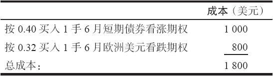
后来，全球的金融形势变得非常稳定，TED价差开始缩小。不过，与此同时，美国的利率降低了，短期债券和欧洲美元的价格开始有显著的上涨。到5月，在短期债券期权到期的时候，有下面的价格存在：

6月短期债券期货：95.50

6月欧洲美元期货：95.10

6月短期债券9450看涨期权：1.00

6月欧洲美元9450看跌期权：0.01

TED价差从0.60缩小到0.40。因此，任何想要只是使用期货而买入TED价差的交易者就会亏损500美元，因为价差朝不利他的方向运动了0.20。

不过，看一看期权的头寸。这些期权现在加起来的价值是1.01（2525美元），它们是花0.72点（1800美元）买来的。因此，这个期权价差在期货策略亏损的时候产生了725美元的盈利。

任何使用这个期权策略来代替使用期货的交易者都会享受到这样的盈利，因为随着美联储不时降低利率，短期债券和欧洲美元的价格会上涨到足够的幅度，使得期权策略家的看涨期权的盈利超过他的看跌期权的亏损。这是在期货价差策略中使用实值期权而不是期货的优势。

公平地说，应当指出，如果期货价格保持相对没有变化，0.12点的时间价值（300美元）就可能损失掉了，而期货的价差则保持相对没有变化。不过，这并不改变使用这个期权策略背后的理由。

另一个应当考虑的因素是保证金要求。我们在前面指出过，实施这个TED价差的初始保证金是400美元。不过，如果交易者使用期权策略，他就必须为期权付全额，在上面的示例里是1800美元。这对使用期权策略显然是个障碍。当然，如果投资了1800美元，交易者就可以赚钱而不是用较小的投资而输钱，那么，初始保证金的多少就不是一个问题。因此，潜在盈利必须被看作是更重要的因素。

### 35.2.3　后续考虑

当交易者使用买入组合来实施一个期货价差策略的时候，他也许会发现他的头寸从一个价差变成为一个更接近直接买卖的头寸。如果市场是高波动的，一手期权变成深度实值，另一手接近无价值的话，就会出现这种情况。上面的TED的示例显示了随着看涨期权价值上涨到1.00，而看跌期权几乎一文不值时，这样的情况是如何出现的。

当期权价差的一条腿变为虚值的时候，价差的性质开始消失，原来的头寸变为一个更加接近直接买卖的头寸。为了计算他在某个时候有多大的风险暴露，交易者可以使用这个头寸的delta。下面的示例触及了一系列策略家也许不得不经历的分析和交易。第1个示例是关于在原油产品中建立一个跨品种价差。

【示例35-12】在夏末，一个价差交易者决定要实施一个跨品种价差。他预测这一年的冬天会非常冷；此外，他还相信汽油的价格在夏天的旅游季节被人为地抬得太高，而且，由于无效的市场定价，这个高价格被带入了后面的月份里。
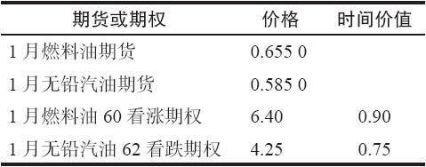
因此，他想要买入燃料油期货或期权，卖出无铅汽油期货或期权。他计划如果可能的话在12月上旬退出交易，这时候市场应当已经将冬天这个事实考虑进去了。因此，他决定看一看1月的期货和期权。有下面的价格存在。

期货之间的价差是0.07，或者说每加仑7美分。交易者认为到早冬的时候，它有可能增长到12美分左右。不过，他同时也认为原油和石油产品的价格有可能上下起伏很大，因此他考虑使用期权。这些产品都是每1美分价值420美元。

将看跌期权和看涨期权结合在一起，期权中的时间价值是1.65，如果他为每个组合付出这个数目（693美元）的话，如果期货的价差像他预期的那样扩大5点，他仍然可以赚钱。此外，如果石油产品价格高波动，那么，即使他对期货之间的相互关系看错了，期权价差还是为他提供了盈利的可能。
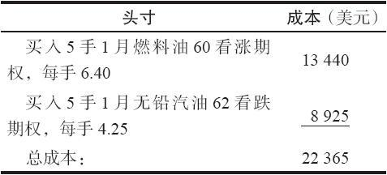
因此，他决定买入5手组合：

这个初始成本比对5手期货价差的初始保证金要求要大得多，期货只需要大约7000美元。另外，期权的成本必须付现金，而期货的保证金可以用短期债券，而短期债券可以继续为这个价差交易者赚钱。不过，这个策略家还是相信期权的头寸更有潜力，所以他就建立了这样一个头寸。

请注意，在这个分析中，这个策略家将他的时间价值的成本同他预期从期货价差本身可以得到的潜在盈利进行比较。这常常是一种衡量应当使用期权还是期货的很好的办法。在这个示例里，他认为，即使期货价格保持相对不变，从而浪费了他的时间价值，只要他对燃料油的表现会好于无铅汽油的看法是对的，他仍然可以赚钱。

现在让我们来考察一下一些后续行动。如果期货价格上涨，这个头寸变成买入，有盈利可以积累。但是，如果期货价格下跌，整个头寸还是会亏损。策略家可以通过使用这个策略中期权的delta来计算变成买入头寸的程度。然后他可以使用期货或其他期权来把这个头寸变得更为中性，如果他想要这样的话。

【示例35-13】假定无铅汽油和燃料油价格都上涨了一些，期货之间的价差略为扩大了一些。下面的信息是已知的：
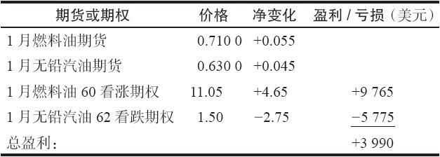
期货价差扩大到了8美分。如果策略家是用期货来建立这个头寸的，他现在在5手合约上每手有1美分的盈利（420美元），或者说2100美元的总盈利。期权策略的盈利要更大一些。

期货的价格也上涨了。燃料油从它最初的价格涨了5.5美分，无铅汽油涨了4.5美分。这个上涨的幅度大到足以使得看跌期权变成虚值的。如果交易者是使用期权建立这个头寸，而且期货的价格上涨到这样的程度，由期权策略产生的盈利一般会更大一些。这个示例就是这种情况，期权价差的盈利几乎是4000美元了。

这个示例显示了实施期权价差的策略家最希望的情况。期货价格涨幅大到使得看跌期权变成虚值的，或者是跌幅大到足以使得看涨期权变成虚值的。如果在期权到期之前发生了这样的情况，其中的一种期权一般会不再有什么时间价值（上面示例里的看涨期权）。另一种期权则仍然还有一些时间价值（这个示例里的看跌期权）。

这代表了一种具有吸引力的情景。不过，这里也有潜在的负面因素，这就是这个头寸现在是买入得太多了。它实际上不再是一个价差头寸。如果期货价格下跌，看涨期权就会迅速丧失价值。看跌期权则不会获益很多，因为它们是虚值的，也无法妥善地保护看涨期权。在这个关节点，策略家可以选择提走他的盈利：将头寸平仓，也可以选择做一些调整，使得这个价差再次变得更为中性。当然，他也可以什么都不做，不过，一个策略家一般会想要在一定程度上保护他的盈利。

【示例35-14】策略家决定，因为他的目标是期货价差扩大到12美分，所以，当这个价差只有8美分的时候，就像现在这样，他不想将这个头寸平仓。不过，他想要采取某些行动来保护他目前的盈利，同时仍然保留增加盈利的可能性。

第1步是计算等额期货头寸（EFP）。表35-5显示了相关的数据。

表35-5　买入组合的EFP
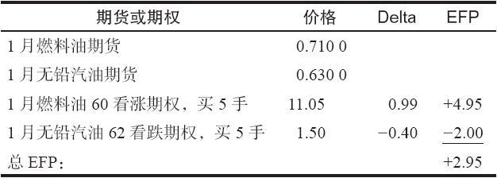
总的来说，这个头寸大约等于买入3手期货合约。这个头寸的盈利性绝大部分是同期货价格的上涨或下跌相关，而不是同燃料油期货与无铅汽油期货之间的价差会如何表现相关。

策略家可以很容易通过卖出3手合约而将这个买入delta中性化。这就为价格继续上涨时的进一步盈利留下了空间（这里还有2手额外的买入的看涨期权）。如果价格突然下跌，它也提供了下行方向的保护，因为5手买入的看跌期权加上3手卖出的期货可以将5手实值看涨期权中所有的亏损给对冲掉。

这个策略家应当卖出什么样的期货呢？这取决于他对自己在一开始的时候认为跨品种价差会扩大的分析有多大的信心。如果他仍然认为它会进一步扩大，那么，他就应当卖出无铅汽油期货，同深度实值的燃料油看涨期权相对。这会为他提供额外的、基于两种石油产成品之间相互关系的盈利或亏损的机会。不过，如果他认为这个跨品种价差现在的跨度理应更大，那么，他或许应当只是卖出3手燃料油期货，作为对燃料油看涨期权的直接对冲。

一旦交易者发现他处在就像上面的示例里那样的一个有利可图的情况里，最保守的途径是使用那个实值期权的标的期货来为这个期权对冲。这个行动可以减小对这个跨品种价差的盈利的依赖性。从期货价格的活动中仍然还有盈利的可能。此外，如果期货价格跌到使得两边的期权都成为实值的，那么，这个跨品种价差又会重新开始发挥作用。因此，在上面的示例里，保守的行为就会是针对燃料油看涨期权，卖出3手燃料油期货。

更为激进一些的途径是使用这个跨品种价差的另一条腿的标的期货来为这个实值期权对冲。在上面的示例里，这就会表现为针对燃料油看涨期权而卖出无铅汽油期货。

假定前面示例里的策略家决定要采取保守的行动，因此他卖出了3手燃料油期货，价格是0.7100的市场价。这个行动在两个方向上都保存了大量的潜在盈利。它比就他现有的头寸直接卖出虚值期权要好。

如果期货价格下跌，或许是当看跌期权变回到实值的（看跌期权的delta至少是-0.75左右），他可以考虑将这个对冲平仓。在这个时候，这个头寸就会多少回到它最初的状态，除了他已经从3手卖出和买回的期货中得到了很好的盈利这个事实之外。

后记。上面的示例来自实际的价格运动。在现实中，期货不但会跌回到最初的价格，而且会跌到比这低得多的价位。这种反转的基本理由可以是天气暖和，对燃料油的需求减少，而且汽油的供应量也低。到12月期权到期日，存在下面的价格：

1月燃料油期货：0.5200

1月无铅汽油期货：0.5200

不但期货价格暴跌，而且跨品种价差也失败了。它们之间的价差变成了零！它从来就没有接近过最初认为的12美分的可能性。任何使用期货建立这个价差的交易者几乎都肯定会赔钱；他或许在价格达到这个水平之前就将头寸平仓了，不过，从头到尾，这里都没有机会从平仓中获得盈利。

不过，使用期权建立这个价差的策略家几乎可以肯定能赚到钱。你可以有把握地说，他买回了前面示例里的3手卖出的期货，得到了相当好的盈利，或许是7点左右。你也可以假设，随着看跌期权变成实值期权，交易者会建立一个相似的对冲，在EFP达到-3.00的时候买回了3手无铅汽油。这也许出现在无铅汽油期货的价格在0.5700的时候，也就是实值5美分。

假设这些交易确实发生了，下面的表格显示了盈亏。
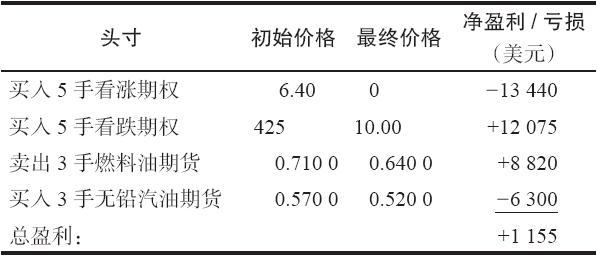
在这个最终分析中，跨品种价差跌到零这个事实实际上有利于期权策略，因为看跌期权在到期时是实值的。当然，这是计划之外的，但是，因为在这个头寸上所持的是买入的头寸，策略家就能够在出现大波动的时候获得盈利。

### 35.2.4　跨期价差策略

显然，同样的策略也可以用在跨期价差上。例如，如果交易者考虑的是两个不同的大豆期货，他可以用实值期权取代头寸中的期货。于是他就有了同我们在跨品种价差中显示的相同属性：如果出现波动，就有大笔的盈利。当然，如果跨期价差扩大，他仍然可以赚钱，不过，他会损失掉他为这些期权所付的时间价值。

### 35.2.5　股票部门指数的期货价差交易

这个概念可以推演到更远一步。许多期货合约是同股票有关系的，通常是同一个具体商品相关的一个部门的股票。例如，有原油期货，原油ETF（USO），也有原油和天然气部门指数（XOI）。有黄金期货，黄金ETF（GLD），也有黄金和白银指数（XAU）。如果就这个商品同这个股票部门的相互关系的历史绘制图形的话，你可以发现就两者的关系而言，常常会有可以交易的模式。这种关系可以通过使用期权的跨品种价差来交易。

例如，如果交易者认为相对总的石油股票价格来说，原油是便宜的，他就可以买入原油期货或USO的看涨期权，同时买入石油天然气指数的看跌期权。交易者在决定这个价差的两条腿各自需要交易多少数量的期权合约必须有清楚的概念，他可以使用第31章讨论指数间价差时所介绍的比率来做到这一点。（事实上，如果两个标的期权的条款不同，这个公式也应当用在期货的跨品种价差上。）现在只是在使用期权的情况下加进了另一个构成要素：期权的delta。
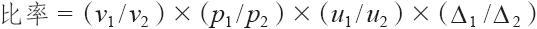
式中　vi——波动率；

pi——标的物价格；

ui——期权的交易单位；

Δi——期权的delta。

【示例35-15】假定交易者确实想要买入原油看涨期权，同时买入XOI的看跌期权，因为他认为原油同石油股票相比是便宜的。有下面的价格存在：
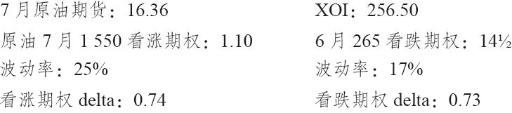
同其他大部分股票和指数期权一样，XOI期权的交易单位是每点100美元。原油期货的交易单位是每点1000美元。有了所有这些信息，可以计算得出下面的比率：

原油=1000×0.25×16.35×0.74

XOI=100×0.17×256.50×0.73

比率=原油/XOI=0.91

因此，交易者就每1手他所买入的原油看涨期权，要买入0.91手XOI看跌期权。如果是一个小账户，这基本就是一个1对1的关系，但是，如果是一个大账户，那就可以使用精确的比率（例如，买入91手XOI看跌期权和100手原油看涨期权）。由此产生的数量概括了这两个市场的各种不同区别：主要是价格和标的物的波动率，再加上它们的交易单位之间的巨大差异（100对1000）。
