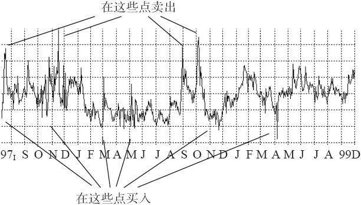

# 第36章　波动率交易的基本原理

最早对波动率交易产生兴趣的是对数学感兴趣的交易者，他们注意到市场对未来的波动率的预测（如隐含波动率）与人们通常从理性上认为应当发生的情况有显著的差异。不仅如此，许多这些交易者（做市商、套利者和其他人）发现很难让一个“delta中性”的头寸保持中性。为了寻找一种不需要对标的证券的市场运动方向持有看法而进行交易的方法，他们转向了波动率交易。这并不是意味着波动率交易消除了所有的市场风险，也许是将它们转化成波动率风险。它说的是，在从事期权交易的人之中，有一部分人在处理波动率风险方面可以比他们在处理价格风险方面有更加自如和自信。

图36-1　例图

简单地说，预测波动率比预测价格要容易得多。除非你说的是20世纪90年代的大牛市，当时，每一个热情的投资者都确定无疑地感到他知道怎样预测价格。要记住，不能将牛市同智慧混淆起来。考虑一下图36-1中的图形。这只股票看上去是一只不错的可以交易的股票：在接近低位时买入，在接近高位时抛出，或者甚至在接近高位时卖空，在后来的下跌中买回。它看上去在长时期内处于交易范围之中，因此，在每一次买入或卖出之后，它至少会回到交易范围的中点，有的时候甚至朝这个范围的另一侧继续运动。这张图形没有标度，不过，这并不改变它看上去是一个可交易对象的事实。事实上，这是一家重要的美国企业的期权的隐含波动率的图形。具体是哪一家没有关系（它是IBM），因为几乎所有的股票、指数或期货合约的隐含波动率的图形都有相似的模式：一个交易范围。隐含波动率完全突破它的“正常”范围的唯一情况是，如果有显著的事件发生，它改变这个股票的运动方式的基本面要素的话（例如，有人要买这个企业，或者重要兼并，或者股票其他类型的价值稀释等）。

许多交易者观察到了这种模式，变得热衷于对波动率进行预测。请注意，如果交易者能够将波动率剥离开来，他就不必在乎股票价格朝哪里运动。他所关心的只是在接近这个范围的底部买入波动率，在它回到中部，或者是这个范围的高部时卖出波动率，或者是反过来。在现实中，公众客户几乎不可能把波动率如此精密地剥离开来。他不得不对价格有所关心，不过，他仍然能够建立起这样一个头寸，在其中，股票价格的运动方向同头寸的结果没有关系。对许多投资者来说，这样的特性是有吸引力的，这些投资者反复不断地发现要预测股票的价格非常困难。此外，这类方法无论在牛市还是熊市里都起作用。因此，波动率交易对许多个体交易者都有吸引力。要记住，如果你自己想要妥当地运作一个策略，你必须发现它适合你个人的交易哲学。使用一个你感到不舒服的策略只会导致亏损和烦恼。因此，如果这个在某种程度上是中性的期权交易策略听上去能够引起你的兴趣，那么就继续读下去。
