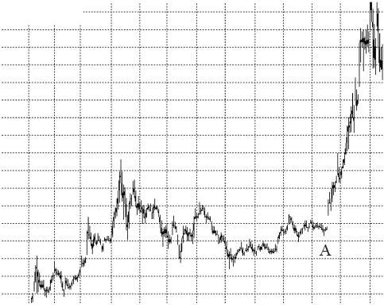
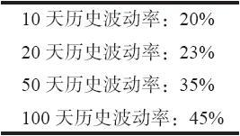
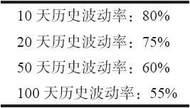

# 36.1　波动率的定义

波动率只是一个用来描写一只股票、期货或者指数的价格变化有多快的术语。当你就期权而谈到波动率的时候，有两类波动率是重要的。第1类是历史波动率（historical volatility），它是对标的工具在过去的价格变化快慢的衡量。另一类是隐含波动率，它是期权市场对这个标的物在这个期权的存续期内的波动率的预测。计算和比较这两种对波动率的衡量，可以在预测标的工具即将出现的波动率方面立刻对交易者有所帮助，这在决定今天的期权价格上是至关重要的。

正如我们在论述数学应用那一章里所显示的，历史波动率可以用一个特殊的公式来衡量。就像在大部分基础统计学书本里可以找到的那样，它只是一个计算标准差（standard deviation）的公式。要理解的重要的一点是，这是一个精确的计算，对于如何计算历史波动率，很少有争议。实际的衡量意味着什么，这并不重要。也就是说，如果有人说一个股票的历史波动率是20%，那么，除了对热衷于统计学的人之外，对任何人来说，这个数字本身相对没有什么意义。不过，它可以用在进行比较的目的上。

标准差是用百分比来表示的。交易者可以说大盘股市的历史波动率通常是在15%~20%之间。一只波动性非常大的股票可以有超过100%的历史波动率。这些数字可以相互进行比较，因此，交易者可以说，历史波动率为100%的股票比一般“股市”的波动性要高出5倍。所以，可以用一个工具的历史波动率同另一个工具的历史波动率进行比较，以决定哪一个的波动性更大。历史波动率自身就是它的一个有用的功能，不过它的用途远不止如此。

对历史波动率可以根据不同的时段进行衡量，从而对标的物在不同时段内的变化有一种感觉。例如，人们通常计算10天的历史波动率，以及20天、50天甚至100天的。在每一种情况里都把结果年化，这样，这些数字就可以直接拿来进行比较。

图36-2　股票例图

考虑一下图36-2中的图形。它显示的是一只在相当一段时间内在小幅度的范围内徘徊的股票（它也可以是一个期货合约或者指数）。在图形上用“A”标出的那一点上，也许是它波动最小的时候。在这个时候，10天的波动率也许在大约20%这样相当低的数字上。紧接着A点之前，价格运动非常小。不过，在股票开始变得波动比较大之前，较长时段的历史波动率会显示出较高的数字。当时，在A点的历史波动率的值有可能是：

这类历史波动率的模式描写的是一只价格运动最近减缓的股票。

它的价格运动在近期内没有那么极端。

再回到图36-2上，注意一下在离A点不远的地方，股票在短时期内上跳到高得多的地方。像这样的价格行为会导致隐含波动率急剧增长。而且，在这幅图形的最右侧，股票停止上涨，但是上下摆动，速度比在图形的大多数点位上要快得多。上下的剧烈波动常常会产生比直线运动所产生的更高的历史波动率值；这只是数字的效果。因此，在图形的最右端，10天的历史波动率会增长得相当急剧，而较长时段的衡量数据则不会变得这样高，因为它们仍然包含着在A点之前出现的价格行为。

在图36-2的最右端，会有这样的数字：

从这样的数据排列里，读者可以看出近期的波动率要高于较远期的过去的波动率。在第38章论述股票价格分布的时候，我们将谈到交易者如果需要使用一个历史波动率的话，他应当在期权和概率模型中使用这些历史波动率中的哪一个作为这些模型的输入数据的“那个”历史波动率。我们需要有能力对波动率做出估量，这样才能决定一个策略是否能够成功，决定目前的期权价格是相对便宜还是相对昂贵的。例如，你不能只是说：“我认为XYZ到2月到期日时至少要上涨18点。”做出这样的判断，需要有一些事实根据，在没有内幕消息透露这个公司从现在到2月之间会宣布什么事情的情况下，这样的根据应当是用波动率预测这种形式表现出来的统计学数据。

作为对（布莱克–斯科尔斯）期权模型的一个输入数据，历史波动率当然是有用的。事实上，在任何模型中波动率的输入都是关键的，因为在决定一个期权的价格中，波动率是如此重要的一个因素。另外，历史波动率的用处还不止在对期权的价格作评估上。在做出股票价格的预测和计算分布上，它也是必不可少的，就像我们在后面讨论这些议题时会看到的那样。任何时候，当你问：“这只股票从这里运动到哪里，或者说，超过一个具体的价格目标的概率有多大？”对它的回答都在很大程度上仰赖于对标的股票（或者指数或期货）的波动率的认识。

从上面的示例里可以清楚地看出，任何工具的历史波动率都有可能发生急剧的变化。即使交易者只想使用一种对历史波动率的衡量方法（20天历史波动率是使用得最普遍的衡量方法），它也会变动得相当频繁。因此，交易者永远无法肯定，将期权价格预测或股票价格分布建立在当前历史波动率上是否会产生出“正确的”结论。统计的波动率随着时间的进程而发生变化，在这样的情况里，你的预测会变为不正确的。因此，用保守的态度来做预测相当重要。
