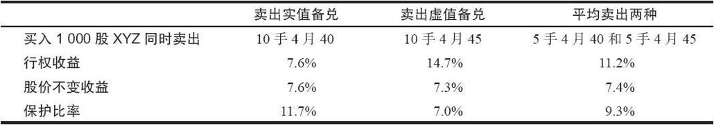
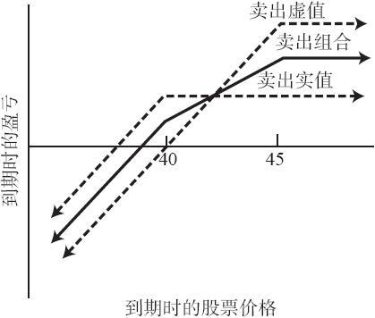

# 2.8　在卖出备兑中对收益和保护分散化

### 2.8.1　分散化的基本方法

卖出备兑策略家显然希望尽可能多地将高潜在收益和充分的下行保护结合在一起。卖出虚值看涨期权可以提供较高的行权收益，但只能提供中等的下行保护。另一方面，卖出实值看涨期权可以提供更多的下行保护，但只能提供较低的行权收益。对有些策略家来说，在实践中进行分散化的办法就是对某些股票卖出虚值看涨期权，同时对另一些股票卖出实值看涨期权。不能保证这种就一系列分散的股票卖出看涨期权的做法就一定会产生出色的结果。投资者仍然需要挑选出他认为会有更好表现的股票（为了虚值卖出），而这不是一件容易做的事。此外，在许多情况里，个体投资者也没有足够的资金来进行分散化。不过，我们还可以用另一种方法来实现在一个卖出备兑的情况里对收益和下行保护进行分散化。

为了尽可能达到分散化的目的，卖出者通常可以对他一半的头寸就一只股票卖出虚值的看涨期权，再对另一半就同一股票卖出实值的看涨期权。对下面这样的股票来说，这种方法特别具有吸引力：这种股票的虚值看涨期权看上去不能提供足够的下行保护，与此同时，它的实值看涨期权又提供不了足够的收益。通过同时卖出这两种期权，这个卖出者就有可能得到他所寻求的收益和保护的分散化。

【示例2-10】6个月的期权有下列的价格：

XYZ普通股票：42

XYZ 4月40看涨期权：4

XYZ 4月45看跌期权：2

这位投资者希望就XYZ普通股票建立卖出备兑，他也许喜欢4月40看涨期权所提供的保护，但这个期权所提供的收益对他没有吸引力。也许他能够通过卖出部分4月45看跌期权来增加他的收益。假设该投资者考虑买入1000股XYZ股票。表2-14对这些策略的属性做了比较：只卖出虚值期权（4月45），只卖出实值期权（4月40），或者两种期权各卖出5手。表2-14所计算的是全部用现金的情形，使用保证金的情形也是类似的。计算考虑了所有手续费。

表2-14　不同卖出备兑的特性

不难看出，“组合的”卖出备兑（一半头寸为4月40期权，另一半为4月45期权）在收益和保护之间提供了最好的平衡。只卖出实值看涨期权的策略提供了高于11%的下行保护，但是，它的行权收益只有7.6%，只比每月1%稍微高一点。因此，投资者也许会因为潜在盈利太小，而不想就他的整个头寸卖出4月40看涨期权。同时，如果就整个头寸卖出4月45看涨期权，虽然可以提供一个有吸引力的行权收益（每月超过2%），但只能提供7%的下行保护。组合的卖出备兑比其他两种都有更好的特性，它提供了超过11%的行权收益（每月1.5%），以及超过8%的下行保护。通过卖出这两种看涨期权，该卖出者就有可能解决在只卖出虚值期权或只卖出实值期权时一定会遇到的问题。由于这个“组合的”卖出备兑，当卖出者在一开始不持看空或看多立场时，他不必一定看空（卖出实值）或是看多（卖出虚值）。对一个低波动率、交易价在两个行权价之间的股票来说，这样做常常是有必要的。

图2-2显示了三种交易方式的盈利图形。我们可以看到，如果在期权到期时XYZ的价格在42附近，这三条线都会交织在一起。

这个技巧不但可以用来为个别头寸而且可以为投资组合的一大部分资产提供保护与收益之间的分散化。现在，手续费都是以每股为基础来计算，因此相关的收益可以通过计算单个卖出备兑的收益的平均值来得到。例如，4月40看涨期权的行权收益是7.6%，4月45看涨期权的行权收益是14.7%，那平均卖出两者的收益就是其平均值11.2%。

图2-2　比较：卖出组合同卖出实值和卖出虚值相比

### 2.8.2　其他分散化的方法

如果某个投资者持有某只股票的大量头寸，那么只卖出两个不同的行权价的分散化方法，对他来说可能还不够。机构投资者、退休基金持有者，以及大户有可能就属于这个范畴。对于这些大额的持有者来说，通常所做的，不但是要至少卖出两个行权价，还要卖出不同存续期的期权，以实现分散化。例如，三分之一的头寸卖出近期看涨期权，三分之一卖出中期看涨期权，剩余三分之一卖出远期看涨期权，这样做的投资者可以得到很多好处。首先，投资者不需要在同一时间对他所有头寸作调整。这个调整包括股票被指派行权，或者是在买回看涨期权的同时再继续卖出。此外，投资者也不再局限于某一系列看涨期权到期时的期权权利金水平。例如，投资者卖出的全部为9个月的看涨期权，并且在它们到期时将它们挪仓，那么他就有可能接受较低的潜在收益。如果在该卖出者要卖出更多看涨期权的时候，期权权利金水平刚好较低，他将会建立一个长达9个月的低于最优值的卖出备兑头寸。如果能将他的交易分散在不同的时段里，即使出现最糟糕的情形，他也只有三分之一的头寸的权利金较低。在随后的3个月里，权利金还有希望会上涨，这样，在他投资组合的下一个三分之一里，他就可以得到相对较好的权利金。这里需要强调一句：个体和相对小额的投资者，如果他们持有的股票只够用来卖出一个系列的期权，那就不应当卖出最长期的看涨期权。此时他虽然得不到特别有吸引力的权利金水平，但至少无需一直持有该头寸到期。否则，他可能会在长达9个月的时间里一直处于相对糟糕的境地。最后，这种类型的分散化，在市场周期性波动时，可能会导致在不同的行权价上卖出看涨期权。如果使用分散化方法的话，投资者就不必把他所有的股票都放在一个价格上。

到这里，我们就结束了对就股票建立卖出备兑头寸的讨论。后面我们还将继续讨论就其他种类的证券进行卖出备兑。
